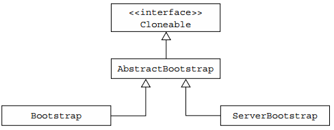
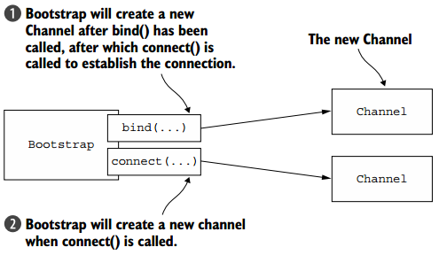
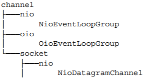
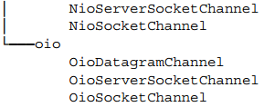
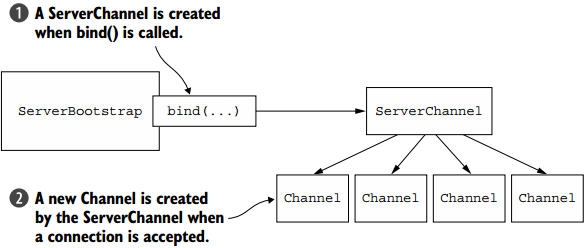
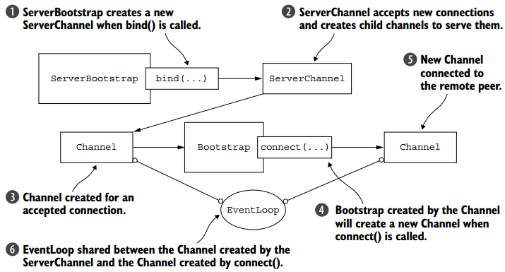

**一、前言**

前面已经学习了Netty的EventLoop以及线程模型，接着学习Netty的Bootstrapping。

**二、Bootstrapping**

在学习了Netty中的很多组件后，如何将这些组件有效的组合至应用程序中，这需要使用应用引导程序，引导应用程序是将其配置为运行的过程，Netty以一种绝对应用程序的方式处理引导。

2.1 Bootstrap类

Bootstrap类的继承结构图如下图所示。

一个服务器使用一个父通道来接受来自客户端的连接并创建子通道来与它们进行通信，而一个客户端很可能只需要一个非父通道来进行所有的网络交互，而前面讨论的组件会参与引导过程，有些在客户端和服务端都会被使用。两个应用程序类型共同的引导步骤由AbstractBootstrap处理，而特定于客户端或服务器的引导步骤分别由Bootstrap或ServerBootstrap处理。

为何Bootstrap为Cloneable？因为有时需要创建具有类似或相同设置的多个通道，为了支持此模式，不需要为每个通道创建和配置新的引导实例，因此将AbstractBootstrap标记为Cloneable,在已配置的引导程序上调用clone()方法将返回可立即使用的另一个引导实例，这
**只会创建引导程序的EventLoopGroup的浅层副本，所以其被所有克隆的通道共享** 。

2.2 引导客户端和无连接协议

Bootstrap在客户端或无连接协议的应用程序中使用。

1\. 引导客户端

Bootstrap类负责为客户端和使用无连接协议的应用程序创建通道，如下图所示。

以下代码引导使用NIO TCP传输的客户端。

    
    
    EventLoopGroup group = new NioEventLoopGroup();
    Bootstrap bootstrap = new Bootstrap();
    bootstrap.group(group)
        .channel(NioSocketChannel.class)
        .handler(new SimpleChannelInboundHandler<ByteBuf>() {
            @Override
            protected void channeRead0(
                ChannelHandlerContext channelHandlerContext,
                ByteBuf byteBuf) throws Exception {
                    System.out.println("Received data");
                }
            } );
            
    ChannelFuture future = bootstrap.connect(
        new InetSocketAddress("www.manning.com", 80));
    future.addListener(new ChannelFutureListener() {
        @Override
        public void operationComplete(ChannelFuture channelFuture)
            throws Exception {
            if (channelFuture.isSuccess()) {
                System.out.println("Connection established");
            } else {
                System.err.println("Connection attempt failed");
                channelFuture.cause().printStackTrace();
            }
        }
    } );

2\. Channel和EventLoopGroup兼容性

io.netty.channel包中的类结构如下。

可以看到对于NIO和OIO传输，都有相关的EventLoopGroup和Channel实现，不能混合具有不同前缀的组件，例如NioEventLoopGroup和OioSocketChannel。如下代码展示不兼容的使用用法。

    
    
    EventLoopGroup group = new NioEventLoopGroup();
    Bootstrap bootstrap = new Bootstrap();
    bootstrap.group(group)
        .channel(OioSocketChannel.class)
        .handler(new SimpleChannelInboundHandler<ByteBuf>() {
            @Override
            protected void channelRead0(
                ChannelHandlerContext channelHandlerContext,
                ByteBuf byteBuf) throws Exception {
                    System.out.println("Received data");
                }
        } );
    ChannelFuture future = bootstrap.connect(
        new InetSocketAddress("www.manning.com", 80));
    future.syncUninterruptibly();

其中NIOEventLooop和OioSocketChannel不兼容，将会抛出IllegalStateException异常。  

在调用bind或者connect方法之前，需要调用group、channel或channelFactory、handler方法，否则会抛出IllegalStateException异常。

2.3 引导服务器

**ServerChannel的实现负责创建接受连接的子通道，ServerBootstrap通过bind()方法创建一个ServerChannel，ServerChannel可管理多个子通道**
，具体如下图所示。  

下面代码展示了如何引导服务器。

    
    
    NioEventLoopGroup group = new NioEventLoopGroup();
    ServerBootstrap bootstrap = new ServerBootstrap();
    bootstrap.group(group)
        .channel(NioServerSocketChannel.class)
        .childHandler(new SimpleChannelInboundHandler<ByteBuf>() {
            @Override
            protected void channelRead0(ChannelHandlerContext ctx,
                ByteBuf byteBuf) throws Exception {
                    System.out.println("Received data");
                }
        } );
    ChannelFuture future = bootstrap.bind(new InetSocketAddress(8080));
    future.addListener(new ChannelFutureListener() {
        @Override
        public void operationComplete(ChannelFuture channelFuture)
            throws Exception {
            if (channelFuture.isSuccess()) {
                System.out.println("Server bound");
            } else {
                System.err.println("Bound attempt failed");
                channelFuture.cause().printStackTrace();
            }
        }
    } );

2.4 由通道引导客户端

假设服务器正在处理客户端请求，并要求服务器作为第三个系统的客户端，如代理服务器。此时需要从ServerChannel引导客户端通道。一个较好的方法是通过Bootstrap类的group方法传递Channel对应的EventLoop，因为所有分配给EventLoop的通道都使用相同的线程，这避免了额外的线程创建和相关的上下文切换。具体如下图所示。

通过group方法共享EventLoop的代码如下。

    
    
    ServerBootstrap bootstrap = new ServerBootstrap();
    bootstrap.group(new NioEventLoopGroup(), new NioEventLoopGroup())
        .channel(NioServerSocketChannel.class)
        .childHandler(
            new SimpleChannelInboundHandler<ByteBuf>() {
                ChannelFuture connectFuture;
                @Override
                public void channelActive(ChannelHandlerContext ctx)
                    throws Exception {
                    Bootstrap bootstrap = new Bootstrap();
                    bootstrap.channel(NioSocketChannel.class).handler(
                        new SimpleChannelInboundHandler<ByteBuf>() {
                        @Override
                        protected void channelRead0(
                            ChannelHandlerContext ctx, ByteBuf in)
                            throws Exception {
                            System.out.println("Received data");
                        }
                    } );
                bootstrap.group(ctx.channel().eventLoop());
                connectFuture = bootstrap.connect(
                    new InetSocketAddress("www.manning.com", 80));
            }
            @Override
            protected void channelRead0(
                ChannelHandlerContext channelHandlerContext,
                    ByteBuf byteBuf) throws Exception {
                if (connectFuture.isDone()) {
                    // do something with the data
                }
            }
        } );
        
    ChannelFuture future = bootstrap.bind(new InetSocketAddress(8080));
    future.addListener(new ChannelFutureListener() {
        @Override
            public void operationComplete(ChannelFuture channelFuture)
            throws Exception {
            if (channelFuture.isSuccess()) {
                System.out.println("Server bound");
            } else {
                System.err.println("Bind attempt failed");
                channelFuture.cause().printStackTrace();
            }
        }
    } );

2.5 在引导过程中添加多个ChannelHandler

在上面示例中，在引导过程中通过调用handler或者childHandler方法添加单个ChannelHandler，并且我们知道在ChannelPipeline中可以有多个ChannelHandler链，但是在引导过程中只添加了一个ChannelHandler。Netty提供了ChannelInboundHandlerAdapter，其提供了initChannel方法，该方法可以将多个ChannelHandler添加至ChannelPipeline中，你只需要将ChannelInitializer的实现提供给引导程序，而一旦Channel注册了EventLoop，那么initChannel方法将被调用，当方法返回后，ChannelInitializer将自身从ChannelPipeline中移除，如下代码展示了具体的操作。

    
    
    ServerBootstrap bootstrap = new ServerBootstrap();
    bootstrap.group(new NioEventLoopGroup(), new NioEventLoopGroup())
        .channel(NioServerSocketChannel.class)
        .childHandler(new ChannelInitializerImpl());
    ChannelFuture future = bootstrap.bind(new InetSocketAddress(8080));
    future.sync();  
    
    final class ChannelInitializerImpl extends ChannelInitializer<Channel> {
        @Override
        protected void initChannel(Channel ch) throws Exception {
            ChannelPipeline pipeline = ch.pipeline();
            pipeline.addLast(new HttpClientCodec());
            pipeline.addLast(new HttpObjectAggregator(Integer.MAX_VALUE));
        }
    }

2.6 使用Netty的ChannelOptions和attributes

当创建通道时手动配置非常麻烦，可以使用option方法将ChannelOptions提供给引导程序，你提供的值将自动应用于在引导中创建的所有通道。ChannelOptions包括连接详细信息，如保持活动、超时属性和缓冲区设置等。Netty还可使用AttributeKey抽象类来配置属性值，如下代码展示了具体使用。

    
    
    final AttributeKey<Integer> id = new AttributeKey<Integer>("ID");
    Bootstrap bootstrap = new Bootstrap();
    bootstrap.group(new NioEventLoopGroup())
    .channel(NioSocketChannel.class)
    .handler(
        new SimpleChannelInboundHandler<ByteBuf>() {
            @Override
            public void channelRegistered(ChannelHandlerContext ctx)
                throws Exception {
                Integer idValue = ctx.channel().attr(id).get();
                // do something with the idValue
            
            @Override
            protected void channelRead0(
                ChannelHandlerContext channelHandlerContext,
                ByteBuf byteBuf) throws Exception {
                System.out.println("Received data");
            }
        }
    );
    bootstrap.option(ChannelOption.SO_KEEPALIVE,true)
        .option(ChannelOption.CONNECT_TIMEOUT_MILLIS, 5000);
    bootstrap.attr(id, 123456);
    ChannelFuture future = bootstrap.connect(
    new InetSocketAddress("www.manning.com", 80));
    future.syncUninterruptibly();

2.7 引导DatagramChannels

前面的示例使用的SocketChannel，是基于TCP协议，但是Bootstrap也可以用于无连接的协议，如UDP协议，唯一的区别在于不调用connect方法，只使用bind方法，具体如下代码所示。

    
    
    Bootstrap bootstrap = new Bootstrap();
    bootstrap.group(new OioEventLoopGroup()).channel(
        OioDatagramChannel.class).handler(
        new SimpleChannelInboundHandler<DatagramPacket>(){
            @Override
            public void channelRead0(ChannelHandlerContext ctx,
                DatagramPacket msg) throws Exception {
                // Do something with the packet
            }
        }
    );
    ChannelFuture future = bootstrap.bind(new InetSocketAddress(0));
    future.addListener(new ChannelFutureListener() {
        @Override
        public void operationComplete(ChannelFuture channelFuture)
            throws Exception {
            if (channelFuture.isSuccess()) {
                System.out.println("Channel bound");
            } else {
                System.err.println("Bind attempt failed");
                channelFuture.cause().printStackTrace();
            }
        }
    })

2.8 关闭  

引导使得应用运行，但是之后需要优雅的关闭引导。需要关闭EventLoopGroup，可调用EventLoopGroup.shutdownGracefully()
方法，其是异步的，会返回ChannelFuture，在观泉关闭后会收到通知，下面是使用示例。

    
    
    EventLoopGroup group = new NioEventLoopGroup();
    Bootstrap bootstrap = new Bootstrap();
    bootstrap.group(group)
        .channel(NioSocketChannel.class);
    ...
    Future<?> future = group.shutdownGracefully();
    // block until the group has shutdown
    future.syncUninterruptibly();

也可以在调用shutdownGracefully方法之前显示调用close方法，要让EventLoopGroup自己主动关闭。

**三、总结**

本篇博文讲解了Bootstrap，包括客户端和服务端的引导，以及如何启动标准的客户端和服务端程序。也谢谢各位园友的观看~

