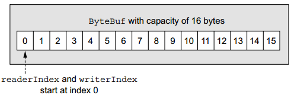
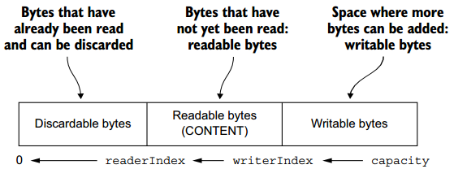
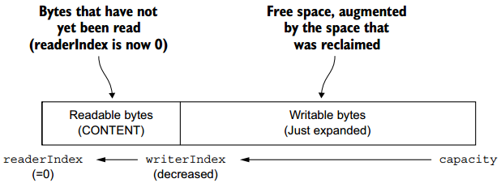
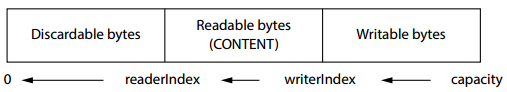
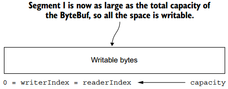

**一、前言**

前面已经学习了Netty中传输部分，现在接着学习Netty中的ByteBuf。

**二、ByteBuf**

2.1 ByteBuf API

在网络上传输的数据形式为Byte，Java
NIO提供了ByteBuffer来作为Byte容器，该类有些复杂，而Netty使用ByteBuf作为ByteBuffer的替换方案，其提供了一个更好的API，

Netty通过ByteBuf和ByteBufHolder两个组件处理数据，而ByteBuf的API有如下优势

· 可扩展的用户定义的缓冲区类型

· 通过内置复合缓冲区类型实现透明零拷贝

· 容量随着需求可扩大

· 在读写器模式之间切换不需要调用ByteBuffer的flip（）方法

· 数据读写使用不同的索引

· 支持方法链

· 支持引用计数

· 支持池

ByteBuf维护两个不同的读索引和写索引，当读ByteBuf时，readerIndex会随着数据的读取而不断增加，同理，writerIndex也相同，对于空的ByteBuf而言，其readerIndex和writerIndex均初始化为0，如下图所示

而当读取数据时，readerIndex与writerIndex相同时，表示不能再读取数据了，否则会抛出IndexOutOfBoundsException异常，以read或者write开头的方法会增加相应的索引，而set和get方法则不会，可自定义ByteBuf的大小，当超过大小时将抛出异常。

2.2 ByteBuf使用模式

常用的模式有如下几种：

· 堆缓冲。将数据存储在JVM的堆空间中，使用backing array提供支持，这种模式在不使用池的情况下提供快速分配和释放。

· 直接缓冲。通过JVM的本地调用分配内存，这可避免每次调用本地I / O操作之前（或之后）将缓冲区的内容复制到（或从）中间缓冲区。

·
复合缓冲。呈现多个ByteBufs的聚合视图，可以添加或删除ByteBuf实例，由Netty中的CompositeByteBuf提供支持，CompositeByteBuf中的ByteBuf实例包含直接或非直接的分配。

2.3 字节级的操作

ByteBuf提供了很多用于修改数据的读写方法。

1\. 随机访问索引

ByteBuf的第一个索引编号为0，最后一个编号为capacity() - 1，可使用如下代码读取ByteBuf的数据

    
    
    for (int i = 0; i < buffer.capacity(); i++) {
        byte b = buffer.getByte(i);
        System.out.println((char) b);
    }

值得注意的是当有索引作为参数传入方法而读取数据时，并不会改变readerIndex或者writerIndex的值。

2\. 顺序访问索引

Netty的ByteBuf有读写两个索引，而JDK的ByteBuffer只有一个索引，因此需要使用flip方法进行读写切换，下图展示了读写索引如何将ByteBuf划分为三个区域。

3\. 可舍弃字节

可舍弃的字节表示那些已经被读取的数据，可通过调用discardReadBytes()
方法舍弃并且回收该部分空间。当调用了discardReadBytes方法后，其布局如下图所示

可以看到，整个容量未变，但是此时readerIndex的值变为0，可写的容量大小扩大了。

4\. 可读字节

可读字节部分存储了真实的数据。新分配的、包装的或复制的缓冲区的readerIndex的默认值为0，以read或者skip开头的方法操作将检索或跳过当前readerIndex中的数据并增加读取的字节数，当可读字节已经用尽时，再进行读取将会抛出异常。下面代码将会读取ByteBuf中的所有数据。

    
    
    ByteBuf buffer = ...;
    while (buffer.isReadable()) {
        System.out.println(buffer.readByte());
    }

5\. 可写字节

可写字节部分可供写入数据，初始化的writerIndex为0，以write开头的将会从writerIndex开始写入数据，并且writerIndex会增加相应的大小。当超过ByteBuf的容量时，再写入数据时会抛出IndexOutOfBoundException异常，如下代码会随机写入一个整形。

    
    
    ByteBuf buffer = ...;
    while (buffer.writableBytes() >= 4) {
        buffer.writeInt(random.nextInt());
    }

6\. 索引管理

可通过调用markReaderIndex(), markWriterIndex(), resetReaderIndex(), and
resetWriterIndex()方法来标记和重置readerIndex和writerIndex，也可通过调用readerIndex(int)、writerIndex(int)
方法来将readerIndex和writerIndex设置为指定值，也可通过调用clear()方法将readerIndex和writerIndex设置为0，但是并不会清空内容。  

若调用clear之前的布局如下

则调用clear之后的布局如下

clear()方法比discardReadBytes()方法性能更优，因为其不需要拷贝数据。

7\. 搜索操作

有多种方法确定ByteBuf指定值的索引，如使用indexOf方法，另一种更为复杂的方法是使用ByteBufProcessor作为方法的参数，如下代码寻找\r的索引

    
    
    ByteBuf buffer = ...;
    int index = buffer.forEachByte(ByteBufProcessor.FIND_CR);　　

8\. 派生缓冲区

派生缓冲提供了ByteBuf的视图，可通过如下方法创建视图duplicate()、slice()、slice(int,
int)、Unpooled.unmodifiableBuffer(…)、order(ByteOrder)、readSlice(int)。

每个方法将会返回一个新的ByteBuf实例，该实例有自己的readerIndex、writerIndex、marker索引，当修改该ByteBuf实例数据时，原始数据也将被修改。如下代码展示了使用slice方法来创建新的ByteBuf实例用法

    
    
    Charset utf8 = Charset.forName("UTF-8");
    ByteBuf buf = Unpooled.copiedBuffer("Netty in Action rocks!", utf8);
    ByteBuf sliced = buf.slice(0, 14);
    System.out.println(sliced.toString(utf8));
    buf.setByte(0, (byte)"J");
    assert buf.getByte(0) == sliced.getByte(0);

其中，由于数据是共享的，对一个ByteBuf的修改对原始的ByteBuf是可见的

下面代码展示了copy方法的使用

    
    
    Charset utf8 = Charset.forName("UTF-8");
    ByteBuf buf = Unpooled.copiedBuffer("Netty in Action rocks!", utf8);
    ByteBuf copy = buf.copy(0, 14);
    System.out.println(copy.toString(utf8));
    buf.setByte(0, (byte)"J");
    assert buf.getByte(0) != copy.getByte(0);

copy方法会重新分配新的ByteBuf，对其的修改对原始的ByteBuf不可见。

9\. 读/写操作

get和set操作读写指定索引的数据，而不会改变索引值。read和write操作读写指定索引数据，并且会改变索引的值。

2.4 ByteBuf分配  

1\. ByteBufAllocator接口

为减少分配和重新分配内存的开销，Netty使用ByteBufAllocator使用了池，其可分配任何类型的ByteBuf实例，Netty提供了ByteBufAllocator两种类型的实现：PooledByteBufAllocator和UnpooledByteBufAllocator，前者池化ByteBuf实例以提高性能并最小化内存碎片，后者每次调用时都返回一个新的实例。Netty默认使用PooledByteBufAllocator，但也可通过ChannelConfig改变并使用不同的分配器。

2\. 非池化缓冲

当没有ByteBufAllocator引用时，Netty提供了Unpooled工具类，其提供了创建非池化缓冲的帮助方法，具体如下：buffer()、buffer(int
initialCapacity)、buffer(int initialCapacity, int
maxCapacity)、directBuffer()、directBuffer(int initialCapacity)、directBuffer(int
initialCapacity, int maxCapacity)、wrappedBuffer()、copiedBuffer()等。

3\. ByteBufUtil类  

ByteBufUtil类提供了管理ByteBuf的方法，其中最有效的方法是hexdump方法，它打印ByteBuf的内容的十六进制表示，在调试时该方法非常有用。另一个方法是boolean
equals(ByteBuf, ByteBuf) 方法，用来判断两个ByteBuf的相等性。  

2.5 引用计数

引用计数是一种通过释放由对象不再被其他对象引用的对象所持有的资源来优化内存使用和性能的技术，Netty在ByteBuf和ByteBufHolder的第4版中引入了引用计数，其都实现了ReferenceCounted接口。引用计数背后的思想并不复杂，主要是跟踪指定对象的活动引用数。ReferenceCounted实现实例的初始化活动引用计数为1。只要引用计数大于0，就要保证对象不被释放，当为0时，需要被释放。当访问已经被释放的对象时会抛出IllegalReferenceCountException异常。  

**三、总结**

本篇博文着重讲解了ByteBuf的具体细节，以及讲解了不同的缓冲区类型，其是Netty中的核心概念，可以类比JDK中的ByteBuffer进行学习，也谢谢各位园友的观看~

