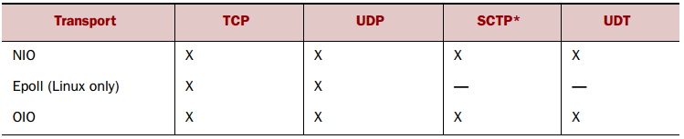

**一、前言**

在简单学习了Netty中的组件后，接着学习Netty中数据的传输细节。

**二、传输**

2.1 传输示例

Netty中的数据传输都是使用的字节类型，下面通过一个实例进行说明，该实例中服务器接受请求，然后向客户端发送一个Hi，最后关闭连接。下面是不同方式的实现。

1\. OIO方式

OIO与NIO对应，使用阻塞式的IO处理，其服务端代码如下

    
    
    package com.hust.grid.leesf.chapter4;
    
    import java.io.IOException;
    import java.io.OutputStream;
    import java.net.ServerSocket;
    import java.net.Socket;
    import java.nio.charset.Charset;
    
    public class PlainOioServer {
    
        public void serve(int port) throws IOException {
            final ServerSocket socket = new ServerSocket(port);
            try {
                for (;;) {
                    final Socket clientSocket = socket.accept();
                    System.out.println("Accepted connection from: " + clientSocket);
    
                    new Thread(new Runnable() {
                        @Override
                        public void run() {
                            OutputStream out;
                            try {
                                out = clientSocket.getOutputStream();
                                out.write("Hi!\r\n".getBytes(Charset.forName("UTF-8")));
                                out.flush();
                                clientSocket.close();
    
                            } catch (IOException e) {
                                e.printStackTrace();
                                try {
                                    clientSocket.close();
                                } catch (IOException ex) {
                                    // ignore on close
                                }
                            }
                        }
                    }).start();
                }
            } catch (IOException e) {
                e.printStackTrace();
            }
        }
    }

OIO

说明：其中，在for循环中会不断的去监听是否有新请求到达，当有请求到达后，初始化一个新的线程去处理，完成向客户端发送Hi字符串，最后关闭连接。使用OIO方式的性能较差，扩展性也不好，需要使用异步方式处理。

2\. NIO方式

    
    
    package com.hust.grid.leesf.chapter4;
    
    import java.io.IOException;
    import java.net.InetSocketAddress;
    import java.net.ServerSocket;
    import java.nio.ByteBuffer;
    import java.nio.channels.SelectionKey;
    import java.nio.channels.Selector;
    import java.nio.channels.ServerSocketChannel;
    import java.nio.channels.SocketChannel;
    import java.util.Iterator;
    import java.util.Set;
    
    public class PlainNioServer {
        public void serve(int port) throws IOException {
            ServerSocketChannel serverChannel = ServerSocketChannel.open();
            serverChannel.configureBlocking(false);
            ServerSocket ss = serverChannel.socket();
            InetSocketAddress address = new InetSocketAddress(port);
            ss.bind(address);
            Selector selector = Selector.open();
            serverChannel.register(selector, SelectionKey.OP_ACCEPT);
            final ByteBuffer msg = ByteBuffer.wrap("Hi!\r\n".getBytes());
            for (;;) {
                try {
                    selector.select();
                } catch (IOException ex) {
                    ex.printStackTrace();
                    // handle exception
                    break;
                }
                Set<SelectionKey> readyKeys = selector.selectedKeys();    //5
                Iterator<SelectionKey> iterator = readyKeys.iterator();
                while (iterator.hasNext()) {
                    SelectionKey key = iterator.next();
                    iterator.remove();
                    try {
                        if (key.isAcceptable()) {                //6
                            ServerSocketChannel server =
                                    (ServerSocketChannel)key.channel();
                            SocketChannel client = server.accept();
                            client.configureBlocking(false);
                            client.register(selector, SelectionKey.OP_WRITE |
                                    SelectionKey.OP_READ, msg.duplicate());    //7
                            System.out.println(
                                    "Accepted connection from " + client);
                        }
                        if (key.isWritable()) {                //8
                            SocketChannel client =
                                    (SocketChannel)key.channel();
                            ByteBuffer buffer =
                                    (ByteBuffer)key.attachment();
                            while (buffer.hasRemaining()) {
                                if (client.write(buffer) == 0) {        //9
                                    break;
                                }
                            }
                            client.close();                    //10
                        }
                    } catch (IOException ex) {
                        key.cancel();
                        try {
                            key.channel().close();
                        } catch (IOException cex) {
                            // ignore on close
                        }
                    }
                }
            }
        }
    }

NIO

说明：NIO方法使用了Selector和Channel等组件，使用Selector来处理多个Channel，其代码与OIO代码几乎是完全不相同。

3\. Netty的OIO方式

当使用Netty框架处理时，并且采用OIO的方式，其代码如下

    
    
    package com.hust.grid.leesf.chapter4;
    
    import io.netty.bootstrap.ServerBootstrap;
    import io.netty.buffer.ByteBuf;
    import io.netty.buffer.Unpooled;
    import io.netty.channel.ChannelFuture;
    import io.netty.channel.ChannelFutureListener;
    import io.netty.channel.ChannelHandlerContext;
    import io.netty.channel.ChannelInboundHandlerAdapter;
    import io.netty.channel.ChannelInitializer;
    import io.netty.channel.EventLoopGroup;
    import io.netty.channel.oio.OioEventLoopGroup;
    import io.netty.channel.socket.SocketChannel;
    import io.netty.channel.socket.oio.OioServerSocketChannel;
    
    import java.net.InetSocketAddress;
    import java.nio.charset.Charset;
    
    public class NettyOioServer {
    
        public void server(int port) throws Exception {
            final ByteBuf buf = Unpooled.unreleasableBuffer(
                    Unpooled.copiedBuffer("Hi!\r\n", Charset.forName("UTF-8")));
            EventLoopGroup group = new OioEventLoopGroup();
            try {
                ServerBootstrap b = new ServerBootstrap();
    
                b.group(group)
                 .channel(OioServerSocketChannel.class)
                 .localAddress(new InetSocketAddress(port))
                 .childHandler(new ChannelInitializer<SocketChannel>() {
                     @Override
                     public void initChannel(SocketChannel ch) 
                         throws Exception {
                         ch.pipeline().addLast(new ChannelInboundHandlerAdapter() {
                             @Override
                             public void channelActive(ChannelHandlerContext ctx) throws Exception {
                                 ctx.writeAndFlush(buf.duplicate()).addListener(ChannelFutureListener.CLOSE);
                             }
                         });
                     }
                 });
                ChannelFuture f = b.bind().sync();
                f.channel().closeFuture().sync();
            } finally {
                group.shutdownGracefully().sync();
            }
        }
    }

Netty的OIO

可以看到上述代码很多都是和之前示例中使用的代码相同，再来看看在Netty框架下使用NIO时的处理方式。

4\. Netty的NIO方式

    
    
    package com.hust.grid.leesf.chapter4;
    
    import io.netty.bootstrap.ServerBootstrap;
    import io.netty.buffer.ByteBuf;
    import io.netty.buffer.Unpooled;
    import io.netty.channel.ChannelFuture;
    import io.netty.channel.ChannelFutureListener;
    import io.netty.channel.ChannelHandlerContext;
    import io.netty.channel.ChannelInboundHandlerAdapter;
    import io.netty.channel.ChannelInitializer;
    import io.netty.channel.nio.NioEventLoopGroup;
    import io.netty.channel.socket.SocketChannel;
    import io.netty.channel.socket.nio.NioServerSocketChannel;
    
    import java.net.InetSocketAddress;
    import java.nio.charset.Charset;
    
    public class NettyNioServer {
    
        public void server(int port) throws Exception {
            final ByteBuf buf = Unpooled.unreleasableBuffer(
                    Unpooled.copiedBuffer("Hi!\r\n", Charset.forName("UTF-8")));
            NioEventLoopGroup group = new NioEventLoopGroup();
            try {
                ServerBootstrap b = new ServerBootstrap();
                b.group(new NioEventLoopGroup(), new NioEventLoopGroup())
                 .channel(NioServerSocketChannel.class)
                 .localAddress(new InetSocketAddress(port))
                 .childHandler(new ChannelInitializer<SocketChannel>() {
                     @Override
                     public void initChannel(SocketChannel ch) 
                         throws Exception {
                         ch.pipeline().addLast(new ChannelInboundHandlerAdapter() {
                             @Override
                             public void channelActive(ChannelHandlerContext ctx) throws Exception {
                                 ctx.writeAndFlush(buf.duplicate()).addListener(ChannelFutureListener.CLOSE);
                             }
                         });
                     }
                 });
                ChannelFuture f = b.bind().sync();
                f.channel().closeFuture().sync();
            } finally {
                group.shutdownGracefully().sync();
            }
        }
    }

Netty的NIO

可以看到Netty框架下的NIO和OIO的代码基本相同。

2.2 传输细节

传输的核心是Channel接口，其继承结构图如下所示

其中，Channel继承了AttributeMap和Comparable接口，其包含ChannelPipeline和ChannelConfig两个实例，ChannelConfig包含了所有的配置信息，ChannelPipeline包含了所有的ChannelHandler实例，其中用于存放用户的处理逻辑。典型的ChannelHandler用法如下

· 将数据类型进行转化

· 提供异常通知

· 提供Channel变为活动或非活动的通知

· 提供当Channel在EventLoopGroup中注册或者注销时的通知

· 提供用户定义事件的通知

Netty中的Channel实现是线程安全的，所以在多线程环境中可安全使用。

2.3 传输方案

Netty提供了多种传输方案，你可根据应用的不同选择合适的传输方案。

1\. NIO-非阻塞型I/O

NIO提供了完全异步的IO实现，其使用基于选择器的API，选择器的核心概念是将其作为注册表，当通道的状态变化时会接受到通知，可能有的变化状态如下

· 一个新通道被接受并已准备好

· 一个通道的连接已经完成

· 一个通道已经有准备好读取的数据

· 一个通道可以写入数据

当应用程序对状态的变化做出反应后，会重置选择器并重复处理，根据不同的状态给出不同的响应，选择操作有如下四种类型OP_ACCEPT
、OP_CONNECT、OP_READ 、OP_WRITE，其中选择器的处理流程如下图所示

2\. Epoll-Linux的本机非阻塞传输

Netty可在任何系统上运行，但对于不同的系统会有不同的折中，Linux系统中的epoll具有高可扩展的I/O的事件通知，Linux上的JDK的NIO则是基于epoll，当使用epoll取代NIO时，可以使用Netty中的EpollEventLoopGroup取代NioEventLoopGroup，使用EpollServerSocketChannel.class取代NioServerSocketChannel.class。  

3\. OIO-阻塞型I/O

Netty的OIO是一种妥协方案，其使用JAVA中原生态的旧的API，其是同步阻塞的。在java.net的API中，通常使用一个线程接受来自指定端口的请求，当创建一个套接字时，就会创建一个新的线程来进行处理，其处理流程图如下图所示

4\. 在JVM内进行通信的本地传输

Netty提供了在同一个JVM中的客户端与服务端之间的异步通信，在此传输中，与服务器通道相关联的SocketAddress不绑定到物理网络地址，相反，当服务器运行时，其存储在注册表中，关闭时取消注册。因为传输不能接受真正的网络流量，所以它不能与其他传输实现互操作。

5\. 嵌入式传输

Netty还提供了一个额外的传输，其可以将ChannelHandler作为帮助类嵌入其他的ChannelHandler中，以这种方式，你无需修改其内部代码便能扩展ChannelHandler的功能。

2.4 传输示例

并非所有的传输都支持所有的传输协议，下表是传输方式与传输协议之间的关系

而对于不同的应用，可根据下表选择合适的传输方式

**三、总结**

本篇博文讲解了Netty中的传输细节，了解了多种不同的传输方式，以及其和不同传输协议之间的关系，也谢谢各位园友的观看~

