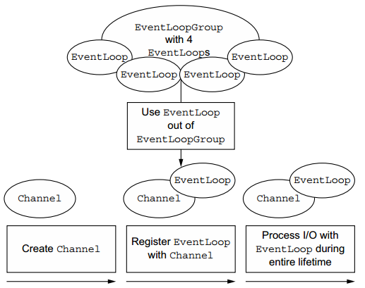
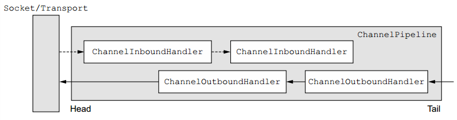
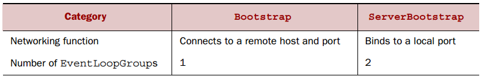
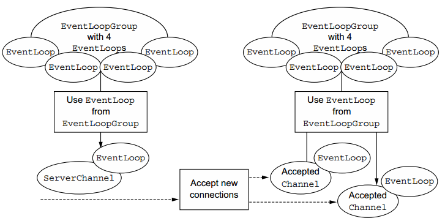

##【Netty】Netty核心组件介绍

##
##一、前言

##
##　　前篇博文体验了Netty的第一个示例，下面接着学习Netty的组件和其设计。

##
##二、核心组件

##
##　　2.1. Channel、EventLoop和ChannelFuture

##
##　　Netty中的核心组件包括Channel、EventLoop、ChannelFuture。下面进行逐一介绍。

##
##　　1. Channel接口

##
##　　基础的IO操作，如绑定、连接、读写等都依赖于底层网络传输所提供的原语，在Java的网络编程中，基础核心类是Socket，而Netty的Channel提供了一组API，极大地简化了直接与Socket进行操作的复杂性，并且Channel是很多类的父类，如EmbeddedChannel、LocalServerChannel、NioDatagramChannel、NioSctpChannel、NioSocketChannel等。

##
##　　2. EventLoop接口

##
##　　EventLoop定义了处理在连接过程中发生的事件的核心抽象，之后会进一步讨论，其中Channel、EventLoop、Thread和EventLoopGroup之间的关系如下图所示

##
##　　 

##
##　　可以看到。

##
##　　　　· 一个EventLoopGroup包含一个或多个EventLoop。

##
##　　　　· 一个EventLoop在生命中周期绑定到一个Thread上。

##
##　　　　· EventLoop使用其对应的Thread处理IO事件。

##
##　　　　· 一个Channel使用EventLoop进行注册。

##
##　　　　· 一个EventLoop可被分配至一个或多个Channel。

##
##　　3. ChannelFuture接口

##
##　　Netty中的所有IO操作都是异步的，不会立即返回，需要在稍后确定操作结果。因此Netty提供了ChannelFuture，其addListener方法可以注册一个ChannelFutureListener，当操作完成时，不管成功还是失败，均会被通知。ChannelFuture存储了之后执行的操作的结果并且无法预测操作何时被执行，提交至Channel的操作按照被唤醒的顺序被执行。

##
##　　2.2.ChannelHandler和ChannelPipeline 

##
##　　ChannelHandler和ChannelPipeline与用户逻辑和数据流密切相关。

##
##　　1. ChannelHandler接口

##
##　　从应用开发者看来，ChannelHandler是最重要的组件，其中存放用来处理进站和出站数据的用户逻辑。ChannelHandler的方法被网络事件触发，ChannelHandler可以用于几乎任何类型的操作，如将数据从一种格式转换为另一种格式或处理抛出的异常。例如，其子接口ChannelInboundHandler，接受进站的事件和数据以便被用户定义的逻辑处理，或者当响应所连接的客户端时刷新ChannelInboundHandler的数据。

##
##　　2. ChannelPipeline接口

##
##　　ChannelPipeline为ChannelHandler链提供了一个容器并定义了用于沿着链传播入站和出站事件流的API。当创建Channel时，会自动创建一个附属的ChannelPipeline。ChannelHandlers按照如下步骤安装在ChannelPipeline中。

##
##　　· 一个ChannelInitializer的实现在ServerBootstrap中进行注册。

##
##　　· 当ChannelInitializer的initChannel方法被调用时，ChannelInitializer在管道中安装一组自定义的ChannelHandlers。

##
##　　· ChannelInitializer从ChannelPipeline中移除自身。

##
##　　ChannelHandler可被当做放置任何代码的容器，用于处理到达并通过ChannelPipeline的事件或者数据，数据可以沿着处理链进行传递。

##
##　　 

##
##　　当事件从客户端移动至服务端时称为出站，反之称为入站。并且入站处理器和出站处理器可共存于同一个管道中，当读取入站数据或事件时，将会从管道的头部开始传递到第一个入站处理器，然后传递至下一个处理器直至管道的尾部，此时数据处理结束。当出站时，沿着处理链直到管道的头，然后进行网络传输。

##
##　　2.3.Bootstrapping 

##
##　　Netty的引导类应用程序网络层配置提供容器，其涉及将进程绑定到给定端口或连接一个进程到在指定主机上指定端口上运行的另一进程。引导类分为客户端引导Bootstrap和服务端引导ServerBootstrap，两种引导的联系与区别如下图所示。

##
##　　 　　

##
##　　其中，ServerBootstrap绑定到指定端口来监听客户端连接请求，Bootstrap连接至远程服务端。并且ServerBootstrap包含两个EventLoopGroup，而Bootstrap只包含一个EventLoopGroup。ServerBootstrap包含两组通道，第一组包含一个ServerChannel，表示服务器绑定到本地端口的监听套接字；第二组包含用来处理客户端连接所创建的所有通道，每接受一个连接时便会创建一个通道，下图显示了ServerBootstrap的两个EventLoopGroup。

##
##　　 

##
##　　EventLoopGroup为关联的ServerChannel分配一个EventLoop，其为连接请求创建通道（归属于第二个EventLoopGroup），一旦一个连接请求被接受时，第二个EventLoopGroup将为通道创建EventLoop。

##
##三、总结

##
##　　本篇博文简单介绍了Netty中的一些核心组件及其作用，以及各组件之间的关联，后面还会更为详细的讲解，谢谢各位园友的观看~　　