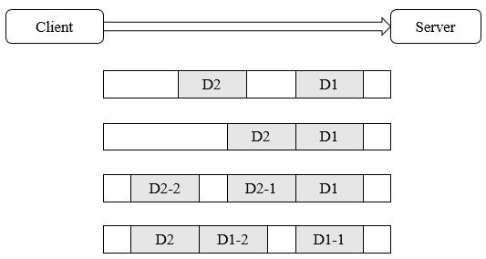

##【Netty】TCP粘包和拆包

##
##一、前言

##
##　　前面已经基本上讲解完了Netty的主要内容，现在来学习Netty中的一些可能存在的问题，如TCP粘包和拆包。

##
##二、粘包和拆包

##
##　　对于TCP协议而言，当底层发送消息和接受消息时，都需要考虑TCP的粘包和拆包问题，一个完整的数据包可能会被TCP拆分为多个包发送，或者将多个小的数据包封装成大的数据包发送。

##
##　　2.1 粘包和拆包基础

##
##　　假设客户端发送D1和D2两个数据包至服务端，由于服务端每次读取的数据大小时不确定的，因此，可能存在如下四种情况。

##
##　　 

##
##　　① 服务端分两次读取到数据包，分别为D1和D2，没有粘包和拆包。

##
##　　② 服务端一次读取两个数据包D1和D2，D1和D2黏合在一起，称为TCP粘包。

##
##　　③ 服务端一次读取完整的D1数据包和D2数据包的一部分，第二次读取D2剩余的部分，称为TCP拆包。

##
##　　④ 服务端一次读取D1数据包的一部分，第二次读取D1的剩余部分和D2数据包。

##
##　　可以看到，在底层发送数据时，可能会发生粘包和拆包，其原因大致有如下三种。

##
##　　① 应用程序写入字节大小大于套接字缓冲区大小。

##
##　　② 进行MSS（Max Segment Size）大小的TCP分段。

##
##　　③ 以太网帧的负载大于MTU（Maximum Transmission Unit）进行分片。

##
##　　由于底层的TCP协议无法理解上层的业务数据，所以底层无法保证数据不被拆分和重组，而为了解决粘包问题，业界主要的策略如下。

##
##　　① 消息定长，如每个报文大小固定为200个字节，如果不够，空格补位。

##
##　　② 在包尾添加回车换行符进行分割，如FTP协议。

##
##　　③ 将消息划分为消息头和消息体，消息头中包含消息总长度的字段。

##
##　　2.2 TCP粘包示例

##
##　　下面通过一个示例展示未考虑粘包问题导致的异常。

##
##　　1. TimeServerHandler　　

	package com.hust.grid.leesf.chapter4;

import io.netty.buffer.ByteBuf;
import io.netty.buffer.Unpooled;
import io.netty.channel.ChannelHandlerContext;
import io.netty.channel.ChannelInboundHandlerAdapter;

/**
 * Created by Leesf on 2017/6/28.
 */
public class TimeServerHandler extends ChannelInboundHandlerAdapter {
    private int counter;

    @Override
    public void channelRead(ChannelHandlerContext ctx, Object msg) throws Exception {
        ByteBuf buf = (ByteBuf) msg;
        byte[] req = new byte[buf.readableBytes()];
        buf.readBytes(req);
        String body = new String(req, "UTF-8").substring(0, req.length
                - System.getProperty("line.separator").length());
        System.out.println("The time server receive order : " + body
                + " ; the counter is : " + ++counter);
        String currentTime = "QUERY TIME ORDER".equalsIgnoreCase(body) ? new java.util.Date(
                System.currentTimeMillis()).toString() : "BAD ORDER";
        currentTime = currentTime + System.getProperty("line.separator");
        ByteBuf resp = Unpooled.copiedBuffer(currentTime.getBytes());
        ctx.writeAndFlush(resp);
    	}

    @Override
    public void exceptionCaught(ChannelHandlerContext ctx, Throwable cause) {
        cause.printStackTrace();
        ctx.close();
    	}
	}


##
##　　2. TimeServer

	package com.hust.grid.leesf.chapter4;

import io.netty.bootstrap.ServerBootstrap;
import io.netty.channel.ChannelFuture;
import io.netty.channel.ChannelInitializer;
import io.netty.channel.ChannelOption;
import io.netty.channel.EventLoopGroup;
import io.netty.channel.nio.NioEventLoopGroup;
import io.netty.channel.socket.SocketChannel;
import io.netty.channel.socket.nio.NioServerSocketChannel;

/**
 * Created by Leesf on 2017/6/28.
 */

public class TimeServer {
    public void bind(int port) throws Exception {
        EventLoopGroup bossGroup = new NioEventLoopGroup();
        EventLoopGroup workerGroup = new NioEventLoopGroup();
        try {
            ServerBootstrap b = new ServerBootstrap();
            b.group(bossGroup, workerGroup)
                    .channel(NioServerSocketChannel.class)
                    .option(ChannelOption.SO_BACKLOG, 1024)
                    .childHandler(new ChildChannelHandler());
            ChannelFuture f = b.bind(port).sync();
            f.channel().closeFuture().sync();
        	} finally {
            bossGroup.shutdownGracefully();
            workerGroup.shutdownGracefully();
        	}
    	}

    private class ChildChannelHandler extends ChannelInitializer<SocketChannel> {
        @Override
        protected void initChannel(SocketChannel arg0) throws Exception {
            arg0.pipeline().addLast(new TimeServerHandler());
        	}

    	}

    public static void main(String[] args) throws Exception {
        int port = 8080;
        if (args != null &amp;&amp; args.length > 0) {
            try {
                port = Integer.valueOf(args[0]);
            	} catch (NumberFormatException e) {
                // ignore
            	}
        	}
        new TimeServer().bind(port);
    	}
	}


##
##　　3. TimeClientHandler　　

	package com.hust.grid.leesf.chapter4;

import io.netty.buffer.ByteBuf;
import io.netty.buffer.Unpooled;
import io.netty.channel.ChannelHandlerAdapter;
import io.netty.channel.ChannelHandlerContext;
import io.netty.channel.ChannelInboundHandlerAdapter;

import java.util.logging.Logger;

/**
 * Created by Leesf on 2017/6/28.
 */

public class TimeClientHandler extends ChannelInboundHandlerAdapter {
    private static final Logger logger = Logger
            .getLogger(TimeClientHandler.class.getName());
    private int counter;
    private byte[] req;

    public TimeClientHandler() {
        req = ("QUERY TIME ORDER" + System.getProperty("line.separator"))
                .getBytes();
    	}

    @Override
    public void channelActive(ChannelHandlerContext ctx) {
        ByteBuf message = null;
        for (int i = 0; i < 100; i++) {
            message = Unpooled.buffer(req.length);
            message.writeBytes(req);
            ctx.writeAndFlush(message);
        	}
    	}

    @Override
    public void channelRead(ChannelHandlerContext ctx, Object msg)
            throws Exception {
        ByteBuf buf = (ByteBuf) msg;
        byte[] req = new byte[buf.readableBytes()];
        buf.readBytes(req);
        String body = new String(req, "UTF-8");
        System.out.println("Now is : " + body + " ; the counter is : "
                + ++counter);
    	}

    @Override
    public void exceptionCaught(ChannelHandlerContext ctx, Throwable cause) {
        cause.printStackTrace();
        ctx.close();
    	}
	}


##
##　　4. TimeClient　

	package com.hust.grid.leesf.chapter4;

import io.netty.bootstrap.Bootstrap;
import io.netty.channel.ChannelFuture;
import io.netty.channel.ChannelInitializer;
import io.netty.channel.ChannelOption;
import io.netty.channel.EventLoopGroup;
import io.netty.channel.nio.NioEventLoopGroup;
import io.netty.channel.socket.SocketChannel;
import io.netty.channel.socket.nio.NioSocketChannel;

/**
 * Created by Leesf on 2017/6/28.
 */

public class TimeClient {
    public void connect(int port, String host) throws Exception {
        EventLoopGroup group = new NioEventLoopGroup();
        try {
            Bootstrap b = new Bootstrap();
            b.group(group).channel(NioSocketChannel.class)
                    .option(ChannelOption.TCP_NODELAY, true)
                    .handler(new ChannelInitializer<SocketChannel>() {
                        @Override
                        public void initChannel(SocketChannel ch)
                                throws Exception {

                            ch.pipeline().addLast(new TimeClientHandler());
                        	}
                    	});
            ChannelFuture f = b.connect(host, port).sync();
            f.channel().closeFuture().sync();
        	} finally {
            group.shutdownGracefully();
        	}
    	}

    public static void main(String[] args) throws Exception {
        int port = 8080;
        if (args != null &amp;&amp; args.length > 0) {
            try {
                port = Integer.valueOf(args[0]);
            	} catch (NumberFormatException e) {
                // ignore
            	}
        	}
        new TimeClient().connect(port, "127.0.0.1");
    	}
	}


##
##　　分别运行服务器和客户端，其中服务器的运行结果如下：　　
  

	The time server receive order : QUERY TIME ORDER
QUERY TIME ORDER
QUERY TIME ORDER
QUERY TIME ORDER
QUERY TIME ORDER
QUERY TIME ORDER
QUERY TIME ORDER
QUERY TIME ORDER
QUERY TIME ORDER
QUERY TIME ORDER
QUERY TIME ORDER
QUERY TIME ORDER
QUERY TIME ORDER
QUERY TIME ORDER
QUERY TIME ORDER
QUERY TIME ORDER
QUERY TIME ORDER
QUERY TIME ORDER
QUERY TIME ORDER
QUERY TIME ORDER
QUERY TIME ORDER
QUERY TIME ORDER
QUERY TIME ORDER
QUERY TIME ORDER
QUERY TIME ORDER
QUERY TIME ORDER
QUERY TIME ORDER
QUERY TIME ORDER
QUERY TIME ORDER
QUERY TIME ORDER
QUERY TIME ORDER
QUERY TIME ORDER
QUERY TIME ORDER
QUERY TIME ORDER
QUERY TIME ORDER
QUERY TIME ORDER
QUERY TIME ORDER
QUERY TIME ORDER
QUERY TIME ORDER
QUERY TIME ORDER
QUERY TIME ORDER
QUERY TIME ORDER
QUERY TIME ORDER
QUERY TIME ORDER
QUERY TIME ORDER
QUERY TIME ORDER
QUERY TIME ORDER
QUERY TIME ORDER
QUERY TIME ORDER
QUERY TIME ORDER
QUERY TIME ORDER
QUERY TIME ORDER
QUERY TIME ORDER
QUERY TIME ORDER
QUERY TIME ORDER
QUERY TIME ORDER
QUERY TIME ORD ; the counter is : 1
The time server receive order : 
QUERY TIME ORDER
QUERY TIME ORDER
QUERY TIME ORDER
QUERY TIME ORDER
QUERY TIME ORDER
QUERY TIME ORDER
QUERY TIME ORDER
QUERY TIME ORDER
QUERY TIME ORDER
QUERY TIME ORDER
QUERY TIME ORDER
QUERY TIME ORDER
QUERY TIME ORDER
QUERY TIME ORDER
QUERY TIME ORDER
QUERY TIME ORDER
QUERY TIME ORDER
QUERY TIME ORDER
QUERY TIME ORDER
QUERY TIME ORDER
QUERY TIME ORDER
QUERY TIME ORDER
QUERY TIME ORDER
QUERY TIME ORDER
QUERY TIME ORDER
QUERY TIME ORDER
QUERY TIME ORDER
QUERY TIME ORDER
QUERY TIME ORDER
QUERY TIME ORDER
QUERY TIME ORDER
QUERY TIME ORDER
QUERY TIME ORDER
QUERY TIME ORDER
QUERY TIME ORDER
QUERY TIME ORDER
QUERY TIME ORDER
QUERY TIME ORDER
QUERY TIME ORDER
QUERY TIME ORDER
QUERY TIME ORDER
QUERY TIME ORDER
QUERY TIME ORDER ; the counter is : 2

View Code

##
##　　客户端的运行结果如下：　　

	Now is : BAD ORDER
BAD ORDER
 ; the counter is : 1


##
##　　可以看到服务端只接收到了两条消息，一条消息包含了57条指令，另一条包含了43条指令，其与我们设计的100条单独的消息不相符，发生了粘包。对于客户端而言，其收到了两条BAD ORDER，表示收到了两条消息，counter应该为2，但是其counter为1，表示也发生了粘包。

##
##　　下面通过Netty的LineBasedFrameDecoder和String来解决粘包问题。

##
##　　1. TimeServerHandler　

	package com.hust.grid.leesf.chapter4.fault;

import io.netty.buffer.ByteBuf;
import io.netty.buffer.Unpooled;
import io.netty.channel.ChannelHandlerContext;
import io.netty.channel.ChannelInboundHandlerAdapter;

/**
 * Created by Leesf on 2017/6/28.
 */
public class TimeServerHandler extends ChannelInboundHandlerAdapter {
    private int counter;

    @Override
    public void channelRead(ChannelHandlerContext ctx, Object msg) throws Exception {
        ByteBuf buf = (ByteBuf) msg;
        byte[] req = new byte[buf.readableBytes()];
        buf.readBytes(req);
        String body = new String(req, "UTF-8").substring(0, req.length
                - System.getProperty("line.separator").length());
        System.out.println("The time server receive order : " + body
                + " ; the counter is : " + ++counter);
        String currentTime = "QUERY TIME ORDER".equalsIgnoreCase(body) ? new java.util.Date(
                System.currentTimeMillis()).toString() : "BAD ORDER";
        currentTime = currentTime + System.getProperty("line.separator");
        ByteBuf resp = Unpooled.copiedBuffer(currentTime.getBytes());
        ctx.writeAndFlush(resp);
    	}

    @Override
    public void exceptionCaught(ChannelHandlerContext ctx, Throwable cause) {
        cause.printStackTrace();
        ctx.close();
    	}
	}


##
##　　2. TimeServer　

	package com.hust.grid.leesf.chapter4.fault;

import io.netty.bootstrap.ServerBootstrap;
import io.netty.channel.ChannelFuture;
import io.netty.channel.ChannelInitializer;
import io.netty.channel.ChannelOption;
import io.netty.channel.EventLoopGroup;
import io.netty.channel.nio.NioEventLoopGroup;
import io.netty.channel.socket.SocketChannel;
import io.netty.channel.socket.nio.NioServerSocketChannel;

/**
 * Created by Leesf on 2017/6/28.
 */

public class TimeServer {
    public void bind(int port) throws Exception {
        EventLoopGroup bossGroup = new NioEventLoopGroup();
        EventLoopGroup workerGroup = new NioEventLoopGroup();
        try {
            ServerBootstrap b = new ServerBootstrap();
            b.group(bossGroup, workerGroup)
                    .channel(NioServerSocketChannel.class)
                    .option(ChannelOption.SO_BACKLOG, 1024)
                    .childHandler(new ChildChannelHandler());
            ChannelFuture f = b.bind(port).sync();
            f.channel().closeFuture().sync();
        	} finally {
            bossGroup.shutdownGracefully();
            workerGroup.shutdownGracefully();
        	}
    	}

    private class ChildChannelHandler extends ChannelInitializer<SocketChannel> {
        @Override
        protected void initChannel(SocketChannel arg0) throws Exception {
            arg0.pipeline().addLast(new TimeServerHandler());
        	}

    	}

    public static void main(String[] args) throws Exception {
        int port = 8080;
        if (args != null &amp;&amp; args.length > 0) {
            try {
                port = Integer.valueOf(args[0]);
            	} catch (NumberFormatException e) {
                // ignore
            	}
        	}
        new TimeServer().bind(port);
    	}
	}


##
##　　3. TimeClientHandler　

	package com.hust.grid.leesf.chapter4.correct;

import io.netty.buffer.ByteBuf;
import io.netty.buffer.Unpooled;
import io.netty.channel.ChannelHandlerAdapter;
import io.netty.channel.ChannelHandlerContext;
import io.netty.channel.ChannelInboundHandlerAdapter;

import java.util.logging.Logger;

/**
 * Created by Leesf on 2017/6/28.
 */
public class TimeClientHandler extends ChannelInboundHandlerAdapter {
    private int counter;
    private byte[] req;

    public TimeClientHandler() {
        req = ("QUERY TIME ORDER" + System.getProperty("line.separator"))
                .getBytes();
    	}

    @Override
    public void channelActive(ChannelHandlerContext ctx) {
        ByteBuf message = null;
        for (int i = 0; i < 100; i++) {
            message = Unpooled.buffer(req.length);
            message.writeBytes(req);
            ctx.writeAndFlush(message);
        	}
    	}

    @Override
    public void channelRead(ChannelHandlerContext ctx, Object msg)
            throws Exception {
        String body = (String) msg;
        System.out.println("Now is : " + body + " ; the counter is : "
                + ++counter);
    	}

    @Override
    public void exceptionCaught(ChannelHandlerContext ctx, Throwable cause) {
        cause.printStackTrace();
        ctx.close();
    	}
	}


##
##　　4. TimeClient　　　

	package com.hust.grid.leesf.chapter4.correct;

import io.netty.bootstrap.Bootstrap;
import io.netty.channel.ChannelFuture;
import io.netty.channel.ChannelInitializer;
import io.netty.channel.ChannelOption;
import io.netty.channel.EventLoopGroup;
import io.netty.channel.nio.NioEventLoopGroup;
import io.netty.channel.socket.SocketChannel;
import io.netty.channel.socket.nio.NioSocketChannel;
import io.netty.handler.codec.LineBasedFrameDecoder;
import io.netty.handler.codec.string.StringDecoder;

/**
 * Created by Leesf on 2017/6/28.
 */

public class TimeClient {
    public void connect(int port, String host) throws Exception {
        EventLoopGroup group = new NioEventLoopGroup();
        try {
            Bootstrap b = new Bootstrap();
            b.group(group).channel(NioSocketChannel.class)
                    .option(ChannelOption.TCP_NODELAY, true)
                    .handler(new ChannelInitializer<SocketChannel>() {
                        @Override
                        public void initChannel(SocketChannel ch)
                                throws Exception {
                            ch.pipeline().addLast(
                                    new LineBasedFrameDecoder(1024));
                            ch.pipeline().addLast(new StringDecoder());
                            ch.pipeline().addLast(new TimeClientHandler());
                        	}
                    	});

            ChannelFuture f = b.connect(host, port).sync();
            f.channel().closeFuture().sync();
        	} finally {
            group.shutdownGracefully();
        	}
    	}

    public static void main(String[] args) throws Exception {
        int port = 8080;
        if (args != null &amp;&amp; args.length > 0) {
            try {
                port = Integer.valueOf(args[0]);
            	} catch (NumberFormatException e) {
                // ignore
            	}
        	}
        new TimeClient().connect(port, "127.0.0.1");
    	}
	}


##
##　　分别运行服务端和客户端，服务端结果如下：　
  

	"D:\Program Files (x86)\Java\jdk1.8.0_65\bin\java" "-javaagent:D:\Program Files (x86)\JetBrains\IntelliJ IDEA 2017.1.4\lib\idea_rt.jar=62564:D:\Program Files (x86)\JetBrains\IntelliJ IDEA 2017.1.4\bin" -Dfile.encoding=UTF-8 -classpath "D:\Program Files (x86)\Java\jdk1.8.0_65\jre\lib\charsets.jar;D:\Program Files (x86)\Java\jdk1.8.0_65\jre\lib\deploy.jar;D:\Program Files (x86)\Java\jdk1.8.0_65\jre\lib\ext\access-bridge-64.jar;D:\Program Files (x86)\Java\jdk1.8.0_65\jre\lib\ext\cldrdata.jar;D:\Program Files (x86)\Java\jdk1.8.0_65\jre\lib\ext\dnsns.jar;D:\Program Files (x86)\Java\jdk1.8.0_65\jre\lib\ext\jaccess.jar;D:\Program Files (x86)\Java\jdk1.8.0_65\jre\lib\ext\jfxrt.jar;D:\Program Files (x86)\Java\jdk1.8.0_65\jre\lib\ext\localedata.jar;D:\Program Files (x86)\Java\jdk1.8.0_65\jre\lib\ext\nashorn.jar;D:\Program Files (x86)\Java\jdk1.8.0_65\jre\lib\ext\sunec.jar;D:\Program Files (x86)\Java\jdk1.8.0_65\jre\lib\ext\sunjce_provider.jar;D:\Program Files (x86)\Java\jdk1.8.0_65\jre\lib\ext\sunmscapi.jar;D:\Program Files (x86)\Java\jdk1.8.0_65\jre\lib\ext\sunpkcs11.jar;D:\Program Files (x86)\Java\jdk1.8.0_65\jre\lib\ext\zipfs.jar;D:\Program Files (x86)\Java\jdk1.8.0_65\jre\lib\javaws.jar;D:\Program Files (x86)\Java\jdk1.8.0_65\jre\lib\jce.jar;D:\Program Files (x86)\Java\jdk1.8.0_65\jre\lib\jfr.jar;D:\Program Files (x86)\Java\jdk1.8.0_65\jre\lib\jfxswt.jar;D:\Program Files (x86)\Java\jdk1.8.0_65\jre\lib\jsse.jar;D:\Program Files (x86)\Java\jdk1.8.0_65\jre\lib\management-agent.jar;D:\Program Files (x86)\Java\jdk1.8.0_65\jre\lib\plugin.jar;D:\Program Files (x86)\Java\jdk1.8.0_65\jre\lib\resources.jar;D:\Program Files (x86)\Java\jdk1.8.0_65\jre\lib\rt.jar;F:\01_Code\02_Idea\CoreInNetty\target\classes;C:\Users\lsf\.m2\repository\io\netty\netty-all\4.0.32.Final\netty-all-4.0.32.Final.jar;C:\Users\lsf\.m2\repository\com\fasterxml\jackson\core\jackson-core\2.6.3\jackson-core-2.6.3.jar;C:\Users\lsf\.m2\repository\com\fasterxml\jackson\core\jackson-databind\2.6.3\jackson-databind-2.6.3.jar;C:\Users\lsf\.m2\repository\com\fasterxml\jackson\core\jackson-annotations\2.6.0\jackson-annotations-2.6.0.jar" com.hust.grid.leesf.chapter4.correct.TimeServer
The time server receive order : QUERY TIME ORDER ; the counter is : 1
The time server receive order : QUERY TIME ORDER ; the counter is : 2
The time server receive order : QUERY TIME ORDER ; the counter is : 3
The time server receive order : QUERY TIME ORDER ; the counter is : 4
The time server receive order : QUERY TIME ORDER ; the counter is : 5
The time server receive order : QUERY TIME ORDER ; the counter is : 6
The time server receive order : QUERY TIME ORDER ; the counter is : 7
The time server receive order : QUERY TIME ORDER ; the counter is : 8
The time server receive order : QUERY TIME ORDER ; the counter is : 9
The time server receive order : QUERY TIME ORDER ; the counter is : 10
The time server receive order : QUERY TIME ORDER ; the counter is : 11
The time server receive order : QUERY TIME ORDER ; the counter is : 12
The time server receive order : QUERY TIME ORDER ; the counter is : 13
The time server receive order : QUERY TIME ORDER ; the counter is : 14
The time server receive order : QUERY TIME ORDER ; the counter is : 15
The time server receive order : QUERY TIME ORDER ; the counter is : 16
The time server receive order : QUERY TIME ORDER ; the counter is : 17
The time server receive order : QUERY TIME ORDER ; the counter is : 18
The time server receive order : QUERY TIME ORDER ; the counter is : 19
The time server receive order : QUERY TIME ORDER ; the counter is : 20
The time server receive order : QUERY TIME ORDER ; the counter is : 21
The time server receive order : QUERY TIME ORDER ; the counter is : 22
The time server receive order : QUERY TIME ORDER ; the counter is : 23
The time server receive order : QUERY TIME ORDER ; the counter is : 24
The time server receive order : QUERY TIME ORDER ; the counter is : 25
The time server receive order : QUERY TIME ORDER ; the counter is : 26
The time server receive order : QUERY TIME ORDER ; the counter is : 27
The time server receive order : QUERY TIME ORDER ; the counter is : 28
The time server receive order : QUERY TIME ORDER ; the counter is : 29
The time server receive order : QUERY TIME ORDER ; the counter is : 30
The time server receive order : QUERY TIME ORDER ; the counter is : 31
The time server receive order : QUERY TIME ORDER ; the counter is : 32
The time server receive order : QUERY TIME ORDER ; the counter is : 33
The time server receive order : QUERY TIME ORDER ; the counter is : 34
The time server receive order : QUERY TIME ORDER ; the counter is : 35
The time server receive order : QUERY TIME ORDER ; the counter is : 36
The time server receive order : QUERY TIME ORDER ; the counter is : 37
The time server receive order : QUERY TIME ORDER ; the counter is : 38
The time server receive order : QUERY TIME ORDER ; the counter is : 39
The time server receive order : QUERY TIME ORDER ; the counter is : 40
The time server receive order : QUERY TIME ORDER ; the counter is : 41
The time server receive order : QUERY TIME ORDER ; the counter is : 42
The time server receive order : QUERY TIME ORDER ; the counter is : 43
The time server receive order : QUERY TIME ORDER ; the counter is : 44
The time server receive order : QUERY TIME ORDER ; the counter is : 45
The time server receive order : QUERY TIME ORDER ; the counter is : 46
The time server receive order : QUERY TIME ORDER ; the counter is : 47
The time server receive order : QUERY TIME ORDER ; the counter is : 48
The time server receive order : QUERY TIME ORDER ; the counter is : 49
The time server receive order : QUERY TIME ORDER ; the counter is : 50
The time server receive order : QUERY TIME ORDER ; the counter is : 51
The time server receive order : QUERY TIME ORDER ; the counter is : 52
The time server receive order : QUERY TIME ORDER ; the counter is : 53
The time server receive order : QUERY TIME ORDER ; the counter is : 54
The time server receive order : QUERY TIME ORDER ; the counter is : 55
The time server receive order : QUERY TIME ORDER ; the counter is : 56
The time server receive order : QUERY TIME ORDER ; the counter is : 57
The time server receive order : QUERY TIME ORDER ; the counter is : 58
The time server receive order : QUERY TIME ORDER ; the counter is : 59
The time server receive order : QUERY TIME ORDER ; the counter is : 60
The time server receive order : QUERY TIME ORDER ; the counter is : 61
The time server receive order : QUERY TIME ORDER ; the counter is : 62
The time server receive order : QUERY TIME ORDER ; the counter is : 63
The time server receive order : QUERY TIME ORDER ; the counter is : 64
The time server receive order : QUERY TIME ORDER ; the counter is : 65
The time server receive order : QUERY TIME ORDER ; the counter is : 66
The time server receive order : QUERY TIME ORDER ; the counter is : 67
The time server receive order : QUERY TIME ORDER ; the counter is : 68
The time server receive order : QUERY TIME ORDER ; the counter is : 69
The time server receive order : QUERY TIME ORDER ; the counter is : 70
The time server receive order : QUERY TIME ORDER ; the counter is : 71
The time server receive order : QUERY TIME ORDER ; the counter is : 72
The time server receive order : QUERY TIME ORDER ; the counter is : 73
The time server receive order : QUERY TIME ORDER ; the counter is : 74
The time server receive order : QUERY TIME ORDER ; the counter is : 75
The time server receive order : QUERY TIME ORDER ; the counter is : 76
The time server receive order : QUERY TIME ORDER ; the counter is : 77
The time server receive order : QUERY TIME ORDER ; the counter is : 78
The time server receive order : QUERY TIME ORDER ; the counter is : 79
The time server receive order : QUERY TIME ORDER ; the counter is : 80
The time server receive order : QUERY TIME ORDER ; the counter is : 81
The time server receive order : QUERY TIME ORDER ; the counter is : 82
The time server receive order : QUERY TIME ORDER ; the counter is : 83
The time server receive order : QUERY TIME ORDER ; the counter is : 84
The time server receive order : QUERY TIME ORDER ; the counter is : 85
The time server receive order : QUERY TIME ORDER ; the counter is : 86
The time server receive order : QUERY TIME ORDER ; the counter is : 87
The time server receive order : QUERY TIME ORDER ; the counter is : 88
The time server receive order : QUERY TIME ORDER ; the counter is : 89
The time server receive order : QUERY TIME ORDER ; the counter is : 90
The time server receive order : QUERY TIME ORDER ; the counter is : 91
The time server receive order : QUERY TIME ORDER ; the counter is : 92
The time server receive order : QUERY TIME ORDER ; the counter is : 93
The time server receive order : QUERY TIME ORDER ; the counter is : 94
The time server receive order : QUERY TIME ORDER ; the counter is : 95
The time server receive order : QUERY TIME ORDER ; the counter is : 96
The time server receive order : QUERY TIME ORDER ; the counter is : 97
The time server receive order : QUERY TIME ORDER ; the counter is : 98
The time server receive order : QUERY TIME ORDER ; the counter is : 99
The time server receive order : QUERY TIME ORDER ; the counter is : 100

View Code

##
##　　客户端运行结果如下：　
  

	"D:\Program Files (x86)\Java\jdk1.8.0_65\bin\java" "-javaagent:D:\Program Files (x86)\JetBrains\IntelliJ IDEA 2017.1.4\lib\idea_rt.jar=62637:D:\Program Files (x86)\JetBrains\IntelliJ IDEA 2017.1.4\bin" -Dfile.encoding=UTF-8 -classpath "D:\Program Files (x86)\Java\jdk1.8.0_65\jre\lib\charsets.jar;D:\Program Files (x86)\Java\jdk1.8.0_65\jre\lib\deploy.jar;D:\Program Files (x86)\Java\jdk1.8.0_65\jre\lib\ext\access-bridge-64.jar;D:\Program Files (x86)\Java\jdk1.8.0_65\jre\lib\ext\cldrdata.jar;D:\Program Files (x86)\Java\jdk1.8.0_65\jre\lib\ext\dnsns.jar;D:\Program Files (x86)\Java\jdk1.8.0_65\jre\lib\ext\jaccess.jar;D:\Program Files (x86)\Java\jdk1.8.0_65\jre\lib\ext\jfxrt.jar;D:\Program Files (x86)\Java\jdk1.8.0_65\jre\lib\ext\localedata.jar;D:\Program Files (x86)\Java\jdk1.8.0_65\jre\lib\ext\nashorn.jar;D:\Program Files (x86)\Java\jdk1.8.0_65\jre\lib\ext\sunec.jar;D:\Program Files (x86)\Java\jdk1.8.0_65\jre\lib\ext\sunjce_provider.jar;D:\Program Files (x86)\Java\jdk1.8.0_65\jre\lib\ext\sunmscapi.jar;D:\Program Files (x86)\Java\jdk1.8.0_65\jre\lib\ext\sunpkcs11.jar;D:\Program Files (x86)\Java\jdk1.8.0_65\jre\lib\ext\zipfs.jar;D:\Program Files (x86)\Java\jdk1.8.0_65\jre\lib\javaws.jar;D:\Program Files (x86)\Java\jdk1.8.0_65\jre\lib\jce.jar;D:\Program Files (x86)\Java\jdk1.8.0_65\jre\lib\jfr.jar;D:\Program Files (x86)\Java\jdk1.8.0_65\jre\lib\jfxswt.jar;D:\Program Files (x86)\Java\jdk1.8.0_65\jre\lib\jsse.jar;D:\Program Files (x86)\Java\jdk1.8.0_65\jre\lib\management-agent.jar;D:\Program Files (x86)\Java\jdk1.8.0_65\jre\lib\plugin.jar;D:\Program Files (x86)\Java\jdk1.8.0_65\jre\lib\resources.jar;D:\Program Files (x86)\Java\jdk1.8.0_65\jre\lib\rt.jar;F:\01_Code\02_Idea\CoreInNetty\target\classes;C:\Users\lsf\.m2\repository\io\netty\netty-all\4.0.32.Final\netty-all-4.0.32.Final.jar;C:\Users\lsf\.m2\repository\com\fasterxml\jackson\core\jackson-core\2.6.3\jackson-core-2.6.3.jar;C:\Users\lsf\.m2\repository\com\fasterxml\jackson\core\jackson-databind\2.6.3\jackson-databind-2.6.3.jar;C:\Users\lsf\.m2\repository\com\fasterxml\jackson\core\jackson-annotations\2.6.0\jackson-annotations-2.6.0.jar" com.hust.grid.leesf.chapter4.correct.TimeClient
Now is : Wed Jun 28 16:12:25 CST 2017 ; the counter is : 1
Now is : Wed Jun 28 16:12:25 CST 2017 ; the counter is : 2
Now is : Wed Jun 28 16:12:25 CST 2017 ; the counter is : 3
Now is : Wed Jun 28 16:12:25 CST 2017 ; the counter is : 4
Now is : Wed Jun 28 16:12:25 CST 2017 ; the counter is : 5
Now is : Wed Jun 28 16:12:25 CST 2017 ; the counter is : 6
Now is : Wed Jun 28 16:12:25 CST 2017 ; the counter is : 7
Now is : Wed Jun 28 16:12:25 CST 2017 ; the counter is : 8
Now is : Wed Jun 28 16:12:25 CST 2017 ; the counter is : 9
Now is : Wed Jun 28 16:12:25 CST 2017 ; the counter is : 10
Now is : Wed Jun 28 16:12:25 CST 2017 ; the counter is : 11
Now is : Wed Jun 28 16:12:25 CST 2017 ; the counter is : 12
Now is : Wed Jun 28 16:12:25 CST 2017 ; the counter is : 13
Now is : Wed Jun 28 16:12:25 CST 2017 ; the counter is : 14
Now is : Wed Jun 28 16:12:25 CST 2017 ; the counter is : 15
Now is : Wed Jun 28 16:12:25 CST 2017 ; the counter is : 16
Now is : Wed Jun 28 16:12:25 CST 2017 ; the counter is : 17
Now is : Wed Jun 28 16:12:25 CST 2017 ; the counter is : 18
Now is : Wed Jun 28 16:12:25 CST 2017 ; the counter is : 19
Now is : Wed Jun 28 16:12:25 CST 2017 ; the counter is : 20
Now is : Wed Jun 28 16:12:25 CST 2017 ; the counter is : 21
Now is : Wed Jun 28 16:12:25 CST 2017 ; the counter is : 22
Now is : Wed Jun 28 16:12:25 CST 2017 ; the counter is : 23
Now is : Wed Jun 28 16:12:25 CST 2017 ; the counter is : 24
Now is : Wed Jun 28 16:12:25 CST 2017 ; the counter is : 25
Now is : Wed Jun 28 16:12:25 CST 2017 ; the counter is : 26
Now is : Wed Jun 28 16:12:25 CST 2017 ; the counter is : 27
Now is : Wed Jun 28 16:12:25 CST 2017 ; the counter is : 28
Now is : Wed Jun 28 16:12:25 CST 2017 ; the counter is : 29
Now is : Wed Jun 28 16:12:25 CST 2017 ; the counter is : 30
Now is : Wed Jun 28 16:12:25 CST 2017 ; the counter is : 31
Now is : Wed Jun 28 16:12:25 CST 2017 ; the counter is : 32
Now is : Wed Jun 28 16:12:25 CST 2017 ; the counter is : 33
Now is : Wed Jun 28 16:12:25 CST 2017 ; the counter is : 34
Now is : Wed Jun 28 16:12:25 CST 2017 ; the counter is : 35
Now is : Wed Jun 28 16:12:25 CST 2017 ; the counter is : 36
Now is : Wed Jun 28 16:12:25 CST 2017 ; the counter is : 37
Now is : Wed Jun 28 16:12:25 CST 2017 ; the counter is : 38
Now is : Wed Jun 28 16:12:25 CST 2017 ; the counter is : 39
Now is : Wed Jun 28 16:12:25 CST 2017 ; the counter is : 40
Now is : Wed Jun 28 16:12:25 CST 2017 ; the counter is : 41
Now is : Wed Jun 28 16:12:25 CST 2017 ; the counter is : 42
Now is : Wed Jun 28 16:12:25 CST 2017 ; the counter is : 43
Now is : Wed Jun 28 16:12:25 CST 2017 ; the counter is : 44
Now is : Wed Jun 28 16:12:25 CST 2017 ; the counter is : 45
Now is : Wed Jun 28 16:12:25 CST 2017 ; the counter is : 46
Now is : Wed Jun 28 16:12:25 CST 2017 ; the counter is : 47
Now is : Wed Jun 28 16:12:25 CST 2017 ; the counter is : 48
Now is : Wed Jun 28 16:12:25 CST 2017 ; the counter is : 49
Now is : Wed Jun 28 16:12:25 CST 2017 ; the counter is : 50
Now is : Wed Jun 28 16:12:25 CST 2017 ; the counter is : 51
Now is : Wed Jun 28 16:12:25 CST 2017 ; the counter is : 52
Now is : Wed Jun 28 16:12:25 CST 2017 ; the counter is : 53
Now is : Wed Jun 28 16:12:25 CST 2017 ; the counter is : 54
Now is : Wed Jun 28 16:12:25 CST 2017 ; the counter is : 55
Now is : Wed Jun 28 16:12:25 CST 2017 ; the counter is : 56
Now is : Wed Jun 28 16:12:25 CST 2017 ; the counter is : 57
Now is : Wed Jun 28 16:12:25 CST 2017 ; the counter is : 58
Now is : Wed Jun 28 16:12:25 CST 2017 ; the counter is : 59
Now is : Wed Jun 28 16:12:25 CST 2017 ; the counter is : 60
Now is : Wed Jun 28 16:12:25 CST 2017 ; the counter is : 61
Now is : Wed Jun 28 16:12:25 CST 2017 ; the counter is : 62
Now is : Wed Jun 28 16:12:25 CST 2017 ; the counter is : 63
Now is : Wed Jun 28 16:12:25 CST 2017 ; the counter is : 64
Now is : Wed Jun 28 16:12:25 CST 2017 ; the counter is : 65
Now is : Wed Jun 28 16:12:25 CST 2017 ; the counter is : 66
Now is : Wed Jun 28 16:12:25 CST 2017 ; the counter is : 67
Now is : Wed Jun 28 16:12:25 CST 2017 ; the counter is : 68
Now is : Wed Jun 28 16:12:25 CST 2017 ; the counter is : 69
Now is : Wed Jun 28 16:12:25 CST 2017 ; the counter is : 70
Now is : Wed Jun 28 16:12:25 CST 2017 ; the counter is : 71
Now is : Wed Jun 28 16:12:25 CST 2017 ; the counter is : 72
Now is : Wed Jun 28 16:12:25 CST 2017 ; the counter is : 73
Now is : Wed Jun 28 16:12:25 CST 2017 ; the counter is : 74
Now is : Wed Jun 28 16:12:25 CST 2017 ; the counter is : 75
Now is : Wed Jun 28 16:12:25 CST 2017 ; the counter is : 76
Now is : Wed Jun 28 16:12:25 CST 2017 ; the counter is : 77
Now is : Wed Jun 28 16:12:25 CST 2017 ; the counter is : 78
Now is : Wed Jun 28 16:12:25 CST 2017 ; the counter is : 79
Now is : Wed Jun 28 16:12:25 CST 2017 ; the counter is : 80
Now is : Wed Jun 28 16:12:25 CST 2017 ; the counter is : 81
Now is : Wed Jun 28 16:12:25 CST 2017 ; the counter is : 82
Now is : Wed Jun 28 16:12:25 CST 2017 ; the counter is : 83
Now is : Wed Jun 28 16:12:25 CST 2017 ; the counter is : 84
Now is : Wed Jun 28 16:12:25 CST 2017 ; the counter is : 85
Now is : Wed Jun 28 16:12:25 CST 2017 ; the counter is : 86
Now is : Wed Jun 28 16:12:25 CST 2017 ; the counter is : 87
Now is : Wed Jun 28 16:12:25 CST 2017 ; the counter is : 88
Now is : Wed Jun 28 16:12:25 CST 2017 ; the counter is : 89
Now is : Wed Jun 28 16:12:25 CST 2017 ; the counter is : 90
Now is : Wed Jun 28 16:12:25 CST 2017 ; the counter is : 91
Now is : Wed Jun 28 16:12:25 CST 2017 ; the counter is : 92
Now is : Wed Jun 28 16:12:25 CST 2017 ; the counter is : 93
Now is : Wed Jun 28 16:12:25 CST 2017 ; the counter is : 94
Now is : Wed Jun 28 16:12:25 CST 2017 ; the counter is : 95
Now is : Wed Jun 28 16:12:25 CST 2017 ; the counter is : 96
Now is : Wed Jun 28 16:12:25 CST 2017 ; the counter is : 97
Now is : Wed Jun 28 16:12:25 CST 2017 ; the counter is : 98
Now is : Wed Jun 28 16:12:25 CST 2017 ; the counter is : 99
Now is : Wed Jun 28 16:12:25 CST 2017 ; the counter is : 100

View Code

##
##　　可以看到此时客户端和服务端的消息发送和接收都已经正常，不存在粘包问题。

##
##　　2.3 LineBasedFrameDecoder和StringDecoder解码器说明

##
##　　LineBasedFrameDecoder会依次遍历ByteBuf中的可读字节，判断是否有\n或者\r\n，其作为一行结束的标志，其是支持以换行符为结束标志的解码器，支持携带结束符和非结束符的两种解码方式，同时支持配置最大单行长度，此时，如果连续读取最大长度后仍未发现换行符，则会抛出异常，并忽略之前读取的数据。

##
##　　StringDecoder将接收的对象转化为字符串，然后继续调用后面的handler，LineBasedFrameDecoder和StringDecoder组合起来使用用来解决按行切换的文本解码器。并且Netty中提供了丰富的解码器和编码器供使用，具体的可以参见官方文档。

##
##三、总结

##
##　　本篇博文讲解了TCP粘包，以及如何通过解码器解决TCP粘包问题，当然，Netty除了提供按行切换的文本解码器之外，还针对不同的应用场景，提供了其他丰富的解码器。谢谢各位园友的观看~