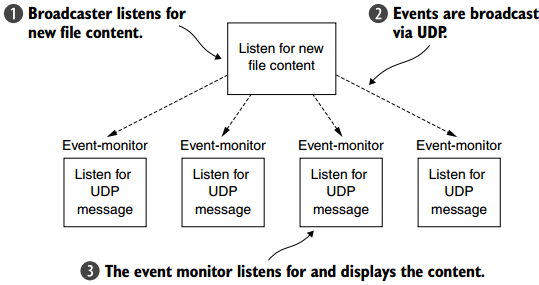
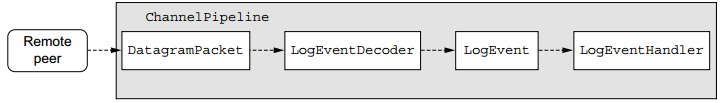

**一、前言**

前面学习了WebSocket协议，并且通过示例讲解了WebSocket的具体使用，接着学习如何使用无连接的UDP来广播事件。

**二、UDP广播事件**

2.1 UDP基础

面向连接的TCP协议管理端到端的连接，在连接生命周期中，发送的消息会有序并且可靠地进行传输，最后连接有序地终止。然而，在无连接协议（如UDP）中，没有持久连接的概念，每个消息（UDP数据报）都是独立的传输，此外，UDP没有TCP的纠错机制（即每个对等体会确认其接收到的分组，并且发送者会重传未确认的分组）。

UDP的限制比TCP多，但是比TCP快很多，这是因为消除了握手和消息管理的所有开销，UDP非常适合处理或容忍消息丢失的应用。

2.2 UDP广播

迄今为止所有的示例都使用了单播的传输模式，其被定义为将消息发送到由唯一地址标识的单个网络目的地，有连接和无连接的协议都支持这种模式，UDP为多个收件人发送消息提供了额外的传输模式：

· 组播--传输到定义的主机组。

· 广播--传输到网络（或子网）上的所有主机。

本章中的示例将通过发送在同一网络上的所有主机接收的消息来使用UDP广播。

2.3 UDP简单示例

示例将打开一个文件，并通过UDP将每一行广播为指定端口。下图展示了应用的结构图。

2.4 LogEvent POJO  

在消息应用中，消息经常以POJO形式展现，LogEvent的POJO如下。

    
    
    public final class LogEvent {
        public static final byte SEPARATOR = (byte) ":";
        private final InetSocketAddress source;
        private final String logfile;
        private final String msg;
        private final long received;
        public LogEvent(String logfile, String msg) {
            this(null, -1, logfile, msg);
        }
        public LogEvent(InetSocketAddress source, long received,
            String logfile, String msg) {
            this.source = source;
            this.logfile = logfile;
            this.msg = msg;
            this.received = received;
        }
        public InetSocketAddress getSource() {
            return source;
        }
        public String getLogfile() {
            return logfile;
        }
        public String getMsg() {
            return msg;
        }
        public long getReceivedTimestamp() {
            return received;
        }
    }

2.5 编写broadcaster

Netty提供了许多类来支持UDP应用程序，如Netty的DatagramPacket是DatagramChannel实现与远程对等体进行通信的简单消息容器，我们需要一个编码器将EventLog消息转换为DatagramPackets，可以扩展Netty的MessageToMessageEncoder，LogEventEncoder的代码如下。

    
    
    public class LogEventEncoder extends MessageToMessageEncoder<LogEvent> {
        private final InetSocketAddress remoteAddress;
        public LogEventEncoder(InetSocketAddress remoteAddress) {
            this.remoteAddress = remoteAddress;
        }
        @Override
        protected void encode(ChannelHandlerContext channelHandlerContext,
            LogEvent logEvent, List<Object> out) throws Exception {
            byte[] file = logEvent.getLogfile().getBytes(CharsetUtil.UTF_8);
            byte[] msg = logEvent.getMsg().getBytes(CharsetUtil.UTF_8);
            ByteBuf buf = channelHandlerContext.alloc()
                .buffer(file.length + msg.length + 1);
            buf.writeBytes(file);
            buf.writeByte(LogEvent.SEPARATOR);
            buf.writeBytes(msg);
            out.add(new DatagramPacket(buf, remoteAddress));
        }
    }

完成编码器后，即可以开始启动服务端，其中服务端LogEventBroadcaster的代码如下。

    
    
    public class LogEventBroadcaster {
        private final Bootstrap bootstrap;
        private final File file;
        private final EventLoopGroup group;
    
        public LogEventBroadcaster(InetSocketAddress address, File file) {
            group = new NioEventLoopGroup();
            bootstrap = new Bootstrap();
            bootstrap.group(group)
                    .channel(NioDatagramChannel.class)
                    .option(ChannelOption.SO_BROADCAST, true)
                    .handler(new LogEventEncoder(address));
    
            this.file = file;
        }
    
        public void run() throws IOException {
            Channel ch = bootstrap.bind(0).syncUninterruptibly().channel();
            System.out.println("LogEventBroadcaster running");
            long pointer = 0;
            for (;;) {
                long len = file.length();
                if (len < pointer) {
                    // file was reset
                    pointer = len;
                } else if (len > pointer) {
                    // Content was added
                    RandomAccessFile raf = new RandomAccessFile(file, "r");
                    raf.seek(pointer);
                    String line;
                    while ((line = raf.readLine()) != null) {
                        ch.writeAndFlush(new LogEvent(null, -1, file.getAbsolutePath(), line));
                    }
                    pointer = raf.getFilePointer();
                    raf.close();
                }
                try {
                    Thread.sleep(1000);
                } catch (InterruptedException e) {
                    Thread.interrupted();
                    break;
                }
            }
        }
    
        public void stop() {
            group.shutdownGracefully();
        }
    
        public static void main(String[] args) throws Exception {
            if (args.length != 2) {
                throw new IllegalArgumentException();
            }
    
            LogEventBroadcaster broadcaster = new LogEventBroadcaster(new InetSocketAddress("255.255.255.255",
                    Integer.parseInt(args[0])), new File(args[1]));
            try {
                broadcaster.run();
            } finally {
                broadcaster.stop();
            }
        }
    }

2.6 编写monitor

在应用中

· 接收由LogEventBroadcaster广播的UDP DatagramPackets。

· 将其解码为LogEvent。

· 将LogEvent写入输出流System.out。

下图展示LogEvent的流动。

LogEventDecoder负责将传入的DatagramPackets解码为LogEvent消息，其代码如下。

    
    
    public class LogEventDecoder extends MessageToMessageDecoder<DatagramPacket> {
        @Override
        protected void decode(ChannelHandlerContext ctx, DatagramPacket datagramPacket, List<Object> out) throws Exception {
            ByteBuf data = datagramPacket.content();
            int i = data.indexOf(0, data.readableBytes(), LogEvent.SEPARATOR);
            String filename = data.slice(0, i).toString(CharsetUtil.UTF_8);
            String logMsg =  data.slice(i + 1, data.readableBytes()).toString(CharsetUtil.UTF_8);
    
            LogEvent event = new LogEvent(datagramPacket.recipient(), System.currentTimeMillis(),
                    filename,logMsg);
            out.add(event);
        }
    }

而LogEventHandler用于处理LogEvent，其代码如下。

    
    
    public class LogEventHandler extends SimpleChannelInboundHandler<LogEvent> {
    
        @Override
        public void exceptionCaught(ChannelHandlerContext ctx, Throwable cause) throws Exception {
            cause.printStackTrace();
            ctx.close();
        }
    
        @Override
        public void channelRead0(ChannelHandlerContext channelHandlerContext, LogEvent event) throws Exception {
            StringBuilder builder = new StringBuilder();
            builder.append(event.getReceivedTimestamp());
            builder.append(" [");
            builder.append(event.getSource().toString());
            builder.append("] [");
            builder.append(event.getLogfile());
            builder.append("] : ");
            builder.append(event.getMsg());
    
            System.out.println(builder.toString());
        }
    }

LogEventMonitor用于将处理器添加至管道中，其代码如下。

    
    
    public class LogEventMonitor {
    
        private final Bootstrap bootstrap;
        private final EventLoopGroup group;
        public LogEventMonitor(InetSocketAddress address) {
            group = new NioEventLoopGroup();
            bootstrap = new Bootstrap();
            bootstrap.group(group)
                    .channel(NioDatagramChannel.class)
                    .option(ChannelOption.SO_BROADCAST, true)
                    .handler(new ChannelInitializer<Channel>() {
                        @Override
                        protected void initChannel(Channel channel) throws Exception {
                            ChannelPipeline pipeline = channel.pipeline();
                            pipeline.addLast(new LogEventDecoder());
                            pipeline.addLast(new LogEventHandler());
                        }
                    }).localAddress(address);
    
        }
    
        public Channel bind() {
            return bootstrap.bind().syncUninterruptibly().channel();
        }
    
        public void stop() {
            group.shutdownGracefully();
        }
    
        public static void main(String[] args) throws Exception {
            if (args.length != 1) {
                throw new IllegalArgumentException("Usage: LogEventMonitor <port>");
            }
            LogEventMonitor monitor = new LogEventMonitor(new InetSocketAddress(Integer.parseInt(args[0])));
            try {
                Channel channel = monitor.bind();
                System.out.println("LogEventMonitor running");
    
                channel.closeFuture().await();
            } finally {
                monitor.stop();
            }
        }
    }

运行LogEventBroadcaster和LogEventMonitor  

**三、总结**

本篇博文讲解了UDP协议，以及其示例，在实际应用中需要根据不同的应用场景选择不同的协议，谢谢各位园友的观看~

