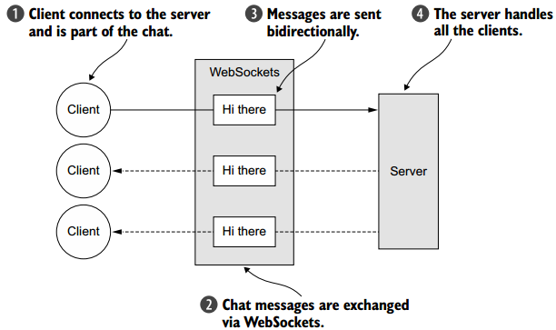
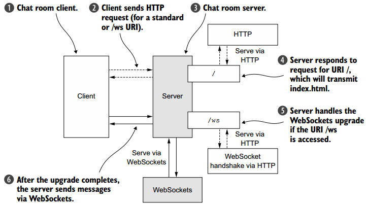
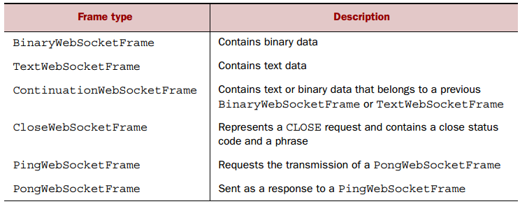
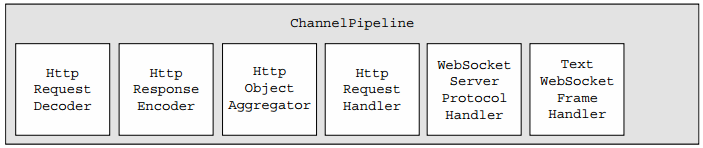
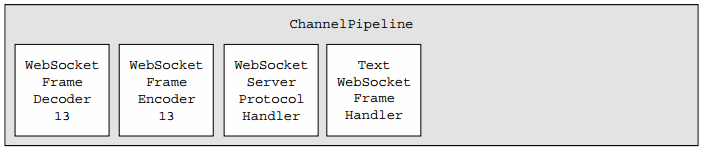
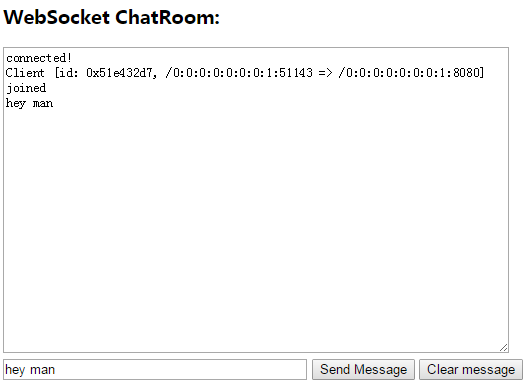
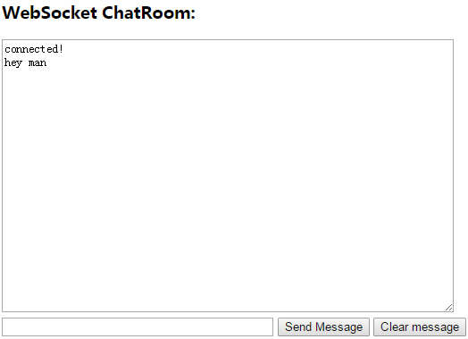

**一、前言**

前面学习了codec和ChannelHandler之间的关系，接着学习WebSocket。

**二、WebSocket**

2.1. WebSocket介绍  

WebSocket协议允许客户端和服务器随时传输消息，要求他们异步处理接收的消息，而几乎所有的浏览器都支持WebSocket协议，Netty支持WebSocket协议的所有实现，可以在应用中直接使用。

2.2. WebSocket应用示例  

下面示例展示了如何使用WebSocket协议实现基于浏览器的实时聊天应用，示例逻辑图如下图所示。

处理逻辑如下

· 客户端发送消息。

· 消息转发至其他所有客户端。

本示例中只实现服务端部分，客户端网页为index.html。

2.3 添加WebSocket支持  

升级握手机制可用于从标准HTTP或HTTPS协议切换到WebSocket，使用WebSocket的应用程序以HTTP/S开头，当请求指定URL时将会启动该协议。本应用有如下惯例：如果URL请求以/
ws结尾，我们将使用升级的WebSocket协议，否则，将使用HTTP/S协议，连接升级后，所有数据将使用WebSocket传输。下图展示服务端的逻辑。

1\. 处理HTTP请求

首先我们实现处理HTTP请求的组件，该组件将为访问聊天室的页面提供服务，并显示连接的客户端发送的消息。下面是HttpRequestHandler代码，其继承SimpleChannelInboundHandler。

    
    
    public class HttpRequestHandler
        extends SimpleChannelInboundHandler<FullHttpRequest> {
        private final String wsUri;
        private static final File INDEX;
        static {
            URL location = HttpRequestHandler.class
                .getProtectionDomain()
                .getCodeSource().getLocation();
            try {
                String path = location.toURI() + "index.html";
                path = !path.contains("file:") ? path : path.substring(5);
                INDEX = new File(path);
            } catch (URISyntaxException e) {
                throw new IllegalStateException(
                    "Unable to locate index.html", e);
            }
        }
        public HttpRequestHandler(String wsUri) {
            this.wsUri = wsUri;
        }
        @Override
        public void channelRead0(ChannelHandlerContext ctx,
            FullHttpRequest request) throws Exception {
            if (wsUri.equalsIgnoreCase(request.getUri())) {
                ctx.fireChannelRead(request.retain());
            } else {
                if (HttpHeaders.is100ContinueExpected(request)) {
                    send100Continue(ctx);
                }
                RandomAccessFile file = new RandomAccessFile(INDEX, "r");
                HttpResponse response = new DefaultHttpResponse(
                request.getProtocolVersion(), HttpResponseStatus.OK);
                response.headers().set(
                    HttpHeaders.Names.CONTENT_TYPE,
                    "text/plain; charset=UTF-8");
                boolean keepAlive = HttpHeaders.isKeepAlive(request);
                if (keepAlive) {
                    response.headers().set(
                        HttpHeaders.Names.CONTENT_LENGTH, file.length());
                    response.headers().set( HttpHeaders.Names.CONNECTION,
                        HttpHeaders.Values.KEEP_ALIVE);
                }
                ctx.write(response);
                if (ctx.pipeline().get(SslHandler.class) == null) {
                    ctx.write(new DefaultFileRegion(
                    file.getChannel(), 0, file.length()));
                } else {
                    ctx.write(new ChunkedNioFile(file.getChannel()));
                }
                ChannelFuture future = ctx.writeAndFlush(
                    LastHttpContent.EMPTY_LAST_CONTENT);
                if (!keepAlive) {
                    future.addListener(ChannelFutureListener.CLOSE);
                }
            }
        }
        private static void send100Continue(ChannelHandlerContext ctx) {
            FullHttpResponse response = new DefaultFullHttpResponse(
                HttpVersion.HTTP_1_1, HttpResponseStatus.CONTINUE);
            ctx.writeAndFlush(response);
        }
        @Override
        public void exceptionCaught(ChannelHandlerContext ctx, Throwable cause)
            throws Exception {
            cause.printStackTrace();
            ctx.close();
        }
    }

上述代码用于处理纯HTTP请求，对于WebSocket而言，数据使用帧进行传输，完整的数据包含多帧。

2\. 处理WebSocket帧

WebSocket定义了六种帧，如下图所示。

对于聊天应用而言，其包含如下帧：CloseWebSocketFrame、PingWebSocketFrame、PongWebSocketFrame、TextWebSocketFrame。

下面代码展示了用于处理TextWebSocketFrames的ChannelHandler。

    
    
    public class TextWebSocketFrameHandler
        extends SimpleChannelInboundHandler<TextWebSocketFrame> {
        private final ChannelGroup group;
        public TextWebSocketFrameHandler(ChannelGroup group) {
            this.group = group;
        }
        @Override
        public void userEventTriggered(ChannelHandlerContext ctx,
            Object evt) throws Exception {
            if (evt == WebSocketServerProtocolHandler
                .ServerHandshakeStateEvent.HANDSHAKE_COMPLETE) {
                ctx.pipeline().remove(HttpRequestHandler.class);
                group.writeAndFlush(new TextWebSocketFrame(
                    "Client " + ctx.channel() + " joined"));
                group.add(ctx.channel());
            } else {
                super.userEventTriggered(ctx, evt);
            }
        }
        @Override
        public void channelRead0(ChannelHandlerContext ctx,
            TextWebSocketFrame msg) throws Exception {
            group.writeAndFlush(msg.retain());
        }
    }

3\. 初始化ChannelPipeline

为在ChannelPipeline中添加ChannelHandler，需要继承ChannelInitializer并且实现initChannel方法，下面是ChatServerInitializer的代码。

    
    
    public class ChatServerInitializer extends ChannelInitializer<Channel> {
        private final ChannelGroup group;
        public ChatServerInitializer(ChannelGroup group) {
            this.group = group;
        }
        @Override
        protected void initChannel(Channel ch) throws Exception {
            ChannelPipeline pipeline = ch.pipeline();
            pipeline.addLast(new HttpServerCodec());
            pipeline.addLast(new ChunkedWriteHandler());
            pipeline.addLast(new HttpObjectAggregator(64 * 1024));
            pipeline.addLast(new HttpRequestHandler("/ws"));
            pipeline.addLast(new WebSocketServerProtocolHandler("/ws"));
            pipeline.addLast(new TextWebSocketFrameHandler(group));
        }
    }

对于使用HTTP协议（升级前）和WebSocket协议（升级后）的管道中的处理器分别如下图所示。

4\. Bootstrapping  

ChatServer类用于启动服务器并且安装ChatServerInitializer，其代码如下。

    
    
    public class ChatServer {
        private final ChannelGroup channelGroup =
            new DefaultChannelGroup(ImmediateEventExecutor.INSTANCE);
        private final EventLoopGroup group = new NioEventLoopGroup();
        private Channel channel;
        public ChannelFuture start(InetSocketAddress address) {
            ServerBootstrap bootstrap = new ServerBootstrap();
            bootstrap.group(group)
                .channel(NioServerSocketChannel.class)
                .childHandler(createInitializer(channelGroup));
            ChannelFuture future = bootstrap.bind(address);
            future.syncUninterruptibly();
            channel = future.channel();
            return future;
        }
        protected ChannelInitializer<Channel> createInitializer(
            ChannelGroup group) {
            return new ChatServerInitializer(group);
        }
        public void destroy() {
            if (channel != null) {
                channel.close();
            }
            channelGroup.close();
            group.shutdownGracefully();
        }
        public static void main(String[] args) throws Exception {
            if (args.length != 1) {
                System.err.println("Please give port as argument");
                System.exit(1);
            }
            int port = Integer.parseInt(args[0]);
            final ChatServer endpoint = new ChatServer();
            ChannelFuture future = endpoint.start(
                new InetSocketAddress(port));
            Runtime.getRuntime().addShutdownHook(new Thread() {
                @Override
                public void run() {
                    endpoint.destroy();
                }
            });
            future.channel().closeFuture().syncUninterruptibly();
        }
    }

上述代码就完成了服务端的所有代码，接着进行测试。

2.4 加密应用

上述代码中可正常进行通信，但是并未加密，首先需要添加SecureChatServerInitializer，其代码如下。

    
    
    public class SecureChatServerInitializer extends ChatServerInitializer {
        private final SslContext context;
        public SecureChatServerInitializer(ChannelGroup group,
            SslContext context) {
            super(group);
            this.context = context;
        }    
        @Override
        protected void initChannel(Channel ch) throws Exception {
            super.initChannel(ch);
            SSLEngine engine = context.newEngine(ch.alloc());
            ch.pipeline().addFirst(new SslHandler(engine));
        }
    }

然后添加SecureChatServerInitializer，代码如下。

    
    
    public class SecureChatServer extends ChatServer {
        private final SslContext context;
        public SecureChatServer(SslContext context) {
            this.context = context;
        }
        @Override
        protected ChannelInitializer<Channel> createInitializer(
            ChannelGroup group) {
            return new SecureChatServerInitializer(group, context);
        }
        public static void main(String[] args) throws Exception {
            if (args.length != 1) {
                System.err.println("Please give port as argument");
                System.exit(1);
            }
            int port = Integer.parseInt(args[0]);
            SelfSignedCertificate cert = new SelfSignedCertificate();
            SslContext context = SslContext.newServerContext(
            cert.certificate(), cert.privateKey());
            final SecureChatServer endpoint = new SecureChatServer(context);
            ChannelFuture future = endpoint.start(new InetSocketAddress(port));
            Runtime.getRuntime().addShutdownHook(new Thread() {
                @Override
                public void run() {
                    endpoint.destroy();
                }
            });
            future.channel().closeFuture().syncUninterruptibly();
        }
    }

2.5 测试应用

在编译的classes文件夹中加入index.html（客户端），其中index.html的源码如下

    
    
    <!DOCTYPE html>
    <html>
    <head>
    <meta charset="UTF-8">
    <title>WebSocket Chat</title>
    </head>
    <body>
        
        <form onsubmit="return false;">
            <h3>WebSocket ChatRoom:</h3>
            <textarea id="responseText" style="width: 500px; height: 300px;"></textarea>
              
            <input type="text" name="message"  style="width: 300px" value="">
            <input type="button" value="Send Message" onclick="send(this.form.message.value)">
            <input type="button" onclick="javascript:document.getElementById("responseText").value=""" value="Clear message">
        </form>
          
          
    </body>
    </html>

然后启动ChatServer（非加密方式），最后在浏览器中访问localhost:8080（可打开多个窗口，多个客户端），其运行效果如下。

可以看到两个客户端之间可以正常进行通信，互相发送消息。

**三、总结**

本篇博文通过一个示例讲解了WebSocket协议的具体使用，可完成不同客户端之间的通信，也谢谢各位园友的观看~

