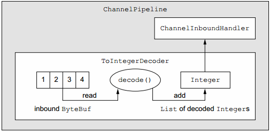
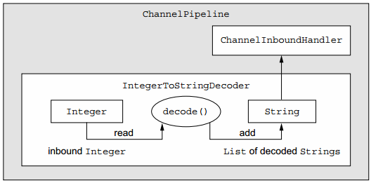
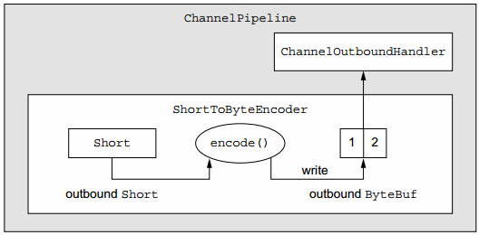
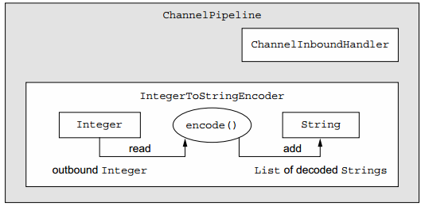

##【Netty】codec框架

##
##一、前言

##
##　　前面已经学习完了Netty框架中的主要组件，接着学习codec框架。

##
##二、codec框架

##
##　　每个网络应用程序必须定义如何将在对等体之间传输的原始字节解析并转换为目标程序的数据格式，这种转换逻辑有codec处理，其由编码器和解码器组成，每个编码器和解码器将字节流从一种格式转换到另一种格式。若将消息视为具有特定意义的结构化字节序列，那么编码器将该消息转换成适合于传输的格式（很可能是字节流），反之，解码器将网络流转换回应用程序的消息格式，然后，编码器处理出站数据，解码器处理入站数据。

##
##　　2.1 解码器

##
##　　解码器类涵盖两个不同的使用用例。

##
##　　　　· 将字节解码为消息 - ByteToMessageDecoder和ReplayingDecoder。

##
##　　　　·将一个消息类型解码为另一个 - MessageToMessageDecoder。

##
##　　解码器负责将入站数据从一种格式转换到另一种格式，所以Netty的解码器实现了ChannelInboundHandler接口。当需要在ChannelPipeline中为下一个ChannelInboundHandler转换入站数据时需要使用解码器。由于Netty支持代码模块化和重用，因此可以链接多个解码器来实现任意复杂的转换逻辑。

##
##　　1.ByteToMessageDecoder抽象类

##
##　　从字节到消息（或另一个字节序列）的解码是一个常见的任务，Netty使用ByteToMessageDecoder抽象类完成该任务，由于无法知道远程对等体是否一次发送完整的消息，因此该类会缓冲入站数据，直到所有待处理的数据已经准备好。

##
##　　假设你收到一个包含简单int的字节流，每个int都要单独处理。 此时将从入站ByteBuf读取每个int，并将其传递给下一个ChannelInboundHandler。而为解码字节流，需要扩展ByteToMessageDecoder（当int添加到List时，它将自动装箱到Integer类型），整个过程如下图所示。

##
##　　 

##
##　　一次从ByteBuf中读取四个字节解析成一个int类型，并添加到List中，当读取完成后，将会被传递至下个ChannelHandler中，下面是ToIntegerDecoder的源代码。　

	public class ToIntegerDecoder extends ByteToMessageDecoder {
    @Override
    public void decode(ChannelHandlerContext ctx, ByteBuf in,
        List<Object> out) throws Exception {
        if (in.readableBytes() >= 4) {
            out.add(in.readInt());
        	}
    	}
	}


##
##　　2.ReplayingDecoder抽象类

##
##　　ReplayingDecoder继承ByteToMessageDecoder类，并且不再需要调用readableBytes()方法，其通过自定义的ReplayingDecoderBuffer来实现该功能，其代码如下所示。　

	public class ToIntegerDecoder2 extends ReplayingDecoder<Void> {
    @Override
    public void decode(ChannelHandlerContext ctx, ByteBuf in,
        List<Object> out) throws Exception {
        out.add(in.readInt());
    	}
	}


##
##　　其中Void表示不执行任何操作，即不管理任何状态类型。

##
##　　3.MessageToMessageDecoder抽象类

##
##　　可以使用MessageToMessageDecoder在消息格式之间进行转换，仅需要实现其decode方法。如IntegerToStringDecoder继承MessageToMessageDecoder，其将Integer类型转化为对应的String表示，转化图如下图所示。

##
##　　 

##
##　　下面是IntegerToStringDecoder的代码。　

	public class IntegerToStringDecoder extends
    MessageToMessageDecoder<Integer> {
    @Override
    public void decode(ChannelHandlerContext ctx, Integer msg
        List<Object> out) throws Exception {
        out.add(String.valueOf(msg));
    	}
	}


##
##　　4.TooLongFrameException类

##
##　　由于Netty是一个异步框架，所以需要缓冲内存中的字节，直到能够对其进行解码。不能让解码器缓冲太多的数据以致耗尽可用内存，为解决该问题，Netty提供了TooLongFrameException类异常，如果超过指定的大小限制，则由解码器抛出该异常。为了避免这种情况，可以设置最大字节数的阈值，如果超出，将抛出TooLongFrameException异常，然后由解码器的用户决定如何处理异常。某些协议（例如HTTP）可能允许返回特殊响应，而在其他情况下，可能只能关闭连接。

##
##　　下面代码展示了ByteToMessageDecoder是如何使用TooLongFrameException来通知ChannelPipeline中的其他ChannelHandler关于帧大小超出运行，特别是当使用具有可变框架大小的协议时，此类保护会尤为重要。　

	public class SafeByteToMessageDecoder extends ByteToMessageDecoder {
    private static final int MAX_FRAME_SIZE = 1024;
    @Override
    public void decode(ChannelHandlerContext ctx, ByteBuf in,
        List<Object> out) throws Exception {
        int readable = in.readableBytes();
        if (readable > MAX_FRAME_SIZE) {
            in.skipBytes(readable);
            throw new TooLongFrameException("Frame too big!");
        	}
        // do something
        ...
    	}
	}


##
##　　2.2 编码器

##
##　　编码器实现了ChannelOutboundHandler，并将出站数据从一种格式转换为另一种格式。Netty提供可帮助编写具有以下功能的编码器的类：

##
##　　　　· 将消息编码为字节。

##
##　　　　· 将消息编码为消息。

##
##　　1.MessageToByteEncoder抽象类

##
##　　与ByteToMessageDecoder作用相反，MessageToByteEncoder将消息编码为字节，其只有encode方法，下图显示了ShortToByteEncoder将Shor类型编码为字节类型，并写入ByteBuf，然后转发给管道中的下一个ChannelOutboundHandler。

##
##　　 

##
##　　ShortToByteEncoder的代码如下所示。　　

	public class ShortToByteEncoder extends MessageToByteEncoder<Short> {
    @Override
    public void encode(ChannelHandlerContext ctx, Short msg, ByteBuf out)
        throws Exception {
        out.writeShort(msg);
    	}
	}


##
##　　2.MessageToMessageEncoder抽象类

##
##　　MessageToMessageEncoder可将一个类型编码为另一个类型，其只有一个encode方法，下图展示了IntegerToStringEncoder如何将Integer类型转化为String类型。

##
##　　 

##
##　　IntegerToStringEncoder的代码如下所示。　　

	public class IntegerToStringEncoder
    extends MessageToMessageEncoder<Integer> {
    @Override
    public void encode(ChannelHandlerContext ctx, Integer msg
        List<Object> out) throws Exception {
        out.add(String.valueOf(msg));
    	}
	}


##
##　　2.3codec抽象类

##
##　　上面单独讨论了解码器和编码器，对于出站数据使用编码器，入站数据使用解码器，但可否对于两者只使用一个类进行处理。Netty的codec类可以满足此需求，每个codec类绑定了编码器和解码器，用来处理不同类型的操作，这些类实现了ChannelInboundHandler和ChannelOutboundHandler。

##
##　　1.ByteToMessageCodec抽象类

##
##　　假如首先需要将字节类型解码成消息，然后在编码成另一种类型，ByteToMessageCodec可以用来处理这种情况，其结合了ByteToMessageDecoder和MessageToByteEncoder。其包含两个类的共三个方法，decode、decodeLast、encode。任何请求/响应协议都可以使用ByteToMessageCodec。

##
##　　2.MessageToMessageCodec抽象类

##
##　　MessageToMessageCodec在消息之间进行编码和解码操作，其签名为MessageToMessageCodec<INBOUND_IN,OUTBOUND_IN>，其包含decode和encode两个方法。decode方法将INBOUND_IN类型转化为OUTBOUND_IN，而encode则相反。可将INBOUND_IN作为通过线路发送的消息类型，OUTBOUND_IN作为应用程序处理的消息类型。如下代码展示了具体的使用。　

	public class WebSocketConvertHandler extends
    MessageToMessageCodec<WebSocketFrame,
    WebSocketConvertHandler.MyWebSocketFrame> {
    @Override
    protected void encode(ChannelHandlerContext ctx,
        WebSocketConvertHandler.MyWebSocketFrame msg,
        List<Object> out) throws Exception {
        ByteBuf payload = msg.getData().duplicate().retain();
        switch (msg.getType()) {
            case BINARY:
                out.add(new BinaryWebSocketFrame(payload));
                break;
            case TEXT:
                out.add(new TextWebSocketFrame(payload));
                break;
            case CLOSE:
                out.add(new CloseWebSocketFrame(true, 0, payload));
                break;
            case CONTINUATION:
                out.add(new ContinuationWebSocketFrame(payload));
                break;
            case PONG:
                out.add(new PongWebSocketFrame(payload));
                break;
            case PING:
                out.add(new PingWebSocketFrame(payload));
                break;
            default:
                throw new IllegalStateException(
                    "Unsupported websocket msg " + msg);
        	}
    	}
    
    @Override
    protected void decode(ChannelHandlerContext ctx, WebSocketFrame msg,
        List<Object> out) throws Exception {
        ByteBuf payload = msg.getData().duplicate().retain();
        if (msg instanceof BinaryWebSocketFrame) {
            out.add(new MyWebSocketFrame(
            MyWebSocketFrame.FrameType.BINARY, payload));
        	} else if (msg instanceof CloseWebSocketFrame) {
            out.add(new MyWebSocketFrame (
            MyWebSocketFrame.FrameType.CLOSE, payload));
        	} else if (msg instanceof PingWebSocketFrame) {
            out.add(new MyWebSocketFrame (
            MyWebSocketFrame.FrameType.PING, payload));
        	} else if (msg instanceof PongWebSocketFrame) {
            out.add(new MyWebSocketFrame (
            MyWebSocketFrame.FrameType.PONG, payload));
        	} else if (msg instanceof TextWebSocketFrame) {
            out.add(new MyWebSocketFrame (
            MyWebSocketFrame.FrameType.TEXT, payload));
        	} else if (msg instanceof ContinuationWebSocketFrame) {
            out.add(new MyWebSocketFrame (
            MyWebSocketFrame.FrameType.CONTINUATION, payload));
        	} else {
            throw new IllegalStateException(
                "Unsupported websocket msg " + msg);
        	}
    	}
    
    public static final class MyWebSocketFrame {
        public enum FrameType {
            BINARY,
            CLOSE,
            PING,
            PONG,
            TEXT,
            CONTINUATION
        	}
        private final FrameType type;
        private final ByteBuf data;
        public WebSocketFrame(FrameType type, ByteBuf data) {
            this.type = type;
            this.data = data;
        	}
        public FrameType getType() {
            return type;
        	}
        public ByteBuf getData() {
            return data;
        	}
    	}
	}


##
##　　3.CombinedChannelDuplexHandler类

##
##　　组合解码器和编码器可能对可重用性有影响，可以使用CombinedChannelDuplexHandler可通过分别扩展解码器类和编码器类的类型来实现编解码器，而不必直接扩展抽象编解码器类。

##
##　　如下代码中，ByteToCharDecoder将从ByteBuf中读取字符。　

	public class ByteToCharDecoder extends ByteToMessageDecoder {
    @Override
    public void decode(ChannelHandlerContext ctx, ByteBuf in,
        List<Object> out) throws Exception {
        while (in.readableBytes() >= 2) {
            out.add(in.readChar());
        	}
    	}
	}


##
##　　一次性从ByteBuf中读取两个字节（char由两个字节组成），然后装箱后添加至List中。

##
##　　如下代码中，CharToByteEncoder则将Char转化为字节类型并写入ByteBuf中。　　

	public class CharToByteEncoder extends
    MessageToByteEncoder<Character> {
    @Override
    public void encode(ChannelHandlerContext ctx, Character msg,
        ByteBuf out) throws Exception {
        out.writeChar(msg);
    	}
	}


##
##　　我们可以直接使用codec来实现上述代码示例，假设已经有了ByteToCharDecoder和CharToByteEncoder，其代码如下所示。　

	public class CombinedByteCharCodec extends
    CombinedChannelDuplexHandler<ByteToCharDecoder, CharToByteEncoder> {
    public CombinedByteCharCodec() {
        super(new ByteToCharDecoder(), new CharToByteEncoder());
    	}
	}


##
##　　可以看到代码非常简洁便完成了编码和解码操作。

##
##三、总结

##
##　　本篇学习了Netty中的编码和解码操作及其相关的类型，编解码器是进行数据处理的基础。也谢谢各位园友的观看~　　