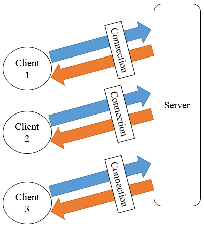

##【Netty】第一个Netty应用

##
##一、前言

##
##　　前面已经学习完了Java NIO的内容，接着来学习Netty，本篇将通过一个简单的应用来了解Netty的使用。

##
##二、Netty应用

##
##　　2.1 服务端客户端框架图

##
##　　下图展示了Netty中服务端与客户端在之间的关系，客户端连接至服务器，然后两者之间互相通信，服务器可连接多个客户端。

##
##　　 

##
##　　2.2 服务端

##
##　　服务端主要包含两部分内容，分为引导和实现服务器处理器。引导用于设置端口号等信息，处理器主要是用于处理用户自定义逻辑。

##
##　　1. 引导服务端

##
##　　引导服务端类名为EchoServer，其代码如下　

	import io.netty.bootstrap.ServerBootstrap;
import io.netty.channel.ChannelFuture;
import io.netty.channel.ChannelInitializer;
import io.netty.channel.EventLoopGroup;
import io.netty.channel.nio.NioEventLoopGroup;
import io.netty.channel.socket.SocketChannel;
import io.netty.channel.socket.nio.NioServerSocketChannel;

import java.net.InetSocketAddress;

public class EchoServer {
    private int port;

    public EchoServer(int port) {
        this.port = port;
    	}

    public void start() throws Exception {
        EventLoopGroup group = new NioEventLoopGroup();
        try {
            ServerBootstrap b = new ServerBootstrap();
            b.group(group)
                    .channel(NioServerSocketChannel.class)
                    .localAddress(new InetSocketAddress(port))
                    .childHandler(new ChannelInitializer<SocketChannel>() {
                        @Override
                        public void initChannel(SocketChannel ch) throws Exception {
                            ch.pipeline().addLast(new EchoServerHandler());
                        	}
                    	});
            // 绑定端口，开始接收连接
            ChannelFuture f = b.bind().sync();
            System.out.println("Server start listen at " + port);
            // 等待服务器socket关闭
            f.channel().closeFuture().sync();
        	} finally {
            group.shutdownGracefully();
        	}
    	}

    public static void main(String[] args) throws Exception {
        int port;
        if (args.length > 0) {
            port = Integer.parseInt(args[0]);
        	} else {
            port = 8080;
        	}
        new EchoServer(port).start();
    	}
	}


##
##　　说明：其流程大致如下

##
##　　① 创建NioEventLoopGroup实例来处理事件，如接受连接，读写数据等。

##
##　　② 创建ServerBootstrap实例。

##
##　　③ 指定服务端绑定的端口。

##
##　　④ 设置childHandler来处理每一次连接。

##
##　　⑤ 使用ServerBootstrap的bind方法进行绑定并同步直至其完成绑定。

##
##　　2. 实现服务端逻辑

##
##　　从代码来看引导服务器只是完成了服务端的创建，如指定端口和处理器等，并未涉及到服务端的具体逻辑，其具体业务逻辑可以在处理器中完成，处理器需要继承ChannelInboundHandlerAdapter，本实例中处理器为EchoServerHandler，其代码如下　

	package com.hust.grid.leesf.chapter2;

import io.netty.buffer.ByteBuf;
import io.netty.buffer.ByteBufUtil;
import io.netty.buffer.Unpooled;
import io.netty.channel.ChannelFutureListener;
import io.netty.channel.ChannelHandlerContext;
import io.netty.channel.ChannelInboundHandlerAdapter;

public class EchoServerHandler extends ChannelInboundHandlerAdapter {

    @Override
    public void channelRead(ChannelHandlerContext ctx, Object msg) {
        ByteBuf bb = (ByteBuf) msg;
        bb.markReaderIndex();
        System.out.println("Server received: " + ByteBufUtil
                .hexDump(bb.readBytes(bb.readableBytes())));
        bb.resetReaderIndex();
        ctx.write(msg);
    	}

    @Override
    public void channelReadComplete(ChannelHandlerContext ctx) {
        ctx.writeAndFlush(Unpooled.EMPTY_BUFFER)
                .addListener(ChannelFutureListener.CLOSE);
    	}

    @Override
    public void exceptionCaught(ChannelHandlerContext ctx, Throwable cause) {
        cause.printStackTrace();
        ctx.close();
    	}
	}


##
##　　说明：当服务器接受到消息后，channelRead方法会被调用，具体消息为msg，用户可以对该消息进行处理，本例中首先将接收的消息进行转化后打印，然后将消息写入ctx中，其中值得注意的是需要标记读索引，然后恢复，否则写入的数据为空。channelReadComplete将之前写入客户端的消息刷新，待操作完成后关闭。exceptionCaught方法则会捕捉处理中的异常。

##
##　　2.3 客户端

##
##　　客户端部分的逻辑同服务器类似，也包含引导客户端和实现客户端处理器两部分，客户端连接服务端，并且接收服务端的消息，关闭连接等。

##
##　　1. 引导客户端

##
##　　引导客户端类名为EchoClient，其代码如下　　

	package com.hust.grid.leesf.chapter2;

import io.netty.bootstrap.Bootstrap;
import io.netty.channel.*;
import io.netty.channel.nio.NioEventLoopGroup;
import io.netty.channel.socket.SocketChannel;
import io.netty.channel.socket.nio.NioSocketChannel;

import java.net.InetSocketAddress;

public final class EchoClient {

    private String host;
    private int port;

    public EchoClient(String host, int port) {
        this.host = host;
        this.port = port;
    	}

    public void start() throws Exception {
        EventLoopGroup group = new NioEventLoopGroup();
        try {
            Bootstrap b = new Bootstrap();
            b.group(group)
                    .channel(NioSocketChannel.class)
                    .remoteAddress(new InetSocketAddress(host, port))
                    .handler(new ChannelInitializer<SocketChannel>() {
                        @Override
                        public void initChannel(SocketChannel ch) throws Exception {
                            ch.pipeline().addLast(new EchoClientHandler());
                        	}
                    	});

            // 启动客户端
            ChannelFuture f = b.connect().sync();
            // 直到连接关闭
            f.channel().closeFuture().sync();
        	} finally {
            group.shutdownGracefully();
        	}
    	}

    public static void main(String[] args) throws Exception {
        String host = "127.0.0.1";
        int port = 8080;
        if (args.length == 2) {
            host = args[0];
            port = Integer.parseInt(args[1]);
        	}

        new EchoClient(host, port).start();
    	}
	}


##
##　　说明：其引导部分与服务端非常类似，流程非常类似，其给出了服务端的地址和端口号，Bootstrap的connect函数将会根据指定的地址和端口号连接服务器。

##
##　　2. 实现客户端逻辑

##
##　　本部分完成用户实际的业务逻辑，本例中的EchoClientHandler继承SimpleChannelInboundHandler，需要重写如下三个函数

##
##　　　　· channelActive函数，在建立了与服务端的连接后该函数被调用。

##
##　　　　· channelRead0函数，当接收到服务端发送来的消息后被调用。

##
##　　　　· exceptionCaught函数，当处理发生异常时被调用。

##
##　　EchoClientHandler的代码如下　　

	package com.hust.grid.leesf.chapter2;

import io.netty.buffer.ByteBuf;
import io.netty.buffer.ByteBufUtil;
import io.netty.buffer.Unpooled;
import io.netty.channel.ChannelHandlerContext;
import io.netty.channel.SimpleChannelInboundHandler;
import io.netty.util.CharsetUtil;

public class EchoClientHandler extends SimpleChannelInboundHandler<ByteBuf> {

    @Override
    public void channelActive(ChannelHandlerContext ctx) {
        ctx.writeAndFlush(Unpooled.copiedBuffer("Netty rocks!", CharsetUtil.UTF_8));
    	}

    @Override
    public void channelRead0(ChannelHandlerContext ctx, ByteBuf in) {
        System.out.println("Client received: " + ByteBufUtil
                .hexDump(in.readBytes(in.readableBytes())));
    	}

    @Override
    public void exceptionCaught(ChannelHandlerContext ctx, Throwable cause) {
        cause.printStackTrace();
        ctx.close();
    	}
	}


##
##　　说明：当同服务器的连接建立后，客户端会发送消息至服务端，然后当接收到服务端发送来的消息时，打印该消息。

##
##　　2.4 运行

##
##　　1. pom.xml文件

##
##　　由于本应用依赖的jar文件使用maven构建，其pom.xml文件如下。

	<?xml version="1.0" encoding="UTF-8"?>
<project xmlns="http://maven.apache.org/POM/4.0.0"
         xmlns:xsi="http://www.w3.org/2001/XMLSchema-instance"
         xsi:schemaLocation="http://maven.apache.org/POM/4.0.0 http://maven.apache.org/xsd/maven-4.0.0.xsd">
    <modelVersion>4.0.0</modelVersion>

    <groupId>NettyInAction</groupId>
    <artifactId>com.hust.grid.leesf</artifactId>
    <version>1.0-SNAPSHOT</version>

    <properties>
        <project.build.sourceEncoding>UTF-8</project.build.sourceEncoding>
        <version.jackson.core>2.6.3</version.jackson.core>
    </properties>
    <build>
        <plugins>
            <plugin>
                <groupId>org.apache.maven.plugins</groupId>
                <artifactId>maven-compiler-plugin</artifactId>
                <version>3.2</version>
                <configuration>
                    <optimize>true</optimize>
                    <source>1.7</source>
                    <target>1.7</target>
                </configuration>
            </plugin>

        </plugins>
    </build>
    <dependencies>
        <dependency>
            <groupId>junit</groupId>
            <artifactId>junit</artifactId>
            <version>4.12</version>
            <scope>test</scope>
        </dependency>

        <dependency>
            <groupId>io.netty</groupId>
            <artifactId>netty-all</artifactId>
            <version>4.0.32.Final</version>
        </dependency>
        <dependency>
            <groupId>com.fasterxml.jackson.core</groupId>
            <artifactId>jackson-core</artifactId>
            <version>${version.jackson.core	}</version>
        </dependency>
        <dependency>
            <groupId>com.fasterxml.jackson.core</groupId>
            <artifactId>jackson-databind</artifactId>
            <version>${version.jackson.core	}</version>
        </dependency>
    </dependencies>


</project>


##
##　　2. 运行服务端

##
##　　启动EchoServer，等待客户端连接。

##
##　　3. 运行客户端

##
##　　启动EchoClient，连接服务端并发送消息。

##
##　　其中服务端的运行结果如下。　　

	Server start listen at 8080
Server received: 4e6574747920726f636b7321


##
##　　客户端的运行结果如下。　

	Client received: 4e6574747920726f636b7321


##
##三、总结

##
##　　本篇博文讲解了Netty的简单应用，通过简单应用对Netty有所了解，具体的细节将会在之后的博文中进行讲解，本文的代码已经上传至github，也谢谢各位园友的观看~　