**一、前言**

前面学习了控制结构，下面学习Scala的Class和Properties。

**二、Class &Properties**

尽管Scala和Java很类似，但是对类的定义、类构造函数、字段可见性控制等则不相同，Java更为冗长，Scala精炼。本章将通过Scala的构造函数工作原理来理解Scala的类和字段，当申明类构造函数参数和使用var、val、private关键字来修饰类的字段时，Scala编译器将会为你生成代码，根据字段修饰符不同，Scala编译器会生成不同的存取函数，本章也会展示如何重写这些函数，另外，Scala将会根据你的值为变量赋予相应的类型。

2.1 创建主构造函数

1\. 问题描述

你需要为一个类创建主构造函数，你很快就会发现其和Java大不相同。

2\. 解决方案

Scala的主构造函数是如下的结合

· 构造函数参数

· 类主体中调用的方法

· 类主体中执行的语句和表达式

Scala类主体中声明的字段与Java类似，他们在类初始化时被赋值，下面的类演示构造函数的参数、类字段和类中的语句

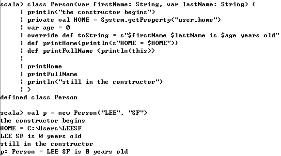

由于类主体中的方法也是构造函数的一部分，当创建一个Person实例时，你会看到println的输出和printHome和printFullName函数调用的输出

3 讨论

如果你是从Java到Scala，你会发现在Scala中声明一个主构造函数时非常不同的，在Java中，在不在主构造函数中都是非常明显的，但是Scala模糊了这个区别，一旦你理解了这个方法，你将会更精确的定义类构造函数，由于构造函数中的firstName和lastName被声明为var类型，因此其是可变的，Scala会为其生成存取函数

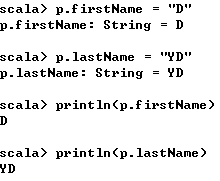

HOME字段时private和val的，其在Java中等效于final和private的，其不能被其他对象直接访问，并且其值不能被改变，使用scalac进行编译后，再用javap进行反编译结果如下

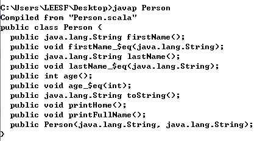

可以看到包含了很多_$eq方法，这是var字段的语法糖，对用户透明，对于如下类

    
    
    class Person {
        var name = ""
        override def toString = s"name = $name"
    }

由于name是var类型的，因此Scala会为其生成存取函数，即将会生成name_$eq函数，有了该函数，你可以修改name字段

    
    
    p.name = "Ron Artest"

实际上，你调用的是如下方法

    
    
    p.name_$eq("Ron Artest")

可以看到Scala的代码更为精炼，在声明字段时需要注意Scala是否会生成该存取函数

2.2 控制构造函数字段的可见性

1\. 问题描述

你想控制Scala中的类中作为构造函数参数的字段的可见性

2\. 解决方案

构造函数中字段的可见性由该字段是否被声明为val或var或无val、var，是否为字段添加了private决定，解决方案如下

· 如果字段被声明为var，Scala会为其生成getter和setter方法

· 如果字段被声明为val，Scala会为只其生成getter方法

· 如果字段无var或var，Scala将不会生成getter或setter方法

· var和val字段可以使用private关键字修饰，这样可以防止生成getter或setter方法

如果字段被声明为var，则表示该字段的值是可变的，所以Scala为其生成getter和setter函数，下面示例中的字段被声明为var，则表示可变

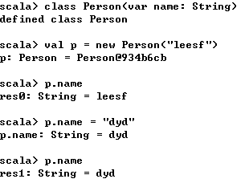

如果字段被声明为val，则表示该字段的值是不可变的，如同Java的final，因此，其不会有setter方法，但是有getter方法

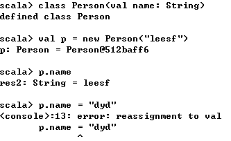

当构造函数中的参数没有使用var或者val声明时，其可见性变得十分严格，Scala不会为其生成setter或getter方法

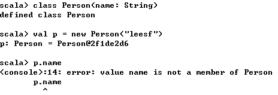

除了将变量定义为val或var之外，还可以使用private关键字修饰字段，private关键字可以防止Scala生成getter或setter方法，因此该字段只能在类内部访问

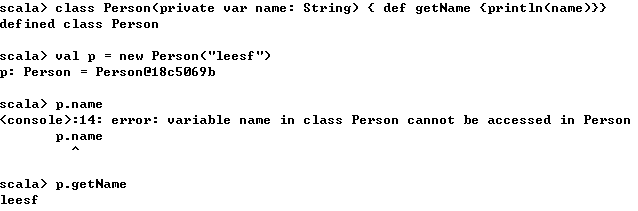

在类外访问name字段时，发生异常，而在类函数中访问时正常

3\. 讨论

当字段定义为val时，则不会产生setter，若定义为var时，则会产生setter和getter，private关键可以提供其他的灵活性。case类中的构造器中的参数与上述情况不太相同，如果你没有使用var或val修饰字段，如

    
    
    case class Person(name: String)

此时你也可以访问该字段，就像该字段被定义为val一样

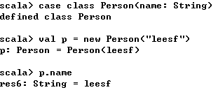

2.3 定义辅助构造器

1\. 问题描述

你要定义类的一个或多个辅助构造函数，以便用户不同方法来创建对象实例

2\. 解决方案

将辅助构造函数定义为名字为this的类的方法，你可以定义多个辅助构造函数，但是它们需要有不同的函数签名(参数列表)，每个构造函数必须调用前面定义的多个构造函数中的一个。

    
    
    class Pizza (var crustSize: Int, var crustType: String) {
        // one-arg auxiliary constructor
        def this(crustSize: Int) {
            this(crustSize, Pizza.DEFAULT_CRUST_TYPE)
        }
        // one-arg auxiliary constructor
        def this(crustType: String) {
            this(Pizza.DEFAULT_CRUST_SIZE, crustType)
        }
        // zero-arg auxiliary constructor
        def this() {
            this(Pizza.DEFAULT_CRUST_SIZE, Pizza.DEFAULT_CRUST_TYPE)
        }
        override def toString = s"A $crustSize inch pizza with a $crustType crust"
    }
    
    object Pizza {
        val DEFAULT_CRUST_SIZE = 12
        val DEFAULT_CRUST_TYPE = "THIN"
        
        def main(args: Array[String]): Unit = {
            val p1 = new Pizza(Pizza.DEFAULT_CRUST_SIZE, Pizza.DEFAULT_CRUST_TYPE)
            val p2 = new Pizza(Pizza.DEFAULT_CRUST_SIZE)
            val p3 = new Pizza(Pizza.DEFAULT_CRUST_TYPE)
            val p4 = new Pizza
            println(p1)
            println(p2)
            println(p3)
            println(p4)
        }
    }

运行结果

    
    
    A 12 inch pizza with a THIN crust
    A 12 inch pizza with a THIN crust
    A 12 inch pizza with a THIN crust
    A 12 inch pizza with a THIN crust

3\. 讨论

关键点如下

· 辅助构造函数时以this为名字的类方法

· 每个辅助构造函数必须以对先前定义的构造函数的调用开始

· 每个辅助构造函数必须有不同的函数签名

· 构造函数通过this来调用其他构造函数

上述示例中的所有辅助构造函数都调用了主构造函数，但是不是只能调用主构造函数，还可调用辅助构造函数，如下所示

    
    
    def this(crustType: String) {
        this(Pizza.DEFAULT_CRUST_SIZE)
        this.crustType = Pizza.DEFAULT_CRUST_TYPE
    }

同时，crustSize和crustType都是主构造函数中的参数，其可以使得Scala为其生成setter和getter函数，你也可以使用如下方法，其需要更多代码

    
    
    class Pizza () {
        var crustSize = 0
        var crustType = ""
        def this(crustSize: Int) {
            this()
            this.crustSize = crustSize
        }
        def this(crustType: String) {
            this()
            this.crustType = crustType
        }
        
        // more constructors here ...
        override def toString = s"A $crustSize inch pizza with a $crustType crust"
    }

case类是一个可以生成很多样板代码的特殊类，为case类添加辅助构造器与常规类的做法不相同，这是因为它们不是真正的构造函数：它们是类的伴生对象中的apply  
方法，为了进行验证，先定义一个Person的case类

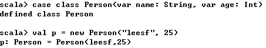

在val p = new Person("leesf", 25)代码后，由于语法糖的存在，Scala编译器将其转化为了如下代码

    
    
    val p = Person.apply("leesf", 25)

这是伴生对象中的apply方法，如果你想要为case类添加构造函数，你只需要在伴生对象中添加apply方法即可

    
    
    // the case class
    case class Person (var name: String, var age: Int)
    
    // the companion object
    object Person {
        def apply() = new Person("<no name>", 0)
        def apply(name: String) = new Person(name, 0)
    }

测试代码如下

    
    
    object CaseClassTest extends App {
        val a = Person() // corresponds to apply()
        val b = Person("leesf") // corresponds to apply(name: String)
        val c = Person("dyd", 25)
        println(a)
        println(b)
        println(c)
        // verify the setter methods work
        a.name = "leesf"
        a.age = 25
        println(a)
    }

运行结果

    
    
    Person(<no name>,0)
    Person(leesf,0)
    Person(dyd,25)
    Person(leesf,25)

2.4 定义私有主构造函数

1\. 问题描述

你想要生成类私有的主构造函数，如强制执行单例模式

2\. 解决方案

为了让主构造器私有，需要在类名和构造函数所接受的任何参数之间插入private关键字

    
    
    class Order private { ... }
    class Person private (name: String) { ... }

在REPL中，定义了私有类后，不能创建类实例

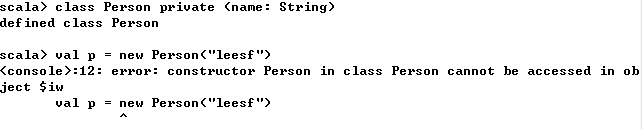

3\. 讨论

在Scala中强制单例模式的一种简单方法就是使主构造器变为private，然后在伴生对象中添加getInstance方法

    
    
    class Brain private {
        override def toString = "This is the brain."
    }
    
    object Brain {
        val brain = new Brain
        def getInstance = brain
    }
    
    object SingletonTest extends App {
        val brain = Brain.getInstance
        println(brain)
    }

运行结果：

    
    
    This is the brain.

其中伴生类对象中的getInstance是静态方法

在Java中，你可以在类中定义静态方法来创建文件工具类，但在Scala中，你只需要将这些方法放在对象中即可

    
    
    object FileUtils {
        def readFile(filename: String) = {
            // code here ...
        }
        def writeToFile(filename: String, contents: String) {
            // code here ...
        }
    }

说明：可以通过FileUtils.readFile和FileUtils.writeToFile来调用相应的方法

2.5 为构造函数参数提供默认值

1\. 问题描述

你想要为构造器参数提供默认值，给其他类调用构造函数时可决定是否指定该参数

2\. 解决方案

在构造函数声明中给予参数默认值，这里有一个简单的声明，Socket类有一个构造函数参数名为timeout，默认值为10000

    
    
    class Socket (val timeout: Int = 10000)

由于构造函数提供了默认参数，因此在调用时可以不指定timeout的值

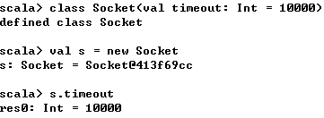

也可以指定timeout的值

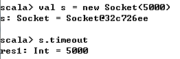

如果你更喜欢调用构造函数时使用命名参数的方法，你也可以用如下方法调用构造函数

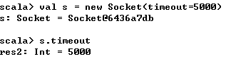

3\. 讨论

默认参数可以有效消除辅助构造函数，如下的构造函数相当于两个构造函数（不指定参数值和指定参数值）

    
    
    class Socket (val timeout: Int = 10000)

若没有默认参数这一特性，则需要定义一个辅助构造函数

    
    
    class Socket(val timeout: Int) {
        def this() = this(10000)
        override def toString = s"timeout: $timeout"
    }

你可以为多参数的构造函数提供多个默认值

    
    
    class Socket(val timeout: Int = 1000, val linger: Int = 2000) {
        override def toString = s"timeout: $timeout, linger: $linger"
    }

尽管你只定义了一个构造函数，但实际上有三个构造函数

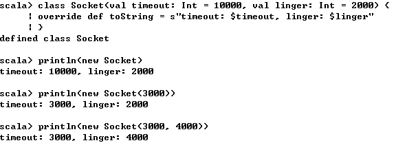

在创建对象时你也可以提供参数名

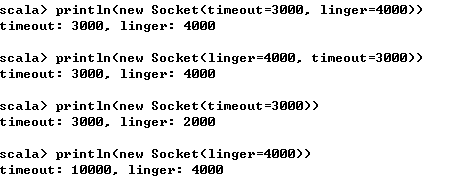

2.6 覆盖默认的访问器和修改器

1\. 问题描述

你想要覆盖Scala为你生成的访问器和修改器

2\. 解决方案

这是一个技巧的问题，如果你想坚持用Scala的命名约定时，你不能重写Scala为你生成的getter和setter方法，例如Person类有name参数，以下代码将不会被编译

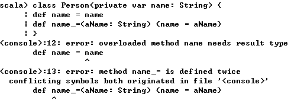

为了解决这个问题，可以构造函数的字段名，如将name改为_name

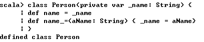

name方法为访问器，name_=方法为修改器

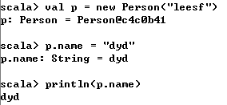

如果你不想使用Scala为你定义访问器和修改器的名字，你可以自由更改，如改为getName、setName。

3\. 讨论

如果你将类构造器的字段设置为var，则Scala会自动生成getter和setter方法，对于如下类

    
    
    class Stock (var symbol: String)

首先使用scalac进行编译，然后使用javap Stock进行反编译，结果如下

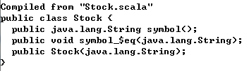

可以看到Scala生成了symbol方法和symbol_$eq方法，可以直接通过方法名调用，对于symbol_$eq而言，还可以使用symbol_=来调用

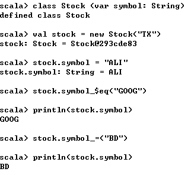

如果本想对字段加private，然而没有加，如下类

    
    
    class Stock (var _symbol: String) {
        def symbol = _symbol
        def symbol_= (s: String) {
            this.symbol = s
            println(s"symbol was updated, new value is $symbol")
        }
    }

同样经过编译和反编译，结果如下

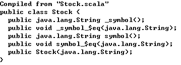

可以看到姿势的_symbol函数和_symbol_$eq函数都变为public了，而加private修饰时，其结果如下

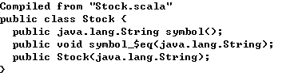

2.7 防止生成getter和setter方法

1\. 问题描述

当你定义类的构造函数参数为var时，Scala将会自动生成setter和getter方法，若是val，则生成getter方法，但是你既不需要setter，也不需要getter

2\. 解决方案

将字段使用private或者private[this]修饰，如下面示例

    
    
    class Stock {
        var delayedPrice: Double = _
        private var currentPrice: Double = _
    }

使用scalac进行编译，再使用javap进行反编译，结果如下

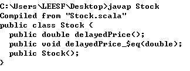

可以看到delayedPrice字段生成了getter和setter方法，而currentPrice字段则没有生成getter和setter方法

3\. 讨论

将字段定义为private，这样其只能被同类的所有实例访问，例如，所有的Stock实例可以互相访问currentPrice字段，如下面示例的结果为true

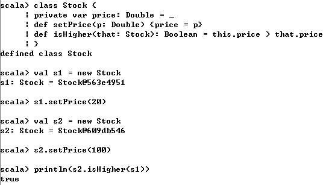

将字段定义为private[this]将会使字段变为对象私有，只有包含它的对象能够访问，同类的实例将无法访问其他实例的字段

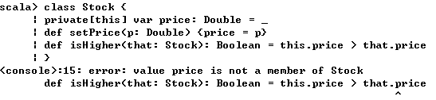

可以看到在this对象的方法中无法访问that对象的price字段

2.8 将代码块或函数赋值给字段

1\. 问题描述

你想要使用代码块或通过调用函数初始化类中的字段

2\. 解决方案

设置字段等于代码块或函数，如果算法需要运行一段时间，则可以设置为lazy，下面示例中，text被设置成等于代码块，它要么返回文件中包含的文本，要么返回错误信息，这取决于该文件是否存在和是否能被读取

    
    
    class Foo {
        // set "text" equal to the result of the block of code
        val text = {
            var lines = ""
            try {
                lines = io.Source.fromFile("F:/test.txt").getLines.mkString
            } catch {
                case e: Exception => lines = "Error happened"
            }
            lines
        }
        println(text)
    }
    
    object Test extends App {
        val f = new Foo
    }

运行结果

    
    
    This is a test file.

对text的赋值和println都在Foo类构造器中，当新生实例时会被执行，因此，编译运行该示例时要么返回文件中的内容，要么发生错误，在catch中被捕获

3\. 讨论

当字段被定义成lazy时，只有当被访问时才会被初始化

    
    
    class Foo {
        val text =
            io.Source.fromFile("F:/test.txt").getLines.foreach(println)
    }
    
    object Test extends App {
        val f = new Foo
    }

运行结果

    
    
    This is a test file.

当字段使用lazy修饰时

    
    
    class Foo {
        lazy val text =
            io.Source.fromFile("F:/test.txt").getLines.foreach(println)
    }
    
    object Test extends App {
        val f = new Foo
    }

无任何结果输出

2.9 设置未初始化的var字段类型

1\. 问题描述

你想要设置未初始化的var字段的类型，你可能会这样写，但是不知道如何结尾

    
    
    var x =

2\. 解决方案

通常，将字段定义为Option，对于有些类型，如String和numeric字段，你可以指明初始值，例如，你想要用户在社交网中注册，注册使用到的信息只有username和password，因此，你可以有如下类定义

    
    
    case class Person(var username: String, var password: String)

之后，你也需要用户的其他信息，如age, first name, last name, address，可以有如下定义

    
    
    case class Person(var username: String, var password: String) {
        var age = 0
        var firstName = ""
        var lastName = ""
        var address = None: Option[Address]
    }
    
    case class Address(city: String, state: String, zip: String)

即使用Option[Address]类型的None作为缺省值，可以使用如下

    
    
    val p = Person("leesf", "secret")
    p.address = Some(Address("WH", "HB", "43000"))

当需要访问address的字段时，可以如下

    
    
    p.address.foreach { a =>
        println(a.city)
        println(a.state)
        println(a.zip)
    }

当p.address为None时，则会跳过，为Some时，则会打印相应信息

3\. 讨论

编译器有时会自动给出类型，如下所示

    
    
    var i = 0 // Int
    var d = 0.0 // Double

当需要自定义类型时，可以如下

    
    
    var b: Byte = 0
    var c: Char = 0
    var f: Float = 0
    var l: Long = 0
    var s: Short = 0

2.10 处理继承时的构造器参数

1\. 问题描述

你想要扩展基类，并且需要使用基类中声明的构造函数参数，以及子类中的新参数

2\. 解决方案

还是使用var和val来定义构造函数参数，当定义子类构造函数时，父类构造函数中的字段不再使用var修饰，在子类构造函数中定义新的字段

    
    
    class Person (var name: String, var address: Address) {
        override def toString = if (address == null) name else s"$name @ $address"
    }

首先定义了Person基类，然后定义Employee子类

    
    
    class Employee (name: String, address: Address, var age: Int)
    　　extends Person (name, address) {
        // rest of the class
    }

Employee继承Person类，不再使用var修饰name和address，但是age在父类中不存在，则使用var修饰，其中Address类如下

    
    
    case class Address (city: String, state: String)

可以使用如下方法创建子类

    
    
    val lee = new Employee("Leesf", Address("JZ", "HB"), 25)

3\. 讨论

为了理解构造函数参数在子类中是如何工作的，也可帮助理解Scala是如何翻译你的代码的，由于Person的参数被定义为var

    
    
    class Person (var name: String, var address: Address) {
        override def toString = if (address == null) name else s"$name @ $address"
    }

Scala编译器将会生成getter和setter

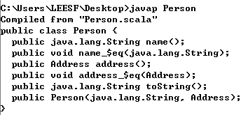

此时，如果Employee继承Person，在Employee构造函数中如何处理name和address字段，加入没有新的参数，那么至少有两种选择

    
    
    // Option 1: define name and address as "var"
    class Employee (var name: String, var address: Address)
        extends Person (name, address) { ... }
    // Option 2: define name and address without var or val
    class Employee (name: String, address: Address)
        extends Person (name, address) { ... }

由于Scala已经在Person类中生成了setter和getter函数，一种解决办法就是在Employee的构造函数的参数不用var修饰

    
    
    // this is correct
    class Employee (name: String, address: Address)
        extends Person (name, address) { ... }

由于Employee的构造函数中并未使用var修饰，因此Scala不会为字段生成getter和setter方法，验证代码如下

    
    
    case class Address (city: String, state: String)
    
    class Person (var name: String, var address: Address) {
        override def toString = if (address == null) name else s"$name @ $address"
    }
    
    class Employee (name: String, address: Address)
        extends Person (name, address) {
    }

使用javap反编译Employee，结果如下

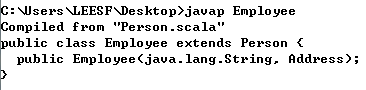

可以看到Scala并未为Employee类生成任何setter和getter方法

2.11 调用父类构造函数

1\. 问题描述

当创建子类构造函数时，你想控制父类构造函数

2\. 解决方案

你可以通过子类的主构造函数来控制父类构造函数，但是不能通过子类的辅助构造函数来控制父类构造函数，当定义子类时，你可以通过定义extends部分来控制子类所调用的父类构造器，例如，Dog类被定义为调用Animal类，其有name参数

    
    
    class Animal (var name: String) {
        // ...
    }
    
    class Dog (name: String) extends Animal (name) {
        // ...
    }

如果Animal类有多个构造函数，Dog子类可以调用任意的父类构造函数

    
    
    // (1) primary constructor
    class Animal (var name: String, var age: Int) {
        // (2) auxiliary constructor
        def this (name: String) {
            this(name, 0)
        }
        override def toString = s"$name is $age years old"
    }
    
    // calls the Animal one-arg constructor
    class Dog (name: String) extends Animal (name) {
        println("Dog constructor called")
    }

由于辅助构造函数的第一行必须要调用其他构造函数，因此，辅助构造函数不能调用父类构造函数，下面代码中，Employee类的主构造含可以调用Person类的任意构造函数，但是Employee的辅助构造函数只能调用其他构造函数

    
    
    case class Address (city: String, state: String)
    case class Role (role: String)
    
    class Person (var name: String, var address: Address) {
        // no way for Employee auxiliary constructors to call this constructor
        def this (name: String) {
            this(name, null)
            address = null
        }
        override def toString = if (address == null) name else s"$name @ $address"
    }
    
    class Employee (name: String, role: Role, address: Address)
        extends Person (name, address) {
        def this (name: String) {
            this(name, null, null)
        }
            
        def this (name: String, role: Role) {
            this(name, role, null)
        }
        
        def this (name: String, address: Address) {
            this(name, null, address)
        }
    }

所以无法通过子类辅助构造函数来控制父类构造函数，因为辅助构造函数必须要调用其他构造函数，所有的辅助构造函数最终会调用主构造函数，最终由主构造函数调用辅助构造函数

2.12 何时使用抽象类

1\. 问题描述

Scala有traits特性，并且traits比抽象类更灵活，那么何时使用抽象类呢

2\. 解决方案

以下两种原因需要使用抽象类

· 你想要创建一个包含构造函数参数的基类

· 代码将会被Java代码调用

考虑第一种情况，traits不允许构造函数参数，如下所示

    
    
    trait Animal(name: String) // this won"t compile

当基类构造函数必须含有参数时应该使用抽象类

    
    
    abstract class Animal(name: String)

考虑第二种情况是你的代码将会被Java调用，traits中实现的方法无法被Java访问

3\. 讨论

当构造函数有参数时，需要使用抽象类而非traits，但是，一个类只能继承一个抽象类，其与Java类似，当类中抽象方法时，该类就是抽象，方法体未定义的方法就是抽象方法

    
    
    def speak // no body makes the method abstract

不需要使用abstract关键字，如下示例

    
    
    abstract class BaseController(db: Database) {
        def save { db.save }
        def update { db.update }
        def delete { db.delete }
        // abstract
        def connect
        // an abstract method that returns a String
        def getStatus: String
        // an abstract method that takes a parameter
        def setServerName(serverName: String)
    }

其中connect、getStatus、setServerName为抽象方法，子类必须要实现或者是为抽象类

2.13 在抽象基类（或traits）中定义属性

1\. 问题描述

你想要在抽象类或traits中定义具体的或抽象属性，以便所有的子类都可以引用

2\. 解决方案

你可以在抽象类或traits中定义var或val字段，该字段可以是抽象的或者是具体定义的，下面示例展示了Pet抽象类中的抽象val和var字段，并且有一个sayHello的具体方法，以及重写的toString方法

    
    
    abstract class Pet (name: String) {
        val greeting: String
        var age: Int
        def sayHello { println(greeting) }
        override def toString = s"I say $greeting, and I"m $age"
    }

Dog和Cat类继承Pet，并且提供了greeting和age的具体实现，其中，字段给再次定义成val或var

    
    
    class Dog (name: String) extends Pet (name) {
        val greeting = "Woof"
        var age = 2
    }
    
    class Cat (name: String) extends Pet (name) {
        val greeting = "Meow"
        var age = 5
    }

可使用如下

    
    
    object AbstractFieldsDemo extends App {
        val dog = new Dog("Fido")
        val cat = new Cat("Morris")
        dog.sayHello
        cat.sayHello
        println(dog)
        println(cat)
        // verify that the age can be changed
        cat.age = 10
        println(cat)
    }

运行结果如下

    
    
    Woof
    Meow
    I say Woof, and I"m 2
    I say Meow, and I"m 5
    I say Meow, and I"m 10

3\. 讨论

你可以在抽象类中定义val或var的抽象字段，抽象字段在抽象类中的工作机制非常有趣

· 抽象的var字段也会生成getter和setter方法

· 抽象的val字段会生成getter方法

· 当在抽象类或traits中定义抽象的var或val字段时，Scala并不会生成该字段，只会生成方法

当在具体类中重写父类抽象的var或val字段时，一定要再次注明val或var，因为父类中不存在该字段，不需要使用override关键字，当在抽象类中使用def来定义无参数的方法时，可以在子类中定义为val

    
    
    abstract class Pet (name: String) {
        def greeting: String
    }
    
    class Dog (name: String) extends Pet (name) {
        val greeting = "Woof"
    }
    
    object Test extends App {
        val dog = new Dog("Fido")
        println(dog.greeting)
    }

当在抽象类中定义具体的val字段时，你可以提供一个初始值，然后在子类中进行重写

    
    
    abstract class Animal {
        val greeting = "Hello" // provide an initial value
        def sayHello { println(greeting) }
        def run
    }
    
    class Dog extends Animal {
        override val greeting = "Woof" // override the value
        def run { println("Dog is running") }
    }

在如下示例中，greeting在父类和子类中都定义了

    
    
    abstract class Animal {
        val greeting = { println("Animal"); "Hello" }
    }
    
    class Dog extends Animal {
        override val greeting = { println("Dog"); "Woof" }
    }
    
    object Test extends App {
        new Dog
    }

运行结果

    
    
    Animal
    Dog

为了防止抽象类中的val字段被子类覆盖，可以将其定义为final

    
    
    abstract class Animal {
        final val greeting = "Hello" // made the field "final"
    }
    
    class Dog extends Animal {
        val greeting = "Woof" // this line won"t compile
    }

你也可以在抽象类中定义var变量，并为其赋值，然后在具体子类中引用它们

    
    
    abstract class Animal {
        var greeting = "Hello"
        var age = 0
        override def toString = s"I say $greeting, and I"m $age years old."
    }
    
    class Dog extends Animal {
        greeting = "Woof"
        age = 2
    }

greeting字段和age字段在Animal类中都被定义和初始化了，在Dog类中就没有必要再重新声明为var或val类型了

在上述讨论中，不应该使用null值，可以使用Option/Some/None来初始化字段

    
    
    trait Animal {
        val greeting: Option[String]
        var age: Option[Int] = None
        override def toString = s"I say $greeting, and I"m $age years old."
    }
    
    class Dog extends Animal {
        val greeting = Some("Woof")
        age = Some(2)
    }
    
    object Test extends App {
        val d = new Dog
        println(d)
    }

运行结果

    
    
    I say Some(Woof), and I"m Some(2) years old.

2.14 使用样例类生成样板代码

1\. 问题描述

你需要使用样例类来生成样板代码，如生成setter和getter方法，还有apply, unapply, toString, equals,
hashCode等方法  

2\. 解决方案

将类定义成样例类，并且添加相应的构造函数参数

    
    
    case class Person(name: String, relation: String)

将类定义为样例类后，会生成很多样板代码，如

· 生成apply方法，所以不需要是new关键字就可以创建实例

· 为构造函数参数生成getter方法，因为其默认是val的，当被定义为var时，会生成setter方法

· 会生成缺省的toString方法

· 生成unapply方法，在模式匹配中将会很方便

· 生成equals和hashCode方法

· 生成copy方法

3\. 讨论

样例类在模式匹配中很实用，其默认参数为val，当创建样例类时，Scala会为你生成很多样板代码

2.15 定义equals方法（对象相等）

1\. 讨论

你想要定义一个equals方法来比较不同对象之间的相等性

2\. 解决方案

如同Java一样，你在类中定义equals和hashCode来比较两个对象，但与Java不同的是，你使用 ==
来比较两个对象的相等性，下面定义了equals方法和hashCode方法

    
    
    class Person (name: String, age: Int) {
        def canEqual(a: Any) = a.isInstanceOf[Person]
        override def equals(that: Any): Boolean =
        that match {
            case that: Person => that.canEqual(this) && this.hashCode == that.hashCode
            case _ => false
        }
        
        override def hashCode:Int = {
            val prime = 31
            var result = 1
            result = prime * result + age;
            result = prime * result + (if (name == null) 0 else name.hashCode)
            return result
        }
    }

接着可以使用 == 来比较两个Person对象是否相等

3\. 讨论

在Java中，==是比较两个对象的引用是否相等，而在Scala中，其是根据用户定义逻辑进行比较，其调用equals方法，在涉及继承时，也可以使用如上方法

    
    
    class Employee(name: String, age: Int, var role: String)
        extends Person(name, age) {
        override def canEqual(a: Any) = a.isInstanceOf[Employee]
        override def equals(that: Any): Boolean =
            that match {
            case that: Employee =>
                that.canEqual(this) && this.hashCode == that.hashCode
            case _ => false
        }
        
        override def hashCode:Int = {
            val ourHash = if (role == null) 0 else role.hashCode
            super.hashCode + ourHash
        }
    }

2.16 创建内部类

1\. 问题描述

你希望创建一个内部类，以将类排除在公共API之外，或者封装您的代码

2\. 解决方案

将类声明在另一个类中，如下示例

    
    
    class PandorasBox {
        case class Thing (name: String)
        
        var things = new collection.mutable.ArrayBuffer[Thing]()
        things += Thing("Evil Thing #1")
        things += Thing("Evil Thing #2")
        
        def addThing(name: String) { things += new Thing(name) }
    }

可以在PandorasBox内部使用things集合

    
    
    object ClassInAClassExample extends App {
        val p = new PandorasBox
        p.things.foreach(println)
    }

运行结果

    
    
    Evil Thing #1
    Evil Thing #2

并且可以调用addThing方法

    
    
    p.addThing("Evil Thing #3")
    p.addThing("Evil Thing #4")

3\. 讨论

与Java的内部类属于外部类不同，Scala中的内部类绑定到外部类的对象上

    
    
    object ClassInObject extends App {
        // inner classes are bound to the object
        val oc1 = new OuterClass
        val oc2 = new OuterClass
        val ic1 = new oc1.InnerClass
        val ic2 = new oc2.InnerClass
        ic1.x = 10
        ic2.x = 20
        println(s"ic1.x = ${ic1.x}")
        println(s"ic2.x = ${ic2.x}")
    }
    
    class OuterClass {
        class InnerClass {
            var x = 1
        }
    }

运行结果

    
    
    ic1.x = 10
    ic2.x = 20

**三、总结**

本篇博文学习了Scala中类的相关知识点，对比Java学习还是相对简单，也谢谢各位园友的观看~

