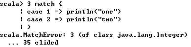

**一、前言**

前面学习了Scala的Numbers，接着学习Scala的Control Structures(控制结构)。

**二、Control Structures**

Scala中的控制结构与Java中的颇为类似，但也有所不同，例如，if/then/else控制结构与Java的类似，但是其可以返回值，虽然Java中有三元运算符的特殊语法，但是在Scala中使用if就可以达到同样的效果。

    
    
    val x =  if (a) y else z

同样，Scala的try/catch/finally 结构与Java的也类似，但是Scala在catch中时使用的模式匹配。

当使用for循环时，情况会变得更有趣，for循环的基本用法在Scala和Java中都相同，但是在Scala可以添加守卫。例如，可以使用两个for循环来读取文件中的每一行，并且对每一行的每个字符进行操作。

    
    
    for (line <- source.getLines) {
        for {
            char <- line
            if char.isLetter
        } // char algorithm here ...
    }            

在Scala中，还可以使用更精炼的语句实现上述功能

    
    
    for {
        line <- source.getLines
        char <- line
        if char.isLetter
    } // char algorithm here ...

在Scala中，使用for循环可以让你能够很轻易的将一个集合转化成另外一个集合

在最基础的使用中，Scala的match表达式与Java的Switch语句类似，你可以匹配任何对象，并且从对象中解析信息。

2.1 for和foreach循环

1\. 问题描述

你需要遍历集合的元素，或者操作集合中的元素，或者在已有集合上创建新的集合

2\. 解决方案

有很多方式可以遍历集合，如for、while循环，还有集合的foreach、map、flatMap方法等，首先看看for循环

当你的算法有多行时，也可以使用for循环，如下所示

上述示例中仅仅只是遍历了集合中的元素，并且没有返回值，如新的Array，当你想要从已有集合中创建新的集合时，可以使用for/yield

for/yield结构返回了一个新的Array。

当在for循环中需要访问计数器时，可以使用如下方法

Scala集合也提供了zipWithIndex方法来创建循环计数器

下面示例展示了如何通过Range来执行循环三次

如下示例展示了如何使用守卫(在for循环中使用if语句)

可以使用如下精炼方式遍历Map的键集合和值集合

3\. 讨论

当你在集合上使用for/yield时，会得到一个新的集合，而仅仅使用for时，则不会产生新的集合，仅仅只是利用for的副作用对集合元素进行操作。for循环可能不是遍历集合最好的方式，使用foreach、map、flatMap、collect、reduce等方法可能会更高效的解决问题。

你可以调用foreach方法来遍历每个集合元素

可以使用匿名函数对元素进行操作

for循环如何被翻译

· for循环会被编译器翻译成foreach方法

· 有守卫的for循环会被翻译成withFilter方法(在foreach之后)

· 有yield的for循环会被翻译成map方法

· 有yield和守卫的for循环会被翻译成withFilter(在map之后)

为了验证for循环的翻译过程，新建Main.scala文件，源代码如下

    
    
    class Main {
        for (i <- 1 to 10) println(i)
    }

使用scalac -Xprint:parse Main.scala命令进行编译

可以看到for循环被翻译成了foreach方法

其他的带守卫、yield的for循环也可以采用上述方法进行查看，不再累赘

2.2 使用多计数器的for循环

1\. 问题描述

你想要创建拥有多个计数器的循环，如当遍历一个多维数组

2\. 解决方案

你可以使用如下方法创建多个计数器

一种更好的方式是使用中括号

同理，也可以使用三个计数器

当遍历多位数组时，该方法很有效

3\. 讨论

在循环中，使用<-符号生成Range被称为生成器，可以在一个循环中使用多个生成器

2.3 使用内嵌语句的for循环

1\. 问题描述

你想要在for循环中添加一个或多个条件子句，通常在筛选集合中的某些元素

2\. 解决方案

可以在生成器后面添加if语句

或者使用中括号

上述的if语句被称为过滤器或守卫，下面示例添加了多个守卫

3\. 讨论

在for循环中使用守卫可以是代码精炼并且提高可读性，当然也可以使用传统的方法

2.4 创建for/yield组合

1\. 问题描述

你想要通过对原始集合中的每个元素应用某种算法（一个或多个守卫）来从现有集合创建新的集合

2\. 解决方案

使用yield和算法来从现有集合生成新的集合

如果算法有多行，可以采用如下形式

通常情况下，使用yield新生的集合的类型和原始集合的类型相同，如原始集合时ArrayBuffer类型，则新生的集合也是ArrayBuffer类型

3\. 讨论

当在for循环中使用yield时，可以将其看做如下

· 开始运行时，for/yield会新建一个空的集合，类型和原始集合类型相同

· 在for循环的每次迭代中，从输入集合的当前元素创建新的输出元素，放置在新的集合中

· 当for循环结束时，返回新的集合中的所有内容

没有守卫的for/yield语句就相当于调用集合的map方法

2.5 实现break和continue

1\. 问题描述

你需要使用break和continue，但是在Scala中并没有break和continue关键字

2\. 解决方案

scala.util.control.Breaks提供了break功能

    
    
    package com.hust.grid.leesf.breakcontinue
    
    /**
      * Created by LEESF on 2017/1/18.
      */
    import util.control.Breaks._
    
    object BreakAndContinueDemo extends App{
      println("\n=== BREAK EXAMPLE ===")
      breakable {
        for (i <- 1 to 10) {
          println(i)
          if (i > 4) break // break out of the for loop
        }
      }
      println("\n=== CONTINUE EXAMPLE ===")
      val searchMe = "peter piper picked a peck of pickled peppers"
      var numPs = 0
      for (i <- 0 until searchMe.length) {
        breakable {
          if (searchMe.charAt(i) != "p") {
            break // break out of the "breakable", continue the outside loop
          } else {
            numPs += 1
          }
        }
      }
      println("Found " + numPs + " p"s in the string.")
    
    }

结果

    
    
    === BREAK EXAMPLE ===
    1
    2
    3
    4
    5
    
    === CONTINUE EXAMPLE ===
    Found 9 p"s in the string.

值得注意的是break和breakable都不是Scala的关键字，它们是scala.util.control.Breaks包下的方法

    
    
    private val breakException = new BreakControl
    
    def break(): Nothing = { throw breakException }
    
    def breakable(op: => Unit) {
        try {
            op
        } catch {
            case ex: BreakControl =>
            if (ex ne breakException) throw ex
        }
    }

可以看到在调用break方法时，会抛出一个异常，此时breakable会捕捉到此异常，利用这种方式实现了break和continue的功能

3\. 讨论

如果你不喜欢使用break和continue时，可以使用如下方法，如可以使用带有守卫的for循环

    
    
    var barrelIsFull = false
    for (monkey <- monkeyCollection if !barrelIsFull) {
        addMonkeyToBarrel(monkey)
        barrelIsFull = checkIfBarrelIsFull
    }

或者使用return直接返回

    
    
    def sumToMax(arr: Array[Int], limit: Int): Int = {
        var sum = 0
        for (i <- arr) {
            sum += i
            if (sum > limit) return limit
        }
        sum
    }
    
    val a = Array.range(0,10)
    println(sumToMax(a, 10))        

2.6 使用类似三元运算符的if表达式

1\. 问题描述

你需要使用if表达式来像三元运算符那样简洁的解决问题

2\. 解决方案

在Scala中没有三元运算法，但是可以使用if/else表达式

3\. 讨论

在Java中可以使用?:三元运算符，在Scala可以使用if/else表达式

2.7 使用类似switch语句的match表达式

1\. 问题描述

你想要创建向Java那样简单的switch语句，如星期几，哪一月

2\. 解决方案

使用Scala的match表达式

    
    
    // i is an integer
    i match {
        case 1 => println("January")
        case 2 => println("February")
        case 3 => println("March")
        case 4 => println("April")
        case 5 => println("May")
        case 6 => println("June")
        case 7 => println("July")
        case 8 => println("August")
        case 9 => println("September")
        case 10 => println("October")
        case 11 => println("November")
        case 12 => println("December")
        // catch the default with a variable so you can print it
        case whoa => println("Unexpected case: " + whoa.toString)
    }

还可以直接利用match表达式的返回值

    
    
    val month = i match {
        case 1 => "January"
        case 2 => "February"
        case 3 => "March"
        case 4 => "April"
        case 5 => "May"
        case 6 => "June"
        case 7 => "July"
        case 8 => "August"
        case 9 => "September"
        case 10 => "October"
        case 11 => "November"
        case 12 => "December"
        case _ => "Invalid month" // the default, catch-all
    }

当写match表达式时，推荐使用@switch注解，当switch不能编译成一个tableswitch或lookupswitch，该注解会提供编译时警告，将switch编译成tableswitch或lookupswitch会有更高的性能，因为结果是在分支表而不是一个决策树里，当给表达式赋值时，它可以直接跳转到结果，而不是遍历决策树

    
    
    import scala.annotation.switch
    
    class SwitchDemo {
        val i = 1
        val x = (i: @switch) match {
            case 1 => "One"
            case 2 => "Two"
            case _ => "Other"
        }
    }

先使用scalac SwitchDemo命令进行编译，然后使用javap SwitchDemo命令反编译

可以看到生成了tableswitch表，当修改代码如下时

    
    
    import scala.annotation.switch
    
    class SwitchDemo {
        val i = 1
        val Two = 2 // added
        val x = (i: @switch) match {
            case 1 => "One"
            case Two => "Two" // replaced the "2"
            case _ => "Other"
        }
    }

同样使用scalac SwitchDemo命令进行编译

这表明match表达式无法生成tableswitch或lookupswitch，当使用javap命令反汇编时，也找不到tableswitch  

3\. 讨论

match表达式非常灵活，可以匹配不同的类型

    
    
    def getClassAsString(x: Any): String = x match {
        case s: String => s + " is a String"
        case i: Int => "Int"
        case f: Float => "Float"
        case l: List[_] => "List"
        case p: Person => "Person"
        case _ => "Unknown"
    }

可以使用case _通配符来匹配之前的所有case无法匹配的情况，或者使用case default进行赋值

    
    
    case default => println(default)

2.8 用一个case语句匹配多个条件

1\. 问题描述

当几个匹配条件要求执行相同的业务逻辑，你想要使用业务逻辑的一个副本来匹配条件，而不是为每个case重复业务逻辑

2\. 解决方案

将匹配条件放在一行使用|分割

    
    
    val i = 5
    i match {
        case 1 | 3 | 5 | 7 | 9 => println("odd")
        case 2 | 4 | 6 | 8 | 10 => println("even")
    }

同理，该语法也适用于字符串或其他类型

    
    
    val cmd = "stop"  
    
    cmd match {
        case "start" | "go" => println("starting")
        case "stop" | "quit" | "exit" => println("stopping")
        case _ => println("doing nothing")
    }　
    
    
    trait Command
    
    case object Start extends Command
    case object Go extends Command
    case object Stop extends Command
    case object Whoa extends Command
    
    def executeCommand(cmd: Command) = cmd match {
        case Start | Go => start()
        case Stop | Whoa => stop()
    }

2.9. 将match表达式的值赋值给变量

1\. 描述

你想要将匹配表达式返回值其赋值给变量，或使用匹配表达式作为方法的主体

2\. 解决方案

在表达式之前插入变量

    
    
    val evenOrOdd = someNumber match {
        case 1 | 3 | 5 | 7 | 9 => println("odd")
        case 2 | 4 | 6 | 8 | 10 => println("even")
    }

这种方法经常被用作创建短的方法或函数

    
    
    def isTrue(a: Any) = a match {
        case 0 | "" => false
        case _ => true
    }

2.10 访问匹配表达式默认情况下的值

1\. 问题描述

你想要访问默认匹配值，但是使用通配符时无法访问到值

2\. 解决方案

在默认情况下指定变量名而非_通配符

    
    
    i match {
        case 0 => println("1")
        case 1 => println("2")
        case default => println("You gave me: " + default)
    }

通过给默认匹配变量名称，你可以在语句右侧访问该变量

3\. 讨论

在默认匹配时使用变量名而非通配符，若没有给出通配符时，可能抛出异常

2.11 在匹配表达式中使用模式匹配

1\. 问题描述

你需要在匹配表达式中匹配一个或多个模式，该模式可以是常量模式、变量模式、构造函数模式、序列模式、元组模式或类型模式等

2\. 解决方案

为要匹配的每个模式定义一个case语句

    
    
    def echoWhatYouGaveMe(x: Any): String = x match {
        // constant patterns
        case 0 => "zero"
        case true => "true"
        case "hello" => "you said "hello""
        case Nil => "an empty List"
        
        // sequence patterns
        case List(0, _, _) => "a three-element list with 0 as the first element"
        case List(1, _*) => "a list beginning with 1, having any number of elements"
        case Vector(1, _*) => "a vector starting with 1, having any number of elements"
        
        // tuples
        case (a, b) => s"got $a and $b"
        case (a, b, c) => s"got $a, $b, and $c"
        
        // constructor patterns
        case Person(first, "Alexander") => s"found an Alexander, first name = $first"
        case Dog("Suka") => "found a dog named Suka"
        
        // typed patterns
        case s: String => s"you gave me this string: $s"
        case i: Int => s"thanks for the int: $i"
        case f: Float => s"thanks for the float: $f"
        case a: Array[Int] => s"an array of int: ${a.mkString(",")}"
        case as: Array[String] => s"an array of strings: ${as.mkString(",")}"    
        case d: Dog => s"dog: ${d.name}"
        case list: List[_] => s"thanks for the List: $list"
        case m: Map[_, _] => m.toString
        
        // the default wildcard pattern
        case _ => "Unknown
    }

上述方法可以匹配不同的类型和模式

3\. 讨论

通常使用此技术时，你的方法希望传入的是基类或特性继承的实例，然后case语句引用该基类型的子类型

    
    
    import java.io.File
    
    sealed trait RandomThing
    
    case class RandomFile(f: File) extends RandomThing
    case class RandomString(s: String) extends RandomThing
    
    class RandomNoiseMaker {
        def makeRandomNoise(t: RandomThing) = t match {
            case RandomFile(f) => playSoundFile(f)
            case RandomString(s) => speak(s)
        }
    }        

sealed表示密封的特质，其子类必须全部给出。

有时你可能需要向模式添加变量，你可以用下面的一般语法：

变量名 @ 模式

这表示变量绑定模式，这种模式的含义是按照正常模式进行模式匹配，如果模式匹配成功，就像简单的变量模式一样，将变量设置为匹配对象。

当匹配List类型时，我们可以如下

    
    
    case list: List[_] => s"thanks for the List: $list"

当我们想要匹配以元素1作为头元素的列表时，我们可能会进行如下匹配

    
    
    case list: List(1, _*) => s"thanks for the List: $list"

但此时会报错

解决办法是添加变量绑定模式

    
    
    case list @ List(1, _*) => s"$list"

2.12. 在匹配表达式中使用案例类

1\. 问题描述

你希望在匹配表达式中匹配不同的case类（或case对象），如接收actor的消息时

2\. 解决方案

根据你的需要可以使用之前的不同模式进行匹配

    
    
    trait Animal
    
    case class Dog(name: String) extends Animal
    case class Cat(name: String) extends Animal
    case object Woodpecker extends Animal
        
    object CaseClassTest extends App {
        def determineType(x: Animal): String = x match {
            case Dog(moniker) => "Got a Dog, name = " + moniker
            case _:Cat => "Got a Cat (ignoring the name)"
            case Woodpecker => "That was a Woodpecker"
            case _ => "That was something else"
        }
        
        println(determineType(new Dog("Rocky")))
        println(determineType(new Cat("Rusty the Cat")))
        println(determineType(Woodpecker))
    }

2.13 将if表达式（守卫）添加到case语句中

1\. 问题描述

你希望将匹配逻辑添加到匹配表达式中的case语句中，例如允许一系列数字或匹配模式，但仅当该模式与某些附加条件相匹配时

2\. 解决方案

将if表达式添加至case语句中

    
    
    i match {
        case a if 0 to 9 contains a => println("0-9 range: " + a)
        case b if 10 to 19 contains b => println("10-19 range: " + b)
        case c if 20 to 29 contains c => println("20-29 range: " + c)
        case _ => println("Hmmm...")
    }

可以匹配不同的值

    
    
    num match {
        case x if x == 1 => println("one, a lonely number")
        case x if (x == 2 || x == 3) => println(x)
        case _ => println("some other value")
    }

也可以在匹配时解析出字段信息

    
    
    def speak(p: Person) = p match {
        case Person(name) if name == "Fred" => println("Yubba dubba doo")
        case Person(name) if name == "Bam Bam" => println("Bam bam!")
        case _ => println("Watch the Flintstones!")
    }

3\. 讨论

在进行匹配时也可将if放在=>的右侧

    
    
    case Person(name) =>
        if (name == "Fred") println("Yubba dubba doo")
        else if (name == "Bam Bam") println("Bam bam!")

2\. 14 使用匹配表达式而非isInstanceOf

1\. 问题描述

你需要编写匹配一种类型或多个不同类型的代码块

2\. 解决方案

你可以使用isInstanceOf来测试对象的类型

    
    
    if (x.isInstanceOf[Foo]) { do something ...}

然而并不鼓励这样做，更好的办法是使用匹配表达式

    
    
    def isPerson(x: Any): Boolean = x match {
        case p: Person => true
        case _ => false
    }

或者给出一个继承已知父类的子类，需要根据子类的不同做出不同的操作

    
    
    trait SentientBeing
    trait Animal extends SentientBeing
    
    case class Dog(name: String) extends Animal
    case class Person(name: String, age: Int) extends SentientBeing
    
    def printInfo(x: SentientBeing) = x match {
        case Person(name, age) => // handle the Person
        case Dog(name) => // handle the Dog
    }

3\. 讨论

匹配表达式可以匹配多种类型，而不需要使用isInstanceOf方法

2\. 15. 在匹配表达式中使用列表

1\. 问题描述

列表数据结构与其他集合数据结构有点不同，它从cons cells开始构建，并以Nil作为结尾，在使用匹配表达式时你想要利用此特性，例如编写递归程序

2\. 解决方案

你可以使用如下方法创建List

当编写递归函数时，你可以利用其尾元素是Nil类型对象

3\. 讨论

在REPL中构建List时，不要忘记Nil情况

2.16 使用try/catch匹配一个或多个异常

1\. 问题描述

在try/catch块中你想要匹配一个或多个异常

2\. 解决方案

Scala的try/catch/finally与Java类型，但是在catch中使用的是模式匹配

    
    
    val s = "Foo"
    try {
        val i = s.toInt
    } catch {
        case e: Exception => e.printStackTrace
    }

当你需要匹配多个异常时，在catch添加即可

    
    
    try {
        openAndReadAFile(filename)
    } catch {
        case e: FileNotFoundException => println("Couldn"t find that file.")
        case e: IOException => println("Had an IOException trying to read that file")
    }

3\. 讨论

Scala中的catch块可以匹配多个异常，如果你不关心发生的异常，可以使用如下方式

    
    
    try {
        openAndReadAFile("foo")
    } catch {
        case t: Throwable => t.printStackTrace()
    }
    
    
    try {
        val i = s.toInt
    } catch {
        case _: Throwable => println("exception ignored")
    }

2.17 在try/catch/finally块之前声明变量

1\. 问题描述

当你需要调用对象的闭包方法，你想要在try块中使用一个对象，并且在finally块中访问它

2\. 解决方案

在try之前将字段声明为Option类型，之后在try块中创建一个Some对象

    
    
    import java.io._
    
    object CopyBytes extends App {
        var in = None: Option[FileInputStream]
        var out = None: Option[FileOutputStream]
        try {
            in = Some(new FileInputStream("/tmp/Test.class"))
            out = Some(new FileOutputStream("/tmp/Test.class.copy"))
            var c = 0
            while ({c = in.get.read; c != −1}) {
                out.get.write(c)
            }
        } catch {
            case e: IOException => e.printStackTrace
        } finally {
            println("entered finally ...")
            if (in.isDefined) in.get.close
            if (out.isDefined) out.get.close
        }
    }        

2.18 自定义控制结构

1\. 问题描述

你想要自定义控制结构来改善Scala语言

2\. 解决方案

假如有一天你不喜欢while结构，而是如下结构

    
    
    package foo
    
    import com.alvinalexander.controls.Whilst._
    
    object WhilstDemo extends App {
        var i = 0
        whilst (i < 5) {
            println(i)
            i += 1
        }
    }

此时，whilist就是你自定义的控制结构，你可能采用如下方法定义whilist方法

    
    
    def whilst(testCondition: => Boolean)(codeBlock: => Unit) {
        while (testCondition) {
            codeBlock
        }
    }

但是更好的方法是不调用while循环

    
    
    package com.leesf.controls
    
    import scala.annotation.tailrec
    
    object Whilst {
        // 2nd attempt
        @tailrec
        def whilst(testCondition: => Boolean)(codeBlock: => Unit) {
            if (testCondition) {
                codeBlock
                whilst(testCondition)(codeBlock)
            }
        }
    }

3\. 讨论

在第二版的whilist中，使用了递归调用，假设有一个两个参数的控制结构，当都为真时执行代码块，调用代码如下

    
    
    doubleif(age > 18)(numAccidents == 0) { println("Discount!") }

doubleif方法则可定义如下

    
    
    def doubleif(test1: => Boolean)(test2: => Boolean)(codeBlock: => Unit) {
        if (test1 && test2) {
            codeBlock
        }
    }

其中，codeBlock: => Unit对应的是println("Discount!")

**三、总结**

本篇博文学习了Scala的控制结构及其细节，同时还学习了自定义控制结构，也谢谢各位园友的观看~

