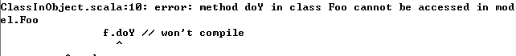

**一、前言**

前面学习了Scala的Class，下面接着学习Method(方法)。

**二、Method**

Scala的方法与Java的方法类似，都是添加至类中的行为，但是在具体的实现细节上差异很大，下面展示一个参数为整形，返回值为String的方法定义

    
    
     // java
    public String doSomething(int x) {
        // code here
    }
    
    // scala
    def doSomething(x: Int): String = {
        // code here
    }

Scala中的方法可以写的更为简洁，如下

    
    
    def plusOne(i: Int) = i + 1

将参数值加1后返回，不用显示定义返回值类型，除了已经给出的差别，还有其他差别如下

· 指定方法访问控制（可见性）

· 为方法参数设置默认值的能力

· 调用方法时指定方法参数名称的能力

· 声明方法抛出的异常

· 在方法中使用var类型的字段

2.1 控制方法的范围

1\. 问题描述

Scala的方法默认为public的，你需要像Java一样控制方法的范围

2\. 解决方案

Scala提供了如下范围控制选项

· 对象私有范围的

· 私有的

· 受保护的

· 包级别的

· 指定包级别的

· 公有的

最严格的访问就是将方法定义为对象私有的，其只能在当前对象上被调用，其他同类型对象无法访问，在方法前面添加private[this]即可

    
    
    private[this] def isFoo = true

在如下示例中，doFoo的参数为Foo实例，但是isFoo被定义为对象私有方法，如下代码编译不成功

这是因为other无法访问isFoo方法，该方法被定义为只有this（当前对象）可以访问

可以将方法定义为private，这样当前对象可以访问，并且同类型的其他对象也可以访问

当定义为private时，子类无法访问，如下示例编译不会通过

将heartBeat定义为protected之后则可通过编译

Scala中的protected含义与Java不太相同，其在同一个包的其他类无法访问该protected方法，如下示例

    
    
    package world {
        class Animal {
            protected def breathe {}
        }
        
        class Jungle {
            val a = new Animal
            a.breathe // error: this line won"t compile
        }
    }

编译时报错如下

表示Jungle类无法访问同包下的Animal类的方法

为了是方法对于同包下的其他类可见，可以使用private[packageName]来修饰方法

    
    
    package model {
        class Foo {
            private[model] def doX {}
            private def doY {}
        }
        
        class Bar {
            val f = new Foo
            f.doX // compiles
            f.doY // won"t compile
        }
    }

运行结果如下

除了让方法在同包下可见，Scala还可以让包在类继承结构中的不同层级下可见

    
    
    package com.hust.grid.model {
        class Foo {
            private[model] def doX {}
            private[grid] def doY {}
            private[hust] def doZ {}
        }
    }
    
    
    import com.hust.grid.model._
    package com.hust.grid.view {
        class Bar {
            val f = new Foo
            f.doX // won"t compile
            f.doY
            f.doZ
        }
    }
    
    package com.hust.common {
        class Bar {
            val f = new Foo
            f.doX // won"t compile
            f.doY // won"t compile
            f.doZ
        }
    }

其中doX在model包下其他类中可见，doY在grid包下其他类中可见，doZ在hust包下其他类中可见

如果方法没有修饰符，其就是public的，下面示例中任何类都可以调用doX方法

    
    
    package com.hust.grid.model {
        class Foo {
            def doX {}
        }
    }
    
    package org.xyz.bar {
        class Bar {
            val f = new com.hust.grid.model.Foo
            f.doX
        }
    }

3\. 讨论

Scala中的访问控制符比Java的要稍微复杂点，需要不断体会和使用

2.2 调用超类的方法

1\. 问题描述

为了保持代码的简洁性，你需要调用父类定义的方法

2\. 解决方案

在基础使用上，Scala与Java一样，使用super指代超类，然后使用方法名指代具体方法

    
    
    class WelcomeActivity extends Activity {
        override def onCreate(bundle: Bundle) {
            super.onCreate(bundle)
            // more code here ...
        }
    }

如果类继承了多个traits，并且这些traits实现了相同的方法，这时你不仅可以选择方法，并且还可以选择哪个traits

    
    
    trait Human {
        def hello = "the Human trait"
    }
    
    trait Mother extends Human {
        override def hello = "Mother"
    }
    
    trait Father extends Human {
        override def hello = "Father"
    }

你可以使用如下不同的方法调用hello方法

    
    
    class Child extends Human with Mother with Father {
        def printSuper = super.hello
        def printMother = super[Mother].hello
        def printFather = super[Father].hello
        def printHuman = super[Human].hello
    }

可以进行如下测试

    
    
    object Test extends App {
        val c = new Child
        println(s"c.printSuper = ${c.printSuper}")
        println(s"c.printMother = ${c.printMother}")
        println(s"c.printFather = ${c.printFather}")
        println(s"c.printHuman = ${c.printHuman}")
    }

运行结果如下

    
    
    c.printSuper = Father
    c.printMother = Mother
    c.printFather = Father
    c.printHuman = the Human trait

当类继承多traits并且有多个相同方法时，可以使用super[traitName].methodName 来调用不同父类中的相同方法  

值得注意的是，其无法使用到父类的继承结构（如父类的父类），其只能调用其直接继承的父类的方法，如下例所示，super[Animal].walk编译报错

    
    
    trait Animal {
        def walk { println("Animal is walking") }
    }
    
    class FourLeggedAnimal extends Animal {
        override def walk { println("I"m walking on all fours") }
    }
    
    class Dog extends FourLeggedAnimal {
        def walkThenRun {
            super.walk // works
            super[FourLeggedAnimal].walk // works
            super[Animal].walk // error: won"t compile
        }
    }

由于Dog并为直接继承Animal，因此不能使用super[Animal].walk来调用Animal的方法

2.3 设置方法参数的默认值

1\. 问题描述

你想要定义方法参数值的默认值，以便在调用方法时不用显示定义该方法参数

2\. 解决方案

在方法签名中指定默认值，如下所示

    
    
    class Connection {
        def makeConnection(timeout: Int = 5000, protocol: = "http") {
            println("timeout = %d, protocol = %s".format(timeout, protocol))
            // more code here
        }
    }

timeout的默认值为5000，protocal的默认值为"http"，可以通过如下方法调用该方法

    
    
    c.makeConnection()
    c.makeConnection(2000)
    c.makeConnection(3000, "https")

如果你喜欢指定参数名时，可以使用如下方式

    
    
    c.makeConnection(timeout=10000)
    c.makeConnection(protocol="https")
    c.makeConnection(timeout=10000, protocol="https")

3\. 讨论

如同构造函数参数一样，你可以为方法参数设置默认值，方法中参数的赋值从左到右，使用如下方法可以使用timeout和protocal的默认值

    
    
    c.makeConnection()

可以设置timeout值为2000，而protocal使用默认值

    
    
    c.makeConnection(2000)

可以设置同时设置timeout和protocal的值

    
    
    c.makeConnection(2000, "https")

但是通过上述方法无法单独设置protocal的值，可以这样单独设置protocal的值，而timeout默认为5000

    
    
    c.makeConnection(protocol="https")

当你的方法中既有默认值也有非默认值，你需要将由默认值的参数放在最后

可以上述调用都会报错，重新调整参数位置即可

2.4 调用方法时使用参数名

1\. 问题描述

当调用方法时，你更喜欢使用参数名

2\. 解决方案

常用的指定参数来调用方法格式如下

    
    
    methodName(param1=value1, param2=value2, ...)

有如下类

    
    
    class Pizza {
        var crustSize = 12
        var crustType = "Thin"
        def update(crustSize: Int, crustType: String) {
            this.crustSize = crustSize
            this.crustType = crustType
        }
        
        override def toString = {
            "A %d inch %s crust pizza.".format(crustSize, crustType)
        }
    }

可以使用如下方法调用

    
    
    p.update(crustSize = 16, crustType = "Thick")
    p.update(crustType = "Pan", crustSize = 14)

3\. 讨论

使用参数名调用方法显得冗长，但是具有更好的可读性，当参数类型相同时，其显得尤为有用，可比较如下两种调用

    
    
    engage(true, true, true, false)　
    
    
    engage(speedIsSet = true,
            directionIsSet = true,
            picardSaidMakeItSo = true,
            turnedOffParkingBrake = false)

显然第二种具有更好的可读性

2.5 定义返回多项(元组)的方法

1\. 问题描述

你想要从一个方法中返回多个值，但是你不想将这些值封装在类中

2\. 解决方案

Scala可以使用tuple，让你从方法中返回多个值，如下返回三元组

    
    
    def getStockInfo = {
        // other code here ...
        ("NFLX", 100.00, 101.00) // this is a Tuple3
    }

然后调用该方法并将返回值赋值给变量

    
    
    val (symbol, currentPrice, bidPrice) = getStockInfo

3\. 讨论

在Java中也可以从方法中返回多个值，但是其是将多个值封装在类中而并非使用tuple

getStockInfo方法返回的是三元组tuple3，tuple最多可以容纳22个变量，即22元组tuple22，如下定义的是二元组

当然也可以直接使用一个val变量来存储方法返回值，然后通过._1、._2符号来访问对应的值

2.6 强制调用者不使用括号调用方法

1\. 问题描述

你想强调如下编程风格，在调用访问方法时不使用括号

2\. 解决方案

在定义访问方法名后不使用括号，如下例所示

    
    
    class Pizza {
        // no parentheses after crustSize
        def crustSize = 12
    }

此时，调用者调用方法时不能使用括号，否则会报错

3\. 讨论

在调用访问方法时不适用括号并没有任何副作用，并且可以强制调用者不适用括号进行调用

2.7 创建接受可变参数的方法

1\. 问题描述

为了使方法更为灵活，你想要定义一个接受可变参数的方法

2\. 解决方案

在参数字段类型后面添加*即可表示方法接受可变个参数

    
    
    def printAll(strings: String*) {
        strings.foreach(println)
    }

针对以上方法，可以有如下调用

    
    
    printAll()
    printAll("foo")
    printAll("foo", "bar")
    printAll("foo", "bar", "baz")

可以使用_*操作符来适应序列（Array、List、Seq、Vector等），所以其也可被用作实参调用方法

    
    
    // a sequence of strings
    val fruits = List("apple", "banana", "cherry")
    // pass the sequence to the varargs field
    printAll(fruits: _*)

3\. 讨论

当定义一个包含可变参数的方法时，其必须要放在方法签名的最后，在可变参数后面定义一个参数是非法的

并且一个方法中只能有一个可变参数，当一个参数为可变参数，调用时你不需要提供任何参数，如下

当定义一个接受可变个整形的参数的方法时，当使用(a)参数调用(b)无参数调用，其结果不相同

当使用一个或多个参数调用时，其是第一个种情况，当不使用参数调用时，其是第二种情况，是空列表，这样可以防止抛出异常

2.8 定义可抛出异常的方法

1\. 问题描述

你想要定义一个可以抛出异常的方法，这样可以警告调用者，或者是你的代码将会被Java代码调用

2\. 解决方案

使用@throws注释来声明可能抛出的异常，将注释放在方法之前

    
    
    @throws(classOf[Exception])
    override def play {
        // exception throwing code here ...
    }

当一个方法可能抛出多个异常时，将其一一列出

    
    
    @throws(classOf[IOException])
    @throws(classOf[LineUnavailableException])
    @throws(classOf[UnsupportedAudioFileException])
    def playSoundFileWithJavaAudio {
        // exception throwing code here ...
    }

3\. 讨论

Scala使用注释声明异常与Java的以下处理方式相同

    
    
    public void play() throws FooException {
        // code here ...
    }

Scala的受检查异常与Java的不相同，Scala不需要方法声明会抛出的异常，并且不需要调用者捕捉异常

即便Scala不需要异常时受检查的，如果不进行测试，也会出现Java中的结果，在下面的代码中，第二个println永远不会被调用

    
    
    object BoomTest extends App {
        def boom { throw new Exception }
        
        println("Before boom")
        
        boom
        
        // this line is never reached
        println("After boom")
    }

2.9 支持流式编程风格

1\. 问题描述

你想要创建一个调用可以使用流式风格编程的API，其也被称为方法链

2\. 解决方案

流式编程风格可以让你的方法调用聚合在一起，如下所示

    
    
    person.setFirstName("LEE")
    .setLastName("SF")
    .setAge(25)
    .setCity("WH")
    .setState("HB")

为了支持这种风格，做法如下

· 如果类可以被继承，可将方法的返回类型定义为this.type

· 如果类不能被继承，可将方法的返回类型定义为this

下面示例展示了this.type作为set*方法的返回类型

    
    
    class Person {
        protected var fname = ""
        protected var lname = ""
        def setFirstName(firstName: String): this.type = {
            fname = firstName
            this
        }
        
        def setLastName(lastName: String): this.type = {
            lname = lastName
            this
        }
    }
    
    class Employee extends Person {
        protected var role = ""
        
        def setRole(role: String): this.type = {
            this.role = role
            this
        }
        
        override def toString = {
            "%s, %s, %s".format(fname, lname, role)
        }
    }

使用如下

    
    
    object Main extends App {
        val employee = new Employee
        // use the fluent methods
        employee.setFirstName("Al")
        .setLastName("Alexander")
        .setRole("Developer")
        println(employee)
    }

3\. 讨论

如果确定类不会被继承，则将返回类型定义为this.type毫无意义，可以直接返回this即可，如下例所示

    
    
    final class Pizza {
        import scala.collection.mutable.ArrayBuffer
        
        private val toppings = ArrayBuffer[String]()
        private var crustSize = 0
        private var crustType = ""
        
        def addTopping(topping: String) = {
            toppings += topping
            this
        }
        
        def setCrustSize(crustSize: Int) = {
            this.crustSize = crustSize
            this
        }
        
        def setCrustType(crustType: String) = {
            this.crustType = crustType
            this
        }
        
        def print() {
            println(s"crust size: $crustSize")
            println(s"crust type: $crustType")
            println(s"toppings: $toppings")
        }
    }

使用如下

    
    
    object FluentPizzaTest extends App {
        val p = new Pizza
        p.setCrustSize(14)
        .setCrustType("thin")
        .addTopping("cheese")
        .addTopping("green olives")
        .print()
    }

当类能够被继承时，则需要将返回类型定义为this.type，这使得流式风格在子类中也可以使用

**三、总结**

本篇主要讲解了Scala中方法的一些使用技巧，谢谢各位园友的观看~

