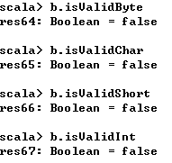
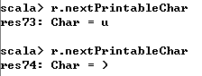
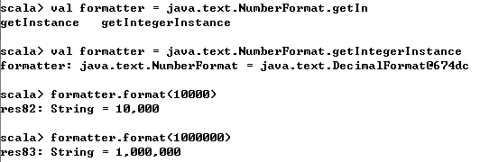
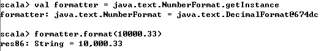

**一、前言**

前面已经学习了Scala中的String，接着学习Scala的Numbers。

**二、Numbers**

在Scala中，所有的数字类型，如Byte，Char，Double，Float，Int，Long，Short都是对象，这七种数字类型继承AnyVal特质，这七种数字类型与其在Java中有相同的范围，而Unit和Boolean则被认为是非数字值类型，Boolean有false和true两个值，你可以获取到各个数字类型的最值。

复杂的数字和日期

如果需要更强大的数类，可以使用[spire](https://github.com/non/spire)，[scalalab](https://code.google.com/archive/p/scalalab/)。

如果需要更强大的日期类，可以使用[Joda Time](http://joda-time.sourceforge.net/)，[nscala-
time](https://github.com/nscala-time/nscala-time)。

2.1 从字符串中解析数字

1\. 问题

你想要将字符串类型转化为数字类型。

2\. 解决方案

使用String的to*方法即可将String转化为相应的数字。

当无法进行转化时，to*方法可能会抛出NumberFormatException异常。  

可以直接使用字符串来创建BigInt和BigDecimal实例（也可能会抛出异常）

**处理基和基数**

如果在计算时不以10为基（十进制）进行计算，而要使用其他进制，此时Int类的toInt方法不允许传入基和基数，此时需要使用parseInt方法，parseInt可将字符串转化为在指定进制下的值

也可以使用隐式转化来完成上述的功能

3\. 讨论

由于在Scala中没有受检查异常，因此你不需要在方法中声明throws
NumberFormatException。但是为了使调用者明白该方法可能会抛出异常，你可以使用throws注解

    
    
    @throws(classOf[NumberFormatException])
    def toInt(s: String) = s.toInt

更通常而言，在Scala中使用Option/None/Some进行模式匹配来处理

    
    
    def toInt(s: String):Option[Int] = {
        try {
            Some(s.toInt)
        } catch {
            case e: NumberFormatException => None
        }
    }        

此时你就可以使用不同的方法来调用toInt方法

    
    
    println(toInt("1").getOrElse(0)) // 1
    println(toInt("a").getOrElse(0)) // 0

另外一种使用方法就是使用匹配表达式

    
    
    toInt(aString) match {
        case Some(n) => println(n)
        case None => println("Boom! That wasn"t a number.")
    }

也可以使用如下直接提取出值

    
    
    val result = toInt(aString) match {
        case Some(x) => x
        case None => 0 
    }

2.2 数字类型间的转化

1\. 问题描述

你想要从一种数字类型转化为另一种数字类型，如从Int到Double。

2\. 解决方案

不同于Java使用cast方法，Scala中可以直接使用数字类型提供的to*方法。

3\. 讨论

在Java中，需要强制转化来将double类型转化为int类型

    
    
    int a = (int) 100.00;

但是在Scala中，使用to*方法即可完成上述转化，如果你想要避免转化错误，你可以使用isValid方法来测试是否可以转化

2.3 重写默认类型

1\. 问题描述

当你给变量赋值时，Scala会自动给变量赋予相应的类型，当你创建数字字段时，你需要重写默认的类型。

2\. 解决方案

如果你将1赋值给变量a，那么a默认为Int类型

下面例子重写了默认类型

另一种方法是用类型注释变量

也可以在等号左边进行定义

你也可以在数字前面添加0x或0X来创建十六进制整形

3\. 讨论

当创建对象实例时，应该注意如下语法结构

    
    
    var [name]:[Type] = [initial value]

在初始化数字类型的var字段时，可以使用占位符，其值默认为0，占位符仅仅只在类定义时有效，其他时候则不行，如在方法内部定义不起作用

    
    
    class Foo {
        var a: Short = 0 // 定义初始值
        var b: Short = _ // 默认为0
    }

但在方法中，可以使用如下方法

    
    
    var name = null.asInstanceOf[String]

当然更好的办法是使用Option/None/Some模式匹配，这样可以避免空值

2.4 替换++、--

1\. 问题描述

在其他语言中，你可以使用++、--来增1、减1，然而，在Scala中没有++、--操作符

2\. 解决方案

由于val类型变量是不可变的，所以不能进行加法或减法的操作，但是var类型是可变，可以使用+=、-=方法来进行加法或减法

同理，也可以使用*=、/=方法进行乘法、除法操作

值得注意的是+=、-=、*=、/=都不是操作符，而是方法，他们是var型Int变量上实现的方法。

3\. 讨论

在其他数字类型上也可以使用+=、-=、*=、/=方法

2.5 比较浮点数

1\. 问题描述

你需要比较两个浮点数，但在其他一些编程语言中，它们应该是相等的两个浮点数

2\. 解决方案

在Java和许多其他语言，你可以通过创建一个指定比较精度的方法来决这个问题，下面是约等于方法

    
    
    def ~=(x: Double, y: Double, precision: Double) = {
        if ((x - y).abs < precision) true else false
    }

3\. 讨论

当进行浮点数计算时，0.1 + 0.1等于0.2，但是0.1 + 0.2不等于0.3

这种细小的错误使得比较两个浮点数成为真正的问题。

因此，你需要自定义比较精度的函数来比较两个浮点数是否相等，你可以定义隐式转化，然后在需要是引入即可。或者将方法放在object对象中，这样可以直接调用

    
    
    object MathUtils {
        def ~=(x: Double, y: Double, precision: Double) = {
            if ((x - y).abs < precision) true else false
    }

然后直接通过MathUtils调用~=方法进行比较

    
    
    println(MathUtils.~=(a, b, 0.000001))

2.6 处理大数

1\. 问题描述

你正在编写需要使用非常大的整数或十进制数的应用程序

2\. 解决方案

你可以使用BigInt或BigDecimal类

不同于其在Java的对应类，这些类支持所有你使用数字类型的操作符

你也可以把它们转化为其他数字类型

为了避免错误，也可以在转化之前进行测试

3\. 讨论

虽然Scala中的BigInt和BigDecimal是由Java中的BigInt和BigDecimal支持的，但是Scala中的类使用更为简便，并且它们是可变的，可以像其他数字类型一样操作。

2.7 生成随机数

1\. 问题描述

你需要创建随机数，如测试应用程序、执行模拟以及许多其他情况

2\. 解决方案

使用scala.util.Random来创建随机数

你可以指定随机生成数字的最大值

上述示例将会生成[0-99]之间的数字，你也可以生成随机Float（0.0到1.0之间的浮点数）

也可以生成随机Double（0.0到1.0之间的浮点数）

你也可以在创建Random时指定seed值，也可以之后调用setSeed方法进行设置

3\. 讨论

Random类可以应对所有通常的使用，包括生成数字、设置最大值、设置seed值，也可以生成随机字符

Scala可以生成一段随机长度的数字，在测试时非常有用

也可以生成随机长度的浮点数

2.8 创建数字范围，列表或数组

1\. 问题描述

你需要创建一个数字范围、列表或数组，如for循环或用于测试目的

2\. 解决方案

使用Int类的方法来创建一个数字Range

也可以自定义间距

3\. 讨论

在Scala中可以很轻易的创建数字范围，并且可以很轻易的将其转化为列表或者数组类型

更好的方式如下

2.9 格式化数字和货币

1\. 问题描述

你想要格式化数字和货币来控制小数点和逗号，特别是用于打印输出。

2\. 解决方案

对于简单的数字格式化，可以采用前篇博文提到的f字符串插值

添加逗号的一种简单方法是调用java.text.NumberFormat类的getIntegerInstance方法  

在使用getIntegerInstance方法的时候可以指定地区

在处理浮点数时可以使用getInstance方法

对于货币格式，可以使用getCurrencyInstance方法  

下面方法可以处理国际化货币

3\. 讨论

**** 主要讨论了使用Java的相关类来格式化数字和货币，也可以使用BigDecimal来处理货币的格式问题。 **  
**

**三、总结**

本篇博文学习了数字类的相关操作，可以看到Scala相比于Java简易很多，与Java也是无缝兼容的。也谢谢各位园友的观看~

