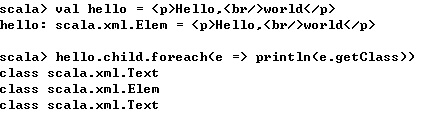

##【Scala】Scala之Object

##
##一、前言

##
##　　前面学习了Scala的Methods，接着学习Scala中的Object

##
##二、Object

##
##　　Object在Scala有两种含义，在Java中，其代表一个类的实例，而在Scala中，其还是一个关键字，本篇首先将会把object当成一个类的实例看待，展示如何将对象从一种类型转化为另一种类型，之后将展示如何创建单例对象，Scala中还存在包对象，在Scala中，经常有如下定义

	type Throwable = java.lang.Throwable
type Exception = java.lang.Exception
type Error = java.lang.Error
type Seq[+A] = scala.collection.Seq[A]
val Seq = scala.collection.Seq


##
##　　使用type定义可以使得代码更为简洁，可使用伴生对象来创建静态方法，并且伴生对象可以使得在创建类对象时不需要使用new关键字，如下所示

	val siblings = List(Person("Kim"), Person("Julia"), Person("Kenny"))


##
##　　2.1 对象转化

##
##　　1. 问题描述

##
##　　你需要将一个类的实例从一种类型转化为另一种类型，如动态创建对象

##
##　　2. 解决方案

##
##　　使用asInstanceOf方法进行类型转化，如下的lookup方法返回的对象将给转化为Recognizer对象　

	val recognizer = cm.lookup("recognizer").asInstanceOf[Recognizer]


##
##　　以上代码在Java中如下　

	Recognizer recognizer = (Recognizer)cm.lookup("recognizer");


##
##　　asInstanceOf方法是定义在Any类中的，所以任何类中都可以使用该方法

##
##　　3. 讨论

##
##　　在动态编程中，经常需要从一个类转化为另一个类，如在Spring框架中使用ApplicationContext文件来初始化Bean　

	// open/read the application context file
val ctx = new ClassPathXmlApplicationContext("applicationContext.xml")
// instantiate our dog and cat objects from the application context
val dog = ctx.getBean("dog").asInstanceOf[Animal]
val cat = ctx.getBean("cat").asInstanceOf[Animal]


##
##　　在进行数字类型转化时，也可以使用asInstanceOf方法

##
##　　 

##
##　　当需要与Java进行交互时，也可以使用asInstanceOf方法　　

	val objects = Array("a", 1)
val arrayOfObject = objects.asInstanceOf[Array[Object]]
AJavaClass.sendObjects(arrayOfObject)


##
##　　与Java类似，类型转化可能会抛出ClassCastException异常

##
##　　 

##
##　　可以使用try/catch来解决此问题

##
##　　2.2 与Java的.class对应的方法

##
##　　1. 问题描述

##
##　　当一个API需要你传递Class对象，在Java中，你可以使用.class，但是在Scala则行不通

##
##　　2. 解决方案

##
##　　使用Scala的classOf方法，如下所示　　

	val info = new DataLine.Info(classOf[TargetDataLine], null)


##
##　　在Java中则使用如下　　

	info = new DataLine.Info(TargetDataLine.class, null);


##
##　　classOf方法定义在Predef对象中，因此可以在没有import情况直接使用

##
##　　3. 讨论

##
##　　该方法可以让你开始学习反射，如下示例可以访问String类的方法

##
##　　 

##
##　　2.3 确定对象的类

##
##　　1. 问题描述

##
##　　在Scala中，你不需要显示的声明类型，你偶尔也想要打印一个对象的类或类型以明白Scala的工作机制

##
##　　2. 解决方案

##
##　　你可以使用对象的getClass方法来确定Scala为你自动赋值的类型，如当需要了解可变参数的工作流程时，可以调用getClass方法，得知不同情况，类型也不相同　

	def printAll(numbers: Int*) {
    println("class: " + numbers.getClass)
	}


##
##　　当使用多个参数调用printAll方法和不使用参数调用printAll方法，其结果不相同

##
##　　 

##
##　　当处理Scala的XML库时，该方法非常有效，可以知道在不同情形下所处理的类，如下，
标签下包含了一个子类

##
##　　 

##
##　　当在
标签中添加 标签后，其结果如下

##
##　　 

##
##　　3. 讨论

##
##　　若在IDE中无法得知对象的类型，可以使用getClass方法来获取对象类型

##
##　　 

##
##　　2.4 使用对象启动应用

##
##　　1. 问题描述

##
##　　你想要使用main方法来启动一个应用，或者为脚本提供一个入口

##
##　　2. 解决方案

##
##　　启动应用有两种方法，其一让类继承App，其二是定义一个对象并定义main方法

##
##　　对于第一种方法，其通用做法如下　

	object Hello extends App {
    println("Hello, world")
	}


##
##　　此时object内的语句会自动执行，第二种方法是定义main方法

	object Hello2 {
    def main(args: Array[String]) {
        println("Hello, world")
    	}
	}    


##
##　　3. 讨论

##
##　　上述两种方法中，都是通过object来启动应用的

##
##　　2.5 使用Object创建单例

##
##　　1. 问题描述

##
##　　你想要创建一个单例对象

##
##　　2. 解决方案

##
##　　使用object关键字来创建单例对象　　

	object CashRegister {
    def open { println("opened") 	}
    def close { println("closed") 	}
	}


##
##　　由于CashRegister被定义为成object，因此仅仅只有一个实例，被调用的方法就相当于Java中的静态方法，调用如下　

	object Main extends App {
    CashRegister.open
    CashRegister.close
	}


##
##　　在创建工具方法时，该方法同样有效　　

	import java.util.Calendar
import java.text.SimpleDateFormat

object DateUtils {
    // as "Thursday, November 29"
    def getCurrentDate: String = getCurrentDateTime("EEEE, MMMM d")
    
    // as "6:20 p.m."
    def getCurrentTime: String = getCurrentDateTime("K:m aa")
    
    // a common function used by other date/time functions
    private def getCurrentDateTime(dateTimeFormat: String): String = {
        val dateFormat = new SimpleDateFormat(dateTimeFormat)
        val cal = Calendar.getInstance()
        dateFormat.format(cal.getTime())
    	}
	}


##
##　　由于方法是定义在object中，因此可以直接使用DateUtils来调用这些方法，如同Java中调用静态方法　

	DateUtils.getCurrentDate
DateUtils.getCurrentTime


##
##　　在使用actors时，单例对象可以产生可重用的消息，如果你有可以接受和发送消息的actor，你可以使用如下方法创建单例　

	case object StartMessage
case object StopMessage


##
##　　这些对象将会被作为消息，并且可被传递到actor中　　

	inputValve ! StopMessage
outputValve ! StopMessage


##
##　　3. 讨论

##
##　　当使用伴生对象时，一个类就既可以有非静态方法又可以有静态方法

##
##　　2.6 使用伴生对象创建静态成员

##
##　　1. 问题描述

##
##　　你想要为一个类创建实例方法和类方法，但是Scala中没有static关键字

##
##　　2. 解决方案

##
##　　在class中定义非静态成员，在object中定义静态成员，对象与类要有相同的名字并且位于同一个文件中，该对象称为伴生对象

##
##　　使用该方法可以让你创建静态成员（字段和方法）　

	// Pizza class
class Pizza (var crustType: String) {
    override def toString = "Crust type is " + crustType
	}

// companion object
object Pizza {
    val CRUST_TYPE_THIN = "thin"
    val CRUST_TYPE_THICK = "thick"
    def getFoo = "Foo"
	}


##
##　　Pizza类和Pizza对象在同一个文件中(Pizza.scala)，Pizza对象中的成员等效于Java类中的静态成员　

	println(Pizza.CRUST_TYPE_THIN)
println(Pizza.getFoo)


##
##　　你也可按照常规方法创建Pizza对象

	var p = new Pizza(Pizza.CRUST_TYPE_THICK)
println(p)


##
##　　3. 讨论

##
##　　class和object具有相同的名称并且在同一个文件中，class中定义的是非静态成员，object中定义的是静态成员

##
##　　class和其伴生对象可以互相访问对方的私有成员，如下面object的double方法可以访问class中的私有变量secret　　

	class Foo {
    private val secret = 2
	}

object Foo {
    // access the private class field "secret"
    def double(foo: Foo) = foo.secret * 2
	}

object Driver extends App {
    val f = new Foo
    println(Foo.double(f)) // prints 4
	}


##
##　　如下的class类中的非静态方法可以访问伴生对象中的静态私有变量　

	class Foo {
    // access the private object field "obj"
    def printObj { println(s"I can see ${Foo.obj	}") 	}
	}

object Foo {
    private val obj = "Foo"s object"
	}

object Driver extends App {
    val f = new Foo
    f.printObj
	}


##
##　　2.7 将常用代码放在包对象中

##
##　　1. 问题描述

##
##　　你想要使方法、字段和其他代码处于包级别，而不需要class或者object

##
##　　2. 解决方案

##
##　　将代码放置在包对象下面，如将你的代码放置在package.scala文件中，例如，如果你想要代码被com.hust.grid.leesf.model包下所有类可用，那么创建一个位于com/hust/grid/leesf/model目录下的package.scala文件，在package.scala中，在包声明中移除model，并且以其作为名字来创建包，大致如下　

	package com.hust.grid.leesf

package object model {


##
##　　其他代码放置在model中，如下所示

	package com.hust.grid.leesf

package object model {
    // field
    val MAGIC_NUM = 42

    // method
    def echo(a: Any) { println(a) 	}
    
    // enumeration
    object Margin extends Enumeration {
        type Margin = Value
        val TOP, BOTTOM, LEFT, RIGHT = Value
    	}
    
    // type definition
    type MutableMap[K, V] = scala.collection.mutable.Map[K, V]
    
    val MutableMap = scala.collection.mutable.Map
	}


##
##　　此时，在com.hust.grid.leesf.model包下面类、对象、接口等可以随意访问上述定义的字段、方法等

	package com.hust.grid.leesf.model

object MainDriver extends App {
    // access our method, constant, and enumeration
    echo("Hello, world")
    echo(MAGIC_NUM)
    echo(Margin.LEFT)
    // use our MutableMap type (scala.collection.mutable.Map)
    val mm = MutableMap("name" -> "Al")
    mm += ("password" -> "123")
    for ((k,v) <- mm) printf("key: %s, value: %s\n", k, v)
	}


##
##　　3. 讨论

##
##　　最疑惑的是将package对象放在哪里，其包名和对象名

##
##　　如果你想要让你的代码在com.hust.grid.leesf.model包中可见，那么将package.scala放在com/hust/grid/leesf/model目录下，而在package.scala中，其包名应该如下　

	package com.hust.grid.leesf


##
##　　然后使用model作为对象名

	package object model {


##
##　　最后大致如下　　

	package com.hust.grid.leesf

package object model {


##
##　　包中可以存放枚举类型、常量和隐式转换

##
##　　2.8 不使用new关键字来创建对象实例

##
##　　1. 问题描述

##
##　　当不使用new关键字来创建对象时，Scala代码会显得相对简洁，如下所示　　

	val a = Array(Person("John"), Person("Paul"))


##
##　　2. 解决方案

##
##　　有两种方式

##
##　　　　· 为类创建伴生对象，然后定义apply方法，其签名与构造方法签名相同

##
##　　　　· 将类定义为case类

##
##　　为Person对象定义了伴生对象，然后定义apply方法并接受参数

	class Person {
    var name: String = _
	}

object Person {
    def apply(name: String): Person = {
        var p = new Person
        p.name = name
        p
    	}
	}    


##
##　　现在你可以不使用new关键字来创建Person对象了　　

	val dawn = Person("Dawn")
val a = Array(Person("Dan"), Person("Elijah"))


##
##　　Scala编译器会对伴生对象中的apply进行特殊处理，让你不使用new关键字即可创建对象

##
##　　将类定义为case类，并且接受相应参数　　

	case class Person (var name: String)


##
##　　现在可以采用如下方法创建对象

	val p = Person("Fred Flinstone")


##
##　　Scala会为case类的伴生对象创建apply方法

##
##　　3. 讨论

##
##　　编译器会对伴生对象的apply做特殊处理，这是Scala的语法糖　　

	val p = Person("Fred Flinstone")


##
##　　上述代码会被转化为如下代码　

	val p = Person.apply("Fred Flinstone")


##
##　　apply方法是工厂方法，Scala的此语法糖让你不用new关键字即可创建对象

##
##　　可以在伴生对象中创建多个apply方法，这样相当于多个构造函数

	class Person {
    var name = ""
    var age = 0
	}

object Person {
    // a one-arg constructor
    def apply(name: String): Person = {
        var p = new Person
        p.name = name
        p
    	}

    // a two-arg constructor
    def apply(name: String, age: Int): Person = {
        var p = new Person
        p.name = name
        p.age = age
        p
    	}
	}


##
##　　可以使用如下方法创建对象　　

	val fred = Person("Fred")
val john = Person("John", 42)


##
##　　为了给case类创建多个构造函数，需要知道case类背后的逻辑

##
##　　当使用scala编译器编译case类时，你会发生其生成了两个文件，Person$.class和Person.class文件，当使用javap反编译Person$.class文件时，其输出如下

##
##　　 

##
##　　其包含了一个返回Person对象的apply方法　

	public Person apply(java.lang.String);


##
##　　String对应的是case类中的name　　

	case class Person (var name: String)


##
##　　使用javap命令可以看到在Person.class中为name生成的getter和setter函数

##
##　　 

##
##　　在如下代码中，存在case类和apply方法　

	// want accessor and mutator methods for the name and age fields
case class Person (var name: String, var age: Int)

// define two auxiliary constructors
object Person {
    def apply() = new Person("<no name>", 0)
    def apply(name: String) = new Person(name, 0)
	}


##
##　　由于name和age都是var的，所以会生成getter和setter，在object中定义了两个apply函数，因此可以使用如下三种方式来生成Person对象　

	object Test extends App {
    val a = Person()
    val b = Person("Al")
    val c = Person("William Shatner", 82)
    println(a)
    println(b)
    println(c)
    // test the mutator methods
    a.name = "Leonard Nimoy"
    a.age = 82
    println(a)
	}


##
##　　其结果如下　　

	Person(<no name>,0)
Person(Al,0)
Person(William Shatner,82)
Person(Leonard Nimoy,82)


##
##　　2.9 使用apply来实现工厂方法

##
##　　1. 问题描述

##
##　　为了让子类声明应该创建哪种类型的对象，并且只在一处能够创建对象，你想要实现工厂方法

##
##　　2. 解决方案

##
##　　可以使用伴生对象的apply方法来实现工厂方法，你可将工厂实现算法放置在apply方法中

##
##　　假设你想要创建一个Animal工厂，并且返回Cat和Dog，在Animal类的伴生对象中实现apply方法，你就可以使用如下方式创建不同对象　

	val cat = Animal("cat") // creates a Cat
val dog = Animal("dog") // creates a Dog


##
##　　首先需要创建一个Animal的trait　　

	trait Animal {
    def speak
	}


##
##　　然后在相同文件中创建伴生对象，创建实现Animal的类，一个合适的apply方法　

	object Animal {
    private class Dog extends Animal {
        override def speak { println("woof") 	}
    	}
    
    private class Cat extends Animal {
        override def speak { println("meow") 	}
    	}
    
    // the factory method
    
    def apply(s: String): Animal = {
        if (s == "dog") new Dog
        else new Cat
    	}
	}


##
##　　然后就可以使用如下语句创建不同对象

	val cat = Animal("cat") // creates a Cat
val dog = Animal("dog") // creates a Dog


##
##　　3. 讨论

##
##　　如果不使用apply方法来实现工厂方法，也可以使用如下的getAnimal方法来实现上述功能　　

	// an alternative factory method (use one or the other)
def getAnimal(s: String): Animal = {
    if (s == "dog") return new Dog
    else return new Cat
	}


##
##　　然后可以使用如下方法创建不同对象　

	val cat = Animal.getAnimal("cat") // returns a Cat
val dog = Animal.getAnimal("dog") // returns a Dog


##
##　　以上两种方法都是可行的

##
##三、总结

##
##　　本篇学习了Scala中的object及其相应的用法，其在Scala的实际编程中应用也是非常广泛，也谢谢各位园友观看~