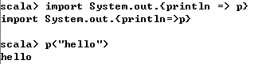
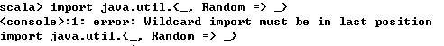
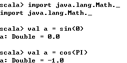

##【Scala】Scala之Packaging and Imports

##
##一、前言

##
##　　前面介绍了Scala的Object，由于中间论文的时间耽误了些时间，接着继续学习Scala的Packaging和Imports

##
##二、Packaging and Imports

##
##　　Scala的包用法与Java类似，但更灵活。在class文件顶端使用package语法，并且可以使用带中括号的package语法，与Java相比，Scala的导入有如下特点

##
##　　　　· 可在任何地方使用import声明

##
##　　　　· 可导入类、包、对象

##
##　　　　· 对导入的成员隐藏或者重命名

##
##　　并且在Scala中，隐式导入了java.lang._和scala.lang._两个包，_与Java中的*一样，表示导入包下所有的类，除了上述两个包，scala.Predef对象也被隐式导入，可以详细阅读Predef的源代码，里面包含了很多Scala的语法

##
##　　2.1 带有中括号符号的包

##
##　　1. 问题描述

##
##　　你想使用一个嵌套风格的包符号，类似于C++和C#命名空间的符号

##
##　　2. 解决方案

##
##　　将类放置在有中括号的包名中，如下所示　

	package com.hust.grid {
    class Foo { override def toString = "I am com.hust.grid.Foo" 	}
	}


##
##　　类的规范名字是com.hust.grid.Foo，其等效于如下代码

	package com.hust.grid 

class Foo { override def toString = "I am com.hust.grid.Foo" 	}


##
##　　使用这种方法，可以在一个文件中放置多个package，也可以使用“中括号”风格嵌套包

##
##　　下面示例展示了三个不同的Foo类，Foo类在不同的包中　　

	// a package containing a class named Foo
package orderentry {
    class Foo { override def toString = "I am orderentry.Foo" 	}
	}

// one package nested inside the other
package customers {
    class Foo { override def toString = "I am customers.Foo" 	}
    
    package database {
        // this Foo is different than customers.Foo or orderentry.Foo
        class Foo { override def toString = "I am customers.database.Foo" 	}
    	}
	}

// a simple object to test the packages and classes
object PackageTests extends App {
    println(new orderentry.Foo)
    println(new customers.Foo)
    println(new customers.database.Foo)
	}


##
##　　输出结果如下　

	I am orderentry.Foo
I am customers.Foo
I am customers.database.Foo


##
##　　3. 讨论

##
##　　可以使用在文件顶端声明包名，但是也可以使用带中括号风格的包名来将多个类和包放置在同一个文件下

##
##　　2.2 导入一个或多个成员

##
##　　1. 讨论

##
##　　你想要将一个或多个成员导入到当前程序的作用域中

##
##　　2. 解决方案

##
##　　下面是导入一个类的语法　

	import java.io.File


##
##　　你可以导入多个类　

	import java.io.File
import java.io.IOException
import java.io.FileNotFoundException


##
##　　或者使用Scala的导入方式　

	import java.io.{File, IOException, FileNotFoundException	}


##
##　　或者导入java.io包下所有的类　　

	import java.io._


##
##　　_与Java中的通配符*含义相同

##
##　　3. 讨论

##
##　　Scala的导入比Java更的使用为灵活，在Scala中，你可以在任何地方放置导入申明，如Scala文件中可包含多个类或者包，此时，可以在不同的包中声明导入，使得具有不同的作用域　

	package foo

import java.io.File
import java.io.PrintWriter

class Foo {
    import javax.swing.JFrame // only visible in this class
    // ...
	}

class Bar {
    import scala.util.Random // only visible in this class
    // ...
	}


##
##　　你甚至可以在方法中、函数中、代码块中放置导入申明

	class Bar {
    def doBar = {
        import scala.util.Random
        println("")
    	}
	}


##
##　　2.3 对导入成员重命名

##
##　　1. 问题描述

##
##　　在导入成员时重命名成员以避免命名空间冲突或混淆

##
##　　2. 解决方案

##
##　　使用下面语法将成员进行重命名　　

	import java.util.{ArrayList => JavaList	}


##
##　　在代码中，可以使用如下方式使用　

	val list = new JavaList[String]


##
##　　也可以一次性重命名多个类　

	import java.util.{Date => JDate, HashMap => JHashMap	}


##
##　　当进行重命名后，之前的名字不能正常使用　

	// error: this won"t compile because HashMap was renamed
// during the import process
val map = new HashMap[String, String]


##
##　　3. 讨论

##
##　　重命名成员可以命名空间冲突或混淆　

	import java.util.{HashMap => JavaHashMap	}
import scala.collection.mutable.{Map => ScalaMutableMap	}


##
##　　你不仅可以重命名类，也可以重命名类的成员，如方法

##
##　　 

##
##　　2.4 在导入时隐藏类

##
##　　1. 问题描述

##
##　　当从同一包导入其他成员时，你想要隐藏一个或多个类

##
##　　2. 解决方案

##
##　　其类似于重命名，但是使用_符号代替重命名的名字，如下面示例隐藏了Random类，但是导入了java.util中的所有其他类

	import java.util.{Random => _, _	}


##
##　　其中，第一个_符号代表隐藏Random类，第二个_符号代码导入所有的其他类，并且导入通配符必须要放在最后，否则发生错误

##
##　　 

##
##　　若需要隐藏多个成员，可以使用如下做法

	import java.util.{List => _, Map => _, Set => _, _	}


##
##　　2.5 使用静态导入

##
##　　1. 问题描述

##
##　　你想要像Java静态导入那样导入成员，以便可以直接使用成员名字，而不需要加类名的前缀

##
##　　2. 解决方案

##
##　　使用下面方法导入java.Math中所有的成员

	import java.lang.Math._


##
##　　此时，你就可以不需要加前缀来使用Math类中的成员

##
##　　 

##
##　　2.6 在任何地方使用Import申明

##
##　　1. 问题描述

##
##　　你想要在任何地方使用import申明，以便控制作用域和管理代码

##
##　　2. 解决方案

##
##　　你可以在类定义之前使用导入，然后在类中使用

	package foo

import scala.util.Random

class ImportTests {
    def printRandom {
        val r = new Random
    	}
	}


##
##　　也可以在类中导入　

	package foo

class ImportTests {
    import scala.util.Random
    def printRandom {
        val r = new Random
    	}
	}


##
##　　这使得import的作用域在类中，也可以将import的作用域限制在方法中　

	def getRandomWaitTimeInMinutes: Int = {
    import com.alvinalexander.pandorasbox._
    val p = new Pandora
    p.release
	}


##
##　　还可以将import作用域控制在代码块中

	def printRandom {
    {
        import scala.util.Random
        val r1 = new Random // this is fine
    	}
    val r2 = new Random // error: not found: type Random
	}


##
##　　3. 讨论

##
##　　import是按照顺序读取的，放置import的位置也决定了其作用域

	// this doesn"t work because the import is after the attempted reference
class ImportTests {
    def printRandom {
        val r = new Random // fails
    	}
	}
import scala.util.Random


##
##　　当文件中包含多个类和包时，你可以结合import申明和包引入方法来限制import语句的作用域

	package orderentry {
    import foo._
    // more code here ...
	}

package customers {
    import bar._
    // more code here ...
    package database {
        import baz._
        // more code here ...
    	}
	}


##
##三、总结

##
##　　本篇博文讲解了Scala中的包和导入方面的知识点，最主要的就是作用域问题，知识点也相对简单，也谢谢各位园友的观看~