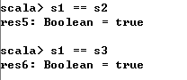
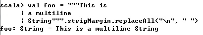
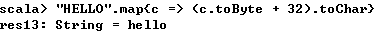
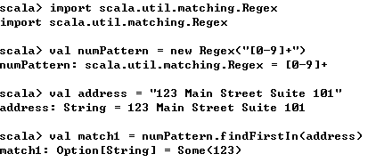

**一、前言**

大数据领域的Spark、Kafka、Summingbird等都是由Scala语言编写而成，相比Java而言，Scala更精炼。由于笔者从事大数据相关的工作，所以有必要好好学习Scala语言，之前也学习过，但是没有记录，所以就会忘记，感觉Scala确实比Java方便精炼很多，下面以Scala
Cookbook英文版作为参考资料，从头到尾梳理Scala相关知识点，也加深印象。PS：这是在研究Zookeeper源码的间隙中交叉学习，不至于总是看源码太枯燥。

**二、String**

在Scala的REPL环境中测试String的类型，可以发现其就是Java中的String。

所以可以使用Java中String的所有方法，如获取字符串的长度、连接多个字符串。在Scala中，由于String可以被隐式转化成StringOps类型，可将字符串看成一个字符序列，并且可以使用foreach方法遍历字符串的每个字符。

也可将字符串当成字符序列，使用for循环遍历每个字符

同理，也可将字符串当前字节序列，使用for循环遍历

由于字符串可以当成字符顺序集合(字符序列)，而在集合上可进行多种操作，如filter

可以看到对字符串进行了过滤，去掉了l字符。filter方法是StringOps的方法，由于String会被隐式的转化为StringOps，因此可以调用此方法。

对于该隐式转化，是在Perdef对象中定义。

    
    
      @inline implicit def augmentString(x: String): StringOps =  new StringOps(x)

**向封闭类中添加方法**

在Java中，String被定义成final的，即无法继承String类或者添加任何方法，但在Scala中，我们可以通过隐式转化添加方法，下面例子展示了Scala的String拥有String的特性和集合的特性。

其中，drop方法和take方法都是Scala的序列(集合)的方法，而capitalize方法则是StringOps的方法，这种调用都是通过隐式转化完成的。

2.1 测试String的相等性

1\. 问题描述

你需要比较两个字符串以判断它们是否相等，或者它们包含相同的字符序列。

2\. 解决方案

定义了如下字符串s1、s2、s3

使用"=="进行相等性判断

可以看到s1、s2、s3均相等，而对于一个好的"=="方法而言，即便是有参数为空，也不会抛出异常。

若在比较过程中不区分大小写，则可将字符串转化成大写或小写进行比较。

然而，在对空字符串调用toUpperCase方法会抛出异常。

在Java中，想要比较不区分大小写比较两个字符串是否相等，则使用equalsIgnoreCase方法

3\. 讨论

在Scala中，我们使用==方法来判定对象的相等性，这与Java不同，Java使用equals方法判定两个对象的相等性，==
是比较两个对象是否是同一个对象(内存地址相同)。在Scala中，==
方法在AnyRef(所有引用类型的父类)中定义，其首先会检查空值，然后再调用第一个对象的equals方法进行比较，因此，当比较两个字符串是否相等时，我们不需要检查空值。

2.2 创建多行字符串

1\. 问题描述

在Scala源码中想要创建多行字符串。

2\. 解决方案

在Scala中，你可以使用三个双引号来创建多行字符串。

    
    
        val s1 = """This is
            a multiline
            String
          """
        println(s1)

3\. 讨论

使用上述方法可以创建多行字符串，但是当打印时，其结果如下

    
    
    This is
            a multiline
            String

第二行和第三行是以空格开头，若需要使第二行、第三行的字符串都不以空格开头，则可进行如下处理。

    
    
        val s1 =
          """
            |This
            |is a multiline
            |String
          """.stripMargin
        
        println(s1)

结果如下

    
    
    This
    is a multiline
    String

即通过|来处理，或者使用其他符号，如#，同时使用stripMargin方法。

    
    
        val s1 = """This is
            #a multiline
            #String
          """.stripMargin("#")
        println(s1)

结果如下

    
    
    This is
    a multiline
    String

上述例子中，在第一行is和第二行multiline后面均隐藏了\n字符进行换行，当需要将多行字符串合并为一行时，可以在使用stripMargin方法之后使用replaceAll方法来将所有的\n替换为"
"。

另外，在三引号字符串中可以包含特殊字符，而并不需要转义符进行转义。

2.3 分割字符串

1\. 问题描述

你需要使用分割字符来分割字符串，如从逗号分隔（CSV）或管道分隔的文件中获取字符串。

2\. 解决方案

可以使用String的split方法进行分割

split方法会返回String数组。

3\. 讨论

split函数的参数可以是正则表达式，所以对于CSV文件，你可以使用逗号进行分割字符串。

可以看到，通过","进行分割时，结果中还包含了一些空格，如" milk", " butter", " Coco
Puffs"，此时，需要使用trim函数来去掉空格。

我们也可以使用正则表达式来分割字符串

split方法是重载的，一部分从Java的String而来，一部分从Scala的StringLike而来，例如，你可以使用字符而非字符串作为参数来调用split，此时，你使用的是StringLike的方法

此时，使用字符和字符串作为参数两者的结果是相同的。

2.4 将变量替换成字符串

1\. 问题描述

如同Perl、PHP、Ruby一样，你需要将变量替换成字符串。

2\. 解决方案

为在Scala中使用字符串插值，字符串前面需要使用字母s，同时需要将变量包含在字符串中，而每个变量名前面是一个$字符。

当在字符串前面使用字母s时，表示正在创建一个已处理的字符串字面量，即可以在字符串中直接使用变量。

**字符串字面量中使用表达式**

除了在字符串中使用变量外，同样也可以在字符串中使用表达式，此时表达式需要放在中括号内。

也可以使用中括号打印对象的属性。

**s是一个方法**

放在字符串字面量前面的s实际上是一个方法，而使用s方法可以让你享受如下便利

· Scala提供了其他现成的插值函数

· 你可自定义字符串插值函数

**f字符串插值(printf格式)**

在讨论中提到，weight被打印成65，但是如果需要在weight后面增加多位小数点应该怎么做，可以使用f字符串插值方法，其可以格式化字符串中的说明符。

为使用f字符串插值，首先需要在字符串前面添加f，然后在变量后面使用printf格式化说明符。

**粗插值**

除了使用s和f插值方法外，Scala还包括了粗插值方法，其会保留字符串中的特殊字符。

可以看到使用raw修饰字符串时，其会保留字符串中的特殊字符。

下表列出了最常用的说明符

2.5 一次处理字符串的一个字符

1\. 问题描述

你需要遍历字符串的每个字符，并且对每个字符做相应的操作。

2\. 解决方案

可以使用map方法、foreach方法、for循环等方法来遍历字符串。

或者使用下划线的方式

对于字符串的字符序列，你可以使用链式调用来得到想要的结果，在下面的示例中，filter方法用于原始的字符串来生成新的字符串(去掉所有的字符l)，然后再调用map方法将新生成的字符串转化为大写。

使用for循环和yield也可以达到map方法的效果

map方法、for和yield方法可以将旧的集合转化为新的集合，而foreach方法则是对集合的每个元素进行操作，不会产生新的结果。

3\. 讨论

由于Scala将字符串当成是字符序列，而Scala也是面向对象和函数编程语言，在Java中，你可以使用如下方法来遍历字符串中的每个字符

    
    
    String s = "hello"
    for (int i = 0; i < s.length(); i++) {
        char c = s.charAt(i);
        System.out.println(c);    
    }

**理解map方法的工作机制**

在map方法中，你可以传入一大段代码块

上述功能是将字符串的字符由大写变换成小写，由于是调用的String的map方法，因此每次只会处理字符串的一个字符，map会将String当成一个字符顺序集合，map方法有一个隐式循环，在此循环中，每次只会传入一个字符。除了在map方法中直接传入代码块外，也可以先定义好函数，然后再传入map，这样可以保证代码的简洁性。

并且也可以在for循环和yield中使用该方法

除了使用方法方式外，还可以使用函数方式来完成上述的操作

2.6 在字符串中查找模式

1\. 问题描述

你需要确定字符串是否包含正则表达式模式。

2\. 解决方案

通过String的.r方法来创建一个Regex对象，之后当查找第一个匹配时，使用findFirstIn方法，而查找所有匹配时，使用findAllIn方法。

对于findAllIn方法而言，可以将结果转化成Array、List、Seq等

3\. 讨论

使用字符串的.r方法是创建Regex对象最简单的方式，另外一种方式是导入Regex类，创建一个Regex实例，之后使用实例的方法

**处理findFirstIn返回的结果**

findFirstIn查找第一个匹配并且返回一个Option[String]

Option/Some/None类型将会在之后的章节进行讨论，可以简单的认为Option是一个容器，它要么持有0或者一个值，对于findFirstIn，成功时会返回Some("123")，不成功时会返回None

返回类型为Option[String]的方法要么返回Some(String)，要么返回None

针对Option类型，想要获取其值，可以使用如下方法

· getOrElse

· 使用foreach

· 使用匹配表达式

使用getOrElse方法，你可以尝试获取值，或者失败时定义缺省值

使用foreach方法如下

使用匹配表达式方法如下

2.7 字符串的替换模式

1\. 问题描述

你需要要在字符串中搜索正则表达式模式，并替换它们。

2\. 解决方案

由于String是不可变的，所以你不能直接在字符串上进行查找并替换的操作，但是你可以创建包含替换内容的新字符串，可以使用replaceAll方法，要记得将结果赋值

也可创建一个正则表达式，然后调用replaceAllIn方法，同样要记得将结果赋值给新的字符串

也可以调用replaceFirstIn来替换第一个匹配值，同样要记得将结果赋值给新的字符串

2.8 提取模式匹配的字符串部分

1\. 问题描述

你需要提取字符串的一个或多个匹配正则达表达式的部分。

2\. 解决方案

首先定义提取的正则表达式模式，然后将它们放置在括号里面形成正则表达式组

上述示例从指定字符串中提取了数字部分和字母部分，并且分别赋值给count和fruit。

3\. 讨论

上述示例的语法可能有点古怪，似乎是将模式两次定义成val字段，但是这种语法很便捷并且可读性很高，可以试想你在编写一个搜索引擎，你想让人们用各种各样的短语搜索电影，你可以让他们输入任何这些短语来获得电影列表

你可以定义一系列的正则表达式进行匹配，例如

    
    
    // match "movies 80301"
    val MoviesZipRE = "movies (\\d{5})".r
    
    // match "movies near boulder, co"
    val MoviesNearCityStateRE = "movies near ([a-z]+), ([a-z]{2})".r

之后可以根据用户的输入进行匹配，然后获取搜索结果，伪代码如下

    
    
    textUserTyped match {
    case MoviesZipRE(zip) => getSearchResults(zip)
    case MoviesNearCityStateRE(city, state) => getSearchResults(city, state)
    case _ => println("did not match a regex")
    }

上述的正则表达式可以匹配如下字符串

在匹配时，需要考虑所有情况，如case _ 表示不能匹配，如下字符串将无法匹配

2.9 访问字符串的字符

1\. 问题描述

你想要获取字符串中特定位置的字符。

2\. 解决方案

可以使用Java的charAt方法

另外，一种更好的方法是数组表示法

3\. 讨论

当map方法和foreach不适用时，可以将String看做Array类型，然后使用数组表示法来访问字符，Scala中的数组表示法不同于Java的数组表示法，因为在Scala中，数组表示法是一个方法调用。

在调用数组表示法时实际上调用的是apply方法，，但是由于Scala语法糖的存在，可以直接使用数组表示法获取指定字符。

2.10 向String类添加自定义方法

1\. 问题描述

你想要向字符串类添加自定义方法，如"HAL".increment，而非使用工具类StringUtilities的increment方法。  

2\. 解决方案

可以定义一个隐式类，然后在类中定义你想要添加的方法

在实际的编码中会稍微复杂一点，因为隐式类需要必须要被定义在可以被定义方法的作用域中，这意味着隐式类必须定义在class、object、package
object中。

    
    
    package com.leesf.utils
    
    object StringUtils {
        implicit class StringImprovements(val s: String) {
            def increment = s.map(c => (c + 1).toChar)
        }
    }    

在使用时，需要导入com.leesf.utils.StringUtils

    
    
    package foo.bar
    
    import com.leesf.utils.StringUtils._
    
    object Main extends App {
        println("HAL".increment)
    }

还可将隐式类放在包对象中

    
    
    package com.leesf
    
    package object utils {
        implicit class StringImprovements(val s: String) {
            def increment = s.map(c => (c + 1).toChar)
        }
    }    

在使用时，需要导入com.leesf.utils

    
    
    package foo.bar
    
    import com.leesf.utils._
    
    object MainDriver extends App {
        println("HAL".increment)
    }

针对Scala2.10前的版本，与上述做法有稍许不同，首先需要在普通的类中定义increment方法

    
    
    class StringImprovements(val s: String) {
        def increment = s.map(c => (c + 1).toChar)
    }

然后定义隐式方法进行转化

    
    
    implicit def stringToString(s: String) = new StringImprovements(s)

3\. 讨论

在Scala中，你可以通过隐式转化向封闭的类添加新的方法，并且在使用时导入，而不需要继承该类来添加方法（有些final类根本不能继承）。

三、总结

本篇博文讲解了Scala中的String知识点，其也是在Scala编程中使用频率非常高的知识点，对其进行了梳理，加深了印象，也谢谢各位园友的观看~

