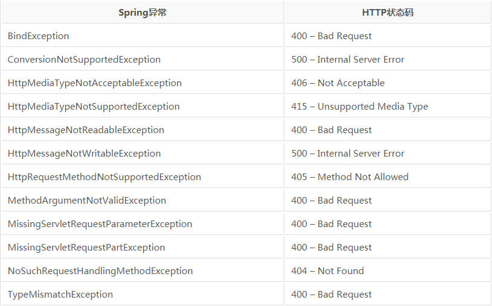

##【Spring】Spring MVC高级技术前言

##
##前面学习了简单的Spring Web知识，接着学习更高阶的Web技术。高级技术Spring MVC配置的替换方案自定义DispatcherServlet配置

##
##在第五章我们曾编写过如下代码。public class SpitterWebInitializer extends AbstractAnnotationConfigDispatcherServletInitializer {    @Override    protected Class<?>[] getRootConfigClasses() {        return new Class<?>[] { RootConfig.class 	};    	}    @Override    protected Class<?>[] getServletConfigClasses() {        return new Class<?>[] { WebConfig.class 	};    	}    @Override    protected String[] getServletMappings() {        return new String[] { "/" 	};    	}	}

##
##可以看到SpitterWebinitializer实现了AbstractAnnotationConfigDispatcherServletInitializer抽象类，并重写了三个必须的方法，实际上还可对更多方法进行重写，以便实现额外的配置，如对customizeRegistration方法进行重写，该方法是AbstractDispatcherServletInitializer的方法，无实际的方法体。当AbstractAnnotationConfigDispatcherServletInitializer将DispatcherServlet注册到Servlet容器中后，就会调用customizeRegistration方法，并将Servlet注册后得到的Registration.Dynamic传入。可通过重写customizeRegistration方法设置MultipartConfigElement，如下所示。    @Override    protected void customizeRegistration(Dynamic registration) {        registration.setMultipartConfig(                new MultipartConfigElement("/tmp/spittr/uploads"));    	}添加其他Servlet和Filter

##
##AbstractAnnotationConfigDispatcherServletInitializer会创建DispatcherServlet和ContextLoaderListener，当需要添加其他Servlet和Filter时，只需要创建一个新的初始化器即可，最简单的方式是实现WebApplicationInitializer接口。import org.springframework.web.WebApplicationInitializer;import javax.servlet.FilterRegistration;import javax.servlet.ServletContext;import javax.servlet.ServletException;import javax.servlet.ServletRegistration.Dynamic;public class MyServletInitializer implements WebApplicationInitializer {    public void onStartup(ServletContext servletContext) throws ServletException {        Dynamic servlet = servletContext.addServlet("myServlet", MyServlet.class);        servlet.addMapping("/custom/**");        FilterRegistration.Dynamic filter = servletContext.addFilter("myFilter", MyFilter.class);        filter.addMappingForUrlPatterns(null, false, "/custom/*");    	}	}在xml文件中声明DispatcherServlet

##
##对基本的Spring MVC应用而言，需要配置DispatcherServlet和ContextLoaderListener，web.xml配置如下。<web-app>  <display-name>Archetype Created Web Application</display-name>  <context-param>    <param-name>contextConfigLocation</param-name>    <param-value>/WEB-INF/spring/root-context.xml</param-value>  </context-param>    <listener>    <listener-class>org.springframework.web.context.ContextLoaderListener</listener-class>  </listener>    <servlet>    <servlet-name>appServlet</servlet-name>    <servlet-class>org.springframework.web.servlet.DispatcherServlet</servlet-class>    <load-on-startup>1</load-on-startup>  </servlet>    <servlet-mapping>    <servlet-name>appServlet</servlet-name>    <url-pattern>/</url-pattern>  </servlet-mapping>  </web-app>

##
##可以看到在web.xml中配置了DispatcherServlet和ContextLoaderListener，并且定义了上下文，该上下文会被ContextLoaderListener加载，从中读取bean。也可指定DispatcherServlet的应用上下文并完成加载，配置web.xml如下。  <servlet>    <servlet-name>appServlet</servlet-name>    <servlet-class>org.springframework.web.servlet.DispatcherServlet</servlet-class>    <init-param>      <param-name>contextConfigLocation</param-name>      <param-value>WEB-INF/spring/appServlet/servlet-context.xml</param-value>    </init-param>    <load-on-startup>1</load-on-startup>  </servlet>

##
##上面使用DispatcherServlet和ContextLoaderListener加载各自的上下文，但实际情况中，基于Java的配置更为通用，此时只需要配置DispatcherServlet和ContextLoaderListener使用AnnotationConfigWebApplicationContext，这样它便可加载Java配置类，而非使用xml，可设置contextClass和DispathcerServlet的初始化参数，如下所示。<web-app>  <display-name>Archetype Created Web Application</display-name>  <context-param>    <param-name>contextClass</param-name>    <param-value>org.springframework.web.context.support.AnnotationConfigWebApplicationContext</param-value>  </context-param>  <context-param>    <param-name>contextConfigLocation</param-name>    <param-value>ch7.RootConfig</param-value>  </context-param>    <listener>    <listener-class>org.springframework.web.context.ContextLoaderListener</listener-class>  </listener>    <servlet>    <servlet-name>appServlet</servlet-name>    <servlet-class>org.springframework.web.servlet.DispatcherServlet</servlet-class>    <init-param>      <param-name>contextClass</param-name>      <param-value>org.springframework.web.context.support.AnnotationConfigWebApplicationContext</param-value>    </init-param>        <init-param>      <param-name>contextConfigLocation</param-name>      <param-value>ch7.WebConfig</param-value>    </init-param>    <load-on-startup>1</load-on-startup>  </servlet>    <servlet-mapping>    <servlet-name>appServlet</servlet-name>    <url-pattern>/</url-pattern>  </servlet-mapping></web-app>处理multipart形式数据

##
##处理multipart数据主要用于处理文件上传操作。需要配置multipart解析器读取multipart请求。配置multipart解析器

##
##DispatcherServlet并未实现任何解析multipart请求数据功能，它只是将任务委托给MultipartResolver策略接口实现，通过该实现解析multipart请求内容，Spring中内置了CommonsMultipartResolver和StandardServletMultipartResolver两个解析器。使用StandardServletMultipartResolver

##
##使用Java配置如下@Overrideprotected void customizeRegistration(Dynamic registration) {    registration.setMultipartConfig(new MultipartConfigElement("/tmp/spittr/uploads", 2 * 1024 * 1024, 4 * 1024 * 1024, 0));	}

##
##使用xml配置如下，在servlet标签中配置multipart-config。      <multipart-config>        <location>/tmp/spittr/uploads</location>        <max-file-size>2 * 1024 * 1024</max-file-size>        <max-request-size>4 * 1024 * 1024</max-request-size>      </multipart-config>使用CommonsMultipartResolver

##
##使用Java配置如下    @Bean    public MultipartResolver multipartResolver() throws IOException {        CommonsMultipartResolver commonsMultipartResolver = new CommonsMultipartResolver();        commonsMultipartResolver.setUploadTempDir(new FileSystemResource("/tmp/spittr/uploads"));        return commonsMultipartResolver;    	}处理multipart请求

##
##可在控制器的方法参数上添加@RequestPart注解，如下所示。@RequestMapping(value="/register", method=POST)public String processRegistration(    @RequestPart("profilePicture") byte[] profilePicture,    @Valid Spittr spitter,    Errors errors) {    profilePicture.transferTo(new File("/data/spittr" + profilePicture.getOriginalFilename()));	}处理异常

##
##Spring提供了多种方式将异常转换为响应特定的异常将会自动映射为指定的HTTP状态码。异常上可以添加@ResponseStatus注解，从而将其映射为某个HTTP状态码。在方法上可添加@ExceptionHandler注解，使其用来处理异常。将异常映射为HTTP状态码

##
##Spring异常与状态码对应关系如下。

##
## 编写异常处理方法

##
##可在请求中直接使用try/catch处理异常，其与正常Java方法中的try/catch相同，同时，也可编写处理器来处理特定异常，当出现特定异常时，将有处理器委托方法进行处理。@ExceptionHandler(DuplicateSpittleException.class)public String handleDuplicateSpittle() {    return "error/duplicate";	}为控制器添加通知

##
##控制器通知是任意带有@ControllerAdvice注解的类，该类包含如下类型的一个或多个方法。@ExceptionHandler注解标注的方法。@InitBinder注解标注的方法。@ModelAttribute注解标注的方法。

##
##上面方法会运用到整个应用程序所有控制器中带有@RequestMapping注解的方法上。@ControllerAdvicepublic class AppWideExceptionHandler {    @ExceptionHandler(DuplicateSpittleException.class)    public String duplicateSpittleHandler() {        return "error/duplicate";    	}	}

##
##经过上述配置，任意控制器方法抛出了DuplicateSpittleException异常，都会调用这个duplicateSpittleHandler方法处理异常。跨重定向请求传递数据

##
##对于重定向而言，若需要从发起重定向的方法传递数据给处理重定向方法中，有如下两种方法使用URL模版以路径变量和/或查询参数形式传递数据。通过flash属性发送数据。通过URL模版进行重定向

##
##如前面讲到的通过redirect:/spitter/{username	}进行重定向，该方法会直接根据username确定url，并非十分安全的做法，可使用进行如下处理。model.addAttribute("username", spitter.getUsername());return "redirect:/spitter/{username	}";

##
##当需要传递参数，如id时，可进行如下处理。model.addAttribute("username", spitter.getUsername());model.addAttribute("spitterId", spitter.getId());return "redirect:/spitter/{username	}";

##
##若username为leesf；id为123456。这样访问的url为/spitter/leesf?spitterId=123456。这种方法只能传递简单的值，无法发送更为复杂的值，此时需要使用flash属性。使用flash属性

##
##通过RedirectAttributes设置flash属性，这样可直接传递对象。@ReuqestMapping(value="/register", method=POST)public String processRegistration(Spitter spitter, RedirectAttributes model) {    spitterRepository.save(spitter);    model.addAttribute("username", spitter.getUsername());    model.addFlashAttribute("spitter", spitter);    return "redirect:/spitter/{username	}";	}

##
##这样spitter对象也被传递到重定向页面中，可直接访问spitter对象。总结

##
##本篇博文讲解了如何配置DispatcherServlet和ContextLoaderListener，以及如何处理异常和控制器通知，最后分析如何在重定向时传递数据。