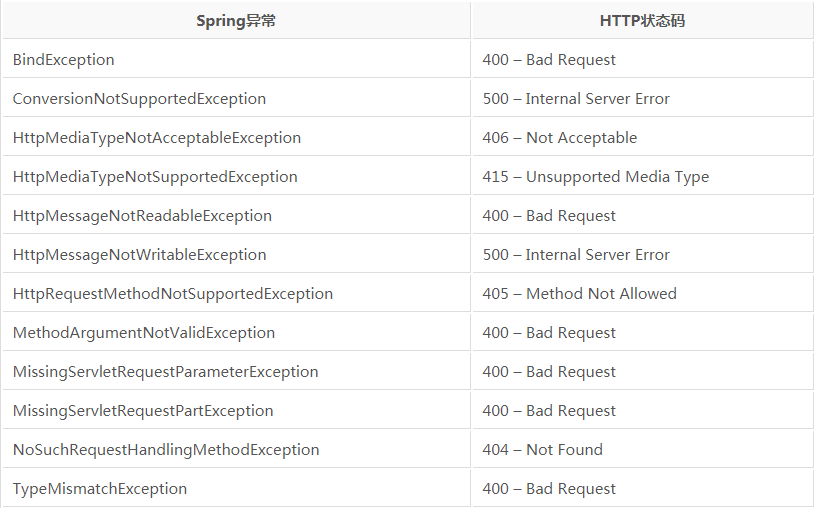

## 前言

> 前面学习了简单的`Spring Web`知识，接着学习更高阶的`Web`技术。

## 高级技术

### Spring MVC配置的替换方案

#### 自定义DispatcherServlet配置

在第五章我们曾编写过如下代码。

    
    
    public class SpitterWebInitializer extends AbstractAnnotationConfigDispatcherServletInitializer {
    
        @Override
        protected Class<?>[] getRootConfigClasses() {
            return new Class<?>[] { RootConfig.class };
        }
    
        @Override
        protected Class<?>[] getServletConfigClasses() {
            return new Class<?>[] { WebConfig.class };
        }
    
        @Override
        protected String[] getServletMappings() {
            return new String[] { "/" };
        }
    
    }
    

可以看到`SpitterWebinitializer`实现了`AbstractAnnotationConfigDispatcherServletInitializer`抽象类，并重写了三个必须的方法，实际上还可对更多方法进行重写，以便实现额外的配置，如对`customizeRegistration`方法进行重写，该方法是`AbstractDispatcherServletInitializer`的方法，无实际的方法体。当`AbstractAnnotationConfigDispatcherServletInitializer`将`DispatcherServlet`注册到`Servlet`容器中后，就会调用`customizeRegistration`方法，并将`Servlet`注册后得到的`Registration.Dynamic`传入。可通过重写`customizeRegistration`方法设置`MultipartConfigElement`，如下所示。

    
    
        @Override
        protected void customizeRegistration(Dynamic registration) {
            registration.setMultipartConfig(
                    new MultipartConfigElement("/tmp/spittr/uploads"));
        }
    

#### 添加其他Servlet和Filter

`AbstractAnnotationConfigDispatcherServletInitializer`会创建`DispatcherServlet`和`ContextLoaderListener`，当需要添加其他`Servlet`和`Filter`时，只需要创建一个新的初始化器即可，最简单的方式是实现`WebApplicationInitializer`接口。

    
    
    import org.springframework.web.WebApplicationInitializer;
    
    import javax.servlet.FilterRegistration;
    import javax.servlet.ServletContext;
    import javax.servlet.ServletException;
    import javax.servlet.ServletRegistration.Dynamic;
    
    public class MyServletInitializer implements WebApplicationInitializer {
    
        public void onStartup(ServletContext servletContext) throws ServletException {
            Dynamic servlet = servletContext.addServlet("myServlet", MyServlet.class);
            servlet.addMapping("/custom/**");
    
            FilterRegistration.Dynamic filter = servletContext.addFilter("myFilter", MyFilter.class);
            filter.addMappingForUrlPatterns(null, false, "/custom/*");
    
        }
    }
    

#### 在xml文件中声明DispatcherServlet

对基本的`Spring
MVC`应用而言，需要配置`DispatcherServlet`和`ContextLoaderListener`，`web.xml`配置如下。

    
    
    <web-app>
      <display-name>Archetype Created Web Application</display-name>
      <context-param>
        <param-name>contextConfigLocation</param-name>
        <param-value>/WEB-INF/spring/root-context.xml</param-value>
      </context-param>
      
      <listener>
        <listener-class>org.springframework.web.context.ContextLoaderListener</listener-class>
      </listener>
      
      <servlet>
        <servlet-name>appServlet</servlet-name>
        <servlet-class>org.springframework.web.servlet.DispatcherServlet</servlet-class>
        <load-on-startup>1</load-on-startup>
      </servlet>
      
      <servlet-mapping>
        <servlet-name>appServlet</servlet-name>
        <url-pattern>/</url-pattern>
      </servlet-mapping>
      
    </web-app>
    

可以看到在`web.xml`中配置了`DispatcherServlet`和`ContextLoaderListener`，并且定义了上下文，该上下文会被`ContextLoaderListener`加载，从中读取`bean`。也可指定`DispatcherServlet`的应用上下文并完成加载，配置`web.xml`如下。

    
    
      <servlet>
        <servlet-name>appServlet</servlet-name>
        <servlet-class>org.springframework.web.servlet.DispatcherServlet</servlet-class>
        <init-param>
          <param-name>contextConfigLocation</param-name>
          <param-value>WEB-INF/spring/appServlet/servlet-context.xml</param-value>
        </init-param>
        <load-on-startup>1</load-on-startup>
      </servlet>
    

上面使用`DispatcherServlet`和`ContextLoaderListener`加载各自的上下文，但实际情况中，基于`Java`的配置更为通用，此时只需要配置`DispatcherServlet`和`ContextLoaderListener`使用`AnnotationConfigWebApplicationContext`，这样它便可加载`Java`配置类，而非使用`xml`，可设置`contextClass`和`DispathcerServlet`的初始化参数，如下所示。

    
    
    <web-app>
      <display-name>Archetype Created Web Application</display-name>
      <context-param>
        <param-name>contextClass</param-name>
        <param-value>org.springframework.web.context.support.AnnotationConfigWebApplicationContext</param-value>
      </context-param>
    
      <context-param>
        <param-name>contextConfigLocation</param-name>
        <param-value>ch7.RootConfig</param-value>
      </context-param>
      
      <listener>
        <listener-class>org.springframework.web.context.ContextLoaderListener</listener-class>
      </listener>
      
      <servlet>
        <servlet-name>appServlet</servlet-name>
        <servlet-class>org.springframework.web.servlet.DispatcherServlet</servlet-class>
        <init-param>
          <param-name>contextClass</param-name>
          <param-value>org.springframework.web.context.support.AnnotationConfigWebApplicationContext</param-value>
        </init-param>
        
        <init-param>
          <param-name>contextConfigLocation</param-name>
          <param-value>ch7.WebConfig</param-value>
        </init-param>
        <load-on-startup>1</load-on-startup>
      </servlet>
      
      <servlet-mapping>
        <servlet-name>appServlet</servlet-name>
        <url-pattern>/</url-pattern>
      </servlet-mapping>
    
    </web-app>
    

### 处理multipart形式数据

处理`multipart`数据主要用于处理文件上传操作。需要配置`multipart`解析器读取`multipart`请求。

#### 配置multipart解析器

`DispatcherServlet`并未实现任何解析`multipart`请求数据功能，它只是将任务委托给`MultipartResolver`策略接口实现，通过该实现解析`multipart`请求内容，`Spring`中内置了`CommonsMultipartResolver`和`StandardServletMultipartResolver`两个解析器。

  * 使用StandardServletMultipartResolver

使用`Java`配置如下

    
    
    @Override
    
    protected void customizeRegistration(Dynamic registration) {
        registration.setMultipartConfig(new MultipartConfigElement("/tmp/spittr/uploads", 2 * 1024 * 1024, 4 * 1024 * 1024, 0));
    }
    

使用`xml`配置如下，在`servlet`标签中配置`multipart-config`。

    
    
          <multipart-config>
            <location>/tmp/spittr/uploads</location>
            <max-file-size>2 * 1024 * 1024</max-file-size>
            <max-request-size>4 * 1024 * 1024</max-request-size>
          </multipart-config>
    

  * 使用CommonsMultipartResolver

使用`Java`配置如下

    
    
        @Bean
        public MultipartResolver multipartResolver() throws IOException {
            CommonsMultipartResolver commonsMultipartResolver = new CommonsMultipartResolver();
            commonsMultipartResolver.setUploadTempDir(new FileSystemResource("/tmp/spittr/uploads"));
    
            return commonsMultipartResolver;
        }
    

#### 处理multipart请求

可在控制器的方法参数上添加`@RequestPart`注解，如下所示。

    
    
    @RequestMapping(value="/register", method=POST)
    public String processRegistration(
        @RequestPart("profilePicture") byte[] profilePicture,
        @Valid Spittr spitter,
        Errors errors) {
        profilePicture.transferTo(new File("/data/spittr" + profilePicture.getOriginalFilename()));
    }
    

### 处理异常

`Spring`提供了多种方式将异常转换为响应

  * 特定的异常将会自动映射为指定的`HTTP`状态码。
  * 异常上可以添加`@ResponseStatus`注解，从而将其映射为某个`HTTP`状态码。
  * 在方法上可添加`@ExceptionHandler`注解，使其用来处理异常。

#### 将异常映射为HTTP状态码

`Spring`异常与状态码对应关系如下。

#### 编写异常处理方法

可在请求中直接使用`try/catch`处理异常，其与正常`Java`方法中的`try/catch`相同，同时，也可编写处理器来处理特定异常，当出现特定异常时，将有处理器委托方法进行处理。

    
    
    @ExceptionHandler(DuplicateSpittleException.class)
    public String handleDuplicateSpittle() {
        return "error/duplicate";
    }
    

### 为控制器添加通知

控制器通知是任意带有`@ControllerAdvice`注解的类，该类包含如下类型的一个或多个方法。

  * `@ExceptionHandler`注解标注的方法。
  * `@InitBinder`注解标注的方法。
  * `@ModelAttribute`注解标注的方法。

上面方法会运用到整个应用程序所有控制器中带有`@RequestMapping`注解的方法上。

    
    
    @ControllerAdvice
    public class AppWideExceptionHandler {
        @ExceptionHandler(DuplicateSpittleException.class)
        public String duplicateSpittleHandler() {
            return "error/duplicate";
        }
    }
    

经过上述配置，任意控制器方法抛出了`DuplicateSpittleException`异常，都会调用这个`duplicateSpittleHandler`方法处理异常。

### 跨重定向请求传递数据

对于重定向而言，若需要从发起重定向的方法传递数据给处理重定向方法中，有如下两种方法

  * 使用`URL`模版以路径变量和/或查询参数形式传递数据。
  * 通过`flash`属性发送数据。

#### 通过URL模版进行重定向

如前面讲到的通过`redirect:/spitter/{username}`进行重定向，该方法会直接根据`username`确定`url`，并非十分安全的做法，可使用进行如下处理。

    
    
    model.addAttribute("username", spitter.getUsername());
    return "redirect:/spitter/{username}";
    

当需要传递参数，如id时，可进行如下处理。

    
    
    model.addAttribute("username", spitter.getUsername());
    model.addAttribute("spitterId", spitter.getId());
    return "redirect:/spitter/{username}";
    

若`username`为`leesf`；`id`为`123456`。这样访问的`url`为`/spitter/leesf?spitterId=123456`。这种方法只能传递简单的值，无法发送更为复杂的值，此时需要使用`flash`属性。

#### 使用flash属性

通过`RedirectAttributes`设置`flash`属性，这样可直接传递对象。

    
    
    @ReuqestMapping(value="/register", method=POST)
    public String processRegistration(Spitter spitter, RedirectAttributes model) {
        spitterRepository.save(spitter);
        model.addAttribute("username", spitter.getUsername());
        model.addFlashAttribute("spitter", spitter);
        return "redirect:/spitter/{username}";
    }
    

这样`spitter`对象也被传递到重定向页面中，可直接访问`spitter`对象。

## 总结

本篇博文讲解了如何配置`DispatcherServlet`和`ContextLoaderListener`，以及如何处理异常和控制器通知，最后分析如何在重定向时传递数据。

