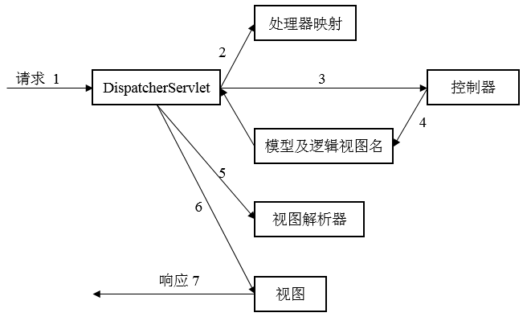

## 前言

> 学习了`Spring`的注解、`AOP`后，接着学习`Spring Web`，对于`Web`应用开发，`Spring`提供了`Web`框架。

## Web应用

### Spring MVC初探

> `MVC`为(`Model-View-Control`)，当用户在浏览器中点击链接或提交表单时，请求经历的流程大致如下。

  * `Spring MVC`所有的请求都会通过一个前端控制器(front controller servlet)，也即是`DispatcherServlet`，`DispatcherServlet`用于将请求发送给`Spring MVC`控制器，而`处理器映射`会根据`url`信息确定将请求发送给哪个控制器。
  * 当请求发送给控制器后，请求会等待控制器处理信息，更好的设计是控制器将请求交给服务对象处理。
  * 控制器处理完后，会产生信息，该信息需要返回给用户并在浏览器上显示，这些信息称为`模型(Model)`。同时，这些信息需要以用户友好的方式进行格式化，此时需要将信息发送给一个`视图(View)`进行处理。
  * `DispatcherServlet`拿到模型及逻辑视图名后会使用视图解析器进行解析，将其转化为特定视图实现。
  * 指定视图实现后，需要将模型数据数据交付，视图将使用模型数据渲染输出。

#### 配置DispatcherServlet

> `DispatcherServlet`是`Spring
MVC`的核心，其负责将请求路由到其他组件中。可通过将`Servlet`配置在`web.xml`中或者使用`Java`显示编码方式将`DispatcherServlet`配置在`Servlet`容器中，本例中设置的`SpittrWebAppInitializer`

    
    
    package ch5;
    
    
    import org.springframework.web.servlet.support.AbstractAnnotationConfigDispatcherServletInitializer;
    
    public class SpitterWebInitializer extends AbstractAnnotationConfigDispatcherServletInitializer {
    
        @Override
        protected Class<?>[] getRootConfigClasses() {
            return new Class<?>[] { RootConfig.class };
        }
    
        @Override
        protected Class<?>[] getServletConfigClasses() {
            return new Class<?>[] { WebConfig.class };
        }
    
        @Override
        protected String[] getServletMappings() {
            return new String[] { "/" };
        }
    
    }
    

>
其中`getServletMappings`方法会将一个或多个路径映射到`DispatcherServlet`上，`/`表示它是默认的`Servlet`，将会处理所有进入应用的请求。  
>
当`DispatcherServlet`启动时，会创建`Spring`应用上下文，并加载配置文件或配置类中所声明的`bean`，如上述`getServletConfigClasses`方法中返回的带有`@Configuration`注解的所有定义在`WebConfig`中的`bean`。与此同时，在`Spring
Web`应用中，还会有另一个由`ContextLoaderListener`创建的应用上下文，如`getRootConfigClasses`方法中返回的带有`@Configuration`注解的所有定义在`RootConfig`中的`bean`。`AbstractAnnotationConfigDispatcherServletInitializer`会同时创建`DispatcherServlet`和`ContextLoaderListener`两个应用上下文，`DispatcherServlet`应用上下文加载`Web`组件的`bean`，如`控制器`、`视图解析器`、`处理映射器`；`ContextLoaderListener`应用上下文加载其他`bean`，如`驱动应用后端的中间层`和`数据层组件`。

#### 配置Web组件并启动Spring MVC

> 可使用`<mvc:annotation-driven>`启动注解启动的`Spring
MVC`，也可使用`@EnableWebMvc`注解启动。`WebConfig`对应`Web`组件配置，其代码如下。

    
    
    package ch5;
    
    import org.springframework.context.annotation.Bean;
    import org.springframework.context.annotation.ComponentScan;
    import org.springframework.context.annotation.Configuration;
    import org.springframework.web.servlet.ViewResolver;
    import org.springframework.web.servlet.config.annotation.DefaultServletHandlerConfigurer;
    import org.springframework.web.servlet.config.annotation.EnableWebMvc;
    import org.springframework.web.servlet.config.annotation.ResourceHandlerRegistry;
    import org.springframework.web.servlet.config.annotation.WebMvcConfigurerAdapter;
    import org.springframework.web.servlet.view.InternalResourceViewResolver;
    
    @Configuration
    @EnableWebMvc
    @ComponentScan("ch5")
    public class WebConfig extends WebMvcConfigurerAdapter {
    
        @Bean
        public ViewResolver viewResolver() {
            InternalResourceViewResolver resolver = new InternalResourceViewResolver();
            resolver.setPrefix("/WEB-INF/views/");
            resolver.setSuffix(".jsp");
            return resolver;
        }
    
        @Override
        public void configureDefaultServletHandling(DefaultServletHandlerConfigurer configurer) {
            configurer.enable();
        }
    
        @Override
        public void addResourceHandlers(ResourceHandlerRegistry registry) {
            super.addResourceHandlers(registry);
        }
    
    }
    
    

>
其中配置了`JSP视图解析器`，也配置`静态资源处理器`(对静态资源的请求转发到`Servlet`容器中默认的`Servlet`，而不是使用`DispatcherServlet`处理)。

#### 配置非Web组件

> `RootConfig`对应非`Web`组件配置，其源码如下。

    
    
    package ch5;
    
    import org.springframework.context.annotation.ComponentScan;
    import org.springframework.context.annotation.ComponentScan.Filter;
    import org.springframework.context.annotation.Configuration;
    import org.springframework.context.annotation.FilterType;
    import org.springframework.web.servlet.config.annotation.EnableWebMvc;
    
    @Configuration
    @ComponentScan(basePackages = {"ch5"},
            excludeFilters = {
                    @Filter(type = FilterType.ANNOTATION, value = EnableWebMvc.class)
            })
    public class RootConfig {
    
    }
    
    

> 通过`RootConfig`的`ComponentScan`注解可以添加很多非`Web`组件，如`驱动应用后端的中间层`和`数据层组件`等。

### 控制器

>
控制器只是在方法上添加了`@RequestMapping`注解的类，该注解声明了它们所要处理的请求，如`HomeController`用来处理对`/`的请求，其源码如下。

    
    
    package ch5;
    
    import static org.springframework.web.bind.annotation.RequestMethod.*;
    
    import org.springframework.stereotype.Controller;
    import org.springframework.web.bind.annotation.RequestMapping;
    
    @Controller
    public class HomeController {
    
      @RequestMapping(value = "/", method = GET)
      public String home() {
        return "home";
      }
    
    }
    
    

> 至此，已经完成所有编码，可以启动该项目，可正确在浏览器中显示页面。

#### 测试控制器

> `Spring`提供了`mock Spring
MVC`来测试控制器`HTTP`请求，这样测试时就不用启动浏览器了。`HomeControllerTest`源码如下。

    
    
    package ch5;
    
    import org.junit.Test;
    import org.springframework.test.web.servlet.MockMvc;
    
    import static org.springframework.test.web.servlet.request.MockMvcRequestBuilders.get;
    import static org.springframework.test.web.servlet.result.MockMvcResultMatchers.view;
    import static org.springframework.test.web.servlet.setup.MockMvcBuilders.standaloneSetup;
    
    public class HomeControllerTest {
        @Test
        public void testHomePage() throws Exception {
            HomeController controller = new HomeController();
            MockMvc mockMvc = standaloneSetup(controller).build();
    
            mockMvc.perform(get("/")).andExpect(view().name("home"));
        }
    
    }
    
    

> 运行可顺利通过测试。

#### 定义类级别的请求处理

> 在前面的`HomeController`中，对于处理的请求路径是直接配置在方法上的，更好的处理是将其配置在类上，如下所示。

    
    
    package ch5;
    
    import static org.springframework.web.bind.annotation.RequestMethod.*;
    
    import org.springframework.stereotype.Controller;
    import org.springframework.web.bind.annotation.RequestMapping;
    
    @Controller
    @RequestMapping("/")
    public class HomeController {
    
      @RequestMapping(method = GET)
      public String home() {
        return "home";
      }
    
    }
    

> 上述配置在类上与前面配置在方法上的效果相同，还可配置多个路径，如下所示。

    
    
    package ch5;
    
    import static org.springframework.web.bind.annotation.RequestMethod.*;
    
    import org.springframework.stereotype.Controller;
    import org.springframework.web.bind.annotation.RequestMapping;
    
    @Controller
    @RequestMapping({"/", "/homepage"})
    public class HomeController {
    
      @RequestMapping(method = GET)
      public String home() {
        return "home";
      }
    
    }
    

> 上述代码中除了配置处理路径`/`外，还可处理`/homepage`路径。

#### 传递模型数据至视图

> 一般情况下，需要传递模型数据至视图中进行渲染，此时，定义接口`SpittleRepository`。

    
    
    package ch5;
    
    import java.util.List;
    
    public interface SpittleRepository {
        List<Spittle> findSpittles(long max, int count);
    }
    
    

> 定义接口`SpittleRepository`的实现子类`SpittoleRepositoryImp`。

    
    
    package ch5;
    
    import org.springframework.stereotype.Component;
    
    import java.util.ArrayList;
    import java.util.Date;
    import java.util.List;
    
    @Component
    public class SpittleRepositoryImp implements SpittleRepository {
        public List<Spittle> findSpittles(long max, int count) {
            List<Spittle> spittles = new ArrayList<Spittle>();
            for (int i = 0; i < count; i++) {
                spittles.add(new Spittle("Spittle " + i, new Date()));
            }
            return spittles;
        }
    }
    
    

> 定义`POJO`类`Spittle`。

    
    
    package ch5;
    
    import java.util.Date;
    
    import org.apache.commons.lang3.builder.EqualsBuilder;
    import org.apache.commons.lang3.builder.HashCodeBuilder;
    
    public class Spittle {
    
        private final Long id;
        private final String message;
        private final Date time;
        private Double latitude;
        private Double longitude;
    
        public Spittle(String message, Date time) {
            this(null, message, time, null, null);
        }
    
        public Spittle(Long id, String message, Date time, Double longitude, Double latitude) {
            this.id = id;
            this.message = message;
            this.time = time;
            this.longitude = longitude;
            this.latitude = latitude;
        }
    
        public long getId() {
            return id;
        }
    
        public String getMessage() {
            return message;
        }
    
        public Date getTime() {
            return time;
        }
    
        public Double getLongitude() {
            return longitude;
        }
    
        public Double getLatitude() {
            return latitude;
        }
    
        @Override
        public boolean equals(Object that) {
            return EqualsBuilder.reflectionEquals(this, that, "id", "time");
        }
    
        @Override
        public int hashCode() {
            return HashCodeBuilder.reflectionHashCode(this, "id", "time");
        }
    
    }
    
    

> 在`/WEB-INF/views`目录下创建`spittles.jsp`文件，内容如下。

    
    
    <%@ taglib prefix="c" uri="http://java.sun.com/jsp/jstl/core"%>
    <%@ taglib prefix="s" uri="http://www.springframework.org/tags"%>
    <%@ taglib prefix="fn" uri="http://java.sun.com/jsp/jstl/functions" %>
    <%@ page isELIgnored="false" %>
    
    <html>
      <head>
        <title>Spitter</title>
        <link rel="stylesheet" type="text/css" href="<c:url value="/resources/style.css" />" >
      </head>
      <body>
        

          <h1>Recent Spittles</h1>
          <ul class="spittleList">
            <c:forEach items="${spittleList}" var="spittle" >
              <li id="spittle_<c:out value="spittle.id"/>">
                
<c:out value="${spittle.message}" />

                

                  <c:out value="${spittle.time}" />
                  (<c:out value="${spittle.latitude}" />, <c:out value="${spittle.longitude}" />)
                

              </li>
            </c:forEach>
          </ul>
        

      </body>
    </html>
    

> 添加`SpittleController`控制器。

    
    
    package ch5;
    
    import org.springframework.beans.factory.annotation.Autowired;
    import org.springframework.stereotype.Controller;
    import org.springframework.ui.Model;
    import org.springframework.web.bind.annotation.RequestMapping;
    import org.springframework.web.bind.annotation.RequestMethod;
    
    @Controller
    @RequestMapping("/spittles")
    public class SpittleController {
    
        private SpittleRepository spittleRepository;
    
        @Autowired
        public SpittleController(SpittleRepository spittleRepository) {
            this.spittleRepository = spittleRepository;
        }
    
        @RequestMapping(method = RequestMethod.GET)
        public String spittles(Model model) {
            model.addAttribute("spittleList", spittleRepository.findSpittles(Long.MAX_VALUE, 20));
            return "spittles";
        }
    }
    
    

> 运行，可正确显示20个`Spittle`实例信息。

### 接受请求的参数

> `Spring MVC`允许以多种方式将客户端的数据传送到控制器的处理器方法中，包括`查询参数`、`表单参数`、`路径变量`。

#### 处理查询参数

>
可让用户指定`findSpittles`方法中的`max`和`count`两个参数，并且在未指定时使用缺省值，修改`SpittleController`如下。

    
    
    package ch5;
    
    import org.springframework.beans.factory.annotation.Autowired;
    import org.springframework.stereotype.Controller;
    import org.springframework.web.bind.annotation.RequestMapping;
    import org.springframework.web.bind.annotation.RequestMethod;
    import org.springframework.web.bind.annotation.RequestParam;
    
    import java.util.List;
    
    @Controller
    @RequestMapping("/spittles")
    public class SpittleController {
        private static final String MAX_LONG_AS_STRING = "9223372036854775807";
        
        private SpittleRepository spittleRepository;
    
        @Autowired
        public SpittleController(SpittleRepository spittleRepository) {
            this.spittleRepository = spittleRepository;
        }
    
        @RequestMapping(method = RequestMethod.GET)
        public List<Spittle> spittles(
                @RequestParam(value = "max", defaultValue = MAX_LONG_AS_STRING) long max,
                @RequestParam(value = "count", defaultValue = "20") int count) {
            return spittleRepository.findSpittles(max, count);
        }
    }
    
    

>
值得注意的是，此时并没有指定视图，但是启动后仍然可以正确显示结果，这是由于视图未指定情况下与`@RequestMapping("/spittles")`的`spittles`相同，若换成其他路径，如`/spittles_test`则报无法找到`**/spittles_test.jsp`的错误。

#### 处理路径参数

>
使用`/spittles?show?spittle_id=123`的方式可以传递参数，但是更好的一种方法是使用`/spittles/123`方式请求，该方式优于前种方式。修改`SpittleController`如下。

    
    
    package ch5;
    
    import org.springframework.beans.factory.annotation.Autowired;
    import org.springframework.stereotype.Controller;
    import org.springframework.ui.Model;
    import org.springframework.web.bind.annotation.PathVariable;
    import org.springframework.web.bind.annotation.RequestMapping;
    import org.springframework.web.bind.annotation.RequestMethod;
    
    @Controller
    @RequestMapping("/spittles")
    public class SpittleController {
    
        private SpittleRepository spittleRepository;
    
        @Autowired
        public SpittleController(SpittleRepository spittleRepository) {
            this.spittleRepository = spittleRepository;
        }
    
        @RequestMapping(value = "/{spittleId}", method = RequestMethod.GET)
        public String spittles(
                @PathVariable("spittleId") long spittleId, Model model) {
            System.out.println("spittleId = " + spittleId);
            System.out.println(spittleRepository.findOne(spittleId).getMessage());
            model.addAttribute(spittleRepository.findOne(spittleId));
            return "spittle";
        }
    }
    
    

> 再添加`spittle.jsp`页面，其源码如下。

    
    
    <%@ taglib prefix="c" uri="http://java.sun.com/jsp/jstl/core"%>
    <%@ taglib prefix="s" uri="http://www.springframework.org/tags"%>
    <%@ taglib prefix="fn" uri="http://java.sun.com/jsp/jstl/functions" %>
    <%@ page isELIgnored="false" %>
    <html>
    <head>
        <title>Spitter</title>
        <link rel="stylesheet"
              type="text/css"
              href="<c:url value="/resources/style.css" />">
    </head>
    <body>
    

        
<c:out value="${spittle.message}"/>

        

            <c:out value="${spittle.time}"/>
        

    

    </body>
    </html>
    

> 运行即可得到正确结果。

### 处理表单

> `Web`应用需要通过表单与用户进行交互，需要展示表单数据和处理用户通过表单提交的数据。对于表单的展示。

  * 添加`SpitterController`如下

    
    
    package ch5;
    
    import static org.springframework.web.bind.annotation.RequestMethod.*;
    
    
    import org.springframework.beans.factory.annotation.Autowired;
    import org.springframework.stereotype.Controller;
    import org.springframework.ui.Model;
    import org.springframework.web.bind.annotation.PathVariable;
    import org.springframework.web.bind.annotation.RequestMapping;
    
    @Controller
    @RequestMapping("/spitter")
    public class SpitterController {
    
        private SpitterRepository spitterRepository;
    
        @Autowired
        public SpitterController(SpitterRepository spitterRepository) {
            this.spitterRepository = spitterRepository;
        }
    
        @RequestMapping(value = "/register", method = GET)
        public String showRegistrationForm() {
            return "registerForm";
        }
    
        @RequestMapping(value = "/register", method = POST)
        public String processRegistration(Spitter spitter) {
            spitterRepository.save(spitter);
    
            return "redirect:/spitter/" + spitter.getUsername();
        }
    
        @RequestMapping(value = "/{username}", method = GET)
        public String showSpitterProfile(@PathVariable String username, Model model) {
            Spitter spitter = spitterRepository.findByUsername(username);
            model.addAttribute(spitter);
            return "profile";
        }
    }
    
    
    

  * 添加`SpitterRepository`如下

    
    
    package ch5;
    
    public interface SpitterRepository {
        Spitter findByUsername(String username);
        void save(Spitter spitter);
    }
    
    

  * 添加`SpitterRepositoryImp`，源码如下。

    
    
    package ch5;
    
    import org.springframework.stereotype.Component;
    
    import java.util.*;
    
    @Component
    public class SpitterRepositoryImp implements SpitterRepository {
    
        Map<String, Spitter> spitters = new HashMap<String, Spitter>();
    
        public void save(Spitter spitter) {
            spitters.put(spitter.getUsername(), spitter);
        }
    
        public Spitter findByUsername(String username) {
            return spitters.get(username);
        }
    }
    
    

  * 添加`registerForm.jsp`文件，内容如下。

    
    
    <%@ taglib uri="http://java.sun.com/jsp/jstl/core" prefix="c" %>
    <%@ page isELIgnored="false" %>
    <html>
      <head>
        <title>Spitter</title>
        <link rel="stylesheet" type="text/css" 
              href="<c:url value="/resources/style.css" />" >
      </head>
      <body>
        <h1>Register</h1>
    
        <form method="POST">
          First Name: <input type="text" name="firstName" /> 
          Last Name: <input type="text" name="lastName" /> 
          Email: <input type="email" name="email" /> 
          Username: <input type="text" name="username" /> 
          Password: <input type="password" name="password" /> 
          <input type="submit" value="Register" />
        </form>
      </body>
    </html>
    
    

> 运行后，访问`http://localhost:8080/spitter/register`即可正常显示表单。

#### 处理表单控制器

>
当成注册表单的`POST`请求时，控制器需要接受表单数据并将表单数据保存为`Spitter`对象，在注册完成后重定向至用户的基本信息页面，修改`SpitterController`如下

    
    
    package ch5;
    
    import static org.springframework.web.bind.annotation.RequestMethod.*;
    
    
    import org.springframework.beans.factory.annotation.Autowired;
    import org.springframework.stereotype.Controller;
    import org.springframework.ui.Model;
    import org.springframework.web.bind.annotation.PathVariable;
    import org.springframework.web.bind.annotation.RequestMapping;
    
    @Controller
    @RequestMapping("/spitter")
    public class SpitterController {
    
        private SpitterRepository spitterRepository;
    
        @Autowired
        public SpitterController(SpitterRepository spitterRepository) {
            this.spitterRepository = spitterRepository;
        }
    
        @RequestMapping(value = "/register", method = GET)
        public String showRegistrationForm() {
            return "registerForm";
        }
    
        @RequestMapping(value = "/register", method = POST)
        public String processRegistration(Spitter spitter) {
            spitterRepository.save(spitter);
    
            return "redirect:/spitter/" + spitter.getUsername();
        }
    
        @RequestMapping(value = "/{username}", method = GET)
        public String showSpitterProfile(@PathVariable String username, Model model) {
            Spitter spitter = spitterRepository.findByUsername(username);
            model.addAttribute(spitter);
            return "profile";
        }
    }
    
    

> 添加`profile.jsp`文件，内容如下

    
    
    <%@ taglib uri="http://java.sun.com/jsp/jstl/core" prefix="c" %>
    <%@ page isELIgnored="false" %>
    <html>
    <head>
        <title>Spitter</title>
        <link rel="stylesheet" type="text/css" href="<c:url value="/resources/style.css" />">
    </head>
    <body>
    <h1>Your Profile</h1>
    <c:out value="${spitter.username}"/> 
    <c:out value="${spitter.firstName}"/> <c:out value="${spitter.lastName}"/> 
    <c:out value="${spitter.email}"/>
    </body>
    </html>
    
    

> 运行后，访问`http://localhost:8080/spitter/register`完成注册后会成功返回到用户信息页面。

## 总结

> 本篇博文讲解了`Spring Web`相关的知识点，其核心是`DispatcherServlet`来派发请求，借助框架，可以快速开发`Web`应用。

