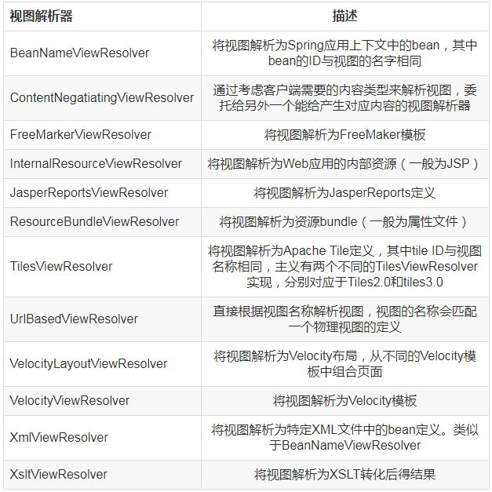
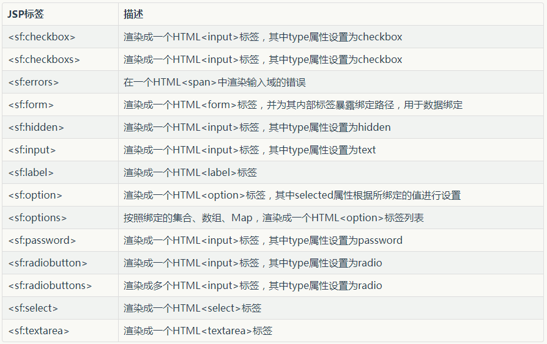

##【Spring】渲染Web视图前言

##
##前面学习了编写Web请求的控制器，创建简单的视图，本篇博文讲解控制器完成请求到结果渲染到用户的浏览器的过程。渲染Web视图理解视图解析

##
##前面所编写的控制器方法都没有直接产生浏览器中渲染所需要的HTML，只是将数据填充到模型中，然后将模型传递给视图，方法返回值是String类型的值，其是视图的逻辑名称，不会直接引用具体的视图实现。将控制器中请求处理的逻辑和视图中的渲染解耦是Spring MVC的重要特征，控制器只通过逻辑视图名了解视图，而视图解析器用于确定使用哪个视图实现来渲染模型。前面在WebConfig中，使用了InternalResourceViewResolver，其配置了prefix为/WEB-INF/views/，suffix为.jsp用于确定渲染模型的jsp文件的物理位置。Spring自带了12个视图解析器用于将逻辑视图名转化为物理实现。

##
## 

##
##对于不同的视图解析器，一般对应某种特定的视图技术，如InternalResourceViewResolver一般用于JSP视图、TilesViewResolver用于Apache Tiles视图、FreeMarkerViewResolver用于FreeMarker视图、VelocityViewResolver用于Velocity视图。创建JSP视图

##
##Spring提供了两种支持JSP视图的方式。InternalResourceViewResolver会将视图名解析为JSP文件。Spring提供了两个JSP标签库，一个用于表单到模型的绑定，一个用于提供了通用的工具类特性。配置适用于JSP的视图解析器

##
##InternalResourceViewResolver会在视图名上添加前缀和后缀，进而确定Web应用中的视图资源的物理路径，如下代码使用@Bean注解，并设置了前缀和后缀的解析器。    @Bean    public ViewResolver viewResolver() {        InternalResourceViewResolver resolver = new InternalResourceViewResolver();        resolver.setPrefix("/WEB-INF/views/");        resolver.setSuffix(".jsp");        return resolver;    	}

##
##也可使用XML的配置如下。<bean id="viewResolver" class="org.springframework.web.servlet.view.InternalResourceViewResolver"    p:prefix="/WEB-INF/views/"    p:suffix=".jsp" />

##
##配置视图解析器后，home会被解析为/WEB-INF/views/home.jsp，/books/detail会被解析为/WEB-INF/views/books/detail.jsp。

##
##InternalResourceViewResolver最终会将逻辑视图名解析为InternalResourceView实例，该实例会引用JSP文件，如果JSP文件中使用JSTL标签处理信息和格式化时，需要将其解析为JSTLView，此时需要设置解析器的viewClass为JstlView.class即可。使用Spring的JSP库

##
##Spring提供了两个用来帮助定义Spring MVC Web视图的JSP标签库，其中一个标签库会用来渲染HTML表单标签，另一个标签库包含工具类标签。

##
##Spring的表单绑定JSP标签库包含了14个标签，其中大多数用来渲染HTML的表单标签，其能够根据模型中对象的属性填充值，还包含展现用户错误的的标签，其会将错误信息渲染到最终的HTML中，可通过如下方式指定。<%@ taglib uri="http://www.springframework.org/tags/form" prefix="cf" %>

##
##在声明后，即可使用如下14个标签库。

##
## 

##
##针对不同地区展示不同信息已是国际化的重要组成部分，其关键在于使用<s:message>标签，如在home.jsp中添加<s:message code="spittr.welcome" />标签，然后在WebConfig中添加如下代码。    @Bean    public MessageSource messageSource() {        ResourceBundleMessageSource resourceBundleMessageSource = new ResourceBundleMessageSource();        resourceBundleMessageSource.setBasename("messages");        return resourceBundleMessageSource;    	}

##
##最后在resources/下添加messages.properties文件，并配置内容如下spitter.welcome=welcome!，启动，显示welcome!，还可配置message_zh.properties文件，内容配置如下spitter.welcome=china welcome!，启动，会显示china wecome!，即会根据本地时区选择合适的messages文件显示。使用Apache Tiles视图定义布局

##
##前面我们并未关注Web页面的布局问题，每个jsp完全负责定义自身的布局，假定需要为所有页面定义一个通用的头部和底部，这时可使用布局引擎如Apache Tiles，定义适用于所有页面的通用页面布局。配置Tiles视图解析器

##
##首先需要配置TilesConfigurer的bean，它负责定位和加载Tile定义并协调生成Tiles，再者需要TilesViewResolver的bean将逻辑视图名称解析为Tile定义。    @Bean    public TilesConfigurer tilesConfigurer() {        TilesConfigurer tilesConfigurer = new TilesConfigurer();        tilesConfigurer.setDefinitions("/WEB-INF/layout/tiles.xml");        tilesConfigurer.setCheckRefresh(true);        return tilesConfigurer;    	}

##
##然后再定义tils.xml文件和对应的文件即可。使用Thymeleaf配置Thymeleaf视图解析器

##
##需要配置如下三个bean。ThymeleafViewResolver，将逻辑视图名解析为Thymeleaf模版视图。SpringTemplateEngine，处理模板并渲染结果。TemplateResolver，加载Thymeleaf模板。

##
##添加bean至WebConfig中如下。    @Bean    public ViewResolver viewResolver(SpringTemplateEngine templateEngine) {        ThymeleafViewResolver viewResolver = new ThymeleafViewResolver();        viewResolver.setTemplateEngine(templateEngine);        return viewResolver;    	}    @Bean    public SpringTemplateEngine templateEngine(TemplateResolver templateResolver) {        SpringTemplateEngine templateEngine = new SpringTemplateEngine();        templateEngine.setTemplateResolver(templateResolver);        return templateEngine;    	}    @Bean    public TemplateResolver templateResolver() {        TemplateResolver templateResolver = new ServletContextTemplateResolver();        templateResolver.setPrefix("/WEB-INF/views/");        templateResolver.setSuffix(".html");        templateResolver.setTemplateMode("HTML5");        return templateResolver;    	}总结

##
##Spring的视图渲染十分灵活，有传统的jsp方案(InternalResourceViewResolver)，还有Tiles(TilesViewResolver)和Thymeleaf(ThymeleafViewResolver)的布局引擎，开发者可根据自身需求选择合适的视图解析器。