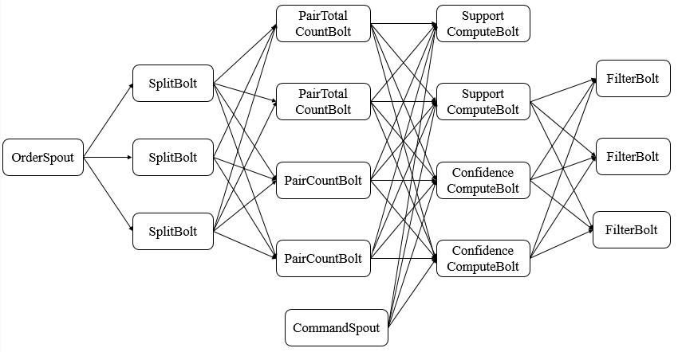
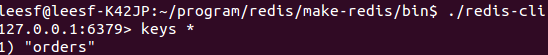
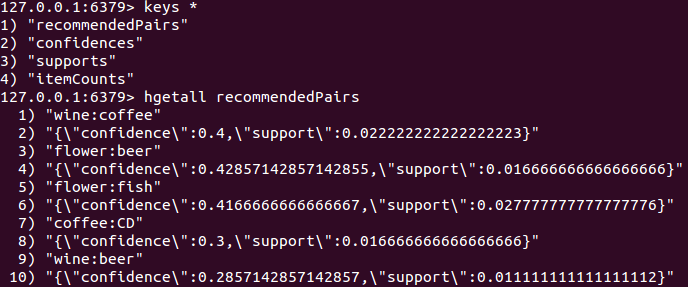

**一、前言**

针对大叔据实时处理的入门，除了使用WordCount示例之外，还需要相对更深入点的示例来理解Storm，因此，本篇博文利用Storm实现了频繁项集挖掘的案例，以方便更好的入门Storm。

**二、基础知识**

2.1 频繁二项集挖掘

如顾客去超市购物时，牙膏和牙刷基本上都是摆放在一起，因为购买牙膏时，很有可能会购买牙刷。另外，“啤酒与尿布”的案例则是对订单进行分析挖掘后发现的规律，将啤酒和尿布一起摆放会促进啤酒的销量。

2.2 算法设计

本示例中不考虑太复杂的挖掘算法，只考虑将两个商品组合后的挖掘，设计如下

**·** 将每笔订单的商品按照两两分组。

**·** 将每个分组的频度进行统计（不考虑商品的次序）。

· 根据频度计算支持度（每个组合出现的频率越高，更有可能是频繁组合）和置信度（商品组合出现的置信程度）。

· 设置支持度和置信度阈值，过滤不达标的数据。

2.3 Storm设计思路

**·** 使用Redis作为存储订单数据的数据库。

**·** 使用Spout从Redis中读取订单数据。

**·** 使用Bolt计算分组频度。

**·** 使用Bolt计算支持度和置信度。

**·** 使用Bolt筛选结果并存储到Redis中。

2.4 拓扑结构图

根据程序思路设计如下所示的拓扑结构，其组件在之后进行介绍。

**三、设计实现**

3.1 实现步骤

1\. 产生订单数据

通过模拟程序产生订单数据，并存储Redis中，即使用OrderGenerator来生成订单数据并存入Redis中，每个订单有四种不同商品及其数量组成。

2\. 接入订单数据

通过OrderSpout读取Redis中的订单数据，以供拓扑结构下游的Bolt使用。

3\. 对订单中商品进行分组

通过SplitBolt对订单中的商品进行分组，两两分组并构建商品对，发送元组至下游Bolt。

4\. 统计商品对总数

使用PairTotalCountBolt对所有商品对数量进行统计（用于计算支持度），并发送元组至下游Bolt。

5\. 统计商品对及其出现次数

使用PairCountBolt对商品对出现的次数进行统计，并发送元组至下游Bolt。

6\. 计算商品对支持度

使用SupportComputeBolt对商品对的支持度进行计算，并发送元组至下游Bolt。

7\. 计算商品对置信度

使用ConfidenceComputeBolt对商品对的置信度进行计算，并发送元组至下游Bolt。

8\. 过滤符合条件的商品对

使用FilterBolt对符合条件的商品对进行过滤并存入redis，并发送元组至下游Bolt。

3.1 源码分析

下面给出拓扑结构中的各组件的源码并进行分析。

1\. OrderSpout

    
    
    package com.hust.grid.leesf.ordertest.spout;
    
    import java.util.Map;
    
    import org.json.simple.JSONArray;
    import org.json.simple.JSONObject;
    import org.json.simple.JSONValue;
    
    import com.hust.grid.leesf.ordertest.common.ConfKeys;
    import com.hust.grid.leesf.ordertest.common.FieldNames;
    
    import backtype.storm.spout.SpoutOutputCollector;
    import backtype.storm.task.TopologyContext;
    import backtype.storm.topology.OutputFieldsDeclarer;
    import backtype.storm.topology.base.BaseRichSpout;
    import backtype.storm.tuple.Fields;
    import backtype.storm.tuple.Values;
    import redis.clients.jedis.Jedis;
    
    /**
     * 数据源，从redis读取订单
     * 
     * @author leesf
     *
     */
    public class OrderSpout extends BaseRichSpout {
        private static final long serialVersionUID = 1L;
    
        private SpoutOutputCollector collector;
        private Jedis jedis;
        private String host;
        private int port;
    
        public void open(@SuppressWarnings("rawtypes") Map conf, TopologyContext context, SpoutOutputCollector collector) {
            this.collector = collector;
            this.host = conf.get(ConfKeys.REDIS_HOST).toString();
            this.port = Integer.parseInt(conf.get(ConfKeys.REDIS_PORT).toString());
            connectToRedis();
        }
    
        private void connectToRedis() {
            jedis = new Jedis(host, port);
            jedis.connect();
        }
    
        public void nextTuple() {
            String content = jedis.rpop("orders"); // 获取一条订单数据
    
            if (null == content || "nil".equals(content)) { // 若无，则等待300ms
                try {
                    Thread.sleep(300);
                } catch (InterruptedException e) {
                    e.printStackTrace();
                }
            } else { // 对订单数据进行转化
                JSONObject object = (JSONObject) JSONValue.parse(content);
                String id = object.get(FieldNames.ID).toString(); // 获取ID
                JSONArray items = (JSONArray) object.get(FieldNames.ITEMS); // 获取订单中的商品
    
                for (Object obj : items) { // 遍历订单中的商品
                    JSONObject item = (JSONObject) obj;
                    String name = item.get(FieldNames.NAME).toString(); // 商品名称
                    int count = Integer.parseInt(item.get(FieldNames.COUNT).toString()); // 商品数量
                    collector.emit(new Values(id, name, count)); // 发射订单号、商品名称、商品数量
    
                    if (jedis.hexists("itemCounts", name)) { // redis中存在name字段
                        jedis.hincrBy("itemCounts", name, 1); // 商品对应数量（订单中多个商品当作1个）增加1
                    } else { // redis中不存在name字段
                        jedis.hset("itemCounts", name, "1"); // 将name字段的值（商品数量）设置为1
                    }
                }
            }
        }
    
        public void declareOutputFields(OutputFieldsDeclarer declarer) {
            // 声明发射元组字段
            declarer.declare(new Fields(FieldNames.ID, FieldNames.NAME, FieldNames.COUNT));
        }
    }

OrderSpout

说明：OrderSpout会从redis中读取订单数据，并遍历订单中每个商品并发射，同时会统计商品数据并存入redis。

2\. CommandSpout

    
    
    package com.hust.grid.leesf.ordertest.spout;
    
    import java.util.Map;
    
    import com.hust.grid.leesf.ordertest.common.FieldNames;
    
    import backtype.storm.spout.SpoutOutputCollector;
    import backtype.storm.task.TopologyContext;
    import backtype.storm.topology.OutputFieldsDeclarer;
    import backtype.storm.topology.base.BaseRichSpout;
    import backtype.storm.tuple.Fields;
    import backtype.storm.tuple.Values;
    
    /**
     * 统计支持度和置信度
     * 
     * @author leesf
     */
    public class CommandSpout extends BaseRichSpout {
        private static final long serialVersionUID = 1L;
    
        private SpoutOutputCollector collector;
    
        public void open(@SuppressWarnings("rawtypes") Map conf, TopologyContext context, SpoutOutputCollector collector) {
            this.collector = collector;
        }
    
        public void nextTuple() {
            // 休眠5S后发射“statistics”
            try {
                Thread.sleep(5000);
            } catch (InterruptedException e) {
                e.printStackTrace();
            }
    
            collector.emit(new Values("statistics"));
        }
    
        public void declareOutputFields(OutputFieldsDeclarer declarer) {
            // 声明元组字段
            declarer.declare(new Fields(FieldNames.COMMAND));
        }
    }

CommandSpout

说明：下游Bolt根据其发射的元组信息来统计支持度和置信度，其每5秒发射一次统计信号。

3\. SplitBolt

    
    
    package com.hust.grid.leesf.ordertest.bolt;
    
    import java.util.ArrayList;
    import java.util.HashMap;
    import java.util.List;
    import java.util.Map;
    
    import com.hust.grid.leesf.ordertest.common.FieldNames;
    
    import backtype.storm.task.OutputCollector;
    import backtype.storm.task.TopologyContext;
    import backtype.storm.topology.OutputFieldsDeclarer;
    import backtype.storm.topology.base.BaseRichBolt;
    import backtype.storm.tuple.Fields;
    import backtype.storm.tuple.Tuple;
    import backtype.storm.tuple.Values;
    
    /**
     * 对订单中的商品进行两两组合并发送
     * 
     * @author leesf
     *
     */
    public class SplitBolt extends BaseRichBolt {
        private static final long serialVersionUID = 1L;
    
        private OutputCollector collector;
        private Map<String, List<String>> orderItems; // 存储订单及其商品
    
        public void prepare(@SuppressWarnings("rawtypes") Map conf, TopologyContext context, OutputCollector collector) {
            this.collector = collector;
            orderItems = new HashMap<String, List<String>>();
        }
    
        public void execute(Tuple tuple) {
            // 获取订单号和商品名称
            String id = tuple.getStringByField(FieldNames.ID);
            String newItem = tuple.getStringByField(FieldNames.NAME);
    
            if (!orderItems.containsKey(id)) { // 不包含该订单
                // 新生商品链表
                ArrayList<String> items = new ArrayList<String>();
                // 添加商品
                items.add(newItem);
    
                orderItems.put(id, items);
    
                return;
            }
            // 包含订单，取出订单中包含的商品
            List<String> items = orderItems.get(id);
            for (String existItem : items) { // 遍历商品
                // 将元组中提取的商品与订单中已存在的商品组合后发射
                collector.emit(createPair(newItem, existItem));
            }
            // 添加新的商品
            items.add(newItem);
        }
    
        private Values createPair(String item1, String item2) { // 按照指定顺序生成商品对
            if (item1.compareTo(item2) > 0) {
                return new Values(item1, item2);
            }
    
            return new Values(item2, item1);
        }
    
        public void declareOutputFields(OutputFieldsDeclarer declarer) {
            // 声明元组字段
            declarer.declare(new Fields(FieldNames.ITEM1, FieldNames.ITEM2));
        }
    }

SplitBolt

说明：其将每个订单的两两商品进行组合，然后发射。

4\. PairTotalCountBolt

    
    
    package com.hust.grid.leesf.ordertest.bolt;
    
    import java.util.Map;
    
    import com.hust.grid.leesf.ordertest.common.FieldNames;
    
    import backtype.storm.task.OutputCollector;
    import backtype.storm.task.TopologyContext;
    import backtype.storm.topology.OutputFieldsDeclarer;
    import backtype.storm.topology.base.BaseRichBolt;
    import backtype.storm.tuple.Fields;
    import backtype.storm.tuple.Tuple;
    import backtype.storm.tuple.Values;
    
    /**
     * 计算商品对总数
     * 
     * @author leesf
     *
     */
    public class PairTotalCountBolt extends BaseRichBolt {
        private static final long serialVersionUID = 1L;
    
        private OutputCollector collector;
        private int totalCount; // 商品对总数
    
        public void prepare(@SuppressWarnings("rawtypes") Map conf, TopologyContext context, OutputCollector collector) {
            this.collector = collector;
            totalCount = 0;
        }
    
        public void execute(Tuple tuple) {
            totalCount++; // 每收到一个元组，便增加商品对总数
            collector.emit(new Values(totalCount)); // 发射商品对总数
        }
    
        public void declareOutputFields(OutputFieldsDeclarer declarer) {
            // 声明元组字段
            declarer.declare(new Fields(FieldNames.TOTAL_COUNT));
        }
    }

PairTotalCountBolt

说明：其用于统计所有商品对的数量（用于后面支持度的计算）。

5\. PairCountBolt

    
    
    package com.hust.grid.leesf.ordertest.bolt;
    
    import java.util.HashMap;
    import java.util.Map;
    
    import com.hust.grid.leesf.ordertest.common.FieldNames;
    import com.hust.grid.leesf.ordertest.common.ItemPair;
    
    import backtype.storm.task.OutputCollector;
    import backtype.storm.task.TopologyContext;
    import backtype.storm.topology.OutputFieldsDeclarer;
    import backtype.storm.topology.base.BaseRichBolt;
    import backtype.storm.tuple.Fields;
    import backtype.storm.tuple.Tuple;
    import backtype.storm.tuple.Values;
    
    /**
     * 计算商品对出现的次数
     * 
     * @author leesf
     *
     */
    public class PairCountBolt extends BaseRichBolt {
        private static final long serialVersionUID = 1L;
    
        private OutputCollector collector;
        private Map<ItemPair, Integer> pairCounts; // 存储商品对及其出现的次数
    
        public void prepare(@SuppressWarnings("rawtypes") Map conf, TopologyContext context, OutputCollector collector) {
            this.collector = collector;
            this.pairCounts = new HashMap<ItemPair, Integer>();
        }
    
        public void execute(Tuple tuple) {
            String item1 = tuple.getStringByField(FieldNames.ITEM1);
            String item2 = tuple.getStringByField(FieldNames.ITEM2);
    
            ItemPair itemPair = new ItemPair(item1, item2);
            int pairCount = 0;
    
            if (pairCounts.containsKey(itemPair)) { // 包含商品对
                // 取出商品对出现的次数
                pairCount = pairCounts.get(itemPair);
            }
            // 更新出现次数
            pairCount++;
    
            pairCounts.put(itemPair, pairCount);
    
            collector.emit(new Values(item1, item2, pairCount));
        }
    
        public void declareOutputFields(OutputFieldsDeclarer declarer) {
            // 声明元组字段
            declarer.declare(new Fields(FieldNames.ITEM1, FieldNames.ITEM2, FieldNames.PAIR_COUNT));
        }
    }

PairCountBolt

说明：其用于统计每个商品对出现的次数，然后发射。

6\. SupportComputeBolt

    
    
    package com.hust.grid.leesf.ordertest.bolt;
    
    import java.util.HashMap;
    import java.util.Map;
    
    import com.hust.grid.leesf.ordertest.common.FieldNames;
    import com.hust.grid.leesf.ordertest.common.ItemPair;
    
    import backtype.storm.task.OutputCollector;
    import backtype.storm.task.TopologyContext;
    import backtype.storm.topology.OutputFieldsDeclarer;
    import backtype.storm.topology.base.BaseRichBolt;
    import backtype.storm.tuple.Fields;
    import backtype.storm.tuple.Tuple;
    import backtype.storm.tuple.Values;
    
    /**
     * 计算商品对的支持度
     * 
     * @author leesf
     *
     */
    public class SupportComputeBolt extends BaseRichBolt {
        private static final long serialVersionUID = 1L;
    
        private OutputCollector collector;
        private Map<ItemPair, Integer> pairCounts; // 存储商品对及其出现的次数
        private int pairTotalCount; // 商品对总数
    
        public void prepare(@SuppressWarnings("rawtypes") Map conf, TopologyContext context, OutputCollector collector) {
            this.collector = collector;
            pairCounts = new HashMap<ItemPair, Integer>();
            pairTotalCount = 0;
        }
    
        /**
         * 由于SupportComputeBolt订阅了多个流，其需要根据不同的字段做出不同的行为
         */
        public void execute(Tuple tuple) {
            if (tuple.getFields().get(0).equals(FieldNames.TOTAL_COUNT)) { // 对应PairTotalCountBolt
                // 取出商品对总数量
                pairTotalCount = tuple.getIntegerByField(FieldNames.TOTAL_COUNT);
            } else if (tuple.getFields().size() == 3) { // 对应PairCountBolt
                // 取出商品及其商品对出现的次数
                String item1 = tuple.getStringByField(FieldNames.ITEM1);
                String item2 = tuple.getStringByField(FieldNames.ITEM2);
                int pairCount = tuple.getIntegerByField(FieldNames.PAIR_COUNT);
                // 存储商品对及其次数
                pairCounts.put(new ItemPair(item1, item2), pairCount);
            } else if (tuple.getFields().get(0).equals(FieldNames.COMMAND)) { // 对应CommandSpout
                for (ItemPair itemPair : pairCounts.keySet()) { // 遍历商品对
                    // 计算商品支持度，使用商品对出现的次数除以商品对总数量
                    double itemSupport = (double) (pairCounts.get(itemPair).intValue()) / pairTotalCount;
    
                    collector.emit(new Values(itemPair.getItem1(), itemPair.getItem2(), itemSupport));
                }
            }
        }
    
        public void declareOutputFields(OutputFieldsDeclarer declarer) {
            // 定义元组字段
            declarer.declare(new Fields(FieldNames.ITEM1, FieldNames.ITEM2, FieldNames.SUPPORT));
        }
    
    }

SupportComputeBolt

说明：计算每个商品对的支持度，并且发射支持度。

7\. ConfidenceComputeBolt

    
    
    package com.hust.grid.leesf.ordertest.bolt;
    
    import java.util.HashMap;
    import java.util.Map;
    
    import com.hust.grid.leesf.ordertest.common.ConfKeys;
    import com.hust.grid.leesf.ordertest.common.FieldNames;
    import com.hust.grid.leesf.ordertest.common.ItemPair;
    
    import backtype.storm.task.OutputCollector;
    import backtype.storm.task.TopologyContext;
    import backtype.storm.topology.OutputFieldsDeclarer;
    import backtype.storm.topology.base.BaseRichBolt;
    import backtype.storm.tuple.Fields;
    import backtype.storm.tuple.Tuple;
    import backtype.storm.tuple.Values;
    import redis.clients.jedis.Jedis;
    
    /**
     * 计算商品对的置信度
     * 
     * @author leesf
     */
    public class ConfidenceComputeBolt extends BaseRichBolt {
        private static final long serialVersionUID = 1L;
    
        private OutputCollector collector;
        private Map<ItemPair, Integer> pairCounts; // 存储商品对及其出现的次数
    
        private String host;
        private int port;
        private Jedis jedis;
    
        public void prepare(@SuppressWarnings("rawtypes") Map conf, TopologyContext context, OutputCollector collector) {
            this.collector = collector;
            this.host = conf.get(ConfKeys.REDIS_HOST).toString();
            this.port = Integer.parseInt(conf.get(ConfKeys.REDIS_PORT).toString());
            pairCounts = new HashMap<ItemPair, Integer>();
            connectToRedis();
        }
    
        private void connectToRedis() {
            jedis = new Jedis(host, port);
            jedis.connect();
        }
    
        /**
         * 由于ConfidenceComputeBolt订阅了多个流，其需要根据元组不同的字段做出不同的行为
         */
        public void execute(Tuple tuple) {
            if (tuple.getFields().size() == 3) { // 对应PairCountBolt
                // 取出商品对及其出现次数
                String item1 = tuple.getStringByField(FieldNames.ITEM1);
                String item2 = tuple.getStringByField(FieldNames.ITEM2);
                int pairCount = tuple.getIntegerByField(FieldNames.PAIR_COUNT);
    
                pairCounts.put(new ItemPair(item1, item2), pairCount);
            } else if (tuple.getFields().get(0).equals(FieldNames.COMMAND)) { // 对应CommandSpout，需要进行统计
                for (ItemPair itemPair : pairCounts.keySet()) { // 遍历商品对
                    // 从redis中取出商品对中商品出现的次数
                    double item1Count = Integer.parseInt(jedis.hget("itemCounts", itemPair.getItem1()));
                    double item2Count = Integer.parseInt(jedis.hget("itemCounts", itemPair.getItem2()));
                    double itemConfidence = pairCounts.get(itemPair).intValue();
    
                    // 计算商品对置信度
                    if (item1Count < item2Count) {
                        itemConfidence /= item1Count;
                    } else {
                        itemConfidence /= item2Count;
                    }
    
                    collector.emit(new Values(itemPair.getItem1(), itemPair.getItem2(), itemConfidence));
                }
            }
        }
    
        public void declareOutputFields(OutputFieldsDeclarer declarer) {
            // 声明元组字段
            declarer.declare(new Fields(FieldNames.ITEM1, FieldNames.ITEM2, FieldNames.CONFIDENCE));
        }
    }

View Code

说明：计算商品对的置信度，并且发射置信度。

8\. FilterBolt

    
    
    package com.hust.grid.leesf.ordertest.bolt;
    
    import java.util.Map;
    
    import org.json.simple.JSONObject;
    
    import com.hust.grid.leesf.ordertest.common.ConfKeys;
    import com.hust.grid.leesf.ordertest.common.FieldNames;
    import com.hust.grid.leesf.ordertest.common.ItemPair;
    
    import backtype.storm.task.OutputCollector;
    import backtype.storm.task.TopologyContext;
    import backtype.storm.topology.OutputFieldsDeclarer;
    import backtype.storm.topology.base.BaseRichBolt;
    import backtype.storm.tuple.Fields;
    import backtype.storm.tuple.Tuple;
    import backtype.storm.tuple.Values;
    import redis.clients.jedis.Jedis;
    
    /**
     * 过滤符合条件的商品对并存入redis
     * 
     * @author leesf
     *
     */
    public class FilterBolt extends BaseRichBolt {
        private static final long serialVersionUID = 1L;
    
        // 商品对的支持度和置信度
        private static final double SUPPORT_THRESHOLD = 0.01;
        private static final double CONFIDENCE_THRESHOLD = 0.01;
    
        private OutputCollector collector;
    
        private Jedis jedis;
        private String host;
        private int port;
    
        public void prepare(@SuppressWarnings("rawtypes") Map conf, TopologyContext context, OutputCollector collector) {
            this.collector = collector;
            this.host = conf.get(ConfKeys.REDIS_HOST).toString();
            this.port = Integer.parseInt(conf.get(ConfKeys.REDIS_PORT).toString());
            connectToRedis();
        }
    
        private void connectToRedis() {
            jedis = new Jedis(host, port);
            jedis.connect();
        }
    
        @SuppressWarnings("unchecked")
        public void execute(Tuple tuple) {
            // 取出商品并构造商品对
            String item1 = tuple.getStringByField(FieldNames.ITEM1);
            String item2 = tuple.getStringByField(FieldNames.ITEM2);
            ItemPair itemPair = new ItemPair(item1, item2);
            String pairString = itemPair.toString();
    
            double support = 0;
            double confidence = 0;
    
            if (tuple.getFields().get(2).equals(FieldNames.SUPPORT)) { // 对应SupportComputeBolt
                // 获取支持度并存入redis
                support = tuple.getDoubleByField(FieldNames.SUPPORT);
                jedis.hset("supports", pairString, String.valueOf(support));
            } else if (tuple.getFields().get(2).equals(FieldNames.CONFIDENCE)) { // 对应ConfidenceComputeBolt
                // 获取置信度并存入redis
                confidence = tuple.getDoubleByField(FieldNames.CONFIDENCE);
                jedis.hset("confidences", pairString, String.valueOf(confidence));
            }
    
            if (!jedis.hexists("supports", pairString) || !jedis.hexists("confidences", pairString)) { // 商品对的支持度和置信度还未计算完成，返回
                return;
            }
            // 商品对的支持度和置信度已经计算完成
            support = Double.parseDouble(jedis.hget("supports", pairString));
            confidence = Double.parseDouble(jedis.hget("confidences", pairString));
    
            if (support >= SUPPORT_THRESHOLD && confidence >= CONFIDENCE_THRESHOLD) { // 支持度和置信度超过阈值
                // 将该商品对信息存入redis中
                JSONObject pairValue = new JSONObject();
                pairValue.put(FieldNames.SUPPORT, support);
                pairValue.put(FieldNames.CONFIDENCE, confidence);
    
                jedis.hset("recommendedPairs", pairString, pairValue.toJSONString());
    
                collector.emit(new Values(item1, item2, support, confidence));
            } else { // 不高于阈值，则从redis中删除
                jedis.hdel("recommendedPairs", pairString);
            }
        }
    
        public void declareOutputFields(OutputFieldsDeclarer declarer) {
            // 声明元组字段
            declarer.declare(new Fields(FieldNames.ITEM1, FieldNames.ITEM2, FieldNames.SUPPORT, FieldNames.CONFIDENCE));
        }
    }

FilterBolt

说明：判断支持度和置信度是否超过了阈值，若超过则需要存入redis，否则，从redis中删除。

**四、程序运行**  

4.1. 环境依赖

打开redis服务器、客户端（方便观看结果）和zookeeper。

4.2. 写入订单数据

运行OrderGenerator，生成并写入订单数据，通过redis查看，结果如下

表示已经成功写入了订单数据。

4.3. 运行任务拓扑

运行OrderTopology，其会根据订单中的商品数据，生成并写入推荐商品对，通过redis查看，结果如下

可以看到运行完成后，已经成功生成了推荐商品方案。

**五、总结**

通过本篇Storm案例的学习，对于Storm的编程有了更深入的认识，同时，本项目的源代码已经上传至[github](https://github.com/leesf/ordertest)，欢迎star，谢谢各位园友的观看～

参考链接：http://www.jikexueyuan.com/course/1437.html

