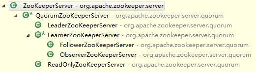

##【Zookeeper】源码分析之服务器（一）

##
##一、前言

##
##　　前面已经介绍了Zookeeper中Leader选举的具体流程，接着来学习Zookeeper中的各种服务器。

##
##二、总体框架图

##
##　　对于服务器，其框架图如下图所示

##
##　　 

##
##　　说明：

##
##　　ZooKeeperServer，为所有服务器的父类，其请求处理链为PrepRequestProcessor -> SyncRequestProcessor -> FinalRequestProcessor。

##
##　　QuorumZooKeeperServer，其是所有参与选举的服务器的父类，是抽象类，其继承了ZooKeeperServer类。

##
##　　LeaderZooKeeperServer，Leader服务器，继承了QuorumZooKeeperServer类，其请求处理链为PrepRequestProcessor -> ProposalRequestProcessor ->CommitProcessor -> Leader.ToBeAppliedRequestProcessor ->FinalRequestProcessor。

##
##　　LearnerZooKeeper，其是Learner服务器的父类，为抽象类，也继承了QuorumZooKeeperServer类。

##
##　　FollowerZooKeeperServer，Follower服务器，继承了LearnerZooKeeper，其请求处理链为FollowerRequestProcessor -> CommitProcessor -> FinalRequestProcessor。

##
##　　ObserverZooKeeperServer，Observer服务器，继承了LearnerZooKeeper。

##
##　　ReadOnlyZooKeeperServer，只读服务器，不提供写服务，继承QuorumZooKeeperServer，其处理链的第一个处理器为ReadOnlyRequestProcessor。

##
##三、总结

##
##　　本篇只简单介绍了服务器的继承关系，之后会详细分析不同服务器的行为和责任，谢谢各位园友的观看~