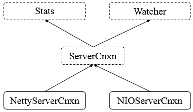

**一、前言**

前面已经分析了请求处理链中的多数类，接着继续分析Zookeeper中的网络通信模块。

**二、总体框图**

**** 对于网络通信模块，其总体框图如下所示

说明：

Stats，表示ServerCnxn上的统计数据。

Watcher，表示时间处理器。

ServerCnxn，表示服务器连接，表示一个从客户端到服务器的连接。

NettyServerCnxn，基于Netty的连接的具体实现。

NIOServerCnxn，基于NIO的连接的具体实现。

**三、ServerCnxn源码分析**

3.1 类的继承关系

    
    
    public abstract class ServerCnxn implements Stats, Watcher {}

说明：ServerCnxn为抽象类，其继承Stats和Watcher两个接口，表示客户端到服务端的连接。

3.2 类的内部类

    
    
        // 请求关闭异常类
        protected static class CloseRequestException extends IOException {
            private static final long serialVersionUID = -7854505709816442681L;
    
            public CloseRequestException(String msg) {
                super(msg);
            }
        }
    
        // 流结束异常类
        protected static class EndOfStreamException extends IOException {
            private static final long serialVersionUID = -8255690282104294178L;
    
            public EndOfStreamException(String msg) {
                super(msg);
            }
    
            public String toString() {
                return "EndOfStreamException: " + getMessage();
            }
        }

说明：ServerCnxn包含了两个异常类，用于表示在连接中发生的异常情况。

3.3 类的属性

    
    
    public abstract class ServerCnxn implements Stats, Watcher {
        // This is just an arbitrary object to represent requests issued by
        // (aka owned by) this class
        // 代表由本类提出的请求
        final public static Object me = new Object();
        // 认证信息
        protected ArrayList<Id> authInfo = new ArrayList<Id>();
    
        /**
         * If the client is of old version, we don"t send r-o mode info to it.
         * The reason is that if we would, old C client doesn"t read it, which
         * results in TCP RST packet, i.e. "connection reset by peer".
         */
        // 是否为旧的C客户端
        boolean isOldClient = true;
        
        // Zookeeper的Sasl服务器
        protected ZooKeeperSaslServer zooKeeperSaslServer = null;
        
        
        /**
        * CMD命令
        **/
        /*
         * See <a href="{@docRoot}/../../../docs/zookeeperAdmin.html#sc_zkCommands">
         * Zk Admin</a>. this link is for all the commands.
         */
        // CMD命令
        protected final static int confCmd =
            ByteBuffer.wrap("conf".getBytes()).getInt();
    
        /*
         * See <a href="{@docRoot}/../../../docs/zookeeperAdmin.html#sc_zkCommands">
         * Zk Admin</a>. this link is for all the commands.
         */
        protected final static int consCmd =
            ByteBuffer.wrap("cons".getBytes()).getInt();
    
        /*
         * See <a href="{@docRoot}/../../../docs/zookeeperAdmin.html#sc_zkCommands">
         * Zk Admin</a>. this link is for all the commands.
         */
        protected final static int crstCmd =
            ByteBuffer.wrap("crst".getBytes()).getInt();
    
        /*
         * See <a href="{@docRoot}/../../../docs/zookeeperAdmin.html#sc_zkCommands">
         * Zk Admin</a>. this link is for all the commands.
         */
        protected final static int dumpCmd =
            ByteBuffer.wrap("dump".getBytes()).getInt();
    
        /*
         * See <a href="{@docRoot}/../../../docs/zookeeperAdmin.html#sc_zkCommands">
         * Zk Admin</a>. this link is for all the commands.
         */
        protected final static int enviCmd =
            ByteBuffer.wrap("envi".getBytes()).getInt();
    
        /*
         * See <a href="{@docRoot}/../../../docs/zookeeperAdmin.html#sc_zkCommands">
         * Zk Admin</a>. this link is for all the commands.
         */
        protected final static int getTraceMaskCmd =
            ByteBuffer.wrap("gtmk".getBytes()).getInt();
    
        /*
         * See <a href="{@docRoot}/../../../docs/zookeeperAdmin.html#sc_zkCommands">
         * Zk Admin</a>. this link is for all the commands.
         */
        protected final static int ruokCmd =
            ByteBuffer.wrap("ruok".getBytes()).getInt();
        /*
         * See <a href="{@docRoot}/../../../docs/zookeeperAdmin.html#sc_zkCommands">
         * Zk Admin</a>. this link is for all the commands.
         */
        protected final static int setTraceMaskCmd =
            ByteBuffer.wrap("stmk".getBytes()).getInt();
    
        /*
         * See <a href="{@docRoot}/../../../docs/zookeeperAdmin.html#sc_zkCommands">
         * Zk Admin</a>. this link is for all the commands.
         */
        protected final static int srvrCmd =
            ByteBuffer.wrap("srvr".getBytes()).getInt();
    
        /*
         * See <a href="{@docRoot}/../../../docs/zookeeperAdmin.html#sc_zkCommands">
         * Zk Admin</a>. this link is for all the commands.
         */
        protected final static int srstCmd =
            ByteBuffer.wrap("srst".getBytes()).getInt();
    
        /*
         * See <a href="{@docRoot}/../../../docs/zookeeperAdmin.html#sc_zkCommands">
         * Zk Admin</a>. this link is for all the commands.
         */
        protected final static int statCmd =
            ByteBuffer.wrap("stat".getBytes()).getInt();
    
        /*
         * See <a href="{@docRoot}/../../../docs/zookeeperAdmin.html#sc_zkCommands">
         * Zk Admin</a>. this link is for all the commands.
         */
        protected final static int wchcCmd =
            ByteBuffer.wrap("wchc".getBytes()).getInt();
    
        /*
         * See <a href="{@docRoot}/../../../docs/zookeeperAdmin.html#sc_zkCommands">
         * Zk Admin</a>. this link is for all the commands.
         */
        protected final static int wchpCmd =
            ByteBuffer.wrap("wchp".getBytes()).getInt();
    
        /*
         * See <a href="{@docRoot}/../../../docs/zookeeperAdmin.html#sc_zkCommands">
         * Zk Admin</a>. this link is for all the commands.
         */
        protected final static int wchsCmd =
            ByteBuffer.wrap("wchs".getBytes()).getInt();
    
        /*
         * See <a href="{@docRoot}/../../../docs/zookeeperAdmin.html#sc_zkCommands">
         * Zk Admin</a>. this link is for all the commands.
         */
        protected final static int mntrCmd = ByteBuffer.wrap("mntr".getBytes())
                .getInt();
    
        /*
         * See <a href="{@docRoot}/../../../docs/zookeeperAdmin.html#sc_zkCommands">
         * Zk Admin</a>. this link is for all the commands.
         */
        protected final static int isroCmd = ByteBuffer.wrap("isro".getBytes())
                .getInt();
    
        // 存储CMD的整形值与String的键值对
        protected final static HashMap<Integer, String> cmd2String =
            new HashMap<Integer, String>();
    
        // specify all of the commands that are available
        static {
            cmd2String.put(confCmd, "conf");
            cmd2String.put(consCmd, "cons");
            cmd2String.put(crstCmd, "crst");
            cmd2String.put(dumpCmd, "dump");
            cmd2String.put(enviCmd, "envi");
            cmd2String.put(getTraceMaskCmd, "gtmk");
            cmd2String.put(ruokCmd, "ruok");
            cmd2String.put(setTraceMaskCmd, "stmk");
            cmd2String.put(srstCmd, "srst");
            cmd2String.put(srvrCmd, "srvr");
            cmd2String.put(statCmd, "stat");
            cmd2String.put(wchcCmd, "wchc");
            cmd2String.put(wchpCmd, "wchp");
            cmd2String.put(wchsCmd, "wchs");
            cmd2String.put(mntrCmd, "mntr");
            cmd2String.put(isroCmd, "isro");
        }
        
        
        /**
        * 服务器的统计数据
        **/
        // 创建连接的时间
        protected final Date established = new Date();
    
        // 接受的packet数量
        protected final AtomicLong packetsReceived = new AtomicLong();
        // 发送的packet数量
        protected final AtomicLong packetsSent = new AtomicLong();
        // 最小延迟
        protected long minLatency;
        // 最大延迟
        protected long maxLatency;
        // 最后操作类型
        protected String lastOp;
        // 最后的cxid
        protected long lastCxid;
        // 最后的zxid
        protected long lastZxid;
        // 最后的响应时间
        protected long lastResponseTime;
        // 最后的延迟
        protected long lastLatency;
        // 数量
        protected long count;
        // 总的延迟
        protected long totalLatency;
    }

类的属性

说明：可以看到，ServerCnxn类维护了很多属性，主要是服务器的统计信息和和命令行信息。

3.4 核心函数分析

1\. 抽象方法

    
    
        // 获取会话超时时间
        abstract int getSessionTimeout();
    
        // 关闭
        abstract void close();
    
        // 发送响应
        public abstract void sendResponse(ReplyHeader h, Record r, String tag)
            throws IOException;
    
        /* notify the client the session is closing and close/cleanup socket */
        // 关闭会话
        abstract void sendCloseSession();
    
        // 处理，Watcher接口中的方法
        public abstract void process(WatchedEvent event);
    
        // 获取会话id
        abstract long getSessionId();
    
        // 设置会话id
        abstract void setSessionId(long sessionId);
    
        // 设置缓冲
        abstract void sendBuffer(ByteBuffer closeConn);
    
        // 允许接收
        abstract void enableRecv();
    
        // 不允许接收
        abstract void disableRecv();
    
        // 设置会话超时时间
        abstract void setSessionTimeout(int sessionTimeout);
        
        // 获取服务器的统计数据
        protected abstract ServerStats serverStats();

说明：以上的方法均为抽象方法，需要具体子类实现，如process方法是Watcher接口中的方法，在ServerCnxn中并未实现，需要具体子类实现。

2\. 具体方法

    
    
        /** auth info for the cnxn, returns an unmodifyable list */
        // 获取认证信息，返回不可修改的列表
        public List<Id> getAuthInfo() {
            return Collections.unmodifiableList(authInfo);
        }
    
        // 添加认证信息
        public void addAuthInfo(Id id) {
            if (authInfo.contains(id) == false) {
                authInfo.add(id);
            }
        }
    
        // 移除认证信息
        public boolean removeAuthInfo(Id id) {
            return authInfo.remove(id);
        }
    
        // 接收的packet
        protected void packetReceived() {
            incrPacketsReceived();
            ServerStats serverStats = serverStats();
            if (serverStats != null) {
                serverStats().incrementPacketsReceived();
            }
        }
    
        // 发送的packet
        protected void packetSent() {
            incrPacketsSent();
            ServerStats serverStats = serverStats();
            if (serverStats != null) {
                serverStats().incrementPacketsSent();
            }
        }
        
        
        // 重置统计数据
        public synchronized void resetStats() {
            packetsReceived.set(0);
            packetsSent.set(0);
            minLatency = Long.MAX_VALUE;
            maxLatency = 0;
            lastOp = "NA";
            lastCxid = -1;
            lastZxid = -1;
            lastResponseTime = 0;
            lastLatency = 0;
    
            count = 0;
            totalLatency = 0;
        }
    
        // 增加接收的packet数量
        protected long incrPacketsReceived() {
            return packetsReceived.incrementAndGet();
        }
        
        // 增加outstandingRequest数量
        protected void incrOutstandingRequests(RequestHeader h) {
        }
        
        // 增加发送的packet数量
        protected long incrPacketsSent() {
            return packetsSent.incrementAndGet();
        }
    
        // 更新响应的统计数据
        protected synchronized void updateStatsForResponse(long cxid, long zxid,
                String op, long start, long end)
        {
            // don"t overwrite with "special" xids - we"re interested
            // in the clients last real operation
            if (cxid >= 0) { 
                lastCxid = cxid;
            }
            lastZxid = zxid;
            lastOp = op;
            lastResponseTime = end;
            long elapsed = end - start;
            lastLatency = elapsed;
            if (elapsed < minLatency) {
                minLatency = elapsed;
            }
            if (elapsed > maxLatency) {
                maxLatency = elapsed;
            }
            count++;
            totalLatency += elapsed;
        }
    
        public Date getEstablished() {
            return (Date)established.clone();
        }
    
        public abstract long getOutstandingRequests();
    
        public long getPacketsReceived() {
            return packetsReceived.longValue();
        }
    
        public long getPacketsSent() {
            return packetsSent.longValue();
        }
    
        public synchronized long getMinLatency() {
            return minLatency == Long.MAX_VALUE ? 0 : minLatency;
        }
    
        public synchronized long getAvgLatency() {
            return count == 0 ? 0 : totalLatency / count;
        }
    
        public synchronized long getMaxLatency() {
            return maxLatency;
        }
    
        public synchronized String getLastOperation() {
            return lastOp;
        }
    
        public synchronized long getLastCxid() {
            return lastCxid;
        }
    
        public synchronized long getLastZxid() {
            return lastZxid;
        }
    
        public synchronized long getLastResponseTime() {
            return lastResponseTime;
        }
    
        public synchronized long getLastLatency() {
            return lastLatency;
        }
    
        /**
         * Prints detailed stats information for the connection.
         *
         * @see dumpConnectionInfo(PrintWriter, boolean) for brief stats
         */
        @Override
        public String toString() {
            StringWriter sw = new StringWriter();
            PrintWriter pwriter = new PrintWriter(sw);
            dumpConnectionInfo(pwriter, false);
            pwriter.flush();
            pwriter.close();
            return sw.toString();
        }
    
        public abstract InetSocketAddress getRemoteSocketAddress();
        public abstract int getInterestOps();
        
        /**
         * Print information about the connection.
         * @param brief iff true prints brief details, otw full detail
         * @return information about this connection
         */
        protected synchronized void
        dumpConnectionInfo(PrintWriter pwriter, boolean brief) {
            pwriter.print(" ");
            pwriter.print(getRemoteSocketAddress());
            pwriter.print("[");
            int interestOps = getInterestOps();
            pwriter.print(interestOps == 0 ? "0" : Integer.toHexString(interestOps));
            pwriter.print("](queued=");
            pwriter.print(getOutstandingRequests());
            pwriter.print(",recved=");
            pwriter.print(getPacketsReceived());
            pwriter.print(",sent=");
            pwriter.print(getPacketsSent());
    
            if (!brief) {
                long sessionId = getSessionId();
                if (sessionId != 0) {
                    pwriter.print(",sid=0x");
                    pwriter.print(Long.toHexString(sessionId));
                    pwriter.print(",lop=");
                    pwriter.print(getLastOperation());
                    pwriter.print(",est=");
                    pwriter.print(getEstablished().getTime());
                    pwriter.print(",to=");
                    pwriter.print(getSessionTimeout());
                    long lastCxid = getLastCxid();
                    if (lastCxid >= 0) {
                        pwriter.print(",lcxid=0x");
                        pwriter.print(Long.toHexString(lastCxid));
                    }
                    pwriter.print(",lzxid=0x");
                    pwriter.print(Long.toHexString(getLastZxid()));
                    pwriter.print(",lresp=");
                    pwriter.print(getLastResponseTime());
                    pwriter.print(",llat=");
                    pwriter.print(getLastLatency());
                    pwriter.print(",minlat=");
                    pwriter.print(getMinLatency());
                    pwriter.print(",avglat=");
                    pwriter.print(getAvgLatency());
                    pwriter.print(",maxlat=");
                    pwriter.print(getMaxLatency());
                }
            }
            pwriter.print(")");
        }

具体方法

说明：ServerCnxn实现了Stats接口中的很多方法，其相对简单，不再累赘。

**四、总结**

本篇博文分析了ServerCnxn的源码，其是抽象类，定义了子类需要实现的方法，较为简单，也谢谢各位园友的观看~

