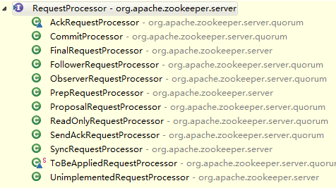

**一、前言**

前面已经分析了Watcher机制的主要代码，现在接着分析Zookeeper中的请求处理链，其是Zookeeper的主要特点之一。

**二、总体框图**

对于请求处理链而言，所有请求处理器的父接口为RequestProcessor，其框架图如下

说明：

AckRequestProcessor，将前一阶段的请求作为ACK转发给Leader。

CommitProcessor，将到来的请求与本地提交的请求进行匹配，这是因为改变系统状态的本地请求的返回结果是到来的请求。

FinalRequestProcessor，通常是请求处理链的最后一个处理器。

FollowerRequestProcessor，将修改了系统状态的请求转发给Leader。

ObserverRequestProcessor，同FollowerRequestProcessor一样，将修改了系统状态的请求转发给Leader。

PrepRequestProcessor，通常是请求处理链的第一个处理器。

ProposalRequestProcessor，将请求转发给AckRequestProcessor和SyncRequestProcessor。

ReadOnlyRequestProcessor，是ReadOnlyZooKeeperServer请求处理链的第一个处理器，将只读请求传递给下个处理器，抛弃改变状态的请求。

SendAckRequestProcessor，发送ACK请求的处理器。

SyncRequestProcessor，发送Sync请求的处理器。

ToBeAppliedRequestProcessor，维护toBeApplied列表，下个处理器必须是FinalRequestProcessor并且FinalRequestProcessor必须同步处理请求。

UnimplementedRequestProcessor，用于管理未知请求。

**三、RequestProcessor源码分析**

RequestProcessor是所有处理器的父接口，其定义了处理器的处理方法，其源码如下

    
    
     public interface RequestProcessor {
        @SuppressWarnings("serial")
        public static class RequestProcessorException extends Exception {
            public RequestProcessorException(String msg, Throwable t) {
                super(msg, t);
            }
        }
    
        void processRequest(Request request) throws RequestProcessorException;
    
        void shutdown();
    }

说明：RequestProcessor源码非常简单，内部类RequestProcessorException，用来表示处理过程中的出现的异常，而processRequest和shutdown方法则是核心方法，是子类必须要实现的方法，处理的主要逻辑在processRequest中，通过processRequest方法可以将请求传递到下个处理器，通常是单线程的。而shutdown表示关闭处理器，其意味着该处理器要关闭和其他处理器的连接。

**四、总结**

本篇博文主要学习了RequestProcessor的相关源码，其定义了处理器的处理逻辑，也分析其子类的大体介绍，之后会详细分析各个处理器的源码，谢谢各位园友的观看~

