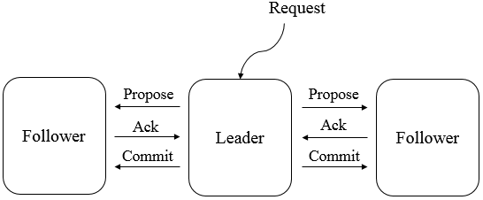

##【分布式】Zookeeper与Paxos

##
##一、前言

##
##　　在学习了Paxos在Chubby中的应用后，接下来学习Paxos在开源软件Zookeeper中的应用。

##
##二、Zookeeper

##
##　　Zookeeper是一个开源的分布式协调服务，其设计目标是将那些复杂的且容易出错的分布式一致性服务封装起来，构成一个高效可靠的原语集，并以一些列简单的接口提供给用户使用。其是一个典型的分布式数据一致性的解决方案，分布式应用程序可以基于它实现诸如数据发布/发布、负载均衡、命名服务、分布式协调/通知、集群管理、Master选举、分布式锁和分布式队列等功能。其可以保证如下分布式一致性特性。

##
##　　① 顺序一致性，从同一个客户端发起的事务请求，最终将会严格地按照其发起顺序被应用到Zookeeper中去。

##
##　　② 原子性，所有事务请求的处理结果在整个集群中所有机器上的应用情况是一致的，即整个集群要么都成功应用了某个事务，要么都没有应用。

##
##　　③ 单一视图，无论客户端连接的是哪个Zookeeper服务器，其看到的服务端数据模型都是一致的。

##
##　　④ 可靠性，一旦服务端成功地应用了一个事务，并完成对客户端的响应，那么该事务所引起的服务端状态变更将会一直被保留，除非有另一个事务对其进行了变更。

##
##　　⑤ 实时性，Zookeeper保证在一定的时间段内，客户端最终一定能够从服务端上读取到最新的数据状态。

##
##　　2.1 设计目标

##
##　　Zookeeper致力于提供一个高性能、高可用、且具有严格的顺序访问控制能力（主要是写操作的严格顺序性）的分布式协调服务，其具有如下的设计目标。

##
##　　① 简单的数据模型，Zookeeper使得分布式程序能够通过一个共享的树形结构的名字空间来进行相互协调，即Zookeeper服务器内存中的数据模型由一系列被称为ZNode的数据节点组成，Zookeeper将全量的数据存储在内存中，以此来提高服务器吞吐、减少延迟的目的。

##
##　　② 可构建集群，一个Zookeeper集群通常由一组机器构成，组成Zookeeper集群的而每台机器都会在内存中维护当前服务器状态，并且每台机器之间都相互通信。

##
##　　③ 顺序访问，对于来自客户端的每个更新请求，Zookeeper都会分配一个全局唯一的递增编号，这个编号反映了所有事务操作的先后顺序。

##
##　　④ 高性能，Zookeeper将全量数据存储在内存中，并直接服务于客户端的所有非事务请求，因此它尤其适用于以读操作为主的应用场景。

##
##　　2.2 基本概念

##
##　　① 集群角色，最典型的集群就是Master/Slave模式（主备模式），此情况下把所有能够处理写操作的机器称为Master机器，把所有通过异步复制方式获取最新数据，并提供读服务的机器为Slave机器。Zookeeper引入了Leader、Follower、Observer三种角色，Zookeeper集群中的所有机器通过Leaser选举过程来选定一台被称为Leader的机器，Leader服务器为客户端提供写服务，Follower和Observer提供读服务，但是Observer不参与Leader选举过程，不参与写操作的过半写成功策略，Observer可以在不影响写性能的情况下提升集群的性能。

##
##　　②会话，指客户端会话，一个客户端连接是指客户端和服务端之间的一个TCP长连接，Zookeeper对外的服务端口默认为2181，客户端启动的时候，首先会与服务器建立一个TCP连接，从第一次连接建立开始，客户端会话的生命周期也开始了，通过这个连接，客户端能够心跳检测与服务器保持有效的会话，也能够向Zookeeper服务器发送请求并接受响应，同时还能够通过该连接接受来自服务器的Watch事件通知。

##
##　　③数据节点，第一类指构成集群的机器，称为机器节点，第二类是指数据模型中的数据单元，称为数据节点-Znode，Zookeeper将所有数据存储在内存中，数据模型是一棵树，由斜杠/进行分割的路径，就是一个ZNode，如/foo/path1，每个ZNode都会保存自己的数据内存，同时还会保存一些列属性信息。ZNode分为持久节点和临时节点两类，持久节点是指一旦这个ZNode被创建了，除非主动进行ZNode的移除操作，否则这个ZNode将一直保存在Zookeeper上，而临时节点的生命周期和客户端会话绑定，一旦客户端会话失效，那么这个客户端创建的所有临时节点都会被移除。另外，Zookeeper还允许用户为每个节点添加一个特殊的属性：SEQUENTIAL。一旦节点被标记上这个属性，那么在这个节点被创建的时候，Zookeeper会自动在其节点后面追加一个整形数字，其是由父节点维护的自增数字。

##
##　　④ 版本，对于每个ZNode，Zookeeper都会为其维护一个叫作Stat的数据结构，Stat记录了这个ZNode的三个数据版本，分别是version（当前ZNode的版本）、cversion（当前ZNode子节点的版本）、aversion（当前ZNode的ACL版本）。

##
##　　⑤ Watcher，Zookeeper允许用户在指定节点上注册一些Watcher，并且在一些特定事件触发的时候，Zookeeper服务端会将事件通知到感兴趣的客户端。

##
##　　⑥ ACL，Zookeeper采用ACL（Access Control Lists）策略来进行权限控制，其定义了如下五种权限：

##
##　　　　· CREATE：创建子节点的权限。

##
##　　　　· READ：获取节点数据和子节点列表的权限。

##
##　　　　· WRITE：更新节点数据的权限。

##
##　　　　· DELETE：删除子节点的权限。

##
##　　　　· ADMIN：设置节点ACL的权限。

##
##　　2.3 ZAB协议

##
##　　Zookeeper使用了Zookeeper Atomic Broadcast（ZAB，Zookeeper原子消息广播协议）的协议作为其数据一致性的核心算法。ZAB协议是为Zookeeper专门设计的一种支持崩溃恢复的原子广播协议。

##
##　　Zookeeper依赖ZAB协议来实现分布式数据的一致性，基于该协议，Zookeeper实现了一种主备模式的系统架构来保持集群中各副本之间的数据的一致性，即其使用一个单一的诸进程来接收并处理客户端的所有事务请求，并采用ZAB的原子广播协议，将服务器数据的状态变更以事务Proposal的形式广播到所有的副本进程中，ZAB协议的主备模型架构保证了同一时刻集群中只能够有一个主进程来广播服务器的状态变更，因此能够很好地处理客户端大量的并发请求。

##
##　　ZAB协议的核心是定义了对于那些会改变Zookeeper服务器数据状态的事务请求的处理方式，即：所有事务请求必须由一个全局唯一的服务器来协调处理，这样的服务器被称为Leader服务器，余下的服务器则称为Follower服务器，Leader服务器负责将一个客户端事务请求转化成一个事务Proposal（提议），并将该Proposal分发给集群中所有的Follower服务器，之后Leader服务器需要等待所有Follower服务器的反馈，一旦超过半数的Follower服务器进行了正确的反馈后，那么Leader就会再次向所有的Follower服务器分发Commit消息，要求其将前一个Proposal进行提交。

##
##　　ZAB一些包括两种基本的模式：崩溃恢复和消息广播。

##
##　　当整个服务框架启动过程中或Leader服务器出现网络中断、崩溃退出与重启等异常情况时，ZAB协议就会进入恢复模式并选举产生新的Leader服务器。当选举产生了新的Leader服务器，同时集群中已经有过半的机器与该Leader服务器完成了状态同步之后，ZAB协议就会退出恢复模式，状态同步时指数据同步，用来保证集群在过半的机器能够和Leader服务器的数据状态保持一致。

##
##　　当集群中已经有过半的Follower服务器完成了和Leader服务器的状态同步，那么整个服务框架就可以进入消息广播模式，当一台同样遵守ZAB协议的服务器启动后加入到集群中，如果此时集群中已经存在一个Leader服务器在负责进行消息广播，那么加入的服务器就会自觉地进入数据恢复模式：找到Leader所在的服务器，并与其进行数据同步，然后一起参与到消息广播流程中去。Zookeeper只允许唯一的一个Leader服务器来进行事务请求的处理，Leader服务器在接收到客户端的事务请求后，会生成对应的事务提议并发起一轮广播协议，而如果集群中的其他机器收到客户端的事务请求后，那么这些非Leader服务器会首先将这个事务请求转发给Leader服务器。

##
##　　当Leader服务器出现崩溃或者机器重启、集群中已经不存在过半的服务器与Leader服务器保持正常通信时，那么在重新开始新的一轮的原子广播事务操作之前，所有进程首先会使用崩溃恢复协议来使彼此到达一致状态，于是整个ZAB流程就会从消息广播模式进入到崩溃恢复模式。一个机器要成为新的Leader，必须获得过半机器的支持，同时由于每个机器都有可能会崩溃，因此，ZAB协议运行过程中，前后会出现多个Leader，并且每台机器也有可能会多次成为Leader，进入崩溃恢复模式后，只要集群中存在过半的服务器能够彼此进行正常通信，那么就可以产生一个新的Leader并再次进入消息广播模式。如一个由三台机器组成的ZAB服务，通常由一个Leader、2个Follower服务器组成，某一个时刻，加入其中一个Follower挂了，整个ZAB集群是不会中断服务的。

##
##　　① 消息广播，ZAB协议的消息广播过程使用原子广播协议，类似于一个二阶段提交过程，针对客户端的事务请求，Leader服务器会为其生成对应的事务Proposal，并将其发送给集群中其余所有的机器，然后再分别收集各自的选票，最后进行事务提交。

##
## 

##
##　　在ZAB的二阶段提交过程中，移除了中断逻辑，所有的Follower服务器要么正常反馈Leader提出的事务Proposal，要么就抛弃Leader服务器，同时，ZAB协议将二阶段提交中的中断逻辑移除意味着我们可以在过半的Follower服务器已经反馈Ack之后就开始提交事务Proposal，而不需要等待集群中所有的Follower服务器都反馈响应，但是，在这种简化的二阶段提交模型下，无法处理Leader服务器崩溃退出而带来的数据不一致问题，因此ZAB采用了崩溃恢复模式来解决此问题，另外，整个消息广播协议是基于具有FIFO特性的TCP协议来进行网络通信的，因此能够很容易保证消息广播过程中消息接受与发送的顺序性。再整个消息广播过程中，Leader服务器会为每个事务请求生成对应的Proposal来进行广播，并且在广播事务Proposal之前，Leader服务器会首先为这个事务Proposal分配一个全局单调递增的唯一ID，称之为事务ID（ZXID），由于ZAB协议需要保证每个消息严格的因果关系，因此必须将每个事务Proposal按照其ZXID的先后顺序来进行排序和处理。

##
##　　② 崩溃恢复，在Leader服务器出现崩溃，或者由于网络原因导致Leader服务器失去了与过半Follower的联系，那么就会进入崩溃恢复模式，在ZAB协议中，为了保证程序的正确运行，整个恢复过程结束后需要选举出一个新的Leader服务器，因此，ZAB协议需要一个高效且可靠的Leader选举算法，从而保证能够快速地选举出新的Leader，同时，Leader选举算法不仅仅需要让Leader自身知道已经被选举为Leader，同时还需要让集群中的所有其他机器也能够快速地感知到选举产生的新的Leader服务器。

##
##　　③ 基本特性，ZAB协议规定了如果一个事务Proposal在一台机器上被处理成功，那么应该在所有的机器上都被处理成功，哪怕机器出现故障崩溃。ZAB协议需要确保那些已经在Leader服务器上提交的事务最终被所有服务器都提交，假设一个事务在Leader服务器上被提交了，并且已经得到了过半Follower服务器的Ack反馈，但是在它Commit消息发送给所有Follower机器之前，Leader服务挂了。如下图所示

##
## 

##
##　　在集群正常运行过程中的某一个时刻，Server1是Leader服务器，其先后广播了P1、P2、C1、P3、C2（C2是Commit Of Proposal2的缩写），其中，当Leader服务器发出C2后就立即崩溃退出了，针对这种情况，ZAB协议就需要确保事务Proposal2最终能够在所有的服务器上都被提交成功，否则将出现不一致。

##
##　　ZAB协议需要确保丢弃那些只在Leader服务器上被提出的事务。如果在崩溃恢复过程中出现一个需要被丢弃的提议，那么在崩溃恢复结束后需要跳过该事务Proposal，如下图所示

##
## 　　假设初始的Leader服务器Server1在提出一个事务Proposal3之后就崩溃退出了，从而导致集群中的其他服务器都没有收到这个事务Proposal，于是，当Server1恢复过来再次加入到集群中的时候，ZAB协议需要确保丢弃Proposal3这个事务。

##
##　　在上述的崩溃恢复过程中需要处理的特殊情况，就决定了ZAB协议必须设计这样的Leader选举算法：能够确保提交已经被Leader提交的事务的Proposal，同时丢弃已经被跳过的事务Proposal。如果让Leader选举算法能够保证新选举出来的Leader服务器拥有集群中所有机器最高编号（ZXID最大）的事务Proposal，那么就可以保证这个新选举出来的Leader一定具有所有已经提交的提议，更为重要的是如果让具有最高编号事务的Proposal机器称为Leader，就可以省去Leader服务器查询Proposal的提交和丢弃工作这一步骤了。

##
##　　④ 数据同步，完成Leader选举后，在正式开始工作前，Leader服务器首先会确认日志中的所有Proposal是否都已经被集群中的过半机器提交了，即是否完成了数据同步。Leader服务器需要确所有的Follower服务器都能够接收到每一条事务Proposal，并且能够正确地将所有已经提交了的事务Proposal应用到内存数据库中。Leader服务器会为每个Follower服务器维护一个队列，并将那些没有被各Follower服务器同步的事务以Proposal消息的形式逐个发送给Follower服务器，并在每一个Proposal消息后面紧接着再发送一个Commit消息，以表示该事务已经被提交，等到Follower服务器将所有其尚未同步的事务Proposal都从Leader服务器上同步过来并成功应用到本地数据库后，Leader服务器就会将该Follower服务器加入到真正的可用Follower列表并开始之后的其他流程。

##
##　　下面分析ZAB协议如何处理需要丢弃的事务Proposal的，ZXID是一个64位的数字，其中32位可以看做是一个简单的单调递增的计数器，针对客户端的每一个事务请求，Leader服务器在产生一个新的事务Proposal时，都会对该计数器进行加1操作，而高32位则代表了Leader周期epoch的编号，每当选举产生一个新的Leader时，就会从这个Leader上取出其本地日志中最大事务Proposal的ZXID，并解析出epoch值，然后加1，之后以该编号作为新的epoch，低32位则置为0来开始生成新的ZXID，ZAB协议通过epoch号来区分Leader周期变化的策略，能够有效地避免不同的Leader服务器错误地使用不同的ZXID编号提出不一样的事务Proposal的异常情况。当一个包含了上一个Leader周期中尚未提交过的事务Proposal的服务器启动时，其肯定无法成为Leader，因为当前集群中一定包含了一个Quorum（过半）集合，该集合中的机器一定包含了更高epoch的事务的Proposal，因此这台机器的事务Proposal并非最高，也就无法成为Leader。

##
##　　2.4 ZAB协议原理

##
##　　ZAB主要包括消息广播和崩溃恢复两个过程，进一步可以分为三个阶段，分别是发现（Discovery）、同步（Synchronization）、广播（Broadcast）阶段。ZAB的每一个分布式进程会循环执行这三个阶段，称为主进程周期。

##
##　　· 发现，选举产生PL(prospective leader)，PL收集Follower epoch(cepoch)，根据Follower的反馈，PL产生newepoch(每次选举产生新Leader的同时产生新epoch)。

##
##　　· 同步，PL补齐相比Follower多数派缺失的状态、之后各Follower再补齐相比PL缺失的状态，PL和Follower完成状态同步后PL变为正式Leader(established leader)。

##
##　　· 广播，Leader处理客户端的写操作，并将状态变更广播至Follower，Follower多数派通过之后Leader发起将状态变更落地(deliver/commit)。

##
##　　在正常运行过程中，ZAB协议会一直运行于阶段三来反复进行消息广播流程，如果出现崩溃或其他原因导致Leader缺失，那么此时ZAB协议会再次进入发现阶段，选举新的Leader。

##
##　　2.4.1 运行分析

##
##　　每个进程都有可能处于如下三种状态之一

##
##　　· LOOKING：Leader选举阶段。

##
##　　· FOLLOWING：Follower服务器和Leader服务器保持同步状态。

##
##　　· LEADING：Leader服务器作为主进程领导状态。

##
##　　所有进程初始状态都是LOOKING状态，此时不存在Leader，此时，进程会试图选举出一个新的Leader，之后，如果进程发现已经选举出新的Leader了，那么它就会切换到FOLLOWING状态，并开始和Leader保持同步，处于FOLLOWING状态的进程称为Follower，LEADING状态的进程称为Leader，当Leader崩溃或放弃领导地位时，其余的Follower进程就会转换到LOOKING状态开始新一轮的Leader选举。

##
##　　一个Follower只能和一个Leader保持同步，Leader进程和所有与所有的Follower进程之间都通过心跳检测机制来感知彼此的情况。若Leader能够在超时时间内正常收到心跳检测，那么Follower就会一直与该Leader保持连接，而如果在指定时间内Leader无法从过半的Follower进程那里接收到心跳检测，或者TCP连接断开，那么Leader会放弃当前周期的领导，比你转换到LOOKING状态，其他的Follower也会选择放弃这个Leader，同时转换到LOOKING状态，之后会进行新一轮的Leader选举，并在选举产生新的Leader之后开始新的一轮主进程周期。

##
##　　2.5 ZAB与Paxos的联系和区别

##
##　　联系：

##
##　　① 都存在一个类似于Leader进程的角色，由其负责协调多个Follower进程的运行。

##
##　　② Leader进程都会等待超过半数的Follower做出正确的反馈后，才会将一个提议进行提交。

##
##　　③ 在ZAB协议中，每个Proposal中都包含了一个epoch值，用来代表当前的Leader周期，在Paxos算法中，同样存在这样的一个标识，名字为Ballot。

##
##　　区别：

##
##　　Paxos算法中，新选举产生的主进程会进行两个阶段的工作，第一阶段称为读阶段，新的主进程和其他进程通信来收集主进程提出的提议，并将它们提交。第二阶段称为写阶段，当前主进程开始提出自己的提议。

##
##　　ZAB协议在Paxos基础上添加了同步阶段，此时，新的Leader会确保存在过半的Follower已经提交了之前的Leader周期中的所有事务Proposal。

##
##　　ZAB协议主要用于构建一个高可用的分布式数据主备系统，而Paxos算法则用于构建一个分布式的一致性状态机系统。

##
##三、总结

##
##　　此部分也还是理论知识偏多，学好理论之后再看代码应该会更快速一些，也谢谢各位园友的观看~　