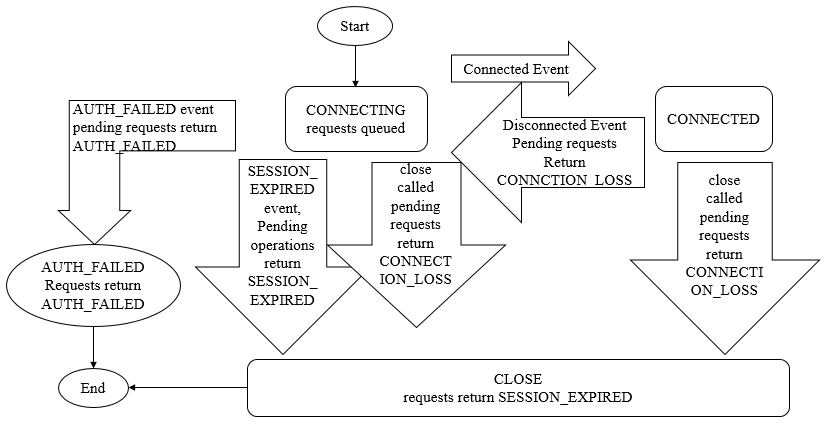

**一、前言**

前面分析了Zookeeper客户端的细节，接着继续学习Zookeeper中的一个非常重要的概念：会话。

**二、会话**

客户端与服务端之间任何交互操作都与会话息息相关，如临时节点的生命周期、客户端请求的顺序执行、Watcher通知机制等。Zookeeper的连接与会话就是客户端通过实例化Zookeeper对象来实现客户端与服务端创建并保持TCP连接的过程.

2.1 会话状态

在Zookeeper客户端与服务端成功完成连接创建后，就创建了一个会话，Zookeeper会话在整个运行期间的生命周期中，会在不同的会话状态中之间进行切换，这些状态可以分为
**CONNECTING、CONNECTED、RECONNECTING、RECONNECTED、CLOSE** 等。

一旦客户端开始创建Zookeeper对象，那么客户端状态就会变成CONNECTING状态，同时客户端开始尝试连接服务端，连接成功后，客户端状态变为CONNECTED，通常情况下，由于断网或其他原因，客户端与服务端之间会出现断开情况，一旦碰到这种情况，
**Zookeeper客户端会自动进行重连服务，同时客户端状态再次变成CONNCTING，直到重新连上服务端后，状态又变为CONNECTED**
，在通常情况下，客户端的状态总是介于CONNECTING和CONNECTED之间。但是，如果出现诸如会话超时、权限检查或是客户端主动退出程序等情况，客户端的状态就会直接变更为CLOSE状态。

2.2 会话创建

Session是Zookeeper中的会话实体，代表了一个客户端会话，其包含了如下四个属性

1. **sessionID** 。会话ID，唯一标识一个会话，每次客户端创建新的会话时，Zookeeper都会为其分配一个全局唯一的sessionID。

2\. **TimeOut**
。会话超时时间，客户端在构造Zookeeper实例时，会配置sessionTimeout参数用于指定会话的超时时间，Zookeeper客户端向服务端发送这个超时时间后，服务端会根据自己的超时时间限制最终确定会话的超时时间。

3\. **TickTime**
。下次会话超时时间点，为了便于Zookeeper对会话实行"分桶策略"管理，同时为了高效低耗地实现会话的超时检查与清理，Zookeeper会为每个会话标记一个下次会话超时时间点，其值大致等于当前时间加上TimeOut。

4\. **isClosing**
。标记一个会话是否已经被关闭，当服务端检测到会话已经超时失效时，会将该会话的isClosing标记为"已关闭"，这样就能确保不再处理来自该会话的心情求了。

Zookeeper为了保证请求会话的全局唯一性，在SessionTracker初始化时，调用initializeNextSession方法生成一个sessionID，之后在Zookeeper运行过程中，会在该sessionID的基础上为每个会话进行分配，初始化算法如下

    
    
    public static long initializeNextSession(long id) {
        long nextSid = 0;
        // 无符号右移8位使为了避免左移24后，再右移8位出现负数而无法通过高8位确定sid值
        nextSid = (System.currentTimeMillis() << 24) >>> 8;
        nextSid = nextSid | (id << 56);
        return nextSid;
    }

其中的id表示配置在myid文件中的值，通常是一个整数，如1、2、3。该算法的高8位确定了所在机器，后56位使用当前时间的毫秒表示进行随机。SessionTracker是Zookeeper服务端的会话管理器，负责会话的创建、管理和清理等工作。

2.3 会话管理

Zookeeper的会话管理主要是通过SessionTracker来负责，其采用了 **分桶策略**
（将类似的会话放在同一区块中进行管理）进行管理，以便Zookeeper对会话进行不同区块的隔离处理以及同一区块的统一处理。

Zookeeper将所有的会话都分配在不同的区块一种，分配的原则是每个会话的下次超时时间点（ExpirationTime）。ExpirationTime指该会话最近一次可能超时的时间点。同时，Zookeeper
Leader服务器在运行过程中会定时地进行会话超时检查，时间间隔是ExpirationInterval，默认为tickTime的值，ExpirationTime的计算时间如下

ExpirationTime = ((CurrentTime + SessionTimeOut) / ExpirationInterval + 1) *
ExpirationInterval

会了保持客户端会话的有效性， **客户端会在会话超时时间过期范围内向服务端发送PING请求来保持会话的有效性（心跳检测）**
。同时，服务端需要不断地接收来自客户端的心跳检测，并且需要重新激活对应的客户端会话，这个重新激活过程称为TouchSession。会话激活不仅能够使服务端检测到对应客户端的存货性，同时也能让客户端自己保持连接状态，其流程如下

  
如上图所示，整个流程分为四步

1\. **检查该会话是否已经被关闭** 。若已经被关闭，则直接返回即可。

2\. **计算该会话新的超时时间ExpirationTime_New** 。使用上面提到的公式计算下一次超时时间点。

3\. **获取该会话上次超时时间ExpirationTime_Old** 。计算该值是为了定位其所在的区块。

3\. **迁移会话** 。将该会话从老的区块中取出，放入ExpirationTime_New对应的新区块中。

在上面会话激活过程中，只要客户端发送心跳检测，服务端就会进行一次会话激活，心跳检测由客户端主动发起，以PING请求形式向服务端发送，在Zookeeper的实际设计中，
**只要客户端有请求发送到服务端，那么就会触发一次会话激活** ，以下两种情况都会触发会话激活。

1\. 客户端向服务端发送请求，包括读写请求，就会触发会话激活。

2\. 客户端发现在sessionTimeout/3时间内尚未和服务端进行任何通信，那么就会主动发起PING请求，服务端收到该请求后，就会触发会话激活。

对于会话的超时检查而言，Zookeeper使用SessionTracker来负责，SessionTracker使用单独的线程（超时检查线程）专门进行会话超时检查，即逐个一次地对会话桶中剩下的会话进行清理。如果一个会话被激活，那么Zookeeper就会将其从上一个会话桶迁移到下一个会话桶中，如ExpirationTime
1 的session n 迁移到ExpirationTime n 中，此时ExpirationTime
1中留下的所有会话都是尚未被激活的，超时检查线程就定时检查这个会话桶中所有剩下的未被迁移的会话，超时检查线程只需要在这些指定时间点（ExpirationTime
1、ExpirationTime 2...）上进行检查即可，这样提高了检查的效率，性能也非常好。

2.4 会话清理

当SessionTracker的会话超时线程检查出已经过期的会话后，就开始进行会话清理工作，大致可以分为如下七步。

1\. **标记会话状态为已关闭**
。由于会话清理过程需要一段时间，为了保证在此期间不再处理来自该客户端的请求，SessionTracker会首先将该会话的isClosing标记为true，这样在会话清理期间接收到该客户端的心情求也无法继续处理了。

2\. **发起会话关闭请求**
。为了使对该会话的关闭操作在整个服务端集群都生效，Zookeeper使用了提交会话关闭请求的方式，并立即交付给PreRequestProcessor进行处理。

3\. **收集需要清理的临时节点**
。一旦某个会话失效后，那么和该会话相关的临时节点都需要被清理，因此，在清理之前，首先需要将服务器上所有和该会话相关的临时节点都整理出来。Zookeeper在内存数据库中会为每个会话都单独保存了一份由该会话维护的所有临时节点集合，在Zookeeper处理会话关闭请求之前，若正好有以下两类请求到达了服务端并正在处理中。

· 节点删除请求，删除的目标节点正好是上述临时节点中的一个。

· 临时节点创建请求，创建的目标节点正好是上述临时节点中的一个。

对于第一类请求，需要将所有请求对应的数据节点路径从当前临时节点列表中移出，以避免重复删除，对于第二类请求，需要将所有这些请求对应的数据节点路径添加到当前临时节点列表中，以删除这些即将被创建但是尚未保存到内存数据库中的临时节点。

4\. **添加节点删除事务变更**
。完成该会话相关的临时节点收集后，Zookeeper会逐个将这些临时节点转换成"节点删除"请求，并放入事务变更队列outstandingChanges中。

5\. **删除临时节点** 。FinalRequestProcessor会触发内存数据库，删除该会话对应的所有临时节点。

6\. **移除会话** 。完成节点删除后，需要将会话从SessionTracker中删除。

7\. **关闭NIOServerCnxn** 。最后，从NIOServerCnxnFactory找到该会话对应的NIOServerCnxn，将其关闭。

2.5 重连

当客户端与服务端之间的网络连接断开时，Zookeeper客户端会自动进行反复的重连，直到最终成功连接上Zookeeper集群中的一台机器。此时，再次连接上服务端的客户端有可能处于以下两种状态之一

1\. **CONNECTED** 。如果在会话超时时间内重新连接上集群中一台服务器 。

2\. **EXPIRED** 。如果在会话超时时间以外重新连接上，那么服务端其实已经对该会话进行了会话清理操作，此时会话被视为非法会话。

在客户端与服务端之间维持的是一个长连接，在sessionTimeout时间内，服务端会不断地检测该客户端是否还处于正常连接，服务端会将客户端的每次操作视为一次有效的心跳检测来反复地进行会话激活。因此，在正常情况下，客户端会话时一直有效的。然而，当客户端与服务端之间的连接断开后，用户在客户端可能主要看到两类异常：
**CONNECTION_LOSS（连接断开）和SESSION_EXPIRED（会话过期）** 。

1\. **CONNECTION_LOSS**
。此时，客户端会自动从地址列表中重新逐个选取新的地址并尝试进行重新连接，直到最终成功连接上服务器。若客户端在setData时出现了CONNECTION_LOSS现象，此时客户端会收到None-
Disconnected通知，同时会抛出异常。应用程序需要捕捉异常并且等待Zookeeper客户端自动完成重连，一旦重连成功，那么客户端会收到None-
SyncConnected通知，之后就可以重试setData操作。

2\. **SESSION_EXPIRED**
。客户端与服务端断开连接后，重连时间耗时太长，超过了会话超时时间限制后没有成功连上服务器，服务器会进行会话清理，此时，客户端不知道会话已经失效，状态还是DISCONNECTED，如果客户端重新连上了服务器，此时状态为SESSION_EXPIRED，用于需要重新实例化Zookeeper对象，并且看应用的复杂情况，重新恢复临时数据。

3. **SESSION_MOVED** 。客户端会话从一台服务器转移到另一台服务器，即客户端与服务端S1断开连接后，重连上了服务端S2，此时会话就从S1转移到了S2。当多个客户端使用相同的sessionId/sessionPasswd创建会话时，会收到SessionMovedException异常。因为一旦有第二个客户端连接上了服务端，就被认为是会话转移了。

**三、总结**

本篇博文介绍了Zookeeper会话的相关细节，通过本篇的学习理解了会话的细节，也谢谢各位园友的观看~

