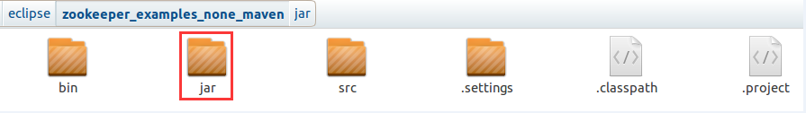
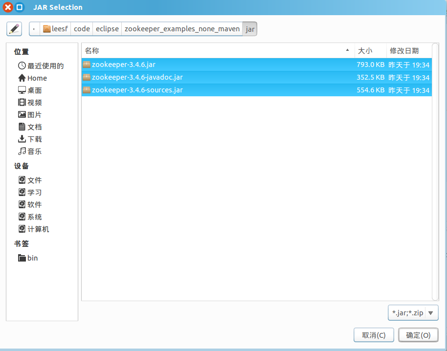
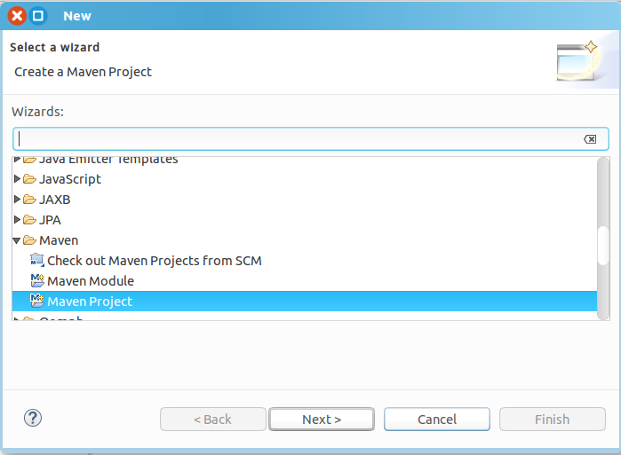
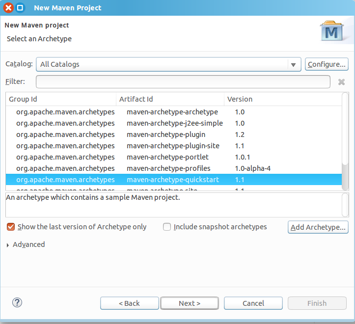
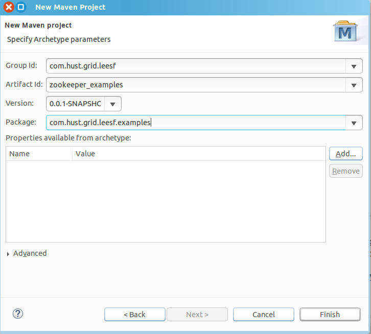

##【分布式】Zookeeper使用--Java API

##
##一、前言

##
##　　上一篇博客我们通过命令行来操作Zookeper的客户端和服务端并进行相应的操作，这篇主要介绍如何通过API（JAVA）来操作Zookeeper。

##
##二、开发环境配置

##
##　　首先打开Zookeeper服务端（上一篇博客有具体的方法），方便客户端连接。

##
##　　配置开发环境环境可以有两种方式：① 直接下载相关的依赖Jar包，然后在IDE中添加依赖 ② 建立maven项目，使用maven进行依赖管理。

##
##　　① 手动添加依赖至IDE

##
##　　步骤一：点击这里下载对应版本的Jar包，包括（jar、javadoc.jar、sources.jar），笔者对应下载的Zookeeper3.4.6版本。

##
##　　步骤二：打开IDE（笔者使用eclispe），新建名为zookeeper_examples_none_maven的java项目。由于需要单独添加依赖，为了方便管理，笔者在项目下新建了jar文件夹，用于存放本项目的jar包（将步骤一下载的3个jar包存放至此文件夹下）。

##
##　　 

##
##　　步骤三：在eclipse中添加依赖

##
##　　 

##
##　　步骤四：新建包、Java类进行测试

##
##　　Zookeeper_Constructor_Usage_Simple.java　　
  

	package com.hust.grid.leesf.examples;

import java.io.IOException;
import java.util.concurrent.CountDownLatch;

import org.apache.zookeeper.WatchedEvent;
import org.apache.zookeeper.Watcher;
import org.apache.zookeeper.Watcher.Event.KeeperState;
import org.apache.zookeeper.ZooKeeper;

public class Zookeeper_Constructor_Usage_Simple implements Watcher {
    private static CountDownLatch connectedSemaphore = new CountDownLatch(1);

    @Override
    public void process(WatchedEvent event) {
        System.out.println("Receive watched event : " + event);
        if (KeeperState.SyncConnected == event.getState()) {
            connectedSemaphore.countDown();
        	}
    	}

    public static void main(String[] args) throws IOException {
        ZooKeeper zookeeper = new ZooKeeper("127.0.0.1:2181", 5000, new Zookeeper_Constructor_Usage_Simple());
        System.out.println(zookeeper.getState());
        try {
            connectedSemaphore.await();
        	} catch (InterruptedException e) {
            e.printStackTrace();
        	}
        System.out.println("Zookeeper session established");
    	}
	}

View Code

##
##　　运行结果如下　　

	Exception in thread "main" java.lang.NoClassDefFoundError: org/slf4j/LoggerFactory
    at org.apache.zookeeper.ZooKeeper.<clinit>(ZooKeeper.java:94)
    at com.hust.grid.leesf.examples.Zookeeper_Constructor_Usage_Simple.main(Zookeeper_Constructor_Usage_Simple.java:23)
Caused by: java.lang.ClassNotFoundException: org.slf4j.LoggerFactory
    at java.net.URLClassLoader.findClass(URLClassLoader.java:381)
    at java.lang.ClassLoader.loadClass(ClassLoader.java:424)
    at sun.misc.Launcher$AppClassLoader.loadClass(Launcher.java:331)
    at java.lang.ClassLoader.loadClass(ClassLoader.java:357)
    ... 2 more


##
##　　结果表明缺失LoggerFactory类，经笔者查阅资料，只需将zookeeper的lib文件夹下log4j-1.2.16.jar、slf4j-api-1.6.1.jar放如zookeeper_examples_none_maven的jar文件夹下，然后再次将其添加至IDE即可。

##
##　　再次运行结果如下

	CONNECTING
Receive watched event : WatchedEvent state:SyncConnected type:None path:null
Zookeeper session established


##
##　　表示客户端已经成功连接至服务器了。

##
##　　可以看到方法一相对而言比较麻烦，需要手动管理不同的依赖jar包，可以采用更成熟的依赖管理方法，即使用maven来管理Jar包。

##
##　　② 使用maven管理依赖

##
##　　步骤一：新建maven项目

##
##　　 

##
##　　 

##
##　　 

##
##　　步骤二：配置pom.xml文件如下　
  

	<project xmlns="http://maven.apache.org/POM/4.0.0" xmlns:xsi="http://www.w3.org/2001/XMLSchema-instance"
  xsi:schemaLocation="http://maven.apache.org/POM/4.0.0 http://maven.apache.org/xsd/maven-4.0.0.xsd">
  <modelVersion>4.0.0</modelVersion>

  <groupId>com.hust.grid.leesf</groupId>
  <artifactId>zookeeper_examples</artifactId>
  <version>0.0.1-SNAPSHOT</version>
  <packaging>jar</packaging>

  <name>zookeeper_examples</name>
  <url>http://maven.apache.org</url>

  <properties>
    <project.build.sourceEncoding>UTF-8</project.build.sourceEncoding>
  </properties>

  <dependencies>
        <dependency>
            <groupId>junit</groupId>
            <artifactId>junit</artifactId>
            <version>3.8.1</version>
            <scope>test</scope>
        </dependency>

        <!-- https://mvnrepository.com/artifact/org.apache.zookeeper/zookeeper -->
        <dependency>
            <groupId>org.apache.zookeeper</groupId>
            <artifactId>zookeeper</artifactId>
            <version>3.4.6</version>
        </dependency>

        <!-- https://mvnrepository.com/artifact/log4j/log4j -->
        <dependency>
            <groupId>log4j</groupId>
            <artifactId>log4j</artifactId>
            <version>1.2.16</version>
        </dependency>
        <!-- https://mvnrepository.com/artifact/org.slf4j/slf4j-api -->

        <dependency>
            <groupId>org.slf4j</groupId>
            <artifactId>slf4j-api</artifactId>
            <version>1.6.1</version>
        </dependency>

    </dependencies>
</project>

View Code

##
##　　步骤三：新建java类进行测试

##
##　　Zookeeper_Constructor_Usage_Simple.java，代码同上。

##
##　　运行结果如下　　

	CONNECTING
Receive watched event : WatchedEvent state:SyncConnected type:None path:null
Zookeeper session established


##
##　　结果也表示客户端已经成功连接至服务器。

##
##三、操作示例

##
##　　3.1 创建节点

##
##　　创建节点有异步和同步两种方式。无论是异步或者同步，Zookeeper都不支持递归调用，即无法在父节点不存在的情况下创建一个子节点，如在/zk-ephemeral节点不存在的情况下创建/zk-ephemeral/ch1节点；并且如果一个节点已经存在，那么创建同名节点时，会抛出NodeExistsException异常。

##
##　　① 同步方式
  

	package com.hust.grid.leesf.examples;

import java.util.concurrent.CountDownLatch;

import org.apache.zookeeper.CreateMode;
import org.apache.zookeeper.WatchedEvent;
import org.apache.zookeeper.Watcher;
import org.apache.zookeeper.Watcher.Event.KeeperState;
import org.apache.zookeeper.ZooDefs.Ids;
import org.apache.zookeeper.ZooKeeper;

public class Zookeeper_Create_API_Sync_Usage implements Watcher {
    private static CountDownLatch connectedSemaphore = new CountDownLatch(1);
    
    public static void main(String[] args) throws Exception {
        ZooKeeper zookeeper = new ZooKeeper("127.0.0.1:2181", 5000, new Zookeeper_Create_API_Sync_Usage());
        System.out.println(zookeeper.getState());
        connectedSemaphore.await();
        
        String path1 = zookeeper.create("/zk-test-ephemeral-", "".getBytes(), Ids.OPEN_ACL_UNSAFE, CreateMode.EPHEMERAL);    
        System.out.println("Success create znode: " + path1);
        
        String path2 = zookeeper.create("/zk-test-ephemeral-", "".getBytes(), Ids.OPEN_ACL_UNSAFE, CreateMode.EPHEMERAL_SEQUENTIAL);    
        System.out.println("Success create znode: " + path2);
    	}

    public void process(WatchedEvent event) {
        if (KeeperState.SyncConnected == event.getState()) {
            connectedSemaphore.countDown();
        	}
    	}
	}

View Code

##
##　　运行结果如下　　

	CONNECTING
Success create znode: /zk-test-ephemeral-
Success create znode: /zk-test-ephemeral-0000000043


##
##　　结果表明已经成功创建了临时节点和临时顺序节点，在创建顺序节点时，系统会在后面自动增加一串数字。

##
##　　② 异步方式

##
##　　使用异步方式于同步方式的区别在于节点的创建过程（包括网络通信和服务端的节点创建过程）是异步的，在同步接口调用过程中，开发者需要关注接口抛出异常的可能，但是在异步接口中，接口本身不会抛出异常，所有异常都会在回调函数中通过Result Code来体现。
  

	package com.hust.grid.leesf.examples;

import java.util.concurrent.CountDownLatch;

import org.apache.zookeeper.AsyncCallback;
import org.apache.zookeeper.CreateMode;
import org.apache.zookeeper.WatchedEvent;
import org.apache.zookeeper.Watcher;
import org.apache.zookeeper.ZooKeeper;
import org.apache.zookeeper.Watcher.Event.KeeperState;
import org.apache.zookeeper.ZooDefs.Ids;

public class Zookeeper_Create_API_ASync_Usage implements Watcher {
    private static CountDownLatch connectedSemaphore = new CountDownLatch(1);

    public static void main(String[] args) throws Exception {
        ZooKeeper zookeeper = new ZooKeeper("127.0.0.1:2181", 5000, new Zookeeper_Create_API_ASync_Usage());
        System.out.println(zookeeper.getState());
        connectedSemaphore.await();

        zookeeper.create("/zk-test-ephemeral-", "".getBytes(), Ids.OPEN_ACL_UNSAFE, CreateMode.EPHEMERAL,
                new IStringCallback(), "I am context. ");

        zookeeper.create("/zk-test-ephemeral-", "".getBytes(), Ids.OPEN_ACL_UNSAFE, CreateMode.EPHEMERAL,
                new IStringCallback(), "I am context. ");

        zookeeper.create("/zk-test-ephemeral-", "".getBytes(), Ids.OPEN_ACL_UNSAFE, CreateMode.EPHEMERAL_SEQUENTIAL,
                new IStringCallback(), "I am context. ");
        Thread.sleep(Integer.MAX_VALUE);
    	}

    public void process(WatchedEvent event) {
        if (KeeperState.SyncConnected == event.getState()) {
            connectedSemaphore.countDown();
        	}
    	}
	}

class IStringCallback implements AsyncCallback.StringCallback {
    public void processResult(int rc, String path, Object ctx, String name) {
        System.out.println("Create path result: [" + rc + ", " + path + ", " + ctx + ", real path name: " + name);
    	}
	}

View Code

##
##　　运行结果如下　

	CONNECTING
Create path result: [0, /zk-test-ephemeral-, I am context. , real path name: /zk-test-ephemeral-
Create path result: [-110, /zk-test-ephemeral-, I am context. , real path name: null
Create path result: [0, /zk-test-ephemeral-, I am context. , real path name: /zk-test-ephemeral-0000000045


##
##　　结果表明已经成功使用异步方式创建了相应节点。

##
##　　3.2 删除节点　

##
##　　只允许删除叶子节点，即一个节点如果有子节点，那么该节点将无法直接删除，必须先删掉其所有子节点。同样也有同步和异步两种方式。　

##
##　　① 同步方式
  

	package com.hust.grid.leesf.examples;

import java.util.concurrent.CountDownLatch;
import org.apache.zookeeper.CreateMode;
import org.apache.zookeeper.WatchedEvent;
import org.apache.zookeeper.Watcher;
import org.apache.zookeeper.Watcher.Event.EventType;
import org.apache.zookeeper.Watcher.Event.KeeperState;
import org.apache.zookeeper.ZooDefs.Ids;
import org.apache.zookeeper.ZooKeeper;

public class Delete_API_Sync_Usage implements Watcher {
    private static CountDownLatch connectedSemaphore = new CountDownLatch(1);
    private static ZooKeeper zk;

    public static void main(String[] args) throws Exception {
        String path = "/zk-book";
        zk = new ZooKeeper("127.0.0.1:2181", 5000,
                new Delete_API_Sync_Usage());
        connectedSemaphore.await();

        zk.create(path, "".getBytes(), Ids.OPEN_ACL_UNSAFE, CreateMode.PERSISTENT);
        System.out.println("success create znode: " + path);
        zk.create(path + "/c1", "".getBytes(), Ids.OPEN_ACL_UNSAFE, CreateMode.PERSISTENT);
        System.out.println("success create znode: " + path + "/c1");
        try {
            zk.delete(path, -1);
        	} catch (Exception e) {
            System.out.println("fail to delete znode: " + path);
        	}
        
        zk.delete(path + "/c1", -1);
        System.out.println("success delete znode: " + path + "/c1");
        zk.delete(path, -1);        
        System.out.println("success delete znode: " + path);

        Thread.sleep(Integer.MAX_VALUE);
    	}

    public void process(WatchedEvent event) {
        if (KeeperState.SyncConnected == event.getState()) {
            if (EventType.None == event.getType() &amp;&amp; null == event.getPath()) {
                connectedSemaphore.countDown();
            	}
        	}
    	}
	}

View Code

##
##　　运行结果如下　

	success create znode: /zk-book
success create znode: /zk-book/c1
fail to delete znode: /zk-book
success delete znode: /zk-book/c1
success delete znode: /zk-book


##
##　　结果表明若节点有子节点，则无法将其删除，必须先删除其所有子节点。

##
##　　② 异步方式　
  

	package com.hust.grid.leesf.examples;

import java.util.concurrent.CountDownLatch;

import org.apache.zookeeper.AsyncCallback;
import org.apache.zookeeper.CreateMode;
import org.apache.zookeeper.WatchedEvent;
import org.apache.zookeeper.Watcher;
import org.apache.zookeeper.ZooKeeper;
import org.apache.zookeeper.Watcher.Event.EventType;
import org.apache.zookeeper.Watcher.Event.KeeperState;
import org.apache.zookeeper.ZooDefs.Ids;

public class Delete_API_ASync_Usage implements Watcher {
    private static CountDownLatch connectedSemaphore = new CountDownLatch(1);
    private static ZooKeeper zk;

    public static void main(String[] args) throws Exception {
        String path = "/zk-book";
        zk = new ZooKeeper("127.0.0.1:2181", 5000,
                new Delete_API_ASync_Usage());
        connectedSemaphore.await();

        zk.create(path, "".getBytes(), Ids.OPEN_ACL_UNSAFE, CreateMode.PERSISTENT);
        System.out.println("success create znode: " + path);
        zk.create(path + "/c1", "".getBytes(), Ids.OPEN_ACL_UNSAFE, CreateMode.PERSISTENT);
        System.out.println("success create znode: " + path + "/c1");

        zk.delete(path, -1, new IVoidCallback(), null);        
        zk.delete(path + "/c1", -1, new IVoidCallback(), null);
        zk.delete(path, -1, new IVoidCallback(), null);        

        Thread.sleep(Integer.MAX_VALUE);
    	}

    public void process(WatchedEvent event) {
        if (KeeperState.SyncConnected == event.getState()) {
            if (EventType.None == event.getType() &amp;&amp; null == event.getPath()) {
                connectedSemaphore.countDown();
            	}
        	}
    	}
	}

class IVoidCallback implements AsyncCallback.VoidCallback {
    public void processResult(int rc, String path, Object ctx) {
        System.out.println(rc + ", " + path + ", " + ctx);
    	}
	}

View Code

##
##　　运行结果如下　　

	success create znode: /zk-book
success create znode: /zk-book/c1
-111, /zk-book, null
0, /zk-book/c1, null
0, /zk-book, null


##
##　　结果结果表明第一次删除/zk-book的时异常，ResultCode为-111。

##
##　　3.3 子节点获取

##
##　　读取节点的子节点列表，同样可以使用同步和异步的方式进行操作。

##
##　　① 同步方式　　
  

	package com.hust.grid.leesf.examples;

import java.util.List;
import java.util.concurrent.CountDownLatch;

import org.apache.zookeeper.CreateMode;
import org.apache.zookeeper.WatchedEvent;
import org.apache.zookeeper.Watcher;
import org.apache.zookeeper.ZooKeeper;
import org.apache.zookeeper.Watcher.Event.EventType;
import org.apache.zookeeper.Watcher.Event.KeeperState;
import org.apache.zookeeper.ZooDefs.Ids;

public class Zookeeper_GetChildren_API_Sync_Usage implements Watcher {
    private static CountDownLatch connectedSemaphore = new CountDownLatch(1);
    private static ZooKeeper zk = null;

    public static void main(String[] args) throws Exception {
        String path = "/zk-book-1";
        zk = new ZooKeeper("127.0.0.1:2181", 5000, new Zookeeper_GetChildren_API_Sync_Usage());
        connectedSemaphore.await();

        zk.create(path, "".getBytes(), Ids.OPEN_ACL_UNSAFE, CreateMode.PERSISTENT);
        System.out.println("success create znode: " + path);
        zk.create(path + "/c1", "".getBytes(), Ids.OPEN_ACL_UNSAFE, CreateMode.EPHEMERAL);
        System.out.println("success create znode: " + path + "/c1");
        List<String> childrenList = zk.getChildren(path, true);
        System.out.println(childrenList);

        zk.create(path + "/c2", "".getBytes(), Ids.OPEN_ACL_UNSAFE, CreateMode.EPHEMERAL);
        System.out.println("success create znode: " + path + "/c2");
        Thread.sleep(1000);
        zk.create(path + "/c3", "".getBytes(), Ids.OPEN_ACL_UNSAFE, CreateMode.EPHEMERAL);
        System.out.println("success create znode: " + path + "/c3");
        Thread.sleep(Integer.MAX_VALUE);
    	}

    public void process(WatchedEvent event) {
        if (KeeperState.SyncConnected == event.getState()) {
            if (EventType.None == event.getType() &amp;&amp; null == event.getPath()) {
                connectedSemaphore.countDown();
            	} else if (event.getType() == EventType.NodeChildrenChanged) {
                try {
                    System.out.println("ReGet Child:" + zk.getChildren(event.getPath(), true));
                	} catch (Exception e) {
                	}
            	}
        	}
    	}
	}

View Code

##
##　　运行结果如下　

	success create znode: /zk-book-1
success create znode: /zk-book-1/c1
[c1]
success create znode: /zk-book-1/c2
ReGet Child:[c1, c2]
success create znode: /zk-book-1/c3
ReGet Child:[c3, c1, c2]


##
##　　值得注意的是，Watcher通知是一次性的，即一旦触发一次通知后，该Watcher就失效了，因此客户端需要反复注册Watcher，即程序中在process里面又注册了Watcher，否则，将无法获取c3节点的创建而导致子节点变化的事件。

##
##　　② 异步方式　　
  

	package com.hust.grid.leesf.examples;

import java.util.List;
import java.util.concurrent.CountDownLatch;
import org.apache.zookeeper.AsyncCallback;
import org.apache.zookeeper.CreateMode;
import org.apache.zookeeper.WatchedEvent;
import org.apache.zookeeper.Watcher;
import org.apache.zookeeper.Watcher.Event.EventType;
import org.apache.zookeeper.Watcher.Event.KeeperState;
import org.apache.zookeeper.ZooDefs.Ids;
import org.apache.zookeeper.ZooKeeper;
import org.apache.zookeeper.data.Stat;

public class Zookeeper_GetChildren_API_ASync_Usage implements Watcher {
    private static CountDownLatch connectedSemaphore = new CountDownLatch(1);
    private static ZooKeeper zk = null;

    public static void main(String[] args) throws Exception {
        String path = "/zk-book";
        zk = new ZooKeeper("127.0.0.1:2181", 5000, new Zookeeper_GetChildren_API_ASync_Usage());
        connectedSemaphore.await();
        zk.create(path, "".getBytes(), Ids.OPEN_ACL_UNSAFE, CreateMode.PERSISTENT);
        System.out.println("success create znode: " + path);
        zk.create(path + "/c1", "".getBytes(), Ids.OPEN_ACL_UNSAFE, CreateMode.EPHEMERAL);
        System.out.println("success create znode: " + path + "/c1");

        zk.getChildren(path, true, new IChildren2Callback(), null);

        zk.create(path + "/c2", "".getBytes(), Ids.OPEN_ACL_UNSAFE, CreateMode.EPHEMERAL);
        System.out.println("success create znode: " + path + "/c2");

        Thread.sleep(Integer.MAX_VALUE);
    	}

    public void process(WatchedEvent event) {
        if (KeeperState.SyncConnected == event.getState()) {
            if (EventType.None == event.getType() &amp;&amp; null == event.getPath()) {
                connectedSemaphore.countDown();
            	} else if (event.getType() == EventType.NodeChildrenChanged) {
                try {
                    System.out.println("ReGet Child:" + zk.getChildren(event.getPath(), true));
                	} catch (Exception e) {
                	}
            	}
        	}
    	}
	}

class IChildren2Callback implements AsyncCallback.Children2Callback {
    public void processResult(int rc, String path, Object ctx, List<String> children, Stat stat) {
        System.out.println("Get Children znode result: [response code: " + rc + ", param path: " + path + ", ctx: "
                + ctx + ", children list: " + children + ", stat: " + stat);
    	}
	}

View Code

##
##　　运行结果如下　　

	success create znode: /zk-book
success create znode: /zk-book/c1
Get Children znode result: [response code: 0, param path: /zk-book, ctx: null, children list: [c1], stat: 2901,2901,1478226062843,1478226062843,0,1,0,0,0,1,2902

success create znode: /zk-book/c2
ReGet Child:[c1, c2]


##
##　　结果表示通过异步的方式可以获取子节点信息。

##
##　　3.4 数据节点获取

##
##　　对于节点的数据获取，同样存在同步和异步两种方式。

##
##　　① 同步方式　　　
  

	package com.hust.grid.leesf.examples;

import java.util.concurrent.CountDownLatch;
import org.apache.zookeeper.CreateMode;
import org.apache.zookeeper.WatchedEvent;
import org.apache.zookeeper.Watcher;
import org.apache.zookeeper.Watcher.Event.EventType;
import org.apache.zookeeper.Watcher.Event.KeeperState;
import org.apache.zookeeper.ZooDefs.Ids;
import org.apache.zookeeper.ZooKeeper;
import org.apache.zookeeper.data.Stat;

public class GetData_API_Sync_Usage implements Watcher {
    private static CountDownLatch connectedSemaphore = new CountDownLatch(1);
    private static ZooKeeper zk = null;
    private static Stat stat = new Stat();

    public static void main(String[] args) throws Exception {
        String path = "/zk-book";
        zk = new ZooKeeper("127.0.0.1:2181", 5000, 
                new GetData_API_Sync_Usage());
        connectedSemaphore.await();
        zk.create(path, "123".getBytes(), Ids.OPEN_ACL_UNSAFE, CreateMode.EPHEMERAL);
        System.out.println("success create znode: " + path);
        
        System.out.println("the data of znode " + path + " is : " + new String(zk.getData(path, true, stat)));
        System.out.println("czxID: " + stat.getCzxid() + ", mzxID: " + stat.getMzxid() + ", version: " + stat.getVersion());
        
        zk.setData(path, "123".getBytes(), -1);

        Thread.sleep(Integer.MAX_VALUE);
    	}

    public void process(WatchedEvent event) {
        if (KeeperState.SyncConnected == event.getState()) {
            if (EventType.None == event.getType() &amp;&amp; null == event.getPath()) {
                connectedSemaphore.countDown();
            	} else if (event.getType() == EventType.NodeDataChanged) {
                try {
                    System.out.println("the data of znode " + event.getPath() + " is : " + new String(zk.getData(event.getPath(), true, stat)));
                    System.out.println("czxID: " + stat.getCzxid() + ", mzxID: " + stat.getMzxid() + ", version: " + stat.getVersion());
                	} catch (Exception e) {
                	}
            	}
        	}
    	}
	}

View Code

##
##　　运行结果如下　　

	success create znode: /zk-book
the data of /zk-book is : 123
czxID: 2924, mzxID: 2924, version: 0
the data of /zk-book is : 123
czxID: 2924, mzxID: 2925, version: 1


##
##　　结果表明可以使用getData函数获取节点的数据。

##
##　　② 异步方式　　
  

	package com.hust.grid.leesf.examples;

import java.util.concurrent.CountDownLatch;
import org.apache.zookeeper.AsyncCallback;
import org.apache.zookeeper.CreateMode;
import org.apache.zookeeper.WatchedEvent;
import org.apache.zookeeper.Watcher;
import org.apache.zookeeper.Watcher.Event.EventType;
import org.apache.zookeeper.Watcher.Event.KeeperState;
import org.apache.zookeeper.ZooDefs.Ids;
import org.apache.zookeeper.ZooKeeper;
import org.apache.zookeeper.data.Stat;

public class GetData_API_ASync_Usage implements Watcher {
    private static CountDownLatch connectedSemaphore = new CountDownLatch(1);
    private static ZooKeeper zk;

    public static void main(String[] args) throws Exception {
        String path = "/zk-book";
        zk = new ZooKeeper("127.0.0.1:2181", 5000, 
                new GetData_API_ASync_Usage());
        connectedSemaphore.await();

        zk.create(path, "123".getBytes(), Ids.OPEN_ACL_UNSAFE, CreateMode.EPHEMERAL);
        System.out.println("success create znode: " + path);
        
        zk.getData(path, true, new IDataCallback(), null);

        zk.setData(path, "123".getBytes(), -1);

        Thread.sleep(Integer.MAX_VALUE);
    	}

    public void process(WatchedEvent event) {
        if (KeeperState.SyncConnected == event.getState()) {
            if (EventType.None == event.getType() &amp;&amp; null == event.getPath()) {
                connectedSemaphore.countDown();
            	} else if (event.getType() == EventType.NodeDataChanged) {
                try {
                    zk.getData(event.getPath(), true, new IDataCallback(), null);
                	} catch (Exception e) {
                	}
            	}
        	}
    	}
	}

class IDataCallback implements AsyncCallback.DataCallback {
    public void processResult(int rc, String path, Object ctx, byte[] data, Stat stat) {
        System.out.println("rc: " + rc + ", path: " + path + ", data: " + new String(data));
        System.out.println("czxID: " + stat.getCzxid() + ", mzxID: " + stat.getMzxid() + ", version: " + stat.getVersion());
    	}
	}

View Code

##
##　　运行结果如下　　

	success create znode: /zk-book
rc: 0, path: /zk-book, data: 123
czxID: 2932, mzxID: 2932, version: 0
rc: 0, path: /zk-book, data: 123
czxID: 2932, mzxID: 2933, version: 1


##
##　　结果表明采用异步方式同样可方便获取节点的数据。

##
##　　3.5 更新数据

##
##　　在更新数据时，setData方法存在一个version参数，其用于指定节点的数据版本，表明本次更新操作是针对指定的数据版本进行的，但是，在getData方法中，并没有提供根据指定数据版本来获取数据的接口，那么，这里为何要指定数据更新版本呢，这里方便理解，可以等效于CAS（compare and swap），对于值V，每次更新之前都会比较其值是否是预期值A，只有符合预期，才会将V原子化地更新到新值B。Zookeeper的setData接口中的version参数可以对应预期值，表明是针对哪个数据版本进行更新，假如一个客户端试图进行更新操作，它会携带上次获取到的version值进行更新，而如果这段时间内，Zookeeper服务器上该节点的数据已经被其他客户端更新，那么其数据版本也会相应更新，而客户端携带的version将无法匹配，无法更新成功，因此可以有效地避免分布式更新的并发问题。

##
##　　① 同步方式　　
  

	package com.hust.grid.leesf.examples;

import java.util.concurrent.CountDownLatch;

import org.apache.zookeeper.CreateMode;
import org.apache.zookeeper.KeeperException;
import org.apache.zookeeper.WatchedEvent;
import org.apache.zookeeper.Watcher;
import org.apache.zookeeper.Watcher.Event.EventType;
import org.apache.zookeeper.Watcher.Event.KeeperState;
import org.apache.zookeeper.ZooDefs.Ids;
import org.apache.zookeeper.ZooKeeper;
import org.apache.zookeeper.data.Stat;

public class SetData_API_Sync_Usage implements Watcher {
    private static CountDownLatch connectedSemaphore = new CountDownLatch(1);
    private static ZooKeeper zk;

    public static void main(String[] args) throws Exception {
        String path = "/zk-book";
        zk = new ZooKeeper("127.0.0.1:2181", 5000, new SetData_API_Sync_Usage());
        connectedSemaphore.await();

        zk.create(path, "123".getBytes(), Ids.OPEN_ACL_UNSAFE, CreateMode.EPHEMERAL);
        System.out.println("success create znode: " + path);
        zk.getData(path, true, null);

        Stat stat = zk.setData(path, "456".getBytes(), -1);
        System.out.println("czxID: " + stat.getCzxid() + ", mzxID: " + stat.getMzxid() + ", version: " + stat.getVersion());
        Stat stat2 = zk.setData(path, "456".getBytes(), stat.getVersion());
        System.out.println("czxID: " + stat2.getCzxid() + ", mzxID: " + stat2.getMzxid() + ", version: " + stat2.getVersion());
        try {
            zk.setData(path, "456".getBytes(), stat.getVersion());
        	} catch (KeeperException e) {
            System.out.println("Error: " + e.code() + "," + e.getMessage());
        	}
        Thread.sleep(Integer.MAX_VALUE);
    	}

    public void process(WatchedEvent event) {
        if (KeeperState.SyncConnected == event.getState()) {
            if (EventType.None == event.getType() &amp;&amp; null == event.getPath()) {
                connectedSemaphore.countDown();
            	}
        	}
    	}
	}

View Code

##
##　　运行结果如下　

	success create znode: /zk-book
czxID: 2936, mzxID: 2937, version: 1
czxID: 2936, mzxID: 2938, version: 2
Error: BADVERSION,KeeperErrorCode = BadVersion for /zk-book


##
##　　结果表明由于携带的数据版本不正确，而无法成功更新节点。其中，setData中的version参数设置-1含义为客户端需要基于数据的最新版本进行更新操作。

##
##　　② 异步方式　　
  

	package com.hust.grid.leesf.examples;

import java.util.concurrent.CountDownLatch;
import org.apache.zookeeper.AsyncCallback;
import org.apache.zookeeper.CreateMode;
import org.apache.zookeeper.WatchedEvent;
import org.apache.zookeeper.Watcher;
import org.apache.zookeeper.Watcher.Event.EventType;
import org.apache.zookeeper.Watcher.Event.KeeperState;
import org.apache.zookeeper.ZooDefs.Ids;
import org.apache.zookeeper.ZooKeeper;
import org.apache.zookeeper.data.Stat;

public class SetData_API_ASync_Usage implements Watcher {
    private static CountDownLatch connectedSemaphore = new CountDownLatch(1);
    private static ZooKeeper zk;

    public static void main(String[] args) throws Exception {
        String path = "/zk-book";
        zk = new ZooKeeper("127.0.0.1:2181", 5000, new SetData_API_ASync_Usage());
        connectedSemaphore.await();

        zk.create(path, "123".getBytes(), Ids.OPEN_ACL_UNSAFE, CreateMode.EPHEMERAL);
        System.out.println("success create znode: " + path);
        zk.setData(path, "456".getBytes(), -1, new IStatCallback(), null);

        Thread.sleep(Integer.MAX_VALUE);
    	}

    public void process(WatchedEvent event) {
        if (KeeperState.SyncConnected == event.getState()) {
            if (EventType.None == event.getType() &amp;&amp; null == event.getPath()) {
                connectedSemaphore.countDown();
            	}
        	}
    	}
	}

class IStatCallback implements AsyncCallback.StatCallback {
    public void processResult(int rc, String path, Object ctx, Stat stat) {
        System.out.println("rc: " + rc + ", path: " + path + ", stat: " + stat);
    	}
	}

View Code

##
##　　运行结果如下　　

	success create znode: /zk-book
rc: 0, path: /zk-book, stat: 2942,2943,1478228414526,1478228414545,1,0,0,96876700808708136,3,0,2942


##
##　　rc（ResultCode）为0，表明成功更新节点数据。

##
##　　3.6 检测节点是否存在

##
##　　在调用接口时注册Watcher的话，还可以对节点是否存在进行监听，一旦节点被创建、被删除、数据更新，都会通知客户端。

##
##　　① 同步方式　
  

	package com.hust.grid.leesf.examples;

import java.util.concurrent.CountDownLatch;
import org.apache.zookeeper.CreateMode;
import org.apache.zookeeper.WatchedEvent;
import org.apache.zookeeper.Watcher;
import org.apache.zookeeper.Watcher.Event.EventType;
import org.apache.zookeeper.Watcher.Event.KeeperState;
import org.apache.zookeeper.ZooDefs.Ids;
import org.apache.zookeeper.ZooKeeper;

public class Exist_API_Sync_Usage implements Watcher {
    private static CountDownLatch connectedSemaphore = new CountDownLatch(1);
    private static ZooKeeper zk;

    public static void main(String[] args) throws Exception {
        String path = "/zk-book";
        zk = new ZooKeeper("127.0.0.1:2181", 5000, //
                new Exist_API_Sync_Usage());
        connectedSemaphore.await();

        zk.exists(path, true);

        zk.create(path, "".getBytes(), Ids.OPEN_ACL_UNSAFE, CreateMode.PERSISTENT);
        zk.setData(path, "123".getBytes(), -1);

        zk.create(path + "/c1", "".getBytes(), Ids.OPEN_ACL_UNSAFE, CreateMode.PERSISTENT);
        System.out.println("success create znode: " + path + "/c1");

        zk.delete(path + "/c1", -1);
        zk.delete(path, -1);

        Thread.sleep(Integer.MAX_VALUE);
    	}

    public void process(WatchedEvent event) {
        try {
            if (KeeperState.SyncConnected == event.getState()) {
                if (EventType.None == event.getType() &amp;&amp; null == event.getPath()) {
                    connectedSemaphore.countDown();
                	} else if (EventType.NodeCreated == event.getType()) {
                    System.out.println("success create znode: " + event.getPath());
                    zk.exists(event.getPath(), true);
                	} else if (EventType.NodeDeleted == event.getType()) {
                    System.out.println("success delete znode: " + event.getPath());
                    zk.exists(event.getPath(), true);
                	} else if (EventType.NodeDataChanged == event.getType()) {
                    System.out.println("data changed of znode: " + event.getPath());
                    zk.exists(event.getPath(), true);
                	}
            	}
        	} catch (Exception e) {
        	}
    	}
	}

View Code

##
##　　运行结果如下　

	success create znode: /zk-book
data changed of znode: /zk-book
success create znode: /zk-book/c1
success delete znode: /zk-book


##
##　　结果表明：

##
##　　· 无论节点是否存在，都可以通过exists接口注册Watcher。

##
##　　· 注册的Watcher，对节点创建、删除、数据更新事件进行监听。

##
##　　· 对于指定节点的子节点的各种变化，不会通知客户端。

##
##　　② 异步方式　　
  

	package com.hust.grid.leesf.examples;

import java.util.concurrent.CountDownLatch;

import org.apache.zookeeper.AsyncCallback;
import org.apache.zookeeper.CreateMode;
import org.apache.zookeeper.WatchedEvent;
import org.apache.zookeeper.Watcher;
import org.apache.zookeeper.Watcher.Event.EventType;
import org.apache.zookeeper.Watcher.Event.KeeperState;
import org.apache.zookeeper.ZooDefs.Ids;
import org.apache.zookeeper.ZooKeeper;
import org.apache.zookeeper.data.Stat;

public class Exist_API_ASync_Usage implements Watcher {
    private static CountDownLatch connectedSemaphore = new CountDownLatch(1);
    private static ZooKeeper zk;

    public static void main(String[] args) throws Exception {
        String path = "/zk-book";
        zk = new ZooKeeper("127.0.0.1:2181", 5000, 
                new Exist_API_ASync_Usage());
        connectedSemaphore.await();

        zk.exists(path, true, new IIStatCallback(), null);

        zk.create(path, "".getBytes(), Ids.OPEN_ACL_UNSAFE, CreateMode.PERSISTENT);
        zk.setData(path, "123".getBytes(), -1);

        zk.create(path + "/c1", "".getBytes(), Ids.OPEN_ACL_UNSAFE, CreateMode.PERSISTENT);
        System.out.println("success create znode: " + path + "/c1");

        zk.delete(path + "/c1", -1);
        zk.delete(path, -1);

        Thread.sleep(Integer.MAX_VALUE);
    	}

    public void process(WatchedEvent event) {
        try {
            if (KeeperState.SyncConnected == event.getState()) {
                if (EventType.None == event.getType() &amp;&amp; null == event.getPath()) {
                    connectedSemaphore.countDown();
                	} else if (EventType.NodeCreated == event.getType()) {
                    System.out.println("success create znode: " + event.getPath());
                    zk.exists(event.getPath(), true, new IIStatCallback(), null);
                	} else if (EventType.NodeDeleted == event.getType()) {
                    System.out.println("success delete znode: " + event.getPath());
                    zk.exists(event.getPath(), true, new IIStatCallback(), null);
                	} else if (EventType.NodeDataChanged == event.getType()) {
                    System.out.println("data changed of znode: " + event.getPath());
                    zk.exists(event.getPath(), true, new IIStatCallback(), null);
                	}
            	}
        	} catch (Exception e) {
        	}
    	}
	}

class IIStatCallback implements AsyncCallback.StatCallback {
    public void processResult(int rc, String path, Object ctx, Stat stat) {
        System.out.println("rc: " + rc + ", path: " + path + ", stat: " + stat);
    	}    
	}

View Code

##
##　　运行结果如下

	rc: -101, path: /zk-book, stat: null
success create znode: /zk-book
rc: 0, path: /zk-book, stat: 2974,2974,1478229717889,1478229717889,0,0,0,0,0,0,2974

data changed of znode: /zk-book
rc: 0, path: /zk-book, stat: 2974,2975,1478229717889,1478229717922,1,0,0,0,3,0,2974

success create znode: /zk-book/c1
success delete znode: /zk-book
rc: -101, path: /zk-book, stat: null


##
##　　结果表明当节点不存在时，其rc（ResultCode）为-101。

##
##　　3.7 权限控制

##
##　　通过设置Zookeeper服务器上数据节点的ACL控制，就可以对其客户端对该数据节点的访问权限：如果符合ACL控制，则可以进行访问，否则无法访问。

##
##　　① 使用无权限信息的Zookeeper会话访问含权限信息的数据节点　　
  

	package com.hust.grid.leesf.examples;

import org.apache.zookeeper.CreateMode;
import org.apache.zookeeper.ZooDefs.Ids;
import org.apache.zookeeper.ZooKeeper;

public class AuthSample_Get {
    final static String PATH = "/zk-book-auth_test";

    public static void main(String[] args) throws Exception {

        ZooKeeper zookeeper1 = new ZooKeeper("127.0.0.1:2181", 5000, null);
        zookeeper1.addAuthInfo("digest", "foo:true".getBytes());
        zookeeper1.create(PATH, "init".getBytes(), Ids.CREATOR_ALL_ACL, CreateMode.EPHEMERAL);
        System.out.println("success create znode: " + PATH);
        ZooKeeper zookeeper2 = new ZooKeeper("127.0.0.1:2181", 5000, null);
        zookeeper2.getData(PATH, false, null);
    	}
	}

View Code

##
##　　运行结果如下　

	success create znode: /zk-book-auth_test
Exception in thread "main" org.apache.zookeeper.KeeperException$NoAuthException: KeeperErrorCode = NoAuth for /zk-book-auth_test
    at org.apache.zookeeper.KeeperException.create(KeeperException.java:113)
    at org.apache.zookeeper.KeeperException.create(KeeperException.java:51)
    at org.apache.zookeeper.ZooKeeper.getData(ZooKeeper.java:1155)
    at org.apache.zookeeper.ZooKeeper.getData(ZooKeeper.java:1184)
    at com.hust.grid.leesf.examples.AuthSample_Get.main(AuthSample_Get.java:17)


##
##　　表示权限不够，不能进行操作。

##
##　　② 删除带权限控制的节点　　
  

	package com.hust.grid.leesf.examples;

import org.apache.zookeeper.CreateMode;
import org.apache.zookeeper.ZooDefs.Ids;
import org.apache.zookeeper.ZooKeeper;

public class AuthSample_Delete {
    final static String PATH = "/zk-book-auth_test";
    final static String PATH2 = "/zk-book-auth_test/child";

    public static void main(String[] args) throws Exception {
        ZooKeeper zookeeper1 = new ZooKeeper("127.0.0.1:2181", 5000, null);
        zookeeper1.addAuthInfo("digest", "foo:true".getBytes());
        zookeeper1.create(PATH, "init".getBytes(), Ids.CREATOR_ALL_ACL, CreateMode.PERSISTENT);
        
        zookeeper1.create(PATH2, "init".getBytes(), Ids.CREATOR_ALL_ACL, CreateMode.EPHEMERAL);

        try {
            ZooKeeper zookeeper2 = new ZooKeeper("127.0.0.1:2181", 5000, null);
            zookeeper2.delete(PATH2, -1);
        	} catch (Exception e) {
            System.out.println("fail to delete: " + e.getMessage());
        	}

        ZooKeeper zookeeper3 = new ZooKeeper("127.0.0.1:2181", 5000, null);
        zookeeper3.addAuthInfo("digest", "foo:true".getBytes());
        zookeeper3.delete(PATH2, -1);
        System.out.println("success delete znode: " + PATH2);

        ZooKeeper zookeeper4 = new ZooKeeper("127.00.1:2181", 5000, null);
        zookeeper4.delete(PATH, -1);
        System.out.println("success delete znode: " + PATH);
    	}
	}

View Code

##
##　　运行结果如下　　

	fail to delete: KeeperErrorCode = NoAuth for /zk-book-auth_test/child
success delete znode: /zk-book-auth_test/child
success delete znode: /zk-book-auth_test


##
##　　结果表明若没有权限，则无法删除节点。

##
##四、总结

##
##　　基于原生态的JAVA API的调用相对较简单，笔者后续会对源码进行分析。本博客的所有代码也同步上传至github，也谢谢各位园友的观看～