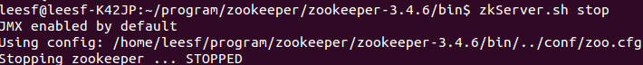

##【分布式】Zookeeper使用--命令行

##
##一、前言

##
##　　在学习了Zookeeper相关的理论知识后，下面接着学习对Zookeeper的相关操作。

##
##二、Zookeeper部署

##
##　　Zookeeper的部署相对来说还是比较简单，读者可以在网上找到相应的教程，点这里，笔者不再累赘。

##
##　　Zookeeper有三种运行形式：集群模式、单机模式、伪集群模式。

##
##　　以下实验都是在单机模式下进行。

##
##三、服务端

##
##　　bin目录下常用的脚本解释

##
##　　　　zkCleanup　　清理Zookeeper历史数据，包括食物日志文件和快照数据文件

##
##　　　　zkCli　　　　 Zookeeper的一个简易客户端

##
##　　　　zkEnv　　　　设置Zookeeper的环境变量

##
##　　　　zkServer　　  Zookeeper服务器的启动、停止、和重启脚本

##
##　　3.1 运行服务

##
##　　进入bin目录，使用zkServer.sh start启动服务

##
##　　 

##
##　　使用jps命令查看，存在QuorumPeerMain进程，表示Zookeeper已经启动

##
##　　 

##
##　　3.2 停止服务

##
##　　在bin目录下，使用zkServer.sh stop停止服务

##
##　　 

##
##　　使用jps命令查看，QuorumPeerMain进程已不存在，表示Zookeeper已经关闭

##
##　　 

##
##四、客户端

##
##　　4.1 打开客户端

##
##　　在服务端开启的情况下，运行客户端，使用如下命令：./zkCli.sh

##
##　　 

##
##　　 

##
##　　连接服务端成功，若连接不同的主机，可使用如下命令：./zkCli.sh -server ip:port

##
##　　可以使用帮助命令help来查看客户端的操作

##
##　　 

##
##　　4.2 创建节点

##
##　　使用create命令，可以创建一个Zookeeper节点， 如

##
##　　create [-s] [-e] path data acl

##
##　　其中，-s或-e分别指定节点特性，顺序或临时节点，若不指定，则表示持久节点；acl用来进行权限控制。

##
##　　① 创建顺序节点

##
##　　使用create -s /zk-test 123 命令创建zk-test顺序节点

##
##　　 

##
##　　可以看到创建的zk-test节点后面添加了一串数字以示区别。

##
##　　② 创建临时节点

##
##　　使用create -e /zk-temp 123 命令创建zk-temp临时节点

##
##　　 

##
##　　临时节点在客户端会话结束后，就会自动删除，下面使用quit命令退出客户端

##
##　　 

##
##　　再次使用客户端连接服务端，并使用ls / 命令查看根目录下的节点

##
##　　 

##
##　　可以看到根目录下已经不存在zk-temp临时节点了。

##
##　　③ 创建永久节点

##
##　　使用 create /zk-permanent 123 命令创建zk-permanent永久节点

##
##　　 

##
##　　可以看到永久节点不同于顺序节点，不会自动在后面添加一串数字。

##
##　　4.3 读取节点

##
##　　与读取相关的命令有ls 命令和get 命令，ls命令可以列出Zookeeper指定节点下的所有子节点，只能查看指定节点下的第一级的所有子节点；get命令可以获取Zookeeper指定节点的数据内容和属性信息。其用法分别如下

##
##　　ls path [watch]

##
##　　get path [watch]

##
##　　ls2 path [watch]

##
##　　若获取根节点下面的所有子节点，使用ls / 命令即可

##
##　　 

##
##　　若想获取根节点数据内容和属性信息，使用get / 命令即可

##
##　　 

##
##　　也可以使用ls2 / 命令查看

##
##　　 

##
##　　可以看到其子节点数量为8。

##
##　　若想获取/zk-permanent的数据内容和属性，可使用如下命令：get /zk-permanent

##
##　　 

##
##　　可以看到其数据内容为123，还有其他的属性，之后会详细介绍。

##
##　　4.4 更新节点

##
##　　使用set命令，可以更新指定节点的数据内容，用法如下

##
##　　set path data [version]

##
##　　其中，data就是要更新的新内容，version表示数据版本，如将/zk-permanent节点的数据更新为456，可以使用如下命令：set /zk-permanent 456

##
##　　 

##
##　　现在dataVersion已经变为1了，表示进行了更新。

##
##　　4.5 删除节点

##
##　　使用delete命令可以删除Zookeeper上的指定节点，用法如下

##
##　　delete path [version]

##
##　　其中version也是表示数据版本，使用delete /zk-permanent 命令即可删除/zk-permanent节点

##
##　　 

##
##　　可以看到，已经成功删除/zk-permanent节点。值得注意的是，若删除节点存在子节点，那么无法删除该节点，必须先删除子节点，再删除父节点。

##
##五、总结

##
##　　本篇博客主要讲解了在命令行情况下如何操作Zookeper的客户端和服务端，并且使用简单的命令完成对Zookeeper的一些操作，谢谢各位园友的观看～　　