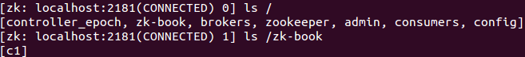

**一、前言**

上一篇博客已经介绍了如何使用Zookeeper提供的原生态Java API进行操作，本篇博文主要讲解如何通过开源客户端来进行操作。

**二、ZkClient**

ZkClient是在Zookeeper原声API接口之上进行了包装，是一个更易用的Zookeeper客户端，其内部还实现了诸如Session超时重连、Watcher反复注册等功能。

2.1 添加依赖

在pom.xml文件中添加如下内容即可。

    
    
            <dependency>
                <groupId>com.101tec</groupId>
                <artifactId>zkclient</artifactId>
                <version>0.2</version>
            </dependency>

2.2 创建会话

使用ZkClient可以轻松的创建会话，连接到服务端。

    
    
    package com.hust.grid.leesf.zkclient.examples;
    
    import java.io.IOException;
    import org.I0Itec.zkclient.ZkClient;
    
    public class Create_Session_Sample {
        public static void main(String[] args) throws IOException, InterruptedException {
            ZkClient zkClient = new ZkClient("127.0.0.1:2181", 5000);
            System.out.println("ZooKeeper session established.");
        }
    }

View Code

运行结果：

    
    
    ZooKeeper session established.

结果表明已经成功创建会话。

2.3 创建节点

ZkClient提供了递归创建节点的接口，即其帮助开发者完成父节点的创建，再创建子节点。

    
    
    package com.hust.grid.leesf.zkclient.examples;
    import org.I0Itec.zkclient.ZkClient;
    
    public class Create_Node_Sample {
        public static void main(String[] args) throws Exception {
            ZkClient zkClient = new ZkClient("127.0.0.1:2181", 5000);
            String path = "/zk-book/c1";
            zkClient.createPersistent(path, true);
            System.out.println("success create znode.");
        }
    }

View Code

运行结果：

    
    
    success create znode.

结果表明已经成功创建了节点，值得注意的是，在原生态接口中是无法创建成功的（父节点不存在），但是通过ZkClient可以递归的先创建父节点，再创建子节点。

可以看到确实成功创建了/zk-book和/zk-book/c1两个节点。

2.4 删除节点

ZkClient提供了递归删除节点的接口，即其帮助开发者先删除所有子节点（存在），再删除父节点。

    
    
    package com.hust.grid.leesf.zkclient.examples;
    
    import org.I0Itec.zkclient.ZkClient;
    
    public class Del_Data_Sample {
        public static void main(String[] args) throws Exception {
            String path = "/zk-book";
            ZkClient zkClient = new ZkClient("127.0.0.1:2181", 5000);
            zkClient.createPersistent(path, "");
            zkClient.createPersistent(path+"/c1", "");
            zkClient.deleteRecursive(path);
            System.out.println("success delete znode.");
        }
    }

View Code

运行结果:

    
    
    success delete znode.

结果表明ZkClient可直接删除带子节点的父节点，因为其底层先删除其所有子节点，然后再删除父节点。

2.5 获取子节点

    
    
    package com.hust.grid.leesf.zkclient.examples;
    
    import java.util.List;
    
    import org.I0Itec.zkclient.IZkChildListener;
    import org.I0Itec.zkclient.ZkClient;
    
    public class Get_Children_Sample {
    
        public static void main(String[] args) throws Exception {
            String path = "/zk-book";
            ZkClient zkClient = new ZkClient("127.0.0.1:2181", 5000);
            zkClient.subscribeChildChanges(path, new IZkChildListener() {
                public void handleChildChange(String parentPath, List<String> currentChilds) throws Exception {
                    System.out.println(parentPath + " "s child changed, currentChilds:" + currentChilds);
                }
            });
    
            zkClient.createPersistent(path);
            Thread.sleep(1000);
            zkClient.createPersistent(path + "/c1");
            Thread.sleep(1000);
            zkClient.delete(path + "/c1");
            Thread.sleep(1000);
            zkClient.delete(path);
            Thread.sleep(Integer.MAX_VALUE);
        }
    }

View Code

运行结果：

    
    
    /zk-book "s child changed, currentChilds:[]
    /zk-book "s child changed, currentChilds:[c1]
    /zk-book "s child changed, currentChilds:[]
    /zk-book "s child changed, currentChilds:null

结果表明：

客户端可以对一个不存在的节点进行子节点变更的监听。

一旦客户端对一个节点注册了子节点列表变更监听之后，那么当该节点的子节点列表发生变更时，服务端都会通知客户端，并将最新的子节点列表发送给客户端

该节点本身的创建或删除也会通知到客户端。

2.6 获取数据

    
    
    package com.hust.grid.leesf.zkclient.examples;
    
    import org.I0Itec.zkclient.IZkDataListener;
    import org.I0Itec.zkclient.ZkClient;
    
    public class Get_Data_Sample {
        public static void main(String[] args) throws Exception {
            String path = "/zk-book";
            ZkClient zkClient = new ZkClient("127.0.0.1:2181", 5000);
            zkClient.createEphemeral(path, "123");
    
            zkClient.subscribeDataChanges(path, new IZkDataListener() {
                public void handleDataDeleted(String dataPath) throws Exception {
                    System.out.println("Node " + dataPath + " deleted.");
                }
    
                public void handleDataChange(String dataPath, Object data) throws Exception {
                    System.out.println("Node " + dataPath + " changed, new data: " + data);
                }
            });
    
            System.out.println(zkClient.readData(path));
            zkClient.writeData(path, "456");
            Thread.sleep(1000);
            zkClient.delete(path);
            Thread.sleep(Integer.MAX_VALUE);
        }
    }

View Code

运行结果：

    
    
    123
    Node /zk-book changed, new data: 456
    Node /zk-book deleted.

结果表明可以成功监听节点数据变化或删除事件。

2.7 检测节点是否存在

    
    
    package com.hust.grid.leesf.zkclient.examples;
    
    import org.I0Itec.zkclient.ZkClient;
    
    public class Exist_Node_Sample {
        public static void main(String[] args) throws Exception {
            String path = "/zk-book";
            ZkClient zkClient = new ZkClient("127.0.0.1:2181", 2000);
            System.out.println("Node " + path + " exists " + zkClient.exists(path));
        }
    }

View Code

运行结果：

    
    
    Node /zk-book exists false

结果表明，可以通过ZkClient轻易检测节点是否存在，其相比于原生态的接口更易于理解。

**三、Curator客户端**

Curator解决了很多Zookeeper客户端非常底层的细节开发工作，包括连接重连，反复注册Watcher和NodeExistsException异常等，现已成为Apache的顶级项目。

3.1 添加依赖

在pom.xml文件中添加如下内容即可。

    
    
            <!-- https://mvnrepository.com/artifact/org.apache.curator/apache-curator -->
            <dependency>
                <groupId>org.apache.curator</groupId>
                <artifactId>curator-framework</artifactId>
                <version>2.4.2</version>
            </dependency>

3.2 创建会话

Curator除了使用一般方法创建会话外，还可以使用fluent风格进行创建。

    
    
    package com.hust.grid.leesf.curator.examples;
    
    import org.apache.curator.RetryPolicy;
    import org.apache.curator.framework.CuratorFramework;
    import org.apache.curator.framework.CuratorFrameworkFactory;
    import org.apache.curator.retry.ExponentialBackoffRetry;
    
    public class Create_Session_Sample {
        public static void main(String[] args) throws Exception {
            RetryPolicy retryPolicy = new ExponentialBackoffRetry(1000, 3);
            CuratorFramework client = CuratorFrameworkFactory.newClient("127.0.0.1:2181", 5000, 3000, retryPolicy);
            client.start();
            System.out.println("Zookeeper session1 established. ");
            CuratorFramework client1 = CuratorFrameworkFactory.builder().connectString("127.0.0.1:2181")
                    .sessionTimeoutMs(5000).retryPolicy(retryPolicy).namespace("base").build();
            client1.start();
            System.out.println("Zookeeper session2 established. ");        
        }
    }

View Code

运行结果：

    
    
    Zookeeper session1 established. 
    Zookeeper session2 established. 

值得注意的是session2会话含有隔离命名空间，即客户端对Zookeeper上数据节点的任何操作都是相对/base目录进行的，这有利于实现不同的Zookeeper的业务之间的隔离。

3.3 创建节点

通过使用Fluent风格的接口，开发人员可以进行自由组合来完成各种类型节点的创建。

    
    
    package com.hust.grid.leesf.curator.examples;
    
    import org.apache.curator.framework.CuratorFramework;
    import org.apache.curator.framework.CuratorFrameworkFactory;
    import org.apache.curator.retry.ExponentialBackoffRetry;
    import org.apache.zookeeper.CreateMode;
    
    public class Create_Node_Sample {
        public static void main(String[] args) throws Exception {
            String path = "/zk-book/c1";
            CuratorFramework client = CuratorFrameworkFactory.builder().connectString("127.0.0.1:2181")
                    .sessionTimeoutMs(5000).retryPolicy(new ExponentialBackoffRetry(1000, 3)).build();
            client.start();
            client.create().creatingParentsIfNeeded().withMode(CreateMode.EPHEMERAL).forPath(path, "init".getBytes());
            System.out.println("success create znode: " + path);
        }
    }

View Code

运行结果：

    
    
    success create znode: /zk-book/c1

其中，也创建了/zk-book/c1的父节点/zk-book节点。

3.4 删除节点

    
    
    package com.hust.grid.leesf.curator.examples;
    
    import org.apache.curator.framework.CuratorFramework;
    import org.apache.curator.framework.CuratorFrameworkFactory;
    import org.apache.curator.retry.ExponentialBackoffRetry;
    import org.apache.zookeeper.CreateMode;
    import org.apache.zookeeper.data.Stat;
    
    public class Del_Data_Sample {
        public static void main(String[] args) throws Exception {
            String path = "/zk-book/c1";
            CuratorFramework client = CuratorFrameworkFactory.builder().connectString("127.0.0.1:2181")
                    .sessionTimeoutMs(5000).retryPolicy(new ExponentialBackoffRetry(1000, 3)).build();
            client.start();
            client.create().creatingParentsIfNeeded().withMode(CreateMode.EPHEMERAL).forPath(path, "init".getBytes());
            Stat stat = new Stat();
            System.out.println(new String(client.getData().storingStatIn(stat).forPath(path)));
            client.delete().deletingChildrenIfNeeded().withVersion(stat.getVersion()).forPath(path);
            System.out.println("success delete znode " + path);
            Thread.sleep(Integer.MAX_VALUE);
        }
    }

View Code

运行结果：

    
    
    init
    success delete znode /zk-book/c1

结果表明成功删除/zk-book/c1节点。

3.5 获取数据

    
    
    package com.hust.grid.leesf.curator.examples;
    
    import org.apache.curator.framework.CuratorFramework;
    import org.apache.curator.framework.CuratorFrameworkFactory;
    import org.apache.curator.retry.ExponentialBackoffRetry;
    import org.apache.zookeeper.CreateMode;
    import org.apache.zookeeper.data.Stat;
    
    public class Get_Data_Sample {
        public static void main(String[] args) throws Exception {
            String path = "/zk-book";
            CuratorFramework client = CuratorFrameworkFactory.builder().connectString("127.0.0.1:2181")
                    .sessionTimeoutMs(5000).retryPolicy(new ExponentialBackoffRetry(1000, 3)).build();
            client.start();
            client.create().creatingParentsIfNeeded().withMode(CreateMode.EPHEMERAL).forPath(path, "init".getBytes());
            Stat stat = new Stat();
            System.out.println(new String(client.getData().storingStatIn(stat).forPath(path)));
        }
    }

View Code

运行结果：

    
    
    init

结果表明成功获取了节点的数据。

3.6 更新数据

    
    
    package com.hust.grid.leesf.curator.examples;
    
    import org.apache.curator.framework.CuratorFramework;
    import org.apache.curator.framework.CuratorFrameworkFactory;
    import org.apache.curator.retry.ExponentialBackoffRetry;
    import org.apache.zookeeper.CreateMode;
    import org.apache.zookeeper.data.Stat;
    
    public class Set_Data_Sample {
        public static void main(String[] args) throws Exception {
            String path = "/zk-book";
            CuratorFramework client = CuratorFrameworkFactory.builder().connectString("127.0.0.1:2181")
                    .sessionTimeoutMs(5000).retryPolicy(new ExponentialBackoffRetry(1000, 3)).build();
            client.start();
            client.create().creatingParentsIfNeeded().withMode(CreateMode.EPHEMERAL).forPath(path, "init".getBytes());
            Stat stat = new Stat();
            client.getData().storingStatIn(stat).forPath(path);
            System.out.println("Success set node for : " + path + ", new version: "
                    + client.setData().withVersion(stat.getVersion()).forPath(path).getVersion());
            try {
                client.setData().withVersion(stat.getVersion()).forPath(path);
            } catch (Exception e) {
                System.out.println("Fail set node due to " + e.getMessage());
            }
        }
    }

View Code

运行结果：

    
    
    Success set node for : /zk-book, new version: 1
    Fail set node due to KeeperErrorCode = BadVersion for /zk-book

结果表明当携带数据版本不一致时，无法完成更新操作。

3.7 异步接口

如同Zookeeper原生API提供了异步接口，Curator也提供了异步接口。在Zookeeper中，所有的异步通知事件处理都是由EventThread这个线程来处理的，EventThread线程用于串行处理所有的事件通知，其可以保证对事件处理的顺序性，但是一旦碰上复杂的处理单元，会消耗过长的处理时间，从而影响其他事件的处理，Curator允许用户传入Executor实例，这样可以将比较复杂的事件处理放到一个专门的线程池中去。

    
    
    package com.hust.grid.leesf.curator.examples;
    
    import java.util.concurrent.CountDownLatch;
    import java.util.concurrent.ExecutorService;
    import java.util.concurrent.Executors;
    
    import org.apache.curator.framework.CuratorFramework;
    import org.apache.curator.framework.CuratorFrameworkFactory;
    import org.apache.curator.framework.api.BackgroundCallback;
    import org.apache.curator.framework.api.CuratorEvent;
    import org.apache.curator.retry.ExponentialBackoffRetry;
    import org.apache.zookeeper.CreateMode;
    
    public class Create_Node_Background_Sample {
        static String path = "/zk-book";
        static CuratorFramework client = CuratorFrameworkFactory.builder().connectString("127.0.0.1:2181")
                .sessionTimeoutMs(5000).retryPolicy(new ExponentialBackoffRetry(1000, 3)).build();
        static CountDownLatch semaphore = new CountDownLatch(2);
        static ExecutorService tp = Executors.newFixedThreadPool(2);
    
        public static void main(String[] args) throws Exception {
            client.start();
            System.out.println("Main thread: " + Thread.currentThread().getName());
    
            client.create().creatingParentsIfNeeded().withMode(CreateMode.EPHEMERAL).inBackground(new BackgroundCallback() {
                public void processResult(CuratorFramework client, CuratorEvent event) throws Exception {
                    System.out.println("event[code: " + event.getResultCode() + ", type: " + event.getType() + "]" + ", Thread of processResult: " + Thread.currentThread().getName());
                    System.out.println();
                    semaphore.countDown();
                }
            }, tp).forPath(path, "init".getBytes());
    
            client.create().creatingParentsIfNeeded().withMode(CreateMode.EPHEMERAL).inBackground(new BackgroundCallback() {
                public void processResult(CuratorFramework client, CuratorEvent event) throws Exception {
                    System.out.println("event[code: " + event.getResultCode() + ", type: " + event.getType() + "]" + ", Thread of processResult: " + Thread.currentThread().getName());
                    semaphore.countDown();
                }
            }).forPath(path, "init".getBytes());
    
            semaphore.await();
            tp.shutdown();
        }
    }

View Code

运行结果：

    
    
    Main thread: main
    event[code: -110, type: CREATE], Thread of processResult: main-EventThread
    event[code: 0, type: CREATE], Thread of processResult: pool-3-thread-1

其中，创建节点的事件由线程池自己处理，而非默认线程处理。

Curator除了提供很便利的API，还提供了一些典型的应用场景，开发人员可以使用参考更好的理解如何使用Zookeeper客户端，所有的都在recipes包中，只需要在pom.xml中添加如下依赖即可

    
    
    <dependency>
       <groupId>org.apache.curator</groupId>
       <artifactId>curator-recipes</artifactId>
       <version>2.4.2</version>  
    </dependency>

3.8 节点监听

    
    
    package com.hust.grid.leesf.curator.examples;
    
    import org.apache.curator.framework.CuratorFramework;
    import org.apache.curator.framework.CuratorFrameworkFactory;
    import org.apache.curator.framework.recipes.cache.NodeCache;
    import org.apache.curator.framework.recipes.cache.NodeCacheListener;
    import org.apache.curator.retry.ExponentialBackoffRetry;
    import org.apache.zookeeper.CreateMode;
    
    public class NodeCache_Sample {
        static String path = "/zk-book/nodecache";
        static CuratorFramework client = CuratorFrameworkFactory.builder().connectString("127.0.0.1:2181")
                .sessionTimeoutMs(5000).retryPolicy(new ExponentialBackoffRetry(1000, 3)).build();
    
        public static void main(String[] args) throws Exception {
            client.start();
            client.create().creatingParentsIfNeeded().withMode(CreateMode.EPHEMERAL).forPath(path, "init".getBytes());
            final NodeCache cache = new NodeCache(client, path, false);
            cache.start(true);
            cache.getListenable().addListener(new NodeCacheListener() {
                public void nodeChanged() throws Exception {
                    System.out.println("Node data update, new data: " + new String(cache.getCurrentData().getData()));
                }
            });
            client.setData().forPath(path, "u".getBytes());
            Thread.sleep(1000);
            client.delete().deletingChildrenIfNeeded().forPath(path);
            Thread.sleep(Integer.MAX_VALUE);
        }
    }

View Code

运行结果：

    
    
    Node data update, new data: u

当节点数据变更后收到了通知。NodeCache不仅可以监听数据节点的内容变更，也能监听指定节点是否存在。

3.9 子节点监听

    
    
    package com.hust.grid.leesf.curator.examples;
    
    import org.apache.curator.framework.CuratorFramework;
    import org.apache.curator.framework.CuratorFrameworkFactory;
    import org.apache.curator.framework.recipes.cache.PathChildrenCache;
    import org.apache.curator.framework.recipes.cache.PathChildrenCache.StartMode;
    import org.apache.curator.framework.recipes.cache.PathChildrenCacheEvent;
    import org.apache.curator.framework.recipes.cache.PathChildrenCacheListener;
    import org.apache.curator.retry.ExponentialBackoffRetry;
    import org.apache.zookeeper.CreateMode;
    
    public class PathChildrenCache_Sample {
        static String path = "/zk-book";
        static CuratorFramework client = CuratorFrameworkFactory.builder().connectString("127.0.0.1:2181")
                .retryPolicy(new ExponentialBackoffRetry(1000, 3)).sessionTimeoutMs(5000).build();
    
        public static void main(String[] args) throws Exception {
            client.start();
            PathChildrenCache cache = new PathChildrenCache(client, path, true);
            cache.start(StartMode.POST_INITIALIZED_EVENT);
            cache.getListenable().addListener(new PathChildrenCacheListener() {
                public void childEvent(CuratorFramework client, PathChildrenCacheEvent event) throws Exception {
                    switch (event.getType()) {
                    case CHILD_ADDED:
                        System.out.println("CHILD_ADDED," + event.getData().getPath());
                        break;
                    case CHILD_UPDATED:
                        System.out.println("CHILD_UPDATED," + event.getData().getPath());
                        break;
                    case CHILD_REMOVED:
                        System.out.println("CHILD_REMOVED," + event.getData().getPath());
                        break;
                    default:
                        break;
                    }
                }
            });
            client.create().withMode(CreateMode.PERSISTENT).forPath(path);
            Thread.sleep(1000);
            client.create().withMode(CreateMode.PERSISTENT).forPath(path + "/c1");
            Thread.sleep(1000);
            client.delete().forPath(path + "/c1");
            Thread.sleep(1000);
            client.delete().forPath(path);
            Thread.sleep(Integer.MAX_VALUE);
        }
    }

View Code

运行结果：

    
    
    CHILD_ADDED,/zk-book/c1
    CHILD_REMOVED,/zk-book/c1

监听节点的子节点，包括新增、数据变化、删除三类事件。

3.10 Master选举

借助Zookeeper，开发者可以很方便地实现Master选举功能，其大体思路如下：选择一个根节点，如/master_select，多台机器同时向该节点创建一个子节点/master_select/lock，利用Zookeeper特性，最终只有一台机器能够成功创建，成功的那台机器就是Master。

    
    
    package com.hust.grid.leesf.curator.examples;
    
    import org.apache.curator.framework.CuratorFramework;
    import org.apache.curator.framework.CuratorFrameworkFactory;
    import org.apache.curator.framework.recipes.leader.LeaderSelector;
    import org.apache.curator.framework.recipes.leader.LeaderSelectorListenerAdapter;
    import org.apache.curator.retry.ExponentialBackoffRetry;
    
    public class Recipes_MasterSelect {
        static String master_path = "/curator_recipes_master_path";
        static CuratorFramework client = CuratorFrameworkFactory.builder().connectString("127.0.0.1:2181")
                .retryPolicy(new ExponentialBackoffRetry(1000, 3)).build();
    
        public static void main(String[] args) throws Exception {
            client.start();
            LeaderSelector selector = new LeaderSelector(client, master_path, new LeaderSelectorListenerAdapter() {
                public void takeLeadership(CuratorFramework client) throws Exception {
                    System.out.println("成为Master角色");
                    Thread.sleep(3000);
                    System.out.println("完成Master操作，释放Master权利");
                }
            });
            selector.autoRequeue();
            selector.start();
            Thread.sleep(Integer.MAX_VALUE);
        }
    }

View Code

运行结果：

    
    
    成为Master角色
    完成Master操作，释放Master权利
    成为Master角色

以上结果会反复循环，并且当一个应用程序完成Master逻辑后，另外一个应用程序的相应方法才会被调用，即当一个应用实例成为Master后，其他应用实例会进入等待，直到当前Master挂了或者推出后才会开始选举Master。

3.11 分布式锁

为了保证数据的一致性，经常在程序的某个运行点需要进行同步控制。以流水号生成场景为例，普通的后台应用通常采用时间戳方式来生成流水号，但是在用户量非常大的情况下，可能会出现并发问题。

    
    
    package com.hust.grid.leesf.curator.examples;
    
    import java.text.SimpleDateFormat;
    import java.util.Date;
    import java.util.concurrent.CountDownLatch;
    
    public class Recipes_NoLock {
        public static void main(String[] args) throws Exception {
            final CountDownLatch down = new CountDownLatch(1);
            for (int i = 0; i < 10; i++) {
                new Thread(new Runnable() {
                    public void run() {
                        try {
                            down.await();
                        } catch (Exception e) {
                        }
                        SimpleDateFormat sdf = new SimpleDateFormat("HH:mm:ss|SSS");
                        String orderNo = sdf.format(new Date());
                        System.err.println("生成的订单号是 : " + orderNo);
                    }
                }).start();
            }
            down.countDown();
        }
    }

View Code

运行结果：

    
    
    生成的订单号是 : 16:29:10|590
    生成的订单号是 : 16:29:10|590
    生成的订单号是 : 16:29:10|591
    生成的订单号是 : 16:29:10|591
    生成的订单号是 : 16:29:10|590
    生成的订单号是 : 16:29:10|590
    生成的订单号是 : 16:29:10|591
    生成的订单号是 : 16:29:10|590
    生成的订单号是 : 16:29:10|592
    生成的订单号是 : 16:29:10|591

结果表示订单号出现了重复，即普通的方法无法满足业务需要，因为其未进行正确的同步。可以使用Curator来实现分布式锁功能。

    
    
    package com.hust.grid.leesf.curator.examples;
    
    import java.text.SimpleDateFormat;
    import java.util.Date;
    import java.util.concurrent.CountDownLatch;
    import org.apache.curator.framework.CuratorFramework;
    import org.apache.curator.framework.CuratorFrameworkFactory;
    import org.apache.curator.framework.recipes.locks.InterProcessMutex;
    import org.apache.curator.retry.ExponentialBackoffRetry;
    
    public class Recipes_Lock {
        static String lock_path = "/curator_recipes_lock_path";
        static CuratorFramework client = CuratorFrameworkFactory.builder().connectString("127.0.0.1:2181")
                .retryPolicy(new ExponentialBackoffRetry(1000, 3)).build();
    
        public static void main(String[] args) throws Exception {
            client.start();
            final InterProcessMutex lock = new InterProcessMutex(client, lock_path);
            final CountDownLatch down = new CountDownLatch(1);
            for (int i = 0; i < 30; i++) {
                new Thread(new Runnable() {
                    public void run() {
                        try {
                            down.await();
                            lock.acquire();
                        } catch (Exception e) {
                        }
                        SimpleDateFormat sdf = new SimpleDateFormat("HH:mm:ss|SSS");
                        String orderNo = sdf.format(new Date());
                        System.out.println("生成的订单号是 : " + orderNo);
                        try {
                            lock.release();
                        } catch (Exception e) {
                        }
                    }
                }).start();
            }
            down.countDown();
        }
    }

View Code

运行结果：

    
    
    生成的订单号是 : 16:31:50|293
    生成的订单号是 : 16:31:50|319
    生成的订单号是 : 16:31:51|278
    生成的订单号是 : 16:31:51|326
    生成的订单号是 : 16:31:51|402
    生成的订单号是 : 16:31:51|420
    生成的订单号是 : 16:31:51|546
    生成的订单号是 : 16:31:51|602
    生成的订单号是 : 16:31:51|626
    生成的订单号是 : 16:31:51|656
    生成的订单号是 : 16:31:51|675
    生成的订单号是 : 16:31:51|701
    生成的订单号是 : 16:31:51|708
    生成的订单号是 : 16:31:51|732
    生成的订单号是 : 16:31:51|763
    生成的订单号是 : 16:31:51|785
    生成的订单号是 : 16:31:51|805
    生成的订单号是 : 16:31:51|823
    生成的订单号是 : 16:31:51|839
    生成的订单号是 : 16:31:51|853
    生成的订单号是 : 16:31:51|868
    生成的订单号是 : 16:31:51|884
    生成的订单号是 : 16:31:51|897
    生成的订单号是 : 16:31:51|910
    生成的订单号是 : 16:31:51|926
    生成的订单号是 : 16:31:51|939
    生成的订单号是 : 16:31:51|951
    生成的订单号是 : 16:31:51|965
    生成的订单号是 : 16:31:51|972
    生成的订单号是 : 16:31:51|983

结果表明此时已经不存在重复的流水号。

3.12 分布式计数器

分布式计数器的典型应用是统计系统的在线人数，借助Zookeeper也可以很方便实现分布式计数器功能：指定一个Zookeeper数据节点作为计数器，多个应用实例在分布式锁的控制下，通过更新节点的内容来实现计数功能。

    
    
    package com.hust.grid.leesf.curator.examples;
    
    import org.apache.curator.framework.CuratorFramework;
    import org.apache.curator.framework.CuratorFrameworkFactory;
    import org.apache.curator.framework.recipes.atomic.AtomicValue;
    import org.apache.curator.framework.recipes.atomic.DistributedAtomicInteger;
    import org.apache.curator.retry.ExponentialBackoffRetry;
    import org.apache.curator.retry.RetryNTimes;
    
    public class Recipes_DistAtomicInt {
        static String distatomicint_path = "/curator_recipes_distatomicint_path";
        static CuratorFramework client = CuratorFrameworkFactory.builder().connectString("127.0.0.1:2181")
                .retryPolicy(new ExponentialBackoffRetry(1000, 3)).build();
    
        public static void main(String[] args) throws Exception {
            client.start();
            DistributedAtomicInteger atomicInteger = new DistributedAtomicInteger(client, distatomicint_path,
                    new RetryNTimes(3, 1000));
            AtomicValue<Integer> rc = atomicInteger.add(8);
            System.out.println("Result: " + rc.succeeded());
        }
    }

View Code

运行结果：

    
    
    Result: true

结果表明已经将数据成功写入数据节点中。

3.13 分布式Barrier

如同JDK的CyclicBarrier，Curator提供了DistributedBarrier来实现分布式Barrier。

    
    
    package com.hust.grid.leesf.curator.examples;
    
    import org.apache.curator.framework.CuratorFramework;
    import org.apache.curator.framework.CuratorFrameworkFactory;
    import org.apache.curator.framework.recipes.barriers.DistributedBarrier;
    import org.apache.curator.retry.ExponentialBackoffRetry;
    
    public class Recipes_Barrier {
        static String barrier_path = "/curator_recipes_barrier_path";
        static DistributedBarrier barrier;
    
        public static void main(String[] args) throws Exception {
            for (int i = 0; i < 5; i++) {
                new Thread(new Runnable() {
                    public void run() {
                        try {
                            CuratorFramework client = CuratorFrameworkFactory.builder()
                                    .connectString("127.0.0.1:2181")
                                    .retryPolicy(new ExponentialBackoffRetry(1000, 3)).build();
                            client.start();
                            barrier = new DistributedBarrier(client, barrier_path);
                            System.out.println(Thread.currentThread().getName() + "号barrier设置");
                            barrier.setBarrier();
                            barrier.waitOnBarrier();
                            System.err.println("启动...");
                        } catch (Exception e) {
                        }
                    }
                }).start();
            }
            Thread.sleep(2000);
            barrier.removeBarrier();
        }
    }

View Code

运行结果：

    
    
    Thread-1号barrier设置
    Thread-2号barrier设置
    Thread-4号barrier设置
    Thread-3号barrier设置
    Thread-0号barrier设置
    启动...
    启动...
    启动...
    启动...
    启动...

结果表明通过DistributedBarrier可以实现类似于CyclicBarrier的分布式Barrier功能。

**四、Curator工具类**

4.1 ZKPaths

其提供了简单的API来构建znode路径、递归创建、删除节点等。

    
    
     package com.hust.grid.leesf.curator.examples;
    
    import org.apache.curator.framework.CuratorFramework;
    import org.apache.curator.framework.CuratorFrameworkFactory;
    import org.apache.curator.retry.ExponentialBackoffRetry;
    import org.apache.curator.utils.ZKPaths;
    import org.apache.curator.utils.ZKPaths.PathAndNode;
    import org.apache.zookeeper.ZooKeeper;
    
    public class ZKPaths_Sample {
        static String path = "/curator_zkpath_sample";
        static CuratorFramework client = CuratorFrameworkFactory.builder().connectString("127.0.0.1:2181")
                .sessionTimeoutMs(5000).retryPolicy(new ExponentialBackoffRetry(1000, 3)).build();
    
        public static void main(String[] args) throws Exception {
            client.start();
            ZooKeeper zookeeper = client.getZookeeperClient().getZooKeeper();
    
            System.out.println(ZKPaths.fixForNamespace(path, "sub"));
            System.out.println(ZKPaths.makePath(path, "sub"));
            System.out.println(ZKPaths.getNodeFromPath("/curator_zkpath_sample/sub1"));
    
            PathAndNode pn = ZKPaths.getPathAndNode("/curator_zkpath_sample/sub1");
            System.out.println(pn.getPath());
            System.out.println(pn.getNode());
    
            String dir1 = path + "/child1";
            String dir2 = path + "/child2";
            ZKPaths.mkdirs(zookeeper, dir1);
            ZKPaths.mkdirs(zookeeper, dir2);
            System.out.println(ZKPaths.getSortedChildren(zookeeper, path));
    
            ZKPaths.deleteChildren(client.getZookeeperClient().getZooKeeper(), path, true);
        }
    }

View Code

运行结果：

    
    
    /curator_zkpath_sample/sub
    /curator_zkpath_sample/sub
    sub1
    /curator_zkpath_sample
    sub1
    [child1, child2]

借助ZKPaths可快速方便的完成节点的创建等操作。

4.2 EnsurePath

其提供了一种能够确保数据节点存在的机制，当上层业务希望对一个数据节点进行操作时，操作前需要确保该节点存在。

    
    
    package com.hust.grid.leesf.curator.examples;
    
    import org.apache.curator.framework.CuratorFramework;
    import org.apache.curator.framework.CuratorFrameworkFactory;
    import org.apache.curator.retry.ExponentialBackoffRetry;
    import org.apache.curator.utils.EnsurePath;
    
    public class EnsurePathDemo {
        static String path = "/zk-book/c1";
        static CuratorFramework client = CuratorFrameworkFactory.builder().connectString("127.0.0.1:2181")
                .sessionTimeoutMs(5000).retryPolicy(new ExponentialBackoffRetry(1000, 3)).build();
    
        public static void main(String[] args) throws Exception {
            client.start();
            client.usingNamespace("zk-book");
    
            EnsurePath ensurePath = new EnsurePath(path);
            ensurePath.ensure(client.getZookeeperClient());
            ensurePath.ensure(client.getZookeeperClient());
    
            EnsurePath ensurePath2 = client.newNamespaceAwareEnsurePath("/c1");
            ensurePath2.ensure(client.getZookeeperClient());
        }
    }

View Code

EnsurePath采取了如下节点创建方式，试图创建指定节点，如果节点已经存在，那么就不进行任何操作，也不对外抛出异常，否则正常创建数据节点。

**五、总结**

本篇介绍了使用Zookeeper的开源客户端如何操作Zookeeper的方法，相应的源码也已经上传至[github](https://github.com/leesf/zookeeper_examples)，谢谢各位园友的观看～

