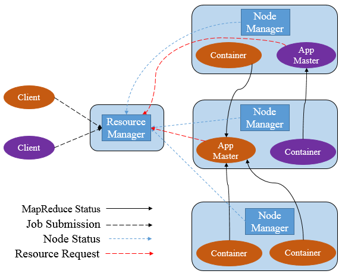
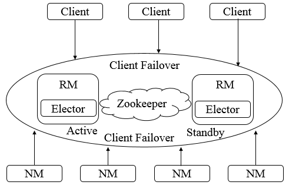
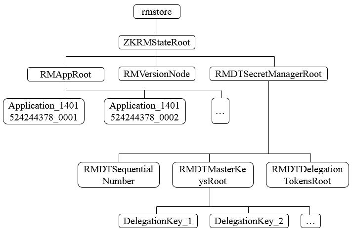
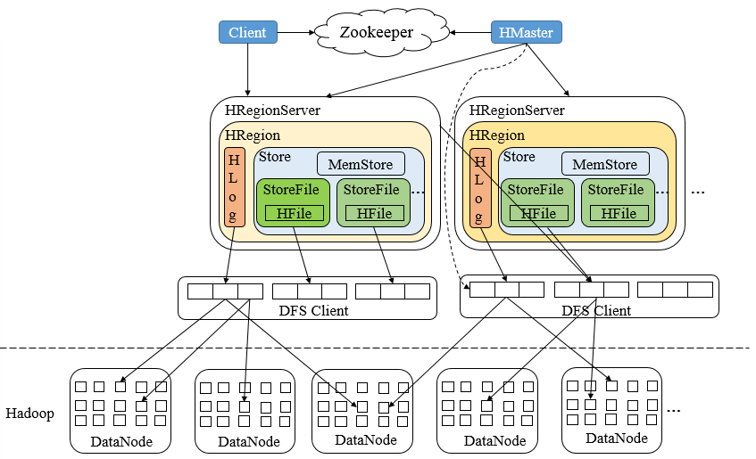
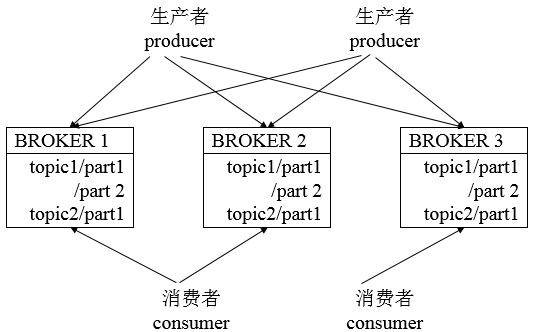

**一、前言**

上一篇博文讲解了Zookeeper的典型应用场景，在大数据时代，各种分布式系统层出不穷，其中，有很多系统都直接或间接使用了Zookeeper，用来解决诸如配置管理、分布式通知/协调、集群管理和Master选举等一系列分布式问题。

**二、 Hadoop**

Hadoop的核心是HDFS（Hadoop Distributed File
System）和MapReduce，分别提供了对海量数据的存储和计算能力，后来，Hadoop又引入了全新MapReduce框架YARN（Yet
Another Resource Negotiator）。在Hadoop中 ， **Zookeeper主要用于实现HA** （High
Availability），这部分逻辑主要集中在Hadoop
Common的HA模块中，HDFS的NameNode与YARN的ResourceManager都是基于此HA模块来实现自己的HA功能，YARN又使用了Zookeeper来存储应用的运行状态。

**YARN**

YARN是一种新的 Hadoop
资源管理器，它是一个通用资源管理系统，可为上层应用提供统一的资源管理和调度，它的引入为集群在利用率、资源统一管理和数据共享等方面带来了巨大好处。其可以支持MapReduce模型，同时也支持Tez、Spark、Storm、Impala、Open
MPI等。

YARN主要由
**ResourceManager（RM）、NodeManager（NM）、ApplicationManager（AM）、Container**
四部分构成。其中，ResourceManager为全局资源管理器，负责整个系统的资源管理和分配。由YARN体系架构可以看到ResourceManager的单点问题，ResourceManager的工作状况直接决定了整个YARN架构是否可以正常运转。

**ResourceManager HA**

为了解决ResourceManager的单点问题，YARN设计了一套Active/Standby模式的ResourceManager HA架构。

由上图可知，在运行期间，
**会有多个ResourceManager并存，并且其中只有一个ResourceManager处于Active状态，另外一些（允许一个或者多个）则处于Standby状态，当Active节点无法正常工作时，其余处于Standby状态的节点则会通过竞争选举产生新的Active节点。**

**主备切换**

ResourceManager使用基于Zookeeper实现的ActiveStandbyElector组件来确定ResourceManager的状态。具体步骤如下

1\. **创建锁节点。** 在Zookeeper上会有一个类似于/yarn-leader-election/pseudo-yarn-rm-
cluster的锁节点，所有的ResourceManager在启动时，都会去竞争写一个Lock子节点（/yarn-leader-
election/pseudo-yarn-rm-
cluster/ActiveStandbyElectorLock），子节点类型为临时节点，利用Zookeeper的特性，创建成功的那个ResourceManager切换为Active状态，其余的为Standby状态。

2\. **注册Watcher监听。** 所有Standby状态的ResourceManager都会向/yarn-leader-
election/pseudo-yarn-rm-
cluster/ActiveStandbyElectorLock节点注册一个节点变更监听，利用临时节点的特性，能够快速感知到Active状态的ResourceManager的运行情况。

3\. **主备切换。**
当Active的ResourceManager无法正常工作时，其创建的Lock节点也会被删除，此时，其余各个Standby的ResourceManager都会收到通知，然后重复步骤1。

**隔离（Fencing）**

在分布式环境中，经常会出现诸如单机 **假死**
（机器由于网络闪断或是其自身由于负载过高，常见的有GC占用时间过长或CPU负载过高，而无法正常地对外进行及时响应）情况。假设RM集群由RM1和RM2两台机器构成，某一时刻，RM1发生了假死，此时，Zookeeper认为RM1挂了，然后进行主备切换，RM2会成为Active状态，但是在随后，RM1恢复了正常，其依然认为自己还处于Active状态，这就是分布式脑裂现象，即存在多个处于Active状态的RM工作，可以使用隔离来解决此类问题。

YARN引入了Fencing机制，借助Zookeeper的数据节点的ACL权限控制机制来实现不同RM之间的隔离。在上述主备切换时，多个RM之间通过竞争创建锁节点来实现主备状态的确定，此时，只需要在创建节点时携带Zookeeper的ACL信息，目的是为了独占该节点，以防止其他RM对该节点进行更新。

还是上述案例，若RM1出现假死，Zookeeper会移除其创建的节点，此时RM2会创建相应的锁节点并切换至Active状态，RM1恢复之后，会试图去更新Zookeeper相关数据，但是此时其没有权限更新Zookeeper的相关节点数据，因为节点不是由其创建的，于是就自动切换至Standby状态，这样就避免了脑裂现象的出现。

**ResourceManager状态存储**

在ResourceManager中，RMStateStore可以存储一些RM的内部状态信息，包括Application以及Attempts信息、Delegation
Token及Version
Information等，值得注意的是，RMStateStore的绝大多数状态信息都是不需要持久化存储的（如资源使用情况），因为其很容易从上下文信息中重构，，在存储方案设计中，提供了三种可能的实现。

1\. 基于内存实现，一般用于日常开发测试。

2\. 基于文件系统实现，如HDFS。

3\. 基于Zookeeper实现。

由于存储的信息不是特别大，Hadoop官方建议基于Zookeeper来实现状态信息的存储，在Zookeeper中，ResourceManager的状态信息都被存储在/rmstore这个根节点下，其数据结构如下。

在RMAppRoot节点下存储的是与各个Application相关的信息，RMDTSecretManagerRoot存储的是与安全相关的Token信息。每个Active状态的ResourceManager在初始化节点都会从Zookeeper上读取到这些信息，并根据这些状态信息继续后续的处理。

**三、HBase**

HBase（Hadoop
Database）是一个基于Hadoop的文件系统设计的面向海量数据的高可靠、高性能、面向列、可伸缩的分布式存储系统，其针对数据写入具有强一致性，索引列也实现了强一致性，其采用了Zookeeper服务来完成对整个系统的分布式协调工作，其架构如下

HBase架构中，
**Zookeeper是串联起HBase集群与Client的关键所在，Zookeeper在HBase中的系统容错、RootRegion管理、Region状态管理、分布式SplitLog任务管理、Replication管理都扮演重要角色**
。

**系统容错**

在HBase启动时，每个RegionServer服务器都会到Zookeeper的/hbase/rs节点下创建一个信息节点，例如/hbase/rs/[Hostname]，同时，HMaster会对这个节点进行监听，当某个RegionServer挂掉时，Zookeeper会因为在一段时间内无法接收其心跳信息（Session失效），而删除掉该RegionServer服务器对应的节点，与此同时，HMaster则会接收到Zookeeper的NodeDelete通知，从而感知到某个节点断开，并立即开始容错工作，HMaster会将该RegionServer所处理的数据分片（Region）重新路由到其他节点上，并记录到Meta信息中供客户端查询。

**RootRegion管理**

数据存储的位置信息是记录在元数据分片上的，即在RootRegion上，每次客户端发起新的请求，就会查询RootRegion来确定数据的位置，而RootRegion自身的位置则记录在Zookeeper上（默认情况下在/hbase/root-
region-
server节点中）。当RootRegion发生变化时，如Region手工移动、Balance或者是RootRegion所在服务器发生了故障，就能通过Zookeeper来感知到这一变化并做出一系列相应的容灾措施，从而保障客户端总能够拿到正确的RootRegion信息。

**Region状态管理**

**Region是HBase中数据的物理切片，每个Region记录了全局数据的一小部分，并且不同的Region之间的数据是相互不重复的**
。但对于一个分布式系统来说，Region是会发生变更的，原因可能是系统故障、负载均衡、配置修改、Region分裂合并等，一旦Region发生变动，它必然经历离线和重新在线的过程。在离线期间，数据是不能被访问的，并且Region的状态变化必须让全局知晓，否则可能会出现某些事务性的异常，而对于HBase集群而言，Region的数量可能会多达10万级别，因此这样规模的Region状态管理只有依靠Zookeeper才能做到。

**分布式SplitLog任务管理**

当某台RegionServer服务器挂掉后，由于总有一部分新写入的数据还没有持久化到HFile中（在内存中），因此在迁移该RegionServer的服务时，应该从HLog中恢复这部分还在内存中的数据，此时HMaster需要遍历该RegionServer服务器的HLog（SplitLog），并按照Region切分成小块移动到新的地址，并进行数据的Replay。由于单个RegionServer的日志量相对庞大（可能存在上千个Region，上GB的日志），而用户往往希望系统能够快速完成日志的恢复工作，因此，需要将处理HLog的任务分配给多台RegionServer服务器共同处理，而这又需要一个持久化组件来辅助HMaster完成任务的分配，当前做法如下，HMaster会在Zookeeper上创建一个splitlog节点（默认为/hbase/splitlog节点），将"哪个RegionServer处理哪个Region"的信息以列表的形式存放在该节点上，然后由各个RegionServer服务器自行到该节点上去领取任务并在任务执行成功或失败后再更新该节点的信息以通知HMaster继续后续步骤，Zookeeper起到了相互通知和信息持久化的角色。

**Replication管理**

**Replication是实现HBase中主备集群间的实时同步的重要模块**
，与传统关系型数据库不同的是，HBase的Replication是多对多的，且每个节点随时都有可能挂掉，因此其会复杂得多。HBase也借助了Zookeeper来完成Replication功能，做法是在Zookeeper上记录一个replication节点（默认是/hbase/replication节点），然后把不同的RegionServer服务器对应的HLog文件名称记录到相应的节点上，HMaster集群会将新增的数据推送给Slave集群，并同时将推送信息记录到Zookeeper上（称为断点记录），然后重复上述步骤，当服务器挂掉时，由于Zookeeper上已经保存了断点信息，因此只要有HMaster能够根据这些信息来协同用来推送HLog数据的主节点服务器就可以进行继续复制操作。

**四、Kafka**

kafka是一个吞吐量极高的分布式消息系统，其整体设计是典型的发布与订阅系统模式，在Kafka集群中，没有中心主节点概念，所有服务器都是对等的，因此，可以在不做任何配置更改的情况下实现服务器的添加与删除，同样，消息的生产者和消费者也能够随意重启和机器的上下线。

**生产者（Producer）** ：消息产生的源头，负责生成消息并发送到Kafka服务器。

**消费者（Consumer）** ：消息的使用方，负责消费Kafka服务器上的消息。

**主题（Topic）**
：由用户定义并配置在Kafka服务端，用于建立生产者和消费者之间的订阅关系，生产者发送消息到指定Topic下，消费者从这个Topic中消费消息。

**消息分区（Partition）** ：一个Topic下会分为多个分区，如"kafka-
test"这个Topic可以分为10个分区，分别由两台服务器提供，那么通常可以配置让每台服务器提供5个分区，假设服务器ID为0和1，那么分区为0-0、0-1、0-2、0-3、0-4和1-0、
1-1、1-2、1-3、1-4。消息分区机制和分区的数量与消费者的负载均衡机制有很大的关系。

**服务器（Broker）** ：用于存储信息，在消息中间件中通常被称为Broker。

**消费者分组（Group）**
：归组同类消费者，多个消费者可以共同消费一个Topic下的消息，每个消费者消费其中的部分消息，这些消费者组成了消费者分组，拥有同一个分组名称，通常也被称为消费者集群。

**偏移量（Offset）** ：消息存储在Kafka的Broker上，消费者拉取消息数据的过程中需要知道消息在文件中的偏移量。

**Broker注册**

Broker是分布式部署并且相互之间相互独立，但是需要有一个注册系统能够将整个集群中的Broker管理起来，此时就使用到了Zookeeper。在Zookeeper上会有一个专门用来进行Broker服务器列表记录的节点/brokers/ids。每个Broker在启动时，都会到Zookeeper上进行注册，即到/brokers/ids下创建属于自己的节点，如/brokers/ids/[0...N]。Kafka使用了全局唯一的数字来指代每个Broker服务器，不同的Broker必须使用不同的Broker
ID进行注册，创建完节点后，每个Broker就会将自己的IP地址和端口信息记录到该节点中去。其中，Broker创建的节点类型是临时节点，一旦Broker宕机，则对应的临时节点也会被自动删除。

**Topic注册**

在Kafka中，同一个Topic的消息会被分成多个分区并将其分布在多个Broker上，这些分区信息及与Broker的对应关系也都是由Zookeeper在维护，由专门的节点来记录，如/borkers/topics。Kafka中每个Topic都会以/brokers/topics/[topic]的形式被记录，如/brokers/topics/login和/brokers/topics/search等。Broker服务器启动后，会到对应Topic节点（/brokers/topics）上注册自己的Broker
ID并写入针对该Topic的分区总数，如/brokers/topics/login/3- >2，这个节点表示Broker
ID为3的一个Broker服务器，对于"login"这个Topic的消息，提供了2个分区进行消息存储，同样，这个分区节点也是临时节点。

**生产者负载均衡**

由于同一个Topic消息会被分区并将其分布在多个Broker上，因此，生产者需要将消息合理地发送到这些分布式的Broker上，那么如何实现生产者的负载均衡，Kafka支持传统的四层负载均衡，也支持Zookeeper方式实现负载均衡。

① **四层负载均衡**
，根据生产者的IP地址和端口来为其确定一个相关联的Broker。通常，一个生产者只会对应单个Broker，然后该生产者产生的消息都发往该Broker。这种方式逻辑简单，每个生产者不需要同其他系统建立额外的TCP连接，只需要和Broker维护单个TCP连接即可。但是，其无法做到真正的负载均衡，因为实际系统中的每个生产者产生的消息量及每个Broker的消息存储量都是不一样的，如果有些生产者产生的消息远多于其他生产者的话，那么会导致不同的Broker接收到的消息总数差异巨大，同时，生产者也无法实时感知到Broker的新增和删除。

② **使用Zookeeper进行负载均衡**
，由于每个Broker启动时，都会完成Broker注册过程，生产者会通过该节点的变化来动态地感知到Broker服务器列表的变更，这样就可以实现动态的负载均衡机制。

**消费者负载均衡**

与生产者类似，Kafka中的消费者同样需要进行负载均衡来实现多个消费者合理地从对应的Broker服务器上接收消息，每个消费者分组包含若干消费者，每条消息都只会发送给分组中的一个消费者，不同的消费者分组消费自己特定的Topic下面的消息，互不干扰。

**消费分区与消费者的关系**

对于每个消费者分组，Kafka都会为其分配一个全局唯一的Group
ID，同一个消费者分组内部的所有消费者共享该ID。同时，Kafka为每个消费者分配一个Consumer
ID，通常采用"Hostname:UUID"形式表示。在Kafka中，规定了每个消息分区有且只能同时有一个消费者进行消费，因此，需要在Zookeeper上记录消息分区与消费者之间的关系，每个消费者一旦确定了对一个消息分区的消费权力，需要将其Consumer
ID 写入到对应消息分区的临时节点上，例如/consumers/[group_id]/owners/[topic]/[broker_id-
partition_id]，其中，[broker_id-
partition_id]就是一个消息分区的标识，节点内容就是该消费分区上消息消费者的Consumer ID。

**消息消费进度Offset记录**

在消费者对指定消息分区进行消息消费的过程中，需要定时地将分区消息的消费进度Offset记录到Zookeeper上，以便在该消费者进行重启或者其他消费者重新接管该消息分区的消息消费后，能够从之前的进度开始继续进行消息消费。Offset在Zookeeper中由一个专门节点进行记录，其节点路径为/consumers/[group_id]/offsets/[topic]/[broker_id-
partition_id]，节点内容就是Offset的值。

**消费者注册**

消费者服务器在初始化启动时加入消费者分组的步骤如下

① **注册到消费者分组**
。每个消费者服务器启动时，都会到Zookeeper的指定节点下创建一个属于自己的消费者节点，例如/consumers/[group_id]/ids/[consumer_id]，完成节点创建后，消费者就会将自己订阅的Topic信息写入该临时节点。

② **对消费者分组中的消费者的变化注册监听**
。每个消费者都需要关注所属消费者分组中其他消费者服务器的变化情况，即对/consumers/[group_id]/ids节点注册子节点变化的Watcher监听，一旦发现消费者新增或减少，就触发消费者的负载均衡。

③ **对Broker服务器变化注册监听**
。消费者需要对/broker/ids/[0-N]中的节点进行监听，如果发现Broker服务器列表发生变化，那么就根据具体情况来决定是否需要进行消费者负载均衡。

④ **进行消费者负载均衡。**
为了让同一个Topic下不同分区的消息尽量均衡地被多个消费者消费而进行消费者与消息分区分配的过程，通常，对于一个消费者分组，如果组内的消费者服务器发生变更或Broker服务器发生变更，会发出消费者负载均衡。

**负载均衡**

Kafka借助Zookeeper上记录的Broker和消费者信息，采用消费者均衡算法进行负载均衡，其具体步骤如下。假设一个消息分组的每个消费者记为C1，C2，Ci，...，Cn。那么对于消费者Ci，其对应的消息分区分配策略如下：

1\. 设置Pr为指定Topic所有的消息分区。

2\. 设置Cg为统一消费者分组中的所有消费者。

3\. 对Pr进行排序，使分布在同一个Broker服务器上的分区尽量靠在一起。

4\. 对Cg进行排序。

5\. 设置i为Ci在Cg中的位置索引，同时设置N = size (Pr) / size (Cg)。

6\. 将编号为i * N ~ (i + 1) * N - 1的消息分区分配给Ci。

7\. 重新更新Zookeeper上消息分区与消费者Ci的关系。

**五、总结**

本篇博客讲解了Zookeeper在大型分布式系统中的应用，也体现了Zookeeper作为一款分布式协调器的优秀特点，至于Zookeeper在各个系统的详细应用，读者可以自行查阅资料，也谢谢各位园友的观看~

