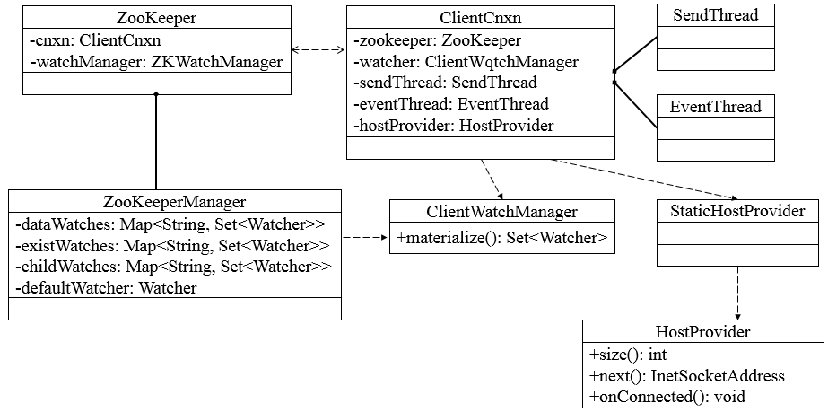
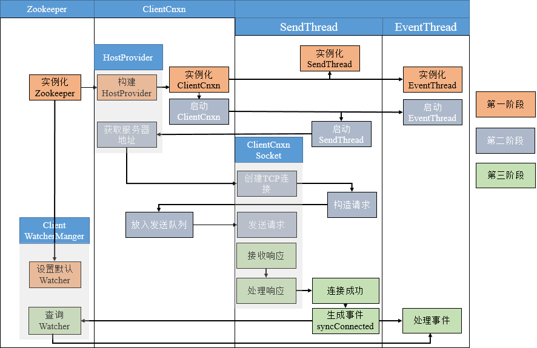
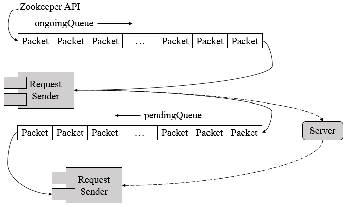

##【分布式】Zookeeper客户端

##
##一、前言

##
##　　前篇博客分析了Zookeeper的序列化和通信协议，接着继续学习客户端，客户端是开发人员使用Zookeeper最主要的途径，很有必要弄懂客户端是如何与服务端通信的。

##
##二、客户端

##
##　　2.1 客户端组成

##
##　　Zookeeper客户端主要由如下核心部件构成。

##
##　　1. Zookeeper实例，客户端入口。

##
##　　2. ClientWatchManager， 客户端Watcher管理器。

##
##　　3. HostProvider，客户端地址列表管理器。

##
##　　4. ClientCnxn，客户端核心线程，内部包含了SendThread和EventThread两个线程，SendThread为I/O线程，主要负责Zookeeper客户端和服务器之间的网络I/O通信；EventThread为事件线程，主要负责对服务端事件进行处理。

##
## 　　Zookeeper客户端初始化与启动环节，就是Zookeeper对象的实例化过程。客户端在初始化和启动过程中大体可以分为如下3个步骤

##
##　　1. 设置默认Watcher

##
##　　2. 设置Zookeeper服务器地址列表

##
##　　3. 创建ClientCnxn。

##
##　　若在Zookeeper构造方法中传入Watcher对象时，那么Zookeeper就会将该Watcher对象保存在ZKWatcherManager的defaultWatcher中，并作为整个客户端会话期间的默认Watcher。

##
##　　2.2 会话的创建

##
##　　下图表示了客户端与服务端会话建立的整个过程，包括初始化阶段（第一阶段）、会话创建阶段（第二阶段）、响应处理阶段（第三阶段）三个阶段。 

##
##　　2.3 服务器地址列表

##
##　　在实例化Zookeeper时，用户传入Zookeeper服务器地址列表，如192.168.0.1:2181,192.168.0.2:2181,192.168.0.3:2181，此时，Zookeeper客户端在连接服务器的过程中，是如何从这个服务器列表中选择服务器的呢？Zookeeper收到服务器地址列表后，会解析出chrootPath和保存服务器地址列表。

##
##　　1. Chroot，每个客户端可以设置自己的命名空间，若客户端设置了Chroot，此时，该客户端对服务器的任何操作都将被限制在自己的命名空间下，如设置Choot为/app/X，那么该客户端的所有节点路径都是以/app/X为根节点。

##
##　　2. 地址列表管理，Zookeeper使用StaticHostProvider打散服务器地址（shuffle），并将服务器地址形成一个环形循环队列，然后再依次取出服务器地址。

##
##　　2.4 网络I/O

##
##　　ClientCnxn是Zookeeper客户端中负责维护客户端与服务端之间的网络连接并进行一系列网络通信的核心工作类，Packet是ClientCnxn内部定义的一个堆协议层的封装，用作Zookeeper中请求和响应的载体。Packet包含了请求头（requestHeader）、响应头（replyHeader）、请求体（request）、响应体（response）、节点路径（clientPath/serverPath）、注册的Watcher（watchRegistration）等信息，然而，并非Packet中所有的属性都在客户端与服务端之间进行网络传输，只会将requestHeader、request、readOnly三个属性序列化，并生成可用于底层网络传输的ByteBuffer，其他属性都保存在客户端的上下文中，不会进行与服务端之间的网络传输。

##
##　　ClientCnxn维护着outgoingQueue（客户端的请求发送队列）和pendingQueue（服务端响应的等待队列），outgoingQueue专门用于存储那些需要发送到服务端的Packet集合，pendingQueue用于存储那些已经从客户端发送到服务端的，但是需要等待服务端响应的Packet集合。

##
##　　在正常情况下，会从outgoingQueue中取出一个可发送的Packet对象，同时生成一个客户端请求序号XID并将其设置到Packet请求头中去，然后序列化后再发送，请求发送完毕后，会立即将该Packet保存到pendingQueue中，以便等待服务端响应返回后进行相应的处理。

##
## 

##
##　　客户端获取到来自服务端的完整响应数据后，根据不同的客户端请求类型，会进行不同的处理。

##
##　　1. 若检测到此时客户端尚未进行初始化，那么说明当前客户端与服务端之间正在进行会话创建，直接将接收的ByteBuffer序列化成ConnectResponse对象。

##
##　　2. 若当前客户端已经处于正常会话周期，并且接收到服务端响应是一个事件，那么将接收的ByteBuffer序列化成WatcherEvent对象，并将该事件放入待处理队列中。

##
##　　3. 若是一个常规请求（Create、GetData、Exist等），那么从pendingQueue队列中取出一个Packet来进行相应处理。首先会检验响应中的XID来确保请求处理的顺序性，然后再将接收到的ByteBuffer序列化成Response对象。

##
##　　SendThread是客户端ClientCnxn内部的一个核心I/O调度线程，用于管理客户端与服务端之间的所有网络I/O操作，在Zookeeper客户端实际运行中，SendThread的作用如下：

##
##　　1. 维护了客户端与服务端之间的会话生命周期（通过一定周期频率内向服务端发送PING包检测心跳），如果会话周期内客户端与服务端出现TCP连接断开，那么就会自动且透明地完成重连操作。

##
##　　2. 管理了客户端所有的请求发送和响应接收操作，其将上层客户端API操作转换成相应的请求协议并发送到服务端，并完成对同步调用的返回和异步调用的回调。

##
##　　3. 将来自服务端的事件传递给EventThread去处理。

##
##　　EventThread是客户端ClientCnxn内部的一个事件处理线程，负责客户端的事件处理，并触发客户端注册的Watcher监听。EventThread中的watingEvents队列用于临时存放那些需要被触发的Object，包括客户端注册的Watcher和异步接口中注册的回调器AsyncCallback。同时，EventThread会不断地从watingEvents中取出Object，识别具体类型（Watcher或AsyncCallback），并分别调用process和processResult接口方法来实现对事件的触发和回调。

##
##三、总结

##
##　　本篇博文讲解了客户端的相关细节，内容较为简单易懂，该模块知识会为之后分析源码打下好的基础，谢谢各位园友观看~　　