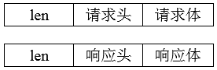
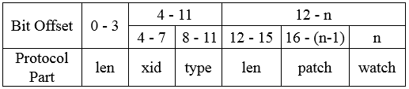
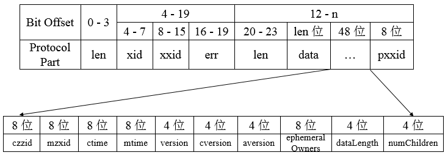

**一、前言**

前面介绍了Zookeeper的系统模型，下面进一步学习Zookeeper的底层序列化机制，Zookeeper的客户端与服务端之间会进行一系列的网络通信来实现数据传输，Zookeeper使用Jute组件来完成数据的序列化和反序列化操作。

**二、Jute**

Jute是Zookeeper底层序列化组件，其用于Zookeeper进行网络数据传输和本地磁盘数据存储的序列化和反序列化工作。

2.1 Jute序列化

MockReHeader实体类

    
    
    package com.hust.grid.leesf.jute.examples;
    
    import org.apache.jute.InputArchive;
    import org.apache.jute.OutputArchive;
    import org.apache.jute.Record;
    
    public class MockReHeader implements Record {
        private long sessionId;
        private String type;
        
        public MockReHeader() {
            
        }
        
        public MockReHeader(long sessionId, String type) {
            this.sessionId = sessionId;
            this.type = type;
        }
        
        public void setSessionId(long sessionId) {
            this.sessionId = sessionId;
        }
        
        public void setType(String type) {
            this.type = type;
        }
        
        public long getSessionId() {
            return sessionId;
        }
        
        public String getType() {
            return type;
        }
        
        public void serialize(OutputArchive oa, String tag) throws java.io.IOException {
            oa.startRecord(this, tag);
            oa.writeLong(sessionId, "sessionId");
            oa.writeString(type, "type");
            oa.endRecord(this, tag);
        }
        
        public void deserialize(InputArchive ia, String tag) throws java.io.IOException {
            ia.startRecord(tag);
            this.sessionId = ia.readLong("sessionId");
            this.type = ia.readString("type");
            ia.endRecord(tag);
        }
        
        @Override
        public String toString() {
            return "sessionId = " + sessionId + ", type = " + type;
        }
    }

View Code

Main

    
    
    package com.hust.grid.leesf.jute.examples;
    
    import java.io.ByteArrayOutputStream;
    import java.io.IOException;
    import java.nio.ByteBuffer;
    
    import org.apache.jute.BinaryInputArchive;
    import org.apache.jute.BinaryOutputArchive;
    import org.apache.zookeeper.server.ByteBufferInputStream;
    
    public class Main {
        public static void main(String[] args) throws IOException {
            ByteArrayOutputStream baos = new ByteArrayOutputStream();
            BinaryOutputArchive boa = BinaryOutputArchive.getArchive(baos);
            new MockReHeader(0x3421eccb92a34el, "ping").serialize(boa, "header");
            
            ByteBuffer bb = ByteBuffer.wrap(baos.toByteArray());
            
            ByteBufferInputStream bbis = new ByteBufferInputStream(bb);
            BinaryInputArchive bia = BinaryInputArchive.getArchive(bbis);
            
            MockReHeader header2 = new MockReHeader();
            System.out.println(header2);
            header2.deserialize(bia, "header");
            System.out.println(header2);
            bbis.close();
            baos.close();    
        }
    }

View Code

运行结果

    
    
    sessionId = 0, type = null
    sessionId = 14673999700337486, type = ping

说明：可以看到MockReHeader实体类需要实现Record接口并且实现serialize和deserialize方法。

OutputArchive和InputArchive分别是Jute底层的序列化器和反序列化器。

在Zookeeper的src文件夹下有zookeeper.jute文件，其内容如下

    
    
    /**
     * Licensed to the Apache Software Foundation (ASF) under one
     * or more contributor license agreements.  See the NOTICE file
     * distributed with this work for additional information
     * regarding copyright ownership.  The ASF licenses this file
     * to you under the Apache License, Version 2.0 (the
     * "License"); you may not use this file except in compliance
     * with the License.  You may obtain a copy of the License at
     *
     *     http://www.apache.org/licenses/LICENSE-2.0
     *
     * Unless required by applicable law or agreed to in writing, software
     * distributed under the License is distributed on an "AS IS" BASIS,
     * WITHOUT WARRANTIES OR CONDITIONS OF ANY KIND, either express or implied.
     * See the License for the specific language governing permissions and
     * limitations under the License.
     */
    
    module org.apache.zookeeper.data {
        class Id {
            ustring scheme;
            ustring id;
        }
        class ACL {
            int perms;
            Id id;
        }
        // information shared with the client
        class Stat {
            long czxid;      // created zxid
            long mzxid;      // last modified zxid
            long ctime;      // created
            long mtime;      // last modified
            int version;     // version
            int cversion;    // child version
            int aversion;    // acl version
            long ephemeralOwner; // owner id if ephemeral, 0 otw
            int dataLength;  //length of the data in the node
            int numChildren; //number of children of this node
            long pzxid;      // last modified children
        }
        // information explicitly stored by the server persistently
        class StatPersisted {
            long czxid;      // created zxid
            long mzxid;      // last modified zxid
            long ctime;      // created
            long mtime;      // last modified
            int version;     // version
            int cversion;    // child version
            int aversion;    // acl version
            long ephemeralOwner; // owner id if ephemeral, 0 otw
            long pzxid;      // last modified children
        }
    
       // information explicitly stored by the version 1 database of servers 
       class StatPersistedV1 {
           long czxid; //created zxid
           long mzxid; //last modified zxid
           long ctime; //created
           long mtime; //last modified
           int version; //version
           int cversion; //child version
           int aversion; //acl version
           long ephemeralOwner; //owner id if ephemeral. 0 otw
        }
    }
    
    module org.apache.zookeeper.proto {
        class ConnectRequest {
            int protocolVersion;
            long lastZxidSeen;
            int timeOut;
            long sessionId;
            buffer passwd;
        }
        class ConnectResponse {
            int protocolVersion;
            int timeOut;
            long sessionId;
            buffer passwd;
        }
        class SetWatches {
            long relativeZxid;
            vector<ustring>dataWatches;
            vector<ustring>existWatches;
            vector<ustring>childWatches;
        }        
        class RequestHeader {
            int xid;
            int type;
        }
        class MultiHeader {
            int type;
            boolean done;
            int err;
        }
        class AuthPacket {
            int type;
            ustring scheme;
            buffer auth;
        }
        class ReplyHeader {
            int xid;
            long zxid;
            int err;
        }
        class GetDataRequest {
            ustring path;
            boolean watch;
        }
        class SetDataRequest {
            ustring path;
            buffer data;
            int version;
        }
        class SetDataResponse {
            org.apache.zookeeper.data.Stat stat;
        }
        class GetSASLRequest {
            buffer token;
        }
        class SetSASLRequest {
            buffer token;
        }
        class SetSASLResponse {
            buffer token;
        }
        class CreateRequest {
            ustring path;
            buffer data;
            vector<org.apache.zookeeper.data.ACL> acl;
            int flags;
        }
        class DeleteRequest {
            ustring path;
            int version;
        }
        class GetChildrenRequest {
            ustring path;
            boolean watch;
        }
        class GetChildren2Request {
            ustring path;
            boolean watch;
        }
        class CheckVersionRequest {
            ustring path;
            int version;
        }
        class GetMaxChildrenRequest {
            ustring path;
        }
        class GetMaxChildrenResponse {
            int max;
        }
        class SetMaxChildrenRequest {
            ustring path;
            int max;
        }
        class SyncRequest {
            ustring path;
        }
        class SyncResponse {
            ustring path;
        }
        class GetACLRequest {
            ustring path;
        }
        class SetACLRequest {
            ustring path;
            vector<org.apache.zookeeper.data.ACL> acl;
            int version;
        }
        class SetACLResponse {
            org.apache.zookeeper.data.Stat stat;
        }
        class WatcherEvent {
            int type;  // event type
            int state; // state of the Keeper client runtime
            ustring path;
        }
        class ErrorResponse {
            int err;
        }
        class CreateResponse {
            ustring path;
        }
        class ExistsRequest {
            ustring path;
            boolean watch;
        }
        class ExistsResponse {
            org.apache.zookeeper.data.Stat stat;
        }
        class GetDataResponse {
            buffer data;
            org.apache.zookeeper.data.Stat stat;
        }
        class GetChildrenResponse {
            vector<ustring> children;
        }
        class GetChildren2Response {
            vector<ustring> children;
            org.apache.zookeeper.data.Stat stat;
        }
        class GetACLResponse {
            vector<org.apache.zookeeper.data.ACL> acl;
            org.apache.zookeeper.data.Stat stat;
        }
    }
    
    module org.apache.zookeeper.server.quorum {
        class LearnerInfo {
            long serverid;
            int protocolVersion;
        }
        class QuorumPacket {
            int type; // Request, Ack, Commit, Ping
            long zxid;
            buffer data; // Only significant when type is request
            vector<org.apache.zookeeper.data.Id> authinfo;
        }
    }
    
    module org.apache.zookeeper.server.persistence {
        class FileHeader {
            int magic;
            int version;
            long dbid;
        }
    }
    
    module org.apache.zookeeper.txn {
        class TxnHeader {
            long clientId;
            int cxid;
            long zxid;
            long time;
            int type;
        }
        class CreateTxnV0 {
            ustring path;
            buffer data;
            vector<org.apache.zookeeper.data.ACL> acl;
            boolean ephemeral;
        }
        class CreateTxn {
            ustring path;
            buffer data;
            vector<org.apache.zookeeper.data.ACL> acl;
            boolean ephemeral;
            int parentCVersion;
        }
        class DeleteTxn {
            ustring path;
        }
        class SetDataTxn {
            ustring path;
            buffer data;
            int version;
        }
        class CheckVersionTxn {
            ustring path;
            int version;
        }
        class SetACLTxn {
            ustring path;
            vector<org.apache.zookeeper.data.ACL> acl;
            int version;
        }
        class SetMaxChildrenTxn {
            ustring path;
            int max;
        }
        class CreateSessionTxn {
            int timeOut;
        }
        class ErrorTxn {
            int err;
        }
        class Txn {
            int type;
            buffer data;
        }
        class MultiTxn {
            vector<org.apache.zookeeper.txn.Txn> txns;
        }
    }

View Code

其定义了所有的实体类的所属包名、类名及类的所有成员变量和类型，该文件会在源代码编译时，Jute会使用不同的代码生成器为这些类定义生成实际编程语言的类文件，如java语言生成的类文件保存在src/java/generated目录下，每个类都会实现Record接口。

**三、通信协议**

基于TCP/IP协议，Zookeeper实现了自己的通信协议来玩按成客户端与服务端、服务端与服务端之间的网络通信，对于请求，主要包含请求头和请求体，对于响应，主要包含响应头和响应体。

3.1 请求协议

对于请求协议而言，如下为获取节点数据请求的完整协议定义

  

    
    
        class RequestHeader {
            int xid;
            int type;
        }

从zookeeper.jute中可知RequestHeader包含了xid和type，xid用于记录客户端请求发起的先后序号，用来确保单个客户端请求的响应顺序，type代表请求的操作类型，如创建节点（OpCode.create）、删除节点（OpCode.delete）、获取节点数据（OpCode.getData）。

协议的请求主体内容部分，包含了请求的所有操作内容，不同的请求类型请求体不同。对于会话创建而言，其请求体如下

    
    
        class ConnectRequest {
            int protocolVersion;
            long lastZxidSeen;
            int timeOut;
            long sessionId;
            buffer passwd;
        }

Zookeeper客户端和服务器在创建会话时，会发送ConnectRequest请求，该请求包含协议版本号protocolVersion、最近一次接收到服务器ZXID
lastZxidSeen、会话超时时间timeOut、会话标识sessionId和会话密码passwd。

对于获取节点数据而言，其请求体如下

    
    
        class GetDataRequest {
            ustring path;
            boolean watch;
        }

Zookeeper客户端在向服务器发送节点数据请求时，会发送GetDataRequest请求，该请求包含了数据节点路径path、是否注册Watcher的标识watch。

对于更新节点数据而言，其请求体如下

    
    
        class SetDataRequest {
            ustring path;
            buffer data;
            int version;
        }

Zookeeper客户端在向服务器发送更新节点数据请求时，会发送SetDataRequest请求，该请求包含了数据节点路径path、数据内容data、节点数据的期望版本号version。

针对不同的请求类型，Zookeeper都会定义不同的请求体，可以在zookeeper.jute中查看。

3.2 响应协议

对于响应协议而言，如下为获取节点数据响应的完整协议定义

响应头中包含了每个响应最基本的信息，包括xid、zxid和err：

    
    
        class ReplyHeader {
            int xid;
            long zxid;
            int err;
        }

xid与请求头中的xid一致，zxid表示Zookeeper服务器上当前最新的事务ID，err则是一个错误码，表示当请求处理过程出现异常情况时，就会在错误码中标识出来，常见的包括处理成功（Code.OK）、节点不存在（Code.NONODE）、没有权限（Code.NOAUTH）。

协议的响应主体内容部分，包含了响应的所有数据，不同的响应类型请求体不同。对于会话创建而言，其响应体如下

    
    
        class ConnectResponse {
            int protocolVersion;
            int timeOut;
            long sessionId;
            buffer passwd;
        }

针对客户端的会话创建请求，服务端会返回客户端一个ConnectResponse响应，该响应体包含了版本号protocolVersion、会话的超时时间timeOut、会话标识sessionId和会话密码passwd。

对于获取节点数据而言，其响应体如下

    
    
        class GetDataResponse {
            buffer data;
            org.apache.zookeeper.data.Stat stat;
        }

针对客户端的获取节点数据请求，服务端会返回客户端一个GetDataResponse响应，该响应体包含了数据节点内容data、节点状态stat。

对于更新节点数据而言，其响应体如下

    
    
        class SetDataResponse {
            org.apache.zookeeper.data.Stat stat;
        }

针对客户端的更新节点数据请求，服务端会返回客户端一个SetDataResponse响应，该响应体包含了最新的节点状态stat。

针对不同的响应类型，Zookeeper都会定义不同的响应体，可以在zookeeper.jute中查看。

**四、总结**

本篇博客讲解了Zookeeper中的序列化机制和客户端与服务端、服务端与服务端的通信协议，内容相对较为简单，容易理解，谢谢各位园友的观看~

