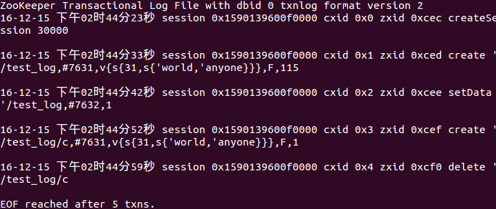
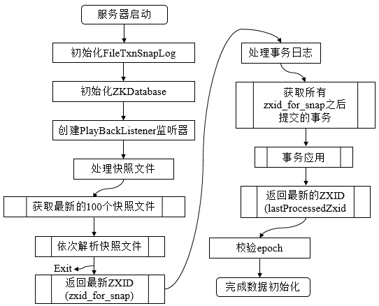
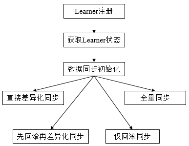

**一、前言**

前面分析了Zookeeper对请求的处理，本篇博文接着分析Zookeeper中如何对底层数据进行存储，数据存储被分为内存数据存储于磁盘数据存储。

**二、数据与存储**

2.1 内存数据

Zookeeper的数据模型是树结构，在内存数据库中，存储了整棵树的内容，包括所有的节点路径、节点数据、ACL信息，Zookeeper会定时将这个数据存储到磁盘上。

1\. DataTree

DataTree是内存数据存储的核心，是一个树结构， **代表了内存中一份完整的数据**
。DataTree不包含任何与网络、客户端连接及请求处理相关的业务逻辑，是一个独立的组件。

2\. DataNode

**DataNode是数据存储的最小单元**
，其内部除了保存了结点的数据内容、ACL列表、节点状态之外，还记录了父节点的引用和子节点列表两个属性，其也提供了对子节点列表进行操作的接口。

3\. ZKDatabase

Zookeeper的内存数据库，管理Zookeeper的所有会话、DataTree存储和事务日志。ZKDatabase会定时向磁盘dump快照数据，同时在Zookeeper启动时，会通过磁盘的事务日志和快照文件恢复成一个完整的内存数据库。

2.2 事务日志

1\. 文件存储

在配置Zookeeper集群时需要配置dataDir目录，其用来存储事务日志文件。也可以为事务日志单独分配一个文件存储目录:dataLogDir。若配置dataLogDir为/home/admin/zkData/zk_log，那么Zookeeper在运行过程中会在该目录下建立一个名字为version-2的子目录，该目录确定了当前Zookeeper使用的事务日志格式版本号，当下次某个Zookeeper版本对事务日志格式进行变更时，此目录也会变更，即在version-2子目录下会生成一系列文件大小一致(64MB)的文件。

2\. 日志格式

在配置好日志文件目录，启动Zookeeper后，完成如下操作

(1) 创建/test_log节点，初始值为v1。

(2) 更新/test_log节点的数据为v2。

(3) 创建/test_log/c节点，初始值为v1。

(4) 删除/test_log/c节点。

经过四步操作后，会在/log/version-2/目录下生成一个日志文件，笔者下是log.cec。

将Zookeeper下的zookeeper-3.4.6.jar和slf4j-api-1.6.1.jar复制到/log/version-2目录下，使用如下命令打开log.cec文件。

java -classpath ./zookeeper-3.4.6.jar:./slf4j-api-1.6.1.jar
org.apache.zookeeper.server.LogFormatter log.cec

ZooKeeper Transactional Log File with dbid 0 txnlog format version 2
。是文件头信息，主要是事务日志的DBID和日志格式版本号。

...session 0x159...0xcec createSession 30000。表示客户端会话创建操作。

...session 0x159...0xced create "/test_log,...
。表示创建/test_log节点，数据内容为#7631(v1)。

...session 0x159...0xcee setData
‘/test_log,...。表示设置了/test_log节点数据，内容为#7632(v2)。

...session 0x159...0xcef create ’/test_log/c,...。表示创建节点/test_log/c。

...session 0x159...0xcf0 delete "/test_log/c。表示删除节点/test_log/c。

3\. 日志写入

FileTxnLog负责维护事务日志对外的接口，包括事务日志的写入和读取等。Zookeeper的事务日志写入过程大体可以分为如下6个步骤。

(1) **确定是否有事务日志可写**
。当Zookeeper服务器启动完成需要进行第一次事务日志的写入，或是上一次事务日志写满时，都会处于与事务日志文件断开的状态，即Zookeeper服务器没有和任意一个日志文件相关联。因此在进行事务日志写入前，Zookeeper首先会判断FileTxnLog组件是否已经关联上一个可写的事务日志文件。若没有，则会使用该事务操作关联的ZXID作为后缀创建一个事务日志文件，同时构建事务日志的文件头信息，并立即写入这个事务日志文件中去，同时将该文件的文件流放入streamToFlush集合，该集合用来记录当前需要强制进行数据落盘的文件流。

(2) **确定事务日志文件是否需要扩容(预分配)**
。Zookeeper会采用磁盘空间预分配策略。当检测到当前事务日志文件剩余空间不足4096字节时，就会开始进行文件空间扩容，即在现有文件大小上，将文件增加65536KB(64MB)，然后使用"0"填充被扩容的文件空间。

(3) **事务序列化** 。对事务头和事务体的序列化，其中事务体又可分为会话创建事务、节点创建事务、节点删除事务、节点数据更新事务等。

(4) **生成Checksum** 。为保证日志文件的完整性和数据的准确性，Zookeeper在将事务日志写入文件前，会计算生成Checksum。

(5) **写入事务日志文件流** 。将序列化后的事务头、事务体和Checksum写入文件流中，此时并为写入到磁盘上。

(6) **事务日志刷入磁盘** 。由于步骤5中的缓存原因，无法实时地写入磁盘文件中，因此需要将缓存数据强制刷入磁盘。

4\. 日志截断

在Zookeeper运行过程中，可能出现非Leader记录的事务ID比Leader上大，这是非法运行状态。此时，需要保证所有机器必须与该Leader的数据保持同步，即Leader会发送TRUNC命令给该机器，要求进行日志截断，Learner收到该命令后，就会删除所有包含或大于该事务ID的事务日志文件。

2.3 snapshot-数据快照

数据快照是Zookeeper数据存储中非常核心的运行机制，数据快照用来记录Zookeeper服务器上某一时刻的全量内存数据内容，并将其写入指定的磁盘文件中。

1\. 文件存储

与事务文件类似，Zookeeper快照文件也可以指定特定磁盘目录，通过dataDir属性来配置。若指定dataDir为/home/admin/zkData/zk_data，则在运行过程中会在该目录下创建version-2的目录，该目录确定了当前Zookeeper使用的快照数据格式版本号。在Zookeeper运行时，会生成一系列文件。

2\. 数据快照

FileSnap负责维护快照数据对外的接口，包括快照数据的写入和读取等，将内存数据库写入快照数据文件其实是一个序列化过程。针对客户端的每一次事务操作，Zookeeper都会将他们记录到事务日志中，同时也会将数据变更应用到内存数据库中，Zookeeper在进行若干次事务日志记录后，将内存数据库的全量数据Dump到本地文件中，这就是数据快照。其步骤如下

(1) **确定是否需要进行数据快照**
。每进行一次事务日志记录之后，Zookeeper都会检测当前是否需要进行数据快照，考虑到数据快照对于Zookeeper机器的影响，需要尽量避免Zookeeper集群中的所有机器在同一时刻进行数据快照。采用过半随机策略进行数据快照操作。

(2) **切换事务日志文件** 。表示当前的事务日志已经写满，需要重新创建一个新的事务日志。

(3) **创建数据快照异步线程** 。创建单独的异步线程来进行数据快照以避免影响Zookeeper主流程。

(4) **获取全量数据和会话信息** 。从ZKDatabase中获取到DataTree和会话信息。

(5) **生成快照数据文件名** 。Zookeeper根据当前已经提交的最大ZXID来生成数据快照文件名。

(6) **数据序列化**
。首先序列化文件头信息，然后再对会话信息和DataTree分别进行序列化，同时生成一个Checksum，一并写入快照数据文件中去。

2.4 初始化

在Zookeeper服务器启动期间，首先会进行数据初始化工作，用于将存储在磁盘上的数据文件加载到Zookeeper服务器内存中。

1\. 初始化流程

Zookeeper的初始化过程如下图所示

数据的初始化工作是从磁盘上加载数据的过程，主要包括了从快照文件中加载快照数据和根据实物日志进行数据修正两个过程。

(1) **初始化FileTxnSnapLog**
。FileTxnSnapLog是Zookeeper事务日志和快照数据访问层，用于衔接上层业务和底层数据存储，底层数据包含了事务日志和快照数据两部分。FileTxnSnapLog中对应FileTxnLog和FileSnap。

(2) **初始化ZKDatabase**
。首先构建DataTree，同时将FileTxnSnapLog交付ZKDatabase，以便内存数据库能够对事务日志和快照数据进行访问。在ZKDatabase初始化时，DataTree也会进行相应的初始化工作，如创建一些默认结点，如/、/zookeeper、/zookeeper/quota三个节点。

(3) **创建PlayBackListener**
。其主要用来接收事务应用过程中的回调，在Zookeeper数据恢复后期，会有事务修正过程，此过程会回调PlayBackListener来进行对应的数据修正。

(4) **处理快照文件** 。此时可以从磁盘中恢复数据了，首先从快照文件开始加载。

(5) **获取最新的100个快照文件** 。更新时间最晚的快照文件包含了最新的全量数据。

(6) **解析快照文件**
。逐个解析快照文件，此时需要进行反序列化，生成DataTree和sessionsWithTimeouts，同时还会校验Checksum及快照文件的正确性。对于100个快找文件，如果正确性校验通过时，通常只会解析最新的那个快照文件。只有最新快照文件不可用时，才会逐个进行解析，直至100个快照文件全部解析完。若将100个快照文件解析完后还是无法成功恢复一个完整的DataTree和sessionWithTimeouts，此时服务器启动失败。

(7) **获取最新的ZXID**
。此时根据快照文件的文件名即可解析出最新的ZXID：zxid_for_snap。该ZXID代表了Zookeeper开始进行数据快照的时刻。

(8) **处理事务日志** 。此时服务器内存中已经有了一份近似全量的数据，现在开始通过事务日志来更新增量数据。

(9) **获取所有zxid_for_snap之后提交的事务**
。此时，已经可以获取快照数据的最新ZXID。只需要从事务日志中获取所有ZXID比步骤7得到的ZXID大的事务操作。

(10) **事务应用**
。获取大于zxid_for_snap的事务后，将其逐个应用到之前基于快照数据文件恢复出来的DataTree和sessionsWithTimeouts。每当有一个事务被应用到内存数据库中后，Zookeeper同时会回调PlayBackListener，将这事务操作记录转换成Proposal，并保存到ZKDatabase的committedLog中，以便Follower进行快速同步。

(11) **获取最新的ZXID**
。待所有的事务都被完整地应用到内存数据库中后，也就基本上完成了数据的初始化过程，此时再次获取ZXID，用来标识上次服务器正常运行时提交的最大事务ID。

(12) **校验epoch**
。epoch标识了当前Leader周期，集群机器相互通信时，会带上这个epoch以确保彼此在同一个Leader周期中。完成数据加载后，Zookeeper会从步骤11中确定ZXID中解析出事务处理的Leader周期：epochOfZxid。同时也会从磁盘的currentEpoch和acceptedEpoch文件中读取上次记录的最新的epoch值，进行校验。

2.5 数据同步

整个集群完成Leader选举后，Learner会向Leader进行注册，当Learner向Leader完成注册后，就进入数据同步环节，同步过程就是Leader将那些没有在Learner服务器上提交过的事务请求同步给Learner服务器，大体过程如下

(1) **获取Learner状态**
。在注册Learner的最后阶段，Learner服务器会发送给Leader服务器一个ACKEPOCH数据包，Leader会从这个数据包中解析出该Learner的currentEpoch和lastZxid。

(2) **数据同步初始化**
。首先从Zookeeper内存数据库中提取出事务请求对应的提议缓存队列proposals，同时完成peerLastZxid(该Learner最后处理的ZXID)、minCommittedLog(Leader提议缓存队列commitedLog中最小的ZXID)、maxCommittedLog(Leader提议缓存队列commitedLog中的最大ZXID)三个ZXID值的初始化。

对于集群数据同步而言，通常分为四类，
**直接差异化同步(DIFF同步)、先回滚再差异化同步(TRUNC+DIFF同步)、仅回滚同步(TRUNC同步)、全量同步(SNAP同步)**
，在初始化阶段，Leader会优先以全量同步方式来同步数据。同时，会根据Leader和Learner之间的数据差异情况来决定最终的数据同步方式。

**· 直接差异化同步**
(DIFF同步，peerLastZxid介于minCommittedLog和maxCommittedLog之间)。Leader首先向这个Learner发送一个DIFF指令，用于通知Learner进入差异化数据同步阶段，Leader即将把一些Proposal同步给自己，针对每个Proposal，Leader都会通过发送PROPOSAL内容数据包和COMMIT指令数据包来完成，

**· 先回滚再差异化同步**
(TRUNC+DIFF同步，Leader已经将事务记录到本地事务日志中，但是没有成功发起Proposal流程)。当Leader发现某个Learner包含了一条自己没有的事务记录，那么就需要该Learner进行事务回滚，回滚到Leader服务器上存在的，同时也是最接近于peerLastZxid的ZXID。

**· 仅回滚同步**
(TRUNC同步，peerLastZxid大于maxCommittedLog)。Leader要求Learner回滚到ZXID值为maxCommittedLog对应的事务操作。

**· 全量同步**
(SNAP同步，peerLastZxid小于minCommittedLog或peerLastZxid不等于lastProcessedZxid)。Leader无法直接使用提议缓存队列和Learner进行同步，因此只能进行全量同步。Leader将本机的全量内存数据同步给Learner。Leader首先向Learner发送一个SNAP指令，通知Learner即将进行全量同步，随后，Leader会从内存数据库中获取到全量的数据节点和会话超时时间记录器，将他们序列化后传输给Learner。Learner接收到该全量数据后，会对其反序列化后载入到内存数据库中。

**三、总结**

本篇博文主要讲解了Zookeeper的数据与存储，包括内存数据，快照数据，以及如何进行数据的同步等细节，至此，Zookeeper的理论学习部分已经全部完成，之后会进行源码分析，也谢谢各位园友的观看~

