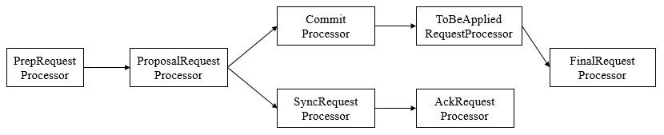
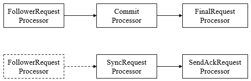
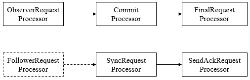
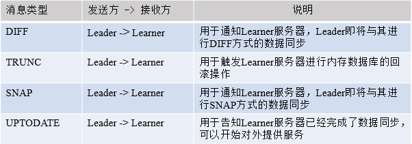
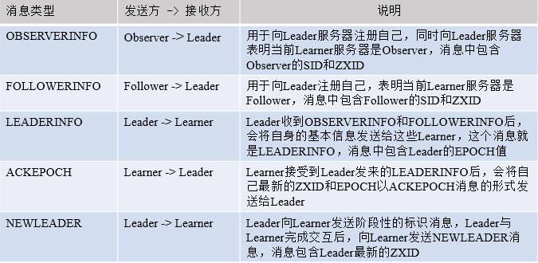
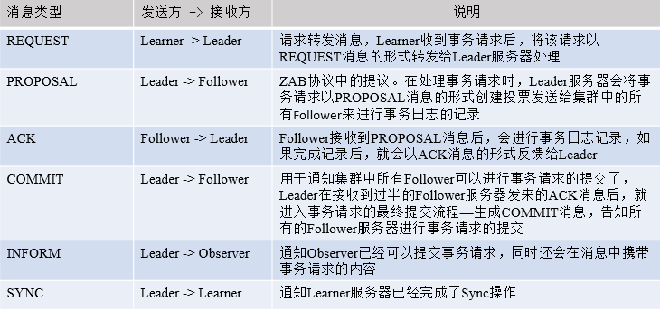
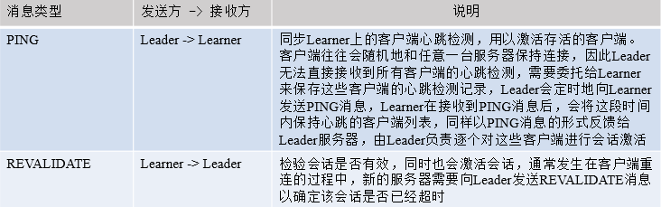

##【分布式】Zookeeper的服务器角色

##
##一、前言

##
##　　前一篇已经详细的讲解了Zookeeper的Leader选举过程，下面接着学习Zookeeper中服务器的各个角色及其细节。

##
##二、服务器角色

##
##　　2.1 Leader

##
##　　Leader服务器是Zookeeper集群工作的核心，其主要工作如下

##
##　　(1) 事务请求的唯一调度和处理者，保证集群事务处理的顺序性。

##
##　　(2) 集群内部各服务器的调度者。

##
##　　1. 请求处理链

##
##　　使用责任链来处理每个客户端的请求时Zookeeper的特色，Leader服务器的请求处理链如下

##
## 

##
##　　(1) PrepRequestProcessor。请求预处理器。在Zookeeper中，那些会改变服务器状态的请求称为事务请求（创建节点、更新数据、删除节点、创建会话等），PrepRequestProcessor能够识别出当前客户端请求是否是事务请求。对于事务请求，PrepRequestProcessor处理器会对其进行一系列预处理，如创建请求事务头、事务体、会话检查、ACL检查和版本检查等。

##
##　　(2) ProposalRequestProcessor。事务投票处理器。Leader服务器事务处理流程的发起者，对于非事务性请求，ProposalRequestProcessor会直接将请求转发到CommitProcessor处理器，不再做任何处理，而对于事务性请求，处理将请求转发到CommitProcessor外，还会根据请求类型创建对应的Proposal提议，并发送给所有的Follower服务器来发起一次集群内的事务投票。同时，ProposalRequestProcessor还会将事务请求交付给SyncRequestProcessor进行事务日志的记录。

##
##　　(2) SyncRequestProcessor。事务日志记录处理器。用来将事务请求记录到事务日志文件中，同时会触发Zookeeper进行数据快照。

##
##　　(3) AckRequestProcessor。负责在SyncRequestProcessor完成事务日志记录后，向Proposal的投票收集器发送ACK反馈，以通知投票收集器当前服务器已经完成了对该Proposal的事务日志记录。

##
##　　(4) CommitProcessor。事务提交处理器。对于非事务请求，该处理器会直接将其交付给下一级处理器处理；对于事务请求，其会等待集群内针对Proposal的投票直到该Proposal可被提交，利用CommitProcessor，每个服务器都可以很好地控制对事务请求的顺序处理。

##
##　　(5) ToBeCommitProcessor。该处理器有一个toBeApplied队列，用来存储那些已经被CommitProcessor处理过的可被提交的Proposal。其会将这些请求交付给FinalRequestProcessor处理器处理，待其处理完后，再将其从toBeApplied队列中移除。

##
##　　(6) FinalRequestProcessor。用来进行客户端请求返回之前的操作，包括创建客户端请求的响应，针对事务请求，该处理还会负责将事务应用到内存数据库中去。

##
##　　2. LearnerHandler

##
##　　为了保证整个集群内部的实时通信，同时为了确保可以控制所有的Follower/Observer服务器，Leader服务器会与每个Follower/Observer服务器建立一个TCP长连接。同时也会为每个Follower/Observer服务器创建一个名为LearnerHandler的实体。LearnerHandler是Learner服务器的管理者，主要负责Follower/Observer服务器和Leader服务器之间的一系列网络通信，包括数据同步、请求转发和Proposal提议的投票等。Leader服务器中保存了所有Follower/Observer对应的LearnerHandler。

##
##　　2.2 Follower

##
##　　Follower是Zookeeper集群的跟随者，其主要工作如下

##
##　　(1) 处理客户端非事务性请求（读取数据），转发事务请求给Leader服务器。

##
##　　(2) 参与事务请求Proposal的投票。

##
##　　(3) 参与Leader选举投票。

##
##　　Follower也采用了责任链模式组装的请求处理链来处理每一个客户端请求，由于不需要对事务请求的投票处理，因此Follower的请求处理链会相对简单，其处理链如下

##
## 

##
##　　(1) FollowerRequestProcessor。其用作识别当前请求是否是事务请求，若是，那么Follower就会将该请求转发给Leader服务器，Leader服务器是在接收到这个事务请求后，就会将其提交到请求处理链，按照正常事务请求进行处理。

##
##　　(2) SendAckRequestProcessor。其承担了事务日志记录反馈的角色，在完成事务日志记录后，会向Leader服务器发送ACK消息以表明自身完成了事务日志的记录工作。

##
##　　2.3 Observer

##
##　　Observer充当观察者角色，观察Zookeeper集群的最新状态变化并将这些状态同步过来，其对于非事务请求可以进行独立处理，对于事务请求，则会转发给Leader服务器进行处理。Observer不会参与任何形式的投票，包括事务请求Proposal的投票和Leader选举投票。其处理链如下

##
## 

##
##　　2.4 集群间消息通信

##
##　　Zookeeper的消息类型大体分为数据同步型、服务器初始化型、请求处理型和会话管理型。

##
##　　(1) 数据同步型。指在Learner和Leader服务器进行数据同步时，网络通信所用到的消息，通常有DIFF、TRUNC、SNAP、UPTODATE。

##
## 

##
##　　(2) 服务器初始化型。指在整个集群或是某些新机器初始化时，Leader和Learner之间相互通信所使用的消息类型，常见的有OBSERVERINFO、FOLLOWERINFO、LEADERINFO、ACKEPOCH和NEWLEADER五种。

##
## 

##
##　　(3) 请求处理型。指在进行清理时，Leader和Learner服务器之间互相通信所使用的消息，常见的有REQUEST、PROPOSAL、ACK、COMMIT、INFORM和SYNC六种。

##
## 

##
##　　(4) 会话管理型。指Zookeeper在进行会话管理时和Learner服务器之间互相通信所使用的消息，常见的有PING和REVALIDATE两种。

##
## 

##
##三、总结

##
##　　经过本篇博文的讲解，明白了服务器的各种角色及其作用，以及集群间如何进行通信。谢谢各位园友的观看~