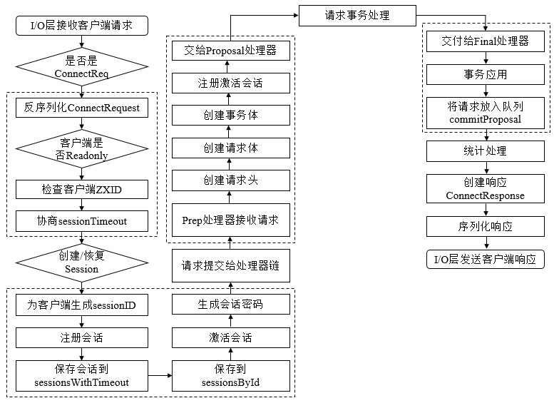
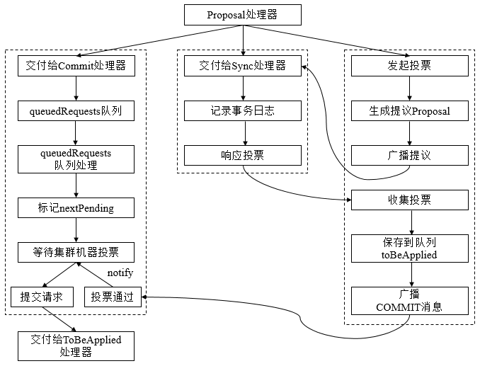

##【分布式】Zookeeper请求处理

##
##一、前言

##
##　　在前面学习了Zookeeper中服务器的三种角色及其之间的通信，接着学习对于客户端的一次请求，Zookeeper是如何进行处理的。

##
##二、请求处理

##
##　　2.1 会话创建请求

##
##　　Zookeeper服务端对于会话创建的处理，大体可以分为请求接收、会话创建、预处理、事务处理、事务应用和会话响应六大环节，其大体流程如

##
## 　　1. 请求接收

##
##　　(1) I/O层接收来自客户端的请求。NIOServerCnxn维护每一个客户端连接，客户端与服务器端的所有通信都是由NIOServerCnxn负责，其负责统一接收来自客户端的所有请求，并将请求内容从底层网络I/O中完整地读取出来。

##
##　　(2) 判断是否是客户端会话创建请求。每个会话对应一个NIOServerCnxn实体，对于每个请求，Zookeeper都会检查当前NIOServerCnxn实体是否已经被初始化，如果尚未被初始化，那么就可以确定该客户端一定是会话创建请求。

##
##　　(3) 反序列化ConnectRequest请求。一旦确定客户端请求是否是会话创建请求，那么服务端就可以对其进行反序列化，并生成一个ConnectRequest载体。

##
##　　(4) 判断是否是ReadOnly客户端。如果当前Zookeeper服务器是以ReadOnly模式启动，那么所有来自非ReadOnly型客户端的请求将无法被处理。因此，服务端需要先检查是否是ReadOnly客户端，并以此来决定是否接受该会话创建请求。

##
##　　(5) 检查客户端ZXID。正常情况下，在一个Zookeeper集群中，服务端的ZXID必定大于客户端的ZXID，因此若发现客户端的ZXID大于服务端ZXID，那么服务端不接受该客户端的会话创建请求。

##
##　　(6) 协商sessionTimeout。在客户端向服务器发送超时时间后，服务器会根据自己的超时时间限制最终确定该会话超时时间，这个过程就是sessionTimeout协商过程。

##
##　　(7) 判断是否需要重新激活创建会话。服务端根据客户端请求中是否包含sessionID来判断该客户端是否需要重新创建会话，若客户单请求中包含sessionID，那么就认为该客户端正在进行会话重连，这种情况下，服务端只需要重新打开这个会话，否则需要重新创建。

##
##　　2. 会话创建

##
##　　(1) 为客户端生成sessionID。在为客户端创建会话之前，服务端首先会为每个客户端分配一个sessionID，服务端为客户端分配的sessionID是全局唯一的。

##
##　　(2) 注册会话。向SessionTracker中注册会话，SessionTracker中维护了sessionsWithTimeout和sessionsById，在会话创建初期，会将客户端会话的相关信息保存到这两个数据结构中。

##
##　　(3) 激活会话。激活会话涉及Zookeeper会话管理的分桶策略，其核心是为会话安排一个区块，以便会话清理程序能够快速高效地进行会话清理。

##
##　　(4) 生成会话密码。服务端在创建一个客户端会话时，会同时为客户端生成一个会话密码，连同sessionID一同发给客户端，作为会话在集群中不同机器间转移的凭证。

##
##　　3. 预处理

##
##　　(1) 将请求交给PrepRequestProcessor处理器处理。在提交给第一个请求处理器之前，Zookeeper会根据该请求所属的会话，进行一次激活会话操作，以确保当前会话处于激活状态，完成会话激活后，则提交请求至处理器。

##
##　　(2) 创建请求事务头。对于事务请求，Zookeeper会为其创建请求事务头，服务端后续的请求处理器都是基于该请求头来识别当前请求是否是事务请求，请求事务头包含了一个事务请求最基本的一些信息，包括sessionID、ZXID（事务请求对应的事务ZXID）、CXID（客户端的操作序列）和请求类型（如create、delete、setData、createSession等）等。

##
##　　(3) 创建请求事务体。由于此时是会话创建请求，其事务体是CreateSessionTxn。

##
##　　(4) 注册于激活会话。处理由非Leader服务器转发过来的会话创建请求。

##
##　　4. 事务处理

##
##　　(1) 将请求交给ProposalRequestProcessor处理器。与提议相关的处理器，从ProposalRequestProcessor开始，请求的处理将会进入三个子处理流程，分别是Sync流程、Proposal流程、Commit流程。

##
## 

##
##　　Sync流程

##
##　　使用SyncRequestProcessor处理器记录事务日志，针对每个事务请求，都会通过事务日志的形式将其记录，完成日志记录后，每个Follower都会向Leader发送ACK消息，表明自身完成了事务日志的记录，以便Leader统计每个事务请求的投票情况。

##
##　　Proposal流程

##
##　　每个事务请求都需要集群中过半机器投票认可才能被真正应用到内存数据库中，这个投票与统计过程就是Proposal流程。

##
##　　　　· 发起投票。若当前请求是事务请求，Leader会发起一轮事务投票，在发起事务投票之前，会检查当前服务端的ZXID是否可用。

##
##　　　　· 生成提议Proposal。若ZXID可用，Zookeeper会将已创建的请求头和事务体以及ZXID和请求本身序列化到Proposal对象中，此Proposal对象就是一个提议。

##
##　　　　· 广播提议。Leader以ZXID作为标识，将该提议放入投票箱outstandingProposals中，同时将该提议广播给所有Follower。

##
##　　　　· 收集投票。Follower接收到Leader提议后，进入Sync流程进行日志记录，记录完成后，发送ACK消息至Leader服务器，Leader根据这些ACK消息来统计每个提议的投票情况，当一个提议获得半数以上投票时，就认为该提议通过，进入Commit阶段。

##
##　　　　· 将请求放入toBeApplied队列中。

##
##　　　　· 广播Commit消息。Leader向Follower和Observer发送COMMIT消息。向Observer发送INFORM消息，向Leader发送ZXID。

##
##　　Commit流程

##
##　　　　· 将请求交付CommitProcessor。CommitProcessor收到请求后，将其放入queuedRequests队列中。

##
##　　　　· 处理queuedRequest队列请求。CommitProcessor中单独的线程处理queuedRequests队列中的请求。

##
##　　　　· 标记nextPending。若从queuedRequests中取出的是事务请求，则需要在集群中进行投票处理，同时将nextPending标记位当前请求。

##
##　　　　· 等待Proposal投票。在进行Commit流程的同时，Leader会生成Proposal并广播给所有Follower服务器，此时，Commit流程等待，直到投票结束。

##
##　　　　· 投票通过。若提议获得过半机器认可，则进入请求提交阶段，该请求会被放入commitedRequests队列中，同时唤醒Commit流程。

##
##　　　　· 提交请求。若commitedRequests队列中存在可以提交的请求，那么Commit流程则开始提交请求，将请求放入toProcess队列中，然后交付下一个请求处理器：FinalRequestProcessor。

##
##　　5. 事务应用

##
##　　(1) 交付给FinalRequestProcessor处理器。FinalRequestProcessor处理器检查outstandingChanges队列中请求的有效性，若发现这些请求已经落后于当前正在处理的请求，那么直接从outstandingChanges队列中移除。

##
##　　(2) 事务应用。之前的请求处理仅仅将事务请求记录到了事务日志中，而内存数据库中的状态尚未改变，因此，需要将事务变更应用到内存数据库。

##
##　　(3) 将事务请求放入队列commitProposal。完成事务应用后，则将该请求放入commitProposal队列中，commitProposal用来保存最近被提交的事务请求，以便集群间机器进行数据的快速同步。

##
##　　6. 会话响应

##
##　　(1) 统计处理。Zookeeper计算请求在服务端处理所花费的时间，统计客户端连接的基本信息，如lastZxid(最新的ZXID)、lastOp(最后一次和服务端的操作)、lastLatency(最后一次请求处理所花费的时间)等。

##
##　　(2) 创建响应ConnectResponse。会话创建成功后的响应，包含了当前客户端和服务端之间的通信协议版本号、会话超时时间、sessionID和会话密码。

##
##　　(3) 序列化ConnectResponse。

##
##　　(4) I/O层发送响应给客户端。

##
##　　2.2 SetData请求

##
##　　服务端对于SetData请求大致可以分为四步，预处理、事务处理、事务应用、请求响应。

##
##　　1. 预处理

##
##　　(1) I/O层接收来自客户端的请求。

##
##　　(2) 判断是否是客户端"会话创建"请求。对于SetData请求，按照正常事务请求进行处理。

##
##　　(3) 将请求交给PrepRequestProcessor处理器进行处理。

##
##　　(4) 创建请求事务头。

##
##　　(5) 会话检查。检查该会话是否有效。

##
##　　(6) 反序列化请求，并创建ChangeRecord记录。反序列化并生成特定的SetDataRequest请求，请求中包含了数据节点路径path、更新的内容data和期望的数据节点版本version。同时根据请求对应的path，Zookeeper生成一个ChangeRecord记录，并放入outstandingChanges队列中。

##
##　　(7) ACL检查。检查客户端是否具有数据更新的权限。

##
##　　(8) 数据版本检查。通过version属性来实现乐观锁机制的写入校验。

##
##　　(9) 创建请求事务体SetDataTxn。

##
##　　(10) 保存事务操作到outstandingChanges队列中。

##
##　　2. 事务处理

##
##　　对于事务请求，服务端都会发起事务处理流程。所有事务请求都是由ProposalRequestProcessor处理器处理，通过Sync、Proposal、Commit三个子流程相互协作完成。

##
##　　3. 事务应用

##
##　　(1) 交付给FinalRequestProcessor处理器。

##
##　　(2) 事务应用。将请求事务头和事务体直接交给内存数据库ZKDatabase进行事务应用，同时返回ProcessTxnResult对象，包含了数据节点内容更新后的stat。

##
##　　(3) 将事务请求放入commitProposal队列。

##
##　　4. 请求响应

##
##　　(1) 创建响应体SetDataResponse。其包含了当前数据节点的最新状态stat。

##
##　　(2) 创建响应头。包含当前响应对应的事务ZXID和请求处理是否成功的标识。

##
##　　(3) 序列化响应。

##
##　　(4) I/O层发送响应给客户端。

##
##　　2.3 GetData请求

##
##　　服务端对于GetData请求的处理，大致分为三步，预处理、非事务处理、请求响应。

##
##　　1. 预处理

##
##　　(1) I/O层接收来自客户端的请求。

##
##　　(2) 判断是否是客户端"会话创建"请求。

##
##　　(3) 将请求交给PrepRequestProcessor处理器进行处理。

##
##　　(4) 会话检查。

##
##　　2. 非事务处理

##
##　　(1) 反序列化GetDataRequest请求。

##
##　　(2) 获取数据节点。

##
##　　(3) ACL检查。

##
##　　(4) 获取数据内容和stat，注册Watcher。

##
##　　3. 请求响应

##
##　　(1) 创建响应体GetDataResponse。响应体包含当前数据节点的内容和状态stat。

##
##　　(2) 创建响应头。

##
##　　(3) 统计处理。

##
##　　(4) 序列化响应。

##
##　　(5) I/O层发送响应给客户端。

##
##三、总结

##
##　　本篇博文讲解了Zookeeper服务端对于客户端不同请求的处理的具体流程，可能从文字上看步骤会显得相对枯燥，但是会为之后的源码分析打下很好的基础，谢谢各位园友的观看~