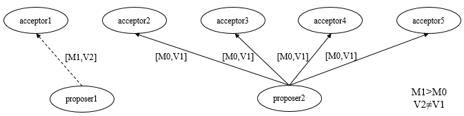

**一、前言**

继续前面的学习，这篇我们来学习在分布式系统中最重要的一块，一致性协议，其中就包括了大名鼎鼎的Paxos算法。

**二、2PC与3PC**

在分布式系统中，每一个机器节点虽然能够明确知道自己在进行事务操作过程中的结果是成功或是失败，但是却无法直接获取到其他分布式节点的操作结果，因此，当一个事务操作需要跨越多个分布式节点的时候，为了保持事务处理的ACID的特性，需要引入协调者的组件来统一调度所有分布式节点的执行逻辑，而被调度的节点则被称为参与者，协调者负责调度参与者的行为并最终决定这些参与者是否要把事务真正进行提交，基于这个思想，衍生出了二阶段提交和三阶段提交两种协议。

2.1 2PC

2PC为Two-Phase Commit的简写，为二阶段提交协议将事务的提交过程分成了两个阶段来进行处理，并执行如下流程：

**阶段一：提交事务请求**

① 事务询问，协调者向所有的参与者发送事务内容，询问是否可以执行事务提交操作，并开始等待各参与者的响应。

② 执行事务，各参与者节点执行事务操作（已经执行），并将Undo和Redo信息记入事务日志中。

③
各参与者向协调者反馈事务询问的响应，如果参与者成功执行了事务操作，那么就反馈给协调者Yes响应，表示事务可以执行；如果参与者没有成功执行事务，那么就反馈给协调者No响应，表示事务不可以执行。

第一阶段近似于是协调者组织各参与者对一次事务操作的投票表态的过程，因此二阶段提交协议的阶段一也被称为投票阶段。

**阶段二：执行事务提交**

协调者会根据各参与者的反馈情况来决定最终是否可以进行事务提交操作，正常情况包含如下两种可能：

1\.  执行事务提交，假如协调者从所有的参与者获得的反馈都是Yes响应，那么就会执行事务提交。

① 发送提交请求，协调者向所有参与者节点发出Commit请求。

② 事务提交，参与者接收到Commit请求后，会正式执行事务提交操作，并在完成提交之后释放在整个事务执行期间占用的事务资源。

③ 反馈事务提交结果，参与者在完成事务提交之后，向协调者发送Ack消息。

④ 完成事务，协调者接收到所有参与者反馈的Ack消息后，完成事务。

2\. 中断事务，假如任意一个参与者向协调者反馈了No响应，或者在等待超时之后，协调者尚无法接收到参与者的反馈响应，就会中断事务。

① 发送回滚请求，协调者向所有参与者节点发出Rollback请求。

② 事务回滚，参与者接收到Rollback请求后，会利用其在阶段一中记录的Undo信息来执行事务回滚，并在完成回滚之后释放在整个事务执行期间占用的资源。

③ 反馈事务回滚结果，参与者在完成事务回滚后，向协调者发送Ack消息。

④ 中断事务，协调者接收所有参与者反馈的Ack消息后，完成事务中断。

二阶段提交协议的优点：原理简单，实现方便。缺点：同步阻塞，单点问题，数据不一致，太过保守。

**同步阻塞** ：在二阶段提交的执行过程中，所有参与该事务操作的逻辑都处于阻塞状态，即当参与者占有公共资源时，其他节点访问公共资源不得不处于阻塞状态。

**单点问题**
：若协调器出现问题，那么整个二阶段提交流程将无法运转，若协调者是在阶段二中出现问题时，那么其他参与者将会一直处于锁定事务资源的状态中，而无法继续完成事务操作。

**数据不一致**
：在二阶段的阶段二，执行事务提交的时候，当协调者向所有的参与者发送Commit请求之后，发生了局部网络异常或者是协调者在尚未发送完Commit请求之前自身发生了崩溃，导致最终只有部分参与者收到了Commit请求，于是会出现数据不一致的现象。

**太过保守**
：在进行事务提交询问的过程中，参与者出现故障而导致协调者始终无法获取到所有参与者的响应信息的话，此时协调者只能依靠自身的超时机制来判断是否需要中断事务，这样的策略过于保守，即没有完善的容错机制，任意一个结点的失败都会导致整个事务的失败。

2.2 3PC

三阶段提交，将二阶段提交协议的提交事务请求过程分为CanCommit、PreCommit、doCommit三个阶段组成的事务处理协议。

**阶段一：canCommit**

① 事务询问，协调者向所有的参与者发送一个包含事务内容的canCommit请求，询问是否可以执行事务提交操作，并开始等待各参与者的响应。

②
各参与者向协调者反馈事务询问的响应，参与者在接收到来自协调者的canCommit请求后，正常情况下，如果自身认为可以顺利执行事务，则反馈Yes响应，并进入预备状态，否则反馈No响应。

**阶段二：preCommit**

该阶段会根据反馈情况决定是否可以进行事务preCommit操作，正常情况下，包含如下两种可能：

执行事务预提交，假如所有参与反馈的都是Yes，那么就会执行事务预提交。

① 发送预提交请求，协调者向所有参与者节点发出preCommit请求，并进入prepared阶段。

② 事务预提交，参与者接收到preCommit请求后，会执行事务操作，并将Undo和Redo信息记录到事务日志中。

③ 各参与者向协调者反馈事务执行的响应，若参与者成功执行了事务操作，那么反馈Ack，同时等待最终的指令：提交（commit）或终止（abort）。

中断事务，若任一参与反馈了No响应，或者在等待超时后，协调者尚无法接收到所有参与者反馈，则中断事务。

① 发送中断请求，协调者向所有参与者发出abort请求。

② 中断事务，无论是收到来自协调者的abort请求或者等待协调者请求过程中超时，参与者都会中断事务。

**阶段三：doCommit**

该阶段会进行真正的事务提交，也会存在如下情况。

1\. 执行提交

①
发送提交请求，进入这一阶段，若协调者处于正常工作状态，并且他接收到了来自所有参与者的Ack响应，那么他将从预提交状态转化为提交状态，并向所有的参与者发送doCommit请求。

② 事务提交，参与者接收到doCommit请求后，会正式执行事务提交操作，并在完成提交之后释放整个事务执行过程中占用的事务资源。

③ 反馈事务提交结果，参与者在完成事务提交后，向协调者发送Ack响应。

④ 完成事务，协调者接收到所有参与者反馈的Ack消息后，完成事务。

2\. 中断事务

① 发送中断请求，协调者向所有的参与者节点发送abort请求。

② 事务回滚，参与者收到abort请求后，会根据记录的Undo信息来执行事务回滚，并在完成回滚之后释放整个事务执行期间占用的资源。

③ 反馈事务回滚结果，参与者在完成事务回滚后，向协调者发送Ack消息。

④ 中断事务，协调者接收到所有参与者反馈的Ack消息后，中断事务。

三阶段提交协议降低了参与者的阻塞范围，能够在发生单点故障后继续达成一致。但是其可能还是会发生数据不一致问题。

**三、Paxos算法**

Paxos算法是一种基于消息传递且具有高度容错特性的一致性算法，其需要解决的问题就是如何在一个可能发生异常的分布式系统中，快速且正确地在集群内部对某个数据的值达成一致，并且保证不论发生以上任何异常，都不会破坏整个系统的一致性。

和2PC类似，Paxos先把节点分成两类，发起提议(proposal)的一方为proposer，参与决议的一方为acceptor。

在没有失败和消息丢失的情况下，假如只有一个提议被提出的情况，如何确定一个提议，做到如下就可以保证

**P1:一个acceptor必须接受它收到的第一个提议。**

P1会引入一个问题，若果多个提议被不同的proposer同时提出，这可能会导致虽然每个acceptor都批准了它收到的第一个提议，但是没有一个提议是由多数acceptor都接受的，因此无法确定一个提议。

上图无法确定一个提议。即使只有两个提议被提出，如果每个提议都被差不多一半的acceptor批准了，此时也可能无法确定哪个提议，如下图所示

如上图所示，若acceptor5出现故障，则无法确定哪个提议。

在P1的基础上，增加如下条件：

**a. proposer发起的每项提议分别用一个ID标识，提议的组成因此变为(ID, value)**

**b. 若确定一个提议，需要由半数以上的acceptor接受，当某个提议被半数以上的acceptor接受后，我们就认为该提议就被确定了。**

我们约定后面发起的提议的ID比前面提议的ID大，并假设可以有多项提议被确定，为做到确定并只确定一个值acceptor要做到以下这点：

**P2：如果一项值为v的提议被确定，那么后续只确定值为v的提议。**

由于一项提议被确定(chosen)前必须先被多数派acceptor接受(accepted)，为实现P2，实质上acceptor需要做到：

**P2a：如果一项值为v的提议被确定，那么acceptor后续只接受值为v的提议。**

如上图所示，在acceptor1没有收到任何提议的情况下，其他4个acceptor已经批准了来自proposer2的提议[M0,V1]，而此时，proposer1产生了一个具有其他value值的，编号更高的提议[M1,V2]，并发送给了acceptor1，根据P1，就需要接受该提议，但是这与P2a矛盾，因此如果要同时满足P1和P2a，需要进入如下强化

**P2b：如果一项值为v的提议被确定，那么proposer后续只发起值为v的提议。**

P2b约束的是提议被确定(chosen)后proposer的行为，我们更关心提议被确定前proposer应该怎么做。

** P2c：对于提议(n,v)，acceptor的多数派S中，如果存在acceptor最近一次(即ID值最大)接受的提议的值为v"，那么要求v =
v"；否则v可为任意值。**

3.1 proposer生成提议

在proposer产生一个编号为Mn的提议时，必须要知道当前某一个将要或已经被半数以上acceptor接受的编号小于Mn但为最大编号的提议，并且，proposer会要求所有的acceptor都不要再接受任何编号小于Mn的提议，这也就是如下提议生成算法。

1\. proposer选择一个新的提议编号为Mn，然后向某个acceptor集合的成员发送请求，要求该集合中的acceptor做出如下回应。

① 向proposer承诺，保证不再接受任何编号小于Mn的提议。

② 如果acceptor已经接受过任何提议，那么其就向proposer反馈当前该acceptor已经接受的编号小于Mn但为最大编号的那个提议的值。

我们将请求称为编号Mn的提议的Prepare请求。

2\.
如果proposer收到了来自半数以上的acceptor的响应结果，那么它就可以产生编号为Mn、Value值为Vn的提议，这里的Vn是所有响应中编号最大的提议Value的值，当然，如果半数以上的acceptor都没有接受过任何提议，即响应中不包含任何提议，那么此时Vn值就可以由proposer任意选择。

在确定了proposer的提议后，proposer就会将该提议再次发送给某个acceptor集合，并期望获得它们的接受，此请求称为accept请求，此时接受accept请求的acceptor集合不一定是之前响应prepare请求的acceptor集合。

3.2 acceptor接受提议

一个acceptor可能会收到来自proposer的两种请求，分别是prepare请求和accept请求，对这两类请求作出响应的条件分别如下

prepare请求：acceptor可以在任何时候响应一个prepare请求。

accept请求：在不违背accept现有承诺的前提下，可以任意响应accept请求。

因此，对acceptor逻辑处理的约束条件，大体可以定义如下：

P1a：一个acceptor只要尚未响应过任何编号大于Mn的prepare请求，那么它就可以接受这个编号为Mn的提议。

3.3 算法描述

阶段一：

① proposer选择一个提议编号Mn，然后向acceptor的某个超过半数的子集成员发送编号为Mn的prepare请求。

②
如果一个acceptor收到编号为Mn的prepare请求，且编号Mn大于该acceptor已经响应的所有prepare请求的编号，那么它就会将它已经接受过的最大编号的提议作为响应反馈给proposer，同时该acceptor承诺不会再接受任何编号小于Mn的提议。

阶段二：

①
如果proposer收到来自半数以上的acceptor对于其发出的编号为Mn的prepare请求响应，那么它就会发送一个针对[Mn,Vn]提议的accept请求给acceptor，注意，Vn的值就是收到的响应中编号最大的提议的值，如果响应中不包含任何提议，那么它就是任意值。

②
如果acceptor收到这个针对[Mn,Vn]提议的accept请求，只要该accept尚未对编号大于Mn的prepare请求作出响应，它就可以接受这个提议。

3.4 提议的获取

使learner获取提议，有如下方案

① 一旦acceptor接受了一个提议，就将该提议发送给所有的learner，通信开销很大。

②
让所有的acceptor将它们对提议的接受情况，统一发送给一个特定的learner（主learner），当该learner被通知一个提议已经被确定时，它就负责通知其他的learner。主learner可能会出现单点故障。

③
将主learner范围扩大至一个特定的learner集合，该集合中的每个learner都可以在一个提议被选定后通知所有其他的learner，集合learner越多，越可靠，但是通信开销越大。

3.5 选取主proposer保证算法的活性

假设存在如下的极端情况，有两个proposer依次提出了一系列编号递增的提议，但是最终都无法被确定，具体流程如下：

proposer1提出了编号为M1的提议，然后完成了上述的第一阶段，与此同时，proposer2提出了编号为M2的提议，同样完成了第一阶段，于是acceptor承诺不再接受编号小于M2的提议，因此，当proposer1进入阶段二时，其发出的accept请求会被acceptor忽略，于是proposer1又进入第一阶段并提出了编号为M3的提议，这导致proposer2的accept请求被忽略，一次类推，提议的确定过程将陷入死循环。

为了保证Paxos算法的活性，就必须选择一个主proposer，并规定只有主proposer才能提出提议。

**四、总结**

本篇分析了一致性协议，并且从理论上着重分析了Paxos算法，理解了其含义，也谢谢各位园友的观看~

参考链接：

http://www.cnblogs.com/bangerlee/p/5655754.html

http://flychao88.iteye.com/blog/2262326

http://www.tudou.com/programs/view/e8zM8dAL6hM/

