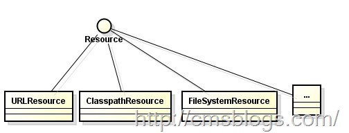
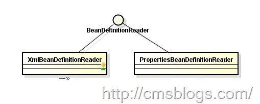
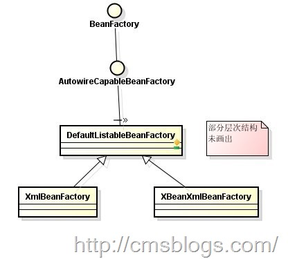
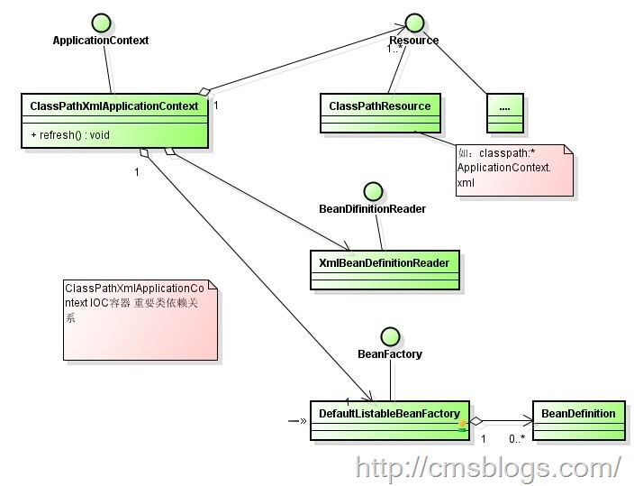

##【初探Spring】------Spring IOC（一）

##
##IOC：Inversion of Control(控制反转)。IOC它所体现的并不是一种技术，而是一种思想，一种将设计好的对象交给容器来管理的思想。IOC的核心思想就体现在控制、反转这两个词上面，要理解就必须要理解几个问题：

##
##1、谁控制谁？在传统的开发工作中，我们一般都是主动去new一个对象，这个是主动控制依赖对象。但是对于IOC而已，控制权会被移交给容器，所以应该是IOC容器控制对象。

##
##2、控制什么？既然是IOC容器控制对象，那控制什么呢？IOC容器除了负责控制对象的生成还包括外部资源的获取。

##
##3、为何是反转？对象主动生成依赖对象，我们称之为“正转”，但是现在有IOC来负责了，所以反转则是IOC容器来负责对象的生成和注入过程。

##
##4、那些地方反转？依赖对象的获取被反转了。

##
##对于IOC而言，它强调是将主动变为被动，由IOC容器来负责依赖对象的创建和查找，由IOC容器来进行注入组合对象。将原来的强联系、高耦合转变为了弱关系、松耦合。IOC，它能指导我们如何设计出松耦合、更加优良的程序，把应用程序从原来需要维护依赖对象之间关系中彻底解放出来而更加专注于业务逻辑，这样会使得程序的整个体系机构变得非常灵活。

##
##其实IoC对编程带来的最大改变不是从代码上，而是从思想上，发生了“主从换位”的变化。应用程序原本是老大，要获取什么资源都是主动出击，但是在IoC/DI思想中，应用程序就变成被动的了，被动的等待IoC容器来创建并注入它所需要的资源了。

##
##有了IOC就有必要提到DI了。DI,Dependency Injection，即“依赖注入”。其实IOC和DI本就是同一个概念的两种不同的表述，DI所描述的是由容器动态地将某个依赖关系注入到主键当中去，其需要理解如下几个概念：

##
##1、谁依赖谁？应用程序依赖IOC容器。

##
##2、依赖什么？因为应用程序不再主动去创建对象，由IOC容器来向应用程序注入，所以应该是应用程序依赖IOC容器来提供的外部资源。

##
##3、谁注入谁？由IOC容器向应用程序注入。

##
##4、注入什么？注入的某个对象所依赖的外部资源。

##
##通俗点将就是IOC就是容器控制应用程序所需要外部资源的创建和管理，然后将其反转给应用程序；而DI是应用程序依赖容器提供的外部对象，容器将其依赖的外部资源在运行期注入到应用程序中。两者表达的意思都是容器负责应用程序的创建和管理，应用程序只需要在需要它们的时候等待容器将其所依赖的外部资源提供就行，至于来自哪里，怎么来的应用程序都不需要知道。

##
##具体的IOC理解我就不多阐述了，网上实在是太多了，这里推荐几篇博客：

##
##1、谈谈对Spring IOC的理解

##
##2、【第二章】 IoC 之 2.1 IoC基础 ——跟我学Spring3

##
##3、Spring的IOC原理[通俗解释一下]

##
##4、spring ioc原理（看完后大家可以自己写一个spring）
##IOC结构体系

##
##IOC作为一个容器，它里面放得都是bean、bean与bean之间的对应关系，而bean之间的对应关系我们开始都是通过xml配置文件来体现的。那么这里就反馈了如下几个问题：

##
##1、对应与对象之间的关系是通过xml配置文件来描述的（当然也可以是properties等文件）。

##
##2、描述的文件存放位置在那里，一般来说我们都是放在classpath目录下的，但是也可是是URL、fileSystem。

##
##3、文件的解析。

##
##4、Bean在容器中的表现形式，也就是它的数据结构。

##
##对于Spring而言，它用Resource、BeanDefinition、BeanDefinitionReader、BeanFactory、ApplicationContext五个组件来实现以上问题，而同时这5个接口定义了 spring ioc 容器的基本代码组件结构。下面我们逐一了解这五个结构

##
##Resource

##
##Resource，对资源的抽象，它的每一个实现类都代表了一种资源的访问策略，如ClasspathResource 、 URLResource ，FileSystemResource 等。

##
## 

##
##

##
##BeanDefinition

##
##用来描述和抽象一个具体的Bean对象，它是描述Bean对象的基本数据结构。

##
##BeanDefinitionReader

##
##外部资源所表达的语义需要统一转化为统一的内部数据结构BeanDefinition，这个时候BeanDefinitionReader就起到统一解析的作用力了。对应不同的描述需要有不同的 Reader 。如 XmlBeanDefinitionReader 用来读取xml 描述配置的 bean 对象。

##
## 

##
##BeanFactory

##
##BeanFactory是一个非常纯粹的bean容器，它是IOC必备的数据结构，其中BeanDefinition是她的基本结构，它内部维护着一个BeanDefinition map，并可根据BeanDefinition 的描述进行 bean 的创建和管理。

##
##

##
## 

##
##

##
##ApplicationContext

##
##这个就是大名鼎鼎的Spring容器，它叫做应用上下文，与我们应用息息相关，她继承BeanFactory，所以它是BeanFactory的扩展升级版，如果BeanFactory是屌丝的话，那么ApplicationContext则是名副其实的高富帅。由于ApplicationContext的结构就决定了它与BeanFactory的不同，其主要区别有：

##
##1、继承MessageSource，提供国际化的标准访问策略。

##
##2、继承ApplicationEventPublisher，提供强大的事件机制。

##
##3、扩展ResourceLoader，可以用来加载多个Resource，可以灵活访问不同的资源。

##
##4、对Web应用的支持。

##
##下图是上面组合关系图（以ClasspathXmlApplicationContext 为例）

##
## 

##
##以上图片均来自：啃啃老菜： Spring IOC核心源码学习（一）

##
##

##
##下面LZ将尽全力阐述IOC的初始化过程和在该过程中涉及的重要组件，这系列博客是也是LZ学习、研究Spring机制和源码的学习笔记，其中难免会参考别人的博客，如有雷同，纯属借鉴。同时也避免不了错误之处，博文中的错误望各位博友指出，不胜感激！！！

##
##参考资料

##
##1、啃啃老菜： Spring IOC核心源码学习（一）