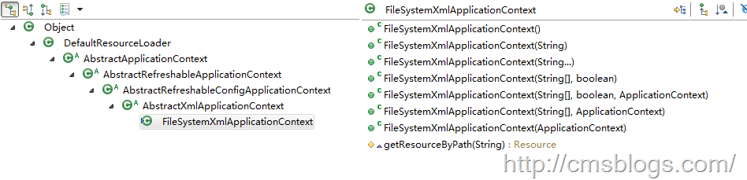
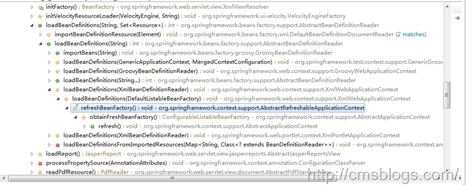
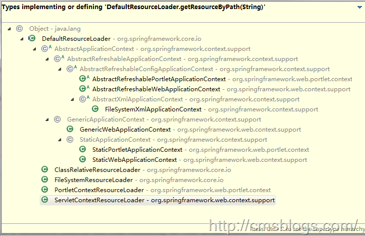

##【初探Spring】------Spring IOC（三）：初始化过程---Resource定位

##
##我们知道Spring的IoC起到了一个容器的作用，其中装得都是各种各样的Bean。同时在我们刚刚开始学习Spring的时候都是通过xml文件来定义Bean，Spring会某种方式加载这些xml文件，然后根据这些信息绑定整个系统的对象，最终组装成一个可用的基于轻量级容器的应用系统。

##
##Spring IoC容器整体可以划分为两个阶段，容器启动阶段，Bean实例化阶段。其中容器启动阶段主要包括加载配置信息、解析配置信息，装备到BeanDefinition中以及其他后置处理，而Bean实例化阶段主要包括实例化对象，装配依赖，生命周期管理已经注册回调。下面LZ先介绍容器的启动阶段的第一步，即定位配置文件。

##
##我们使用编程方式使用DefaultListableBeanFactory时，首先是需要定义一个Resource来定位容器使用的BeanDefinition。

	ClassPathResource resource = new ClassPathResource("bean.xml");


##
##通过这个代码，就意味着Spring会在类路径中去寻找bean.xml并解析为BeanDefinition信息。当然这个Resource并不能直接被使用，他需要被BeanDefinitionReader进行解析处理（这是后面的内容了）。

##
##对于各种applicationContext，如FileSystemXmlApplicationContext、ClassPathXmlApplicationContext等等，我们从这些类名就可以看到他们提供了那些Resource的读入功能。下面我们以FileSystemXmlApplicationContext为例来阐述Spring IoC容器的Resource定位。

##
##先看FileSystemXmlApplicationContext继承体系结构：

##
## 

##
##从图中可以看出FileSystemXMLApplicationContext继承了DefaultResourceLoader，具备了Resource定义的BeanDefinition的能力，其源代码如下：

	public class FileSystemXmlApplicationContext extends AbstractXmlApplicationContext {
    /**
     * 默认构造函数
     */
    public FileSystemXmlApplicationContext() {
    	}

    public FileSystemXmlApplicationContext(ApplicationContext parent) {
        super(parent);
    	}

    public FileSystemXmlApplicationContext(String configLocation) throws BeansException {
        this(new String[] {configLocation	}, true, null);
    	}

    public FileSystemXmlApplicationContext(String... configLocations) throws BeansException {
        this(configLocations, true, null);
    	}

    public FileSystemXmlApplicationContext(String[] configLocations, ApplicationContext parent) throws BeansException {
        this(configLocations, true, parent);
    	}

    public FileSystemXmlApplicationContext(String[] configLocations, boolean refresh) throws BeansException {
        this(configLocations, refresh, null);
    	}
    
    //核心构造器
    public FileSystemXmlApplicationContext(String[] configLocations, boolean refresh, ApplicationContext parent)
            throws BeansException {

        super(parent);
        setConfigLocations(configLocations);
        if (refresh) {
            refresh();
        	}
    	}

    //通过构造一个FileSystemResource对象来得到一个在文件系统中定位的BeanDefinition
    //采用模板方法设计模式，具体的实现用子类来完成
    protected Resource getResourceByPath(String path) {
        if (path != null &amp;&amp; path.startsWith("/")) {
            path = path.substring(1);
        	}
        return new FileSystemResource(path);
    	}

	}


##
##AbstractApplicationContext中的refresh()方法是IoC容器初始化的入口，也就是说IoC容器的初始化是通过refresh()方法来完成整个调用过程的。在核心构造器中就对refresh进行调用，通过它来启动IoC容器的初始化工作。getResourceByPath为一个模板方法，通过构造一个FileSystemResource对象来得到一个在文件系统中定位的BeanDEfinition。getResourceByPath的调用关系如下（部分）：

##
## 

##
##refresh为初始化IoC容器的入口，但是具体的资源定位还是在XmlBeanDefinitionReader读入BeanDefinition时完成，loadBeanDefinitions() 加载BeanDefinition的载入。

	protected final void refreshBeanFactory() throws BeansException {
        //判断是否已经创建了BeanFactory，如果创建了则销毁关闭该BeanFactory
        if (hasBeanFactory()) {
            destroyBeans();
            closeBeanFactory();
        	}
        try {
            //创建DefaultListableBeanFactory实例对象
            DefaultListableBeanFactory beanFactory = createBeanFactory();
            beanFactory.setSerializationId(getId());
            customizeBeanFactory(beanFactory);
            //加载BeanDefinition信息
            loadBeanDefinitions(beanFactory);
            synchronized (this.beanFactoryMonitor) {
                this.beanFactory = beanFactory;
            	}
        	}
        catch (IOException ex) {
            throw new ApplicationContextException("I/O error parsing bean definition source for " + getDisplayName(), ex);
        	}
    	}


##
##DefaultListableBeanFactory作为BeanFactory默认实现类，其重要性不言而喻，而createBeanFactory()则返回该实例对象。

	protected DefaultListableBeanFactory createBeanFactory() {
        return new DefaultListableBeanFactory(getInternalParentBeanFactory());
    	}


##
##loadBeanDefinition方法加载BeanDefinition信息，BeanDefinition就是在这里定义的。AbstractRefreshableApplicationContext对loadBeanDefinitions仅仅只是定义了一个抽象的方法，真正的实现类为其子类AbstractXmlApplicationContext来实现：

##
##AbstractRefreshableApplicationContext：

	protected abstract void loadBeanDefinitions(DefaultListableBeanFactory beanFactory)
            throws BeansException, IOException;


##
##AbstractXmlApplicationContext：

	protected void loadBeanDefinitions(DefaultListableBeanFactory beanFactory) throws BeansException, IOException {
        //创建bean的读取器(Reader)，即XmlBeanDefinitionReader,并通过回调设置到容器中
        XmlBeanDefinitionReader beanDefinitionReader = new XmlBeanDefinitionReader(beanFactory);

        //
        beanDefinitionReader.setEnvironment(getEnvironment());
        //为Bean读取器设置Spring资源加载器
        beanDefinitionReader.setResourceLoader(this);
        //为Bean读取器设置SAX xml解析器
        beanDefinitionReader.setEntityResolver(new ResourceEntityResolver(this));

        //
        initBeanDefinitionReader(beanDefinitionReader);
        //Bean读取器真正实现的地方
        loadBeanDefinitions(beanDefinitionReader);
    	}


##
##程序首先首先创建一个Reader，在前面就提到过，每一类资源都对应着一个BeanDefinitionReader，BeanDefinitionReader提供统一的转换规则；然后设置Reader，最后调用loadBeanDefinition，该loadBeanDefinition才是读取器真正实现的地方：

	protected void loadBeanDefinitions(XmlBeanDefinitionReader reader) throws BeansException, IOException {
        //获取Bean定义资源的定位
        Resource[] configResources = getConfigResources();
        if (configResources != null) {
            reader.loadBeanDefinitions(configResources);
        	}
        //获取Bean定义资源的路径。在FileSystemXMLApplicationContext中通过setConfigLocations可以配置Bean资源定位的路径
        String[] configLocations = getConfigLocations();
        if (configLocations != null) {
            reader.loadBeanDefinitions(configLocations);
        	}
    	}


##
##首先通过getConfigResources()获取Bean定义的资源定位，如果不为null则调用loadBeanDefinitions方法来读取Bean定义资源的定位。

##
##loadBeanDefinitions是中的方法：

	public int loadBeanDefinitions(String... locations) throws BeanDefinitionStoreException {
        Assert.notNull(locations, "Location array must not be null");
        int counter = 0;
        for (String location : locations) {
            counter += loadBeanDefinitions(location);
        	}
        return counter;
    	}


##
##继续：

	public int loadBeanDefinitions(String location) throws BeanDefinitionStoreException {
        return loadBeanDefinitions(location, null);
    	}


##
##再继续：

	public int loadBeanDefinitions(String location, Set<Resource> actualResources) throws BeanDefinitionStoreException {
        //获取ResourceLoader资源加载器
        ResourceLoader resourceLoader = getResourceLoader();
        if (resourceLoader == null) {
            throw new BeanDefinitionStoreException(
                    "Cannot import bean definitions from location [" + location + "]: no ResourceLoader available");
        	}

        //
        if (resourceLoader instanceof ResourcePatternResolver) {
            try {
                //调用DefaultResourceLoader的getResourceByPath完成具体的Resource定位
                Resource[] resources = ((ResourcePatternResolver) resourceLoader).getResources(location);
                int loadCount = loadBeanDefinitions(resources);
                if (actualResources != null) {
                    for (Resource resource : resources) {
                        actualResources.add(resource);
                    	}
                	}
                if (logger.isDebugEnabled()) {
                    logger.debug("Loaded " + loadCount + " bean definitions from location pattern [" + location + "]");
                	}
                return loadCount;
            	}
            catch (IOException ex) {
                throw new BeanDefinitionStoreException(
                        "Could not resolve bean definition resource pattern [" + location + "]", ex);
            	}
        	}
        else {
            //调用DefaultResourceLoader的getResourceByPath完成具体的Resource定位
            Resource resource = resourceLoader.getResource(location);
            int loadCount = loadBeanDefinitions(resource);
            if (actualResources != null) {
                actualResources.add(resource);
            	}
            if (logger.isDebugEnabled()) {
                logger.debug("Loaded " + loadCount + " bean definitions from location [" + location + "]");
            	}
            return loadCount;
        	}
    	}


##
##在这段源代码中通过调用DefaultResourceLoader的getResource方法：

	public Resource getResource(String location) {
        Assert.notNull(location, "Location must not be null");
        if (location.startsWith("/")) {
            return getResourceByPath(location);
        	}
        //处理带有classPath标识的Resource
        else if (location.startsWith(CLASSPATH_URL_PREFIX)) {
            return new ClassPathResource(location.substring(CLASSPATH_URL_PREFIX.length()), getClassLoader());
        	}
        else {
            try {
                //处理URL资源
                URL url = new URL(location);
                return new UrlResource(url);
            	}
            catch (MalformedURLException ex) {
                return getResourceByPath(location);
            	}
        	}
    	}


##
##在getResource方法中我们可以清晰地看到Resource资源的定位。这里可以清晰地看到getResourceByPath方法的调用，getResourceByPath方法的具体实现有子类来完成，在FileSystemXmlApplicationContext实现如下：

	protected Resource getResourceByPath(String path) {
        if (path != null &amp;&amp; path.startsWith("/")) {
            path = path.substring(1);
        	}
        return new FileSystemResource(path);
    	}


##
##这样代码就回到了博客开初的FileSystemXmlApplicationContext 中来了，它提供了FileSystemResource 来完成从文件系统得到配置文件的资源定义。当然这仅仅只是Spring IoC容器定位资源的一种逻辑，我们可以根据这个步骤来查看Spring提供的各种资源的定位，如ClassPathResource、URLResource等等。下图是ResourceLoader的继承关系：

##
## 

##
##这里就差不多分析了Spring IoC容器初始化过程资源的定位，在BeanDefinition定位完成的基础上，就可以通过返回的Resource对象来进行BeanDefinition的载入、解析了。

##
##下篇博客将探索Spring IoC容器初始化过程的解析，Spring Resource体系结构会在后面详细讲解。

##
##

##
##参考文献

##
##1、《Spring技术内幕 深入解析Spring架构与设计原理》--第二版

##
##2、Spring：源码解读Spring IOC原理

##
##3、【Spring】IOC核心源码学习（二）：容器初始化过程