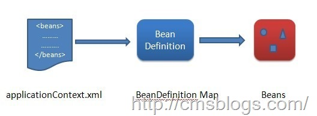

##【初探Spring】------Spring IOC（二）：初始化过程---简介

##
##首先我们先来看看如下一段代码     	ClassPathResource resource = new ClassPathResource("bean.xml");
        DefaultListableBeanFactory factory = new DefaultListableBeanFactory();
        XmlBeanDefinitionReader reader = new XmlBeanDefinitionReader(factory);
        reader.loadBeanDefinitions(resource);



##
##博友是否对这段简单代码记忆犹新呢？ 这段代码是编程式使用IOC容器，通过这个简单的程序我们初步判定IOC容器的使用过程：


##
##1、创建IOC配置文件的抽闲资源，也就是Resource接口。


##
##2、创建BeanFactory，DefaultListtableBeanFactory是BeanFactory模式实现类。


##
##3、创建一个BeanDefinitionReader对象，该对象为BeanDefinition的读取器。xml文件就使用XMLBeanDefinitionReader。


##
##4、使用Reader来装载配置文件。loadBeanDefinitions就包括了资源文件的解析和注入过程。


##
##通过上面四个步骤我们就可以轻松地使用IOC容器了，在整个过程可以剖析为三个步骤，这三个步骤也是IOC容器的初始化过程：Resource定位、载入、注册。如下：


##
## 


##
##Resource定位


##
##我们一般使用外部资源来描述Bean对象，所以IOC容器第一步就是需要定位Resource外部资源。Resource的定位其实就是BeanDefinition的资源定位，它是由ResourceLoader通过统一的Resource接口来完成的，这个Resource对各种形式的BeanDefinition的使用都提供了统一接口。


##
##载入


##
##第二个过程就是BeanDefinition的载入。BeanDefinitionReader读取、解析Resource定位的资源，也就是将用户定义好的Bean表示成IOC容器的内部数据结构也就是BeanDefinition。在IOC容器内部维护着一个BeanDefinition Map的数据结构，通过这样的数据结构，IOC容器能够对Bean进行更好的管理。


##
##在配置文件中每一个<bean>都对应着一个BeanDefinition对象。


##
##注册


##
##第三个过程则是注册，即向IOC容器注册这些BeanDefinition，这个过程是通过BeanDefinitionRegistery接口来实现的。在IOC容器内部其实是将第二个过程解析得到的BeanDefinition注入到一个HashMap容器中，IOC容器就是通过这个HashMap来维护这些BeanDefinition的。在这里需要注意的一点是这个过程并没有完成依赖注入，依赖注册是发生在应用第一次调用getBean向容器所要Bean时。当然我们可以通过设置预处理，即对某个Bean设置lazyinit属性，那么这个Bean的依赖注入就会在容器初始化的时候完成。


##
##


##
##经过这三个步骤，IOC容器的初始化过程就已经完成了，后面LZ会结合源代码详细阐述这三个过程的实现。下面来看看与IOC容器相关的体系结构图，以ClassPathXmlApplicationContext为例（图片来自：【Spring】IOC核心源码学习（二）：容器初始化过程）


##
## 


##
##左边黄色部分是 ApplicationContext 体系继承结构，右边是 BeanFactory 的结构体系。