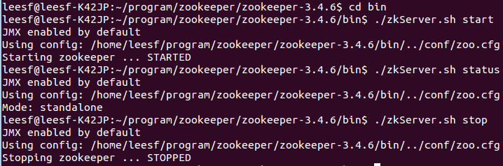
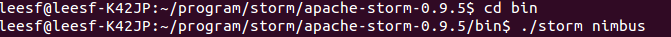
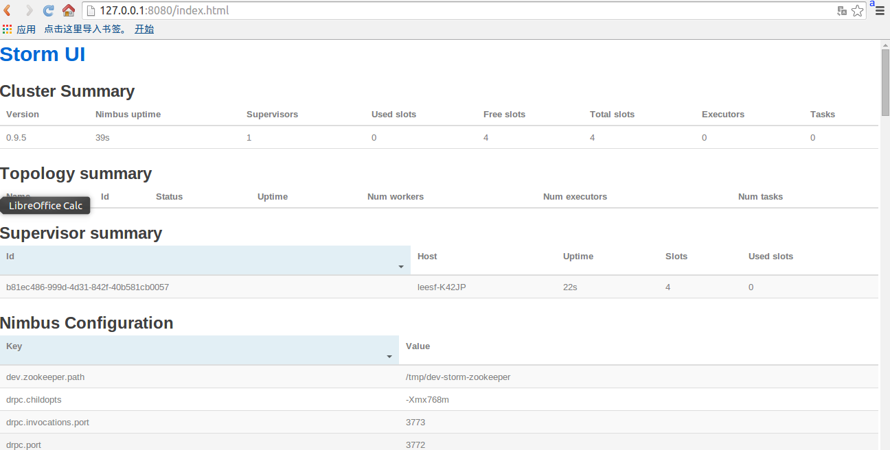
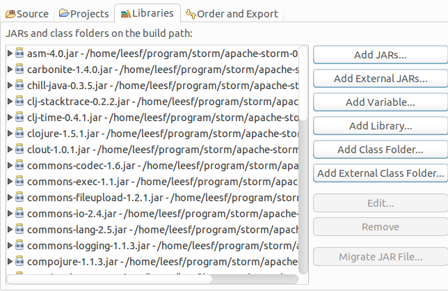

##【大数据】Linux下Storm（0.9版本以上）的环境配置和小Demo

##
##一、引言：

##
##　　在storm发布到0.9.x以后，配置storm将会变得简单很多，也就是只需要配置zookeeper和storm即可，而不再需要配置zeromq和jzmq，由于网上面的storm配置绝大部分都是0.9以前的storm版本，所以有很多工作是不需要进行的，下面就storm的0.9.5版本在linux环境下进行配置进行详细解析。

##
##　　由于配置storm只需要两个步骤，大大简化了配置，也是storm团队做了很大的努力，让程序员们专注于程序，让storm配置进行异常简单，好了，废话说了不少，下面正式开始讲解。

##
##

##
##二、配置zookeeper

##
##　　1.打开shell，可以根据自身的习惯设置下载文件的位置信息，使用如下命令进行下载(下载3.4.6版本，此版本位稳定版)：

##
##　　wgethttp://mirrors.hust.edu.cn/apache/zookeeper/zookeeper-3.4.6/zookeeper-3.4.6.tar.gz

##
##　　2.下载完成后，使用如下命令进行解压缩：

##
##　　tar -zxvf zookeeper-3.4.6.tar.gz

##
##　　会出现一个名为zookeeper-3.4.6的文件夹

##
##　　3.进入zookeeper-3.4.6的conf文件夹，复制zoo_sample.cfg，重命名为zoo.cfg

##
##　　4.修改zoo.cfg的内容，添加的内容如下：　

##
##　　dataDir=/home/leesf/program/zookeeper/data　　　　//（注释：放置数据信息）　　dataLogDir=/home/leesf/program/zookeeper/log　　　　//（注释：放置日志信息）

##
##  　server.1=127.0.0.1:2888:3888　　　　//（注释：使用本地模式，如果有多个机器，可以进行配置（server.1=xxx.xxx.xxxx:xxxx:xxxx 　　　　　　　　　　    

##
##　　　　　　　　　　　　　　　　　　　　//server.2=xxx.xxx.xxx:xxxx:xxxx ....））

##
##　　5.在shell命令行里进入zookeeper-3.4.6/bin目录，使用如下命令可以开启、测试、停止zookeeper服务

##
##　　./zkServer.sh start　　　　//（注释：开启服务）

##
##　　./zkServer.sh status　　　　//（注释：查看状态）

##
##　　./zkServer.sh stop　　　　//（停止服务）

##
##　　截图如下：

##
##　　 

##
##　

##
##三、配置storm

##
##　　1.下载storm，使用如下命令下载storm文件

##
##　　wgethttp://mirrors.hust.edu.cn/apache/storm/apache-storm-0.9.5/apache-storm-0.9.5.tar.gz

##
##　　2.进行解压缩，使用如下命令

##
##　　tar -zxvf apache-storm-0.9.5.tar.gz

##
##　　解压缩后出现文件夹apache-storm-0.9.5

##
##　　3.修改apache-storm-0.9.5/conf目录中的storm.yaml文件

##
##　　添加的内容如下：　

##
##　　# storm.zookeeper.servers:　　#     - "127.0.0.1"　　# 　　# nimbus.host: "127.0.0.1"　　# 　　# storm.zookeeper.port:2181　　#　　# storm.local.dir: "/home/leesf/program/storm/data"　　# 　　# supervisor.slots.ports:　　# -6700　　# -6701　　# -6702　　# -6703

##
##　　4.进入到apache-storm-0.9.5/bin目录下，启动nimbus、supervisor、ui，使用如下命令进行启动：

##
##　　./storm nimbus

##
##　　./storm supervisor

##
##　　./storm ui

##
##　　截图如下：

##
##　　 

##
##　　 

##
##　　 

##
##　　5.在浏览器中查看storm ui信息，打开浏览器输入127.0.0.1:8080即可查看

##
##　　截图如下：

##
##　　 

##
##　　

##
##至此，storm的配置就完成了。

##
##下面使用storm的本地模式来运行一个小的Demo，方便各位园友查看storm的运行效果

##
##

##
##四、Storm Demo示例

##
##　　storm demo的目录结构如下

##
##　　　　1.spout包，数据发射源

##
##　　　　2.bolt包，数据处理节点

##
##　　　　3.main包，程序执行入口

##
##　　　　4.words.txt，程序资源文件

##
##　　分为如下几个步骤：

##
##　　1.添加源代码：

##
##　　　　1.spout包中包含一个java文件，WordReader.java，具体代码如下：　　　
  

	package com.leesf.Spout;

import java.io.BufferedReader;
import java.io.FileNotFoundException;
import java.io.FileReader;
import java.util.Map;
import backtype.storm.spout.SpoutOutputCollector;
import backtype.storm.task.TopologyContext;
import backtype.storm.topology.OutputFieldsDeclarer;
import backtype.storm.topology.base.BaseRichSpout;
import backtype.storm.tuple.Fields;
import backtype.storm.tuple.Values;

public class WordReader extends BaseRichSpout {

    private SpoutOutputCollector collector;
    private FileReader fileReader;
    private boolean completed = false;
    public void ack(Object msgId) {
        System.out.println("OK:"+msgId);
    	}
    public void close() {	}
    public void fail(Object msgId) {
        System.out.println("FAIL:"+msgId);
    	}

    /**
     * The only thing that the methods will do It is emit each 
     * file line
     */
    public void nextTuple() {
        /**
         * The nextuple it is called forever, so if we have been readed the file
         * we will wait and then return
         */
        if(completed){
            try {
                Thread.sleep(1000);
            	} catch (InterruptedException e) {
                //Do nothing
            	}
            return;
        	}
        String str;
        //Open the reader
        BufferedReader reader = new BufferedReader(fileReader);
        try{
            //Read all lines
            while((str = reader.readLine()) != null){
                /**
                 * By each line emmit a new value with the line as a their
                 */
                this.collector.emit(new Values(str),str);
            	}
        	}catch(Exception e){
            throw new RuntimeException("Error reading tuple",e);
        	}finally{
            completed = true;
        	}
    	}

    /**
     * We will create the file and get the collector object
     */
    public void open(Map conf, TopologyContext context,
            SpoutOutputCollector collector) {
        try {
            this.fileReader = new FileReader(conf.get("wordsFile").toString());
        	} catch (FileNotFoundException e) {
            throw new RuntimeException("Error reading file ["+conf.get("wordFile")+"]");
        	}
        this.collector = collector;
    	}

    /**
     * Declare the output field "word"
     */
    public void declareOutputFields(OutputFieldsDeclarer declarer) {
        declarer.declare(new Fields("line"));
    	}
	}

View Code

##
##　　　　2.bolt包中包含两个java文件，WordCounter.java、WordNormalizer.java，具体代码如下：

##
##　　　　WordCounter.java代码如下：
  

	package com.leesf.Bolt;

import java.util.HashMap;
import java.util.Map;

import backtype.storm.task.TopologyContext;
import backtype.storm.topology.BasicOutputCollector;
import backtype.storm.topology.OutputFieldsDeclarer;
import backtype.storm.topology.base.BaseBasicBolt;
import backtype.storm.tuple.Tuple;

public class WordCounter extends BaseBasicBolt {

    Integer id;
    String name;
    Map<String, Integer> counters;

    /**
     * At the end of the spout (when the cluster is shutdown
     * We will show the word counters
     */
    @Override
    public void cleanup() {
        System.out.println("-- Word Counter ["+name+"-"+id+"] --");
        for(Map.Entry<String, Integer> entry : counters.entrySet()){
            System.out.println(entry.getKey()+": "+entry.getValue());
        	}
    	}

    /**
     * On create 
     */
    @Override
    public void prepare(Map stormConf, TopologyContext context) {
        this.counters = new HashMap<String, Integer>();
        this.name = context.getThisComponentId();
        this.id = context.getThisTaskId();
    	}

    @Override
    public void declareOutputFields(OutputFieldsDeclarer declarer) {	}


    @Override
    public void execute(Tuple input, BasicOutputCollector collector) {
        String str = input.getString(0);
        /**
         * If the word dosn"t exist in the map we will create
         * this, if not We will add 1 
         */
        if(!counters.containsKey(str)){
            counters.put(str, 1);
        	}else{
            Integer c = counters.get(str) + 1;
            counters.put(str, c);
        	}
    	}
	}

View Code

##
##　　　　WordNormalizer.java代码如下：
  

	package com.leesf.Bolt;

import backtype.storm.topology.BasicOutputCollector;
import backtype.storm.topology.OutputFieldsDeclarer;
import backtype.storm.topology.base.BaseBasicBolt;
import backtype.storm.tuple.Fields;
import backtype.storm.tuple.Tuple;
import backtype.storm.tuple.Values;

public class WordNormalizer extends BaseBasicBolt {

    public void cleanup() {	}

    /**
     * The bolt will receive the line from the
     * words file and process it to Normalize this line
     * 
     * The normalize will be put the words in lower case
     * and split the line to get all words in this 
     */
    public void execute(Tuple input, BasicOutputCollector collector) {
        String sentence = input.getString(0);
        String[] words = sentence.split(" ");
        for(String word : words){
            word = word.trim();
            if(!word.isEmpty()){
                word = word.toLowerCase();
                collector.emit(new Values(word));
            	}
        	}
    	}
    

    /**
     * The bolt will only emit the field "word" 
     */
    public void declareOutputFields(OutputFieldsDeclarer declarer) {
        declarer.declare(new Fields("word"));
    	}
	}

View Code

##
##　　　　3.main包中包含一个java文件，Main.java，具体代码如下：
  

	package com.leesf.Main;
import backtype.storm.Config;
import backtype.storm.LocalCluster;
import backtype.storm.topology.TopologyBuilder;
import backtype.storm.tuple.Fields;
import com.leesf.Bolt.*;
import com.leesf.Spout.*;


public class Main {
    public static void main(String[] args) throws InterruptedException {
         
        //Topology definition
        TopologyBuilder builder = new TopologyBuilder();
        builder.setSpout("word-reader",new WordReader());
        builder.setBolt("word-normalizer", new WordNormalizer())
            .shuffleGrouping("word-reader");
        builder.setBolt("word-counter", new WordCounter(),1)
            .fieldsGrouping("word-normalizer", new Fields("word"));
        
        //Configuration
        Config conf = new Config();
        conf.put("wordsFile", "/home/leesf/code/eclipse/StormDemo/res/words.txt");
        conf.setDebug(false);
        //Topology run
        conf.put(Config.TOPOLOGY_MAX_SPOUT_PENDING, 1);
        LocalCluster cluster = new LocalCluster();
        cluster.submitTopology("Getting-Started-Toplogie", conf, builder.createTopology());
        Thread.sleep(10000);
        cluster.shutdown();
    	}
	}

View Code

##
##　　　　4.资源文件，words.txt,内容如下：
  

	storm
test
are
great
is
an
storm
simple
application
but
very
powerfull
really
StOrm
is
great

View Code

##
##　　　　words.txt可以放在任何地方，相应的程序中的路径也要进行修改，保证路径一致。

##
##　　2.添加依赖库

##
##　　将storm/lib目录下的所有文件添加到本项目中，截图如下：

##
##　　 

##
##　　3.运行程序

##
##　　运行程序，可以得到如下的结果：

##
## 

##
##至此，关于storm的所有配置就已经完成了，下面可以进行相应的storm的开发了。

##
##总结：storm在发布了0.9b版本以后，其配置工作就变得很简单，不再需要配置zeromq和jzmq，现在网上面的配置信息绝大部分都是0.9版本以前的，所以配置显得很累赘，在此记录此次的配置过程，方便各位园友的同时也方便自己以后再去配置这样的信息。在配置的过程中有任何问题也欢迎交流，谢谢各位观看。

##
##参考链接：

##
##http://blog.csdn.net/w13770269691/article/details/38982397

##
##　　

##
##

##
##　　

##
##　　

##
##　　

##
##