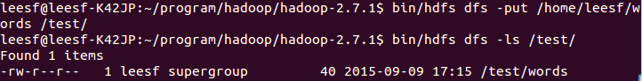

**一、引言**

在完成了Storm的环境配置之后，想着鼓捣一下Hadoop的安装，网上面的教程好多，但是没有一个特别切合的，所以在安装的过程中还是遇到了很多的麻烦，并且最后不断的查阅资料，终于解决了问题，感觉还是很好的，下面废话不多说，开始进入正题。

本机器的配置环境如下：

Hadoop(2.7.1)

Ubuntu Linux(64位系统)

下面分为几个步骤来详解配置过程。

**二、安装ssh服务**

进入shell命令，输入如下命令，查看是否已经安装好ssh服务，若没有，则使用如下命令进行安装：

sudo apt-get install ssh openssh-server

安装过程还是比较轻松加愉快的。

**三、使用ssh进行无密码验证登录**

1.创建ssh-key，这里我们采用rsa方式，使用如下命令：

ssh-keygen -t rsa -P ""

2.出现一个图形，出现的图形就是密码，不用管它

cat ~/.ssh/id_rsa.pub  >> authorized_keys(好像是可以省略的)

3.然后即可无密码验证登录了，如下：

ssh localhost

成功截图如下：

**四、下载Hadoop安装包**

下载Hadoop安装也有两种方式

1.直接上官网进行下载，<http://mirrors.hust.edu.cn/apache/hadoop/core/stable/hadoop-2.7.1.tar.gz>

2.使用shell进行下载，命令如下：

wget http://mirrors.hust.edu.cn/apache/hadoop/core/stable/hadoop-2.7.1.tar.gz

貌似第二种的方法要快点，经过漫长的等待，终于下载完成。

**五、解压缩Hadoop安装包**

使用如下命令解压缩Hadoop安装包

tar -zxvf hadoop-2.7.1.tar.gz

解压缩完成后出现hadoop2.7.1的文件夹

**六、配置Hadoop中相应的文件**

需要配置的文件如下，hadoop-env.sh，core-site.xml，mapred-site.xml.template，hdfs-
site.xml，所有的文件均位于hadoop2.7.1/etc/hadoop下面，具体需要的配置如下：

1.core-site.xml 配置如下：

<configuration>  
<property>  
<name>hadoop.tmp.dir</name>  
<value>file:/home/leesf/program/hadoop/tmp</value>  
<description>Abase for other temporary directories.</description>  
</property>  
<property>  
<name>fs.defaultFS</name>  
<value>hdfs://localhost:9000</value>  
</property>  
</configuration>

其中的hadoop.tmp.dir的路径可以根据自己的习惯进行设置。

2.mapred-site.xml.template配置如下：

<configuration>  
<property>  
<name>mapred.job.tracker</name>  
<value>localhost:9001</value>  
</property>  
</configuration>

3.hdfs-site.xml配置如下：

<configuration>  
<property>  
<name>dfs.replication</name>  
<value>1</value>  
</property>  
<property>  
<name>dfs.namenode.name.dir</name>  
<value>file:/home/leesf/program/hadoop/tmp/dfs/name</value>  
</property>  
<property>  
<name>dfs.datanode.data.dir</name>  
<value>file:/home/leesf/program/hadoop/tmp/dfs/data</value>  
</property>  
</configuration>

其中dfs.namenode.name.dir和dfs.datanode.data.dir的路径可以自由设置，最好在hadoop.tmp.dir的目录下面。

补充，如果运行Hadoop的时候发现找不到jdk，可以直接将jdk的路径放置在hadoop.env.sh里面，具体如下：

export JAVA_HOME="/home/leesf/program/java/jdk1.8.0_60"

**七、运行Hadoop**

在配置完成后，运行hadoop。

1.初始化HDFS系统

在hadop2.7.1目录下使用如下命令：

bin/hdfs namenode -format

截图如下：

过程需要进行ssh验证，之前已经登录了，所以初始化过程之间键入y即可。

成功的截图如下：

表示已经初始化完成。

2.开启`NameNode`和`DataNode`守护进程

使用如下命令开启：

`sbin/start-dfs.sh，成功的截图如下：`

3.查看进程信息

使用如下命令查看进程信息

jps，截图如下：

表示数据DataNode和NameNode都已经开启

4.查看Web UI  

在浏览器中输入[http://localhost:50070](http://localhost:50070/)，即可查看相关信息，截图如下：

至此，hadoop的环境就已经搭建好了。下面开始使用hadoop来运行一个WordCount例子。

**八、运行WordCount Demo**

1.在本地新建一个文件，笔者在home/leesf目录下新建了一个words文档，里面的内容可以随便填写。

2.在HDFS中新建一个文件夹，用于上传本地的words文档，在hadoop2.7.1目录下输入如下命令：

bin/hdfs dfs -mkdir /test，表示在hdfs的根目录下建立了一个test目录

使用如下命令可以查看HDFS根目录下的目录结构

bin/hdfs dfs -ls /

具体截图如下：

表示在HDFS的根目录下已经建立了一个test目录

3.将本地words文档上传到test目录中

使用如下命令进行上传操作：

bin/hdfs dfs -put /home/leesf/words /test/

使用如下命令进行查看

bin/hdfs dfs -ls /test/

结果截图如下：

表示已经将本地的words文档上传到了test目录下了。

4.运行wordcount

使用如下命令运行wordcount：

bin/hadoop jar share/hadoop/mapreduce/hadoop-mapreduce-examples-2.7.1.jar
wordcount /test/words /test/out

截图如下：

运行完成后，在/test目录下生成名为out的文件，使用如下命令查看/test目录下的文件

bin/hdfs dfs -ls /test

截图如下：

表示在test目录下已经有了一个名为Out的文件目录

输入如下命令查看out目录下的文件：

bin/hdfs dfs -ls /test/out，结果截图如下：

表示已经成功运行了，结果保存在part-r-00000中。

5.查看运行结果

使用如下命令查看运行结果：

bin/hadoop fs -cat /test/out/part-r-00000

结果截图如下：

至此，运行过程就已经完成了。

**九、总结**

在此次的hadoop配置过程遇到了很多问题，hadoop1.x和2.x的命令还是差别很大的，配置过程中还是一一的解决了问题，配置成功了，收获也很多，特此把这次配置的经验分享出来，也方便想要配置hadoop环境的各位园友，在配置的过程中有任何问题都欢迎讨论，谢谢各位园友的观看~

参考链接如下：

<http://www.linuxidc.com/Linux/2015-02/113487.htm>

<http://www.cnblogs.com/madyina/p/3708153.html>

