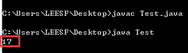
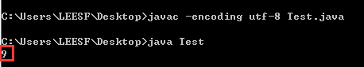
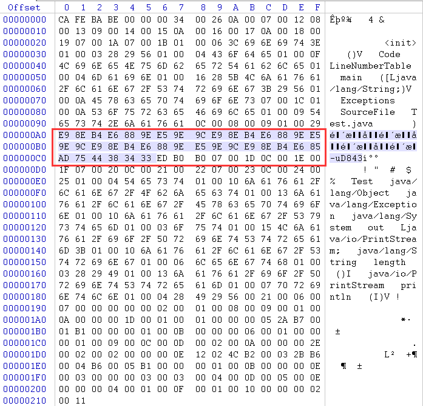
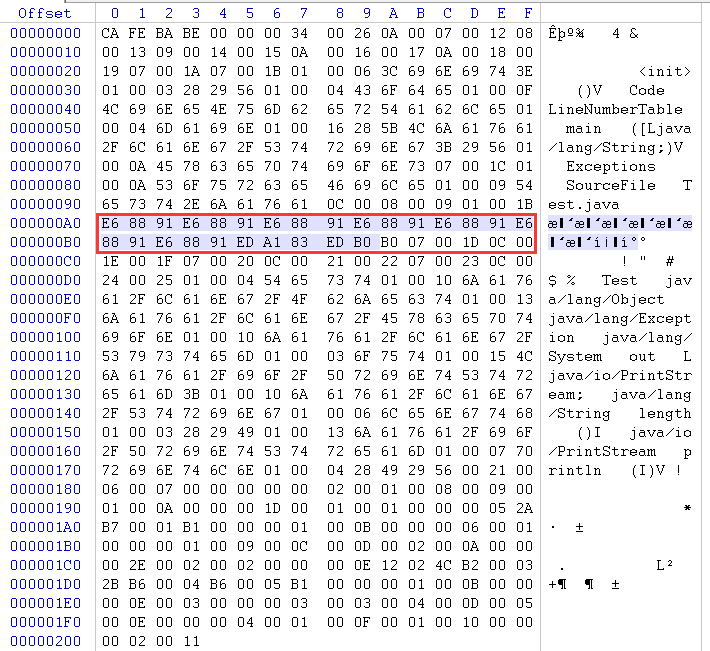
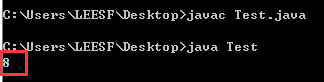

**一、前言**

继上一篇写完[字节编码](http://www.cnblogs.com/leesf456/p/5317574.html)内容后，现在分析在Java中各字符编码的问题，并且由这个问题，也引出了一个更有意思的问题，笔者也还没有找到这个问题的答案。也希望各位园友指点指点。

**二、Java字符编码**

直接上代码进行分析似乎更有感觉。

    
    
     public class Test {    
        public static String stringInfo(String str, String code) throws Exception {
            byte[] bytes = null;
            if (code.equals("")) // 使用缺省编码格式
                bytes = str.getBytes();
            else // 使用指定编码格式
                bytes = str.getBytes(code);
            StringBuffer sb = new StringBuffer();
            for (int i = 0; i < bytes.length; i++) { // 转化为十六进制
                sb.append(Integer.toHexString(bytes[i] & 0xff).toUpperCase() + " ");
            }
            // 对最后一个空格做处理（为了显示美观）
            String info = sb.toString().substring(0, sb.toString().length() - 1);
            // 组合返回
            StringBuffer result = new StringBuffer();
            result.append(bytes.length);
            result.append("[");
            result.append(info);
            result.append("]");
            return result.toString();
        } 
        
        public static void main(String[] args) throws Exception {
            String left = "(";
            String right = ") : ";
            String[] strs = {"L", "LD", "李", "李邓"};
            String[] codes = {"ASCII", "ISO-8859-1", "GB2312", "GBK", "Unicode", "UTF-8", "UTF-16", "UTF-16BE", "UTF-16LE", ""};
            for (String code : codes) {
                for (String str : strs) {
                    System.out.println(str + left + (!code.equals("") ? code : "default") + right + stringInfo(str, code));
                }
                System.out.println("---------------------------------------");
            }
        }    
    }

View Code

运行结果：

    
    
    L(ASCII) : 1[4C]
    LD(ASCII) : 2[4C 44]
    李(ASCII) : 1[3F]
    李邓(ASCII) : 2[3F 3F]
    ---------------------------------------
    L(ISO-8859-1) : 1[4C]
    LD(ISO-8859-1) : 2[4C 44]
    李(ISO-8859-1) : 1[3F]
    李邓(ISO-8859-1) : 2[3F 3F]
    ---------------------------------------
    L(GB2312) : 1[4C]
    LD(GB2312) : 2[4C 44]
    李(GB2312) : 2[C0 EE]
    李邓(GB2312) : 4[C0 EE B5 CB]
    ---------------------------------------
    L(GBK) : 1[4C]
    LD(GBK) : 2[4C 44]
    李(GBK) : 2[C0 EE]
    李邓(GBK) : 4[C0 EE B5 CB]
    ---------------------------------------
    L(Unicode) : 4[FE FF 0 4C]
    LD(Unicode) : 6[FE FF 0 4C 0 44]
    李(Unicode) : 4[FE FF 67 4E]
    李邓(Unicode) : 6[FE FF 67 4E 90 93]
    ---------------------------------------
    L(UTF-8) : 1[4C]
    LD(UTF-8) : 2[4C 44]
    李(UTF-8) : 3[E6 9D 8E]
    李邓(UTF-8) : 6[E6 9D 8E E9 82 93]
    ---------------------------------------
    L(UTF-16) : 4[FE FF 0 4C]
    LD(UTF-16) : 6[FE FF 0 4C 0 44]
    李(UTF-16) : 4[FE FF 67 4E]
    李邓(UTF-16) : 6[FE FF 67 4E 90 93]
    ---------------------------------------
    L(UTF-16BE) : 2[0 4C]
    LD(UTF-16BE) : 4[0 4C 0 44]
    李(UTF-16BE) : 2[67 4E]
    李邓(UTF-16BE) : 4[67 4E 90 93]
    ---------------------------------------
    L(UTF-16LE) : 2[4C 0]
    LD(UTF-16LE) : 4[4C 0 44 0]
    李(UTF-16LE) : 2[4E 67]
    李邓(UTF-16LE) : 4[4E 67 93 90]
    ---------------------------------------
    L(default) : 1[4C]
    LD(default) : 2[4C 44]
    李(default) : 3[E6 9D 8E]
    李邓(default) : 6[E6 9D 8E E9 82 93]
    ---------------------------------------

View Code

说明：通过结果我们知道如下信息。

1\.
在Java中，中文在用ASCII码表示为3F，实际对应符号"？"，用ISO-8859-1表示为3F，实际对应符号也是为"？"，这意味着中文已经超出了ASCII和ISO-8859-1的表示范围。

2\. UTF-16采用大端存储，即在字节数组前添加了FE FF，并且FE FF也算在了字符数组长度中。

3\. 指定UTF-16的大端（UTF-16BE）或者小端（UTF-16LE）模式后，则不会有FE FF 或 FF
FE控制符，相应的字节数组大小也不会包含控制符所占的大小。

4\. Unicode表示与UTF-16相同。

5\. getBytes()方法默认是采用UTF-8。

**三、char表示问题**

我们知道，在Java中char类型为两个字节长度，我们来看下一个示例。

    
    
     public class Test {    
        public static void main(String[] args) throws Exception {
            char ch1 = "a";    // 1
            char ch2 = "李"; // 2
            char ch3 = "\uFFFF"; // 3
            char ch4 = "\u10000"; // 4
        
        }
    }

问题：读者觉得这样的代码能够编译通过吗？如不能编码通过是为什么，又具体是那一行代码出现了错误？

分析：把这个示例拷贝到Eclipse中，定位到错误，发现是第四行代码出现了错误，有这样的提示，Invalid character constant。

解答：问题的关键就在于char类型为两个字节长度，Java字符采用UTF-16编码。而"\u10000"显然已经超过了两个字节所能表示的范围了，一个char无法表示。说得更具体点，就是char表示的范围为Unicode表中第零平面（BMP），从0000
- FFFF（十六进制），而在辅助平面上的码位，即010000 - 10FFFF（十六进制），必须使用四个字节进行表示。

有了这个理解后，我们看下面的代码

    
    
    public class Test {    
        public static void main(String[] args) throws Exception {
            char ch1 = "a";
            char ch2 = "李";
            char ch3 = "\uFFFF";
            String str = "\u10000";
            System.out.println(String.valueOf(ch1).length());
            System.out.println(String.valueOf(ch2).length());
            System.out.println(String.valueOf(ch3).length());
            System.out.println(str.length());    
        }
    }

运行结果：

    
    
    1
    1
    1
    2

说明：从结果我们可以知道，所有在BMP上的码点（包括"a"、"李"、"\uFFFF"）的长度都是1，所有在辅助平面上的码点的长度都是2。注意区分字符串的length函数与字节数组的length字段的差别。

**四、问题的发现**

在写Java小程序时，笔者一般不会打开Eclispe，而是直接在NodePad++中编写，然后通过javac、java命令运行程序，查看结果。也正是由于这个习惯，发现了如下的问题，请听笔者慢慢道来，来请园友们指点指点。

有如下简单程序，请忽略字符串的含义。

    
    
     public class Test {    
        public static void main(String[] args) throws Exception {
            String str = "我我我我我我我\uD843\uDC30";
            System.out.println(str.length());
        }
    }

说明：程序功能很简单，就是打印字符串长度。

4.1 两种编译方法

1\. 笔者通过javac Test.java进行编译，编译通过。然后通过java Test运行程序，运行结果如下：

说明：根据结果我们可以推测，字符"我"为长度1，\uD843\uDC30为长度10，其中\u为长度1。

2\. 笔者通过javac -encoding utf-8 Test.java进行编译，编译通过。然后通过java Test运行程序，运行结果如下：

说明：这个结果很好理解，字符"我"、\uD843、\uDC30都在BMP，都为长度1,故总共为9。

通过两种编译方法，得到的结果不相同，经过查阅资料知道javac Test.java默认的是采用GBK编码，就像指定javac -encoding gbk
Test.java进行编译。

4.2. 查看class文件

1\. 查看java Test.java的class文件，使用winhex打开，结果如下：

说明：图中红色标记给出了字符串"我我我我我我我\uD843\uDC30"大致所在位置。因为前面我们分析过，class文件的存储使用UTF-8编码，于是，先算E9
8E B4，得到Unicode码点为94B4（十六进制），查阅Unicode表，发现表示字符为"鎴"，这完全和"我"没有关系。并且E9 8E B4
后面的E6 88 9E，和E9 8E B4也不相等，照理说，相同的字符编码应该相同。后来发现，红色标记地方好像有点规则，就是E9 8E B4 E6 88
9E E5 9E 9C（九个字节）表示"我我"，重复循环了3次，表示字符"我我我我我我"，之后的E9 8E B4 E6
85（五个字节）表示"我"，总共7个"我"，很明显又出现疑问了。

猜测是因为使用javac
Test.java进行编译，采用的是GBK编码，而class文件存储的格式为UTF-8编码。这两种操作中肯定含有某种转化关系，并且最后的class文件中也加入相应的信息。

2\. 查看java -encoding -utf-8 Test.java的class文件，使用winhex打开，结果如下：

说明：红色标记给出了字符串的大体位置，E6 88 91，经过计算，确实对应字符"我"。这是没有疑问的。

4.3 针对疑问的探索

1\. 又改变了字符串的值，使用如下代码：

    
    
    public class Test {    
        public static void main(String[] args) throws Exception {
            String str = "我我coder";
            System.out.println(str.length());
        }
    }

同样，使用javac Test.java、java Test命令。得到结果为：

这就更加疑惑了。为什么会得到8。

2\. 查阅资料结果

在Javac时，若没有指定-
encoding参数指定Java源程序的编码格式，则javac.exe首先获得我们操作系统默认采用的编码格式，也即在编译java程序时，若我们不指定源程序文件的编码格式，JDK首先获得操作系统的file.encoding参数(它保存的就是操作系统默认的编码格式，如WIN2k，它的值为GBK)，然后JDK就把我们的java源程序从file.encoding编码格式转化为Java内部默认的UTF-16格式放入内存中。之后会输出class文件，我们知道class是以UTF-8方式编码的，它内部包含我们源程序中的中文字符串，只不过此时它己经由file.encoding格式转化为UTF-8格式了。

**五、问题提出**

1\. 使用javac Test.java编译后，为何会得到上述class文件的格式（即GBK - > UTF16 -> UTF8具体是如何实现的）。  

2\. 使用javac Test.java编译后，为何得到的结果一个是17，而另外一个是8。  

**六、总结**

探索的过程有很意思，这个问题暂时还没有解决，以后遇到该问题的答案会贴出来，也欢迎有想法的读者进行交流探讨。谢谢各位园友的观看~

参考链接：

http://blog.csdn.net/xiunai78/article/details/8349129

