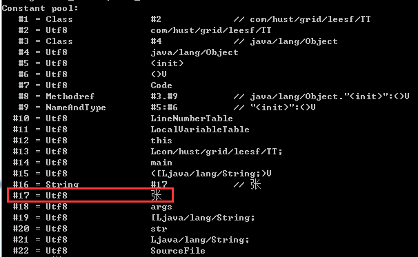
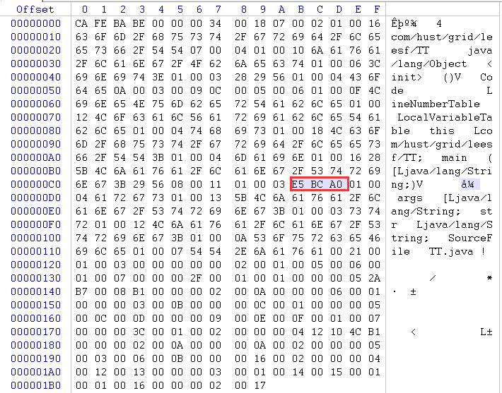

**一、前言**

在分析Comparable和Comparator的时候，分析到了String类的compareTo方法，String底层是用char[]数组来存放元素，在比较的时候是比较的两个字符串的字符，字符用char来存储，此时，突然想到，Java里面的char可以存放中文吗？后来发现是可以的，并且由此也引出了Java中字符的编码格式问题。

**二、Java存储格式**

在Java中，如下代码获取了字符"张"的各种编码格式。

    
    
     import java.io.UnsupportedEncodingException;
    public class Test {
        public static String getCode(String content, String format) throws UnsupportedEncodingException {
            byte[] bytes = content.getBytes(format);
            StringBuffer sb = new StringBuffer();
            for (int i = 0; i < bytes.length; i++) {
                sb.append(Integer.toHexString(bytes[i] & 0xff).toUpperCase() + " ");
            }
            
            return sb.toString();
        }
        public static void main(String[] args) throws UnsupportedEncodingException {
            System.out.println("gbk : " + getCode("张", "gbk"));
            System.out.println("gb2312 : " + getCode("张", "gb2312"));
            System.out.println("iso-8859-1 : " + getCode("张", "iso-8859-1"));
            System.out.println("unicode : " + getCode("张", "unicode"));  
    　　　　System.out.println("utf-16 : " + getCode("张", "utf-16"));
            System.out.println("utf-8 : " + getCode("张", "utf-8"));
    　　}
    }

运行结果：

    
    
    gbk : D5 C5 
    gb2312 : D5 C5 
    iso-8859-1 : 3F 
    unicode : FE FF 5F 20 
    utf-16 : FE FF 5F 20 
    utf-8 : E5 BC A0 

说明：从结果我们可以知道，字符"张"的gbk与gb2312编码是相同的，unicode与utf-16编码时相同的，但是其iso-8859-1、unicode、utf-8编码都是不相同的，至于各个编码的含义，我们这里不给出解释，下一篇会给出答案。那么，在JVM中，字符"张"是按照哪种编码格式进行存储的呢？下面开始我们的分析。

**三、探秘思路**

1\. 查看.class文件常量池的存储格式

测试代码如下

    
    
    public class Test {
        public static void main(String[] args) {
            String str = "张";        
        }
    }

使用javap -verbose Test.class进行反编译，发现常量池情况如下：

再使用winhex打开class文件，发现字符"张"在常量池的存储如下

说明：上面两张可以在class文件中是以utf-8的格式存储的。

但是在运行时是否是utf-8格式呢？继续我们的探秘之旅。

2\. 在程序中一探究竟

使用如下代码

    
    
    public class Test {    
        public static void main(String[] args) {
            String str = "张";
            System.out.println(Integer.toHexString(str.codePointAt(0)).toUpperCase());
        }
    }

运行结果：

5F20

说明：根据结果我们知道在运行时JVM是使用的utf-16格式进行存储，utf-16一般是使用2个字节进行存储，如果遇到两个字节无法表示的字符则会使用4个字节表示。之后会另外有篇幅进行介绍，并且我们查看Character类源码时，会发现就是使用的utf-16进行编码的，从两面都找到了我们想要的答案。

3\. char类型可以存放中文吗？

根据上面的探索我们已经知道了Java的class文件中字符是以utf-8进行编码的，在JVM运行时则是以utf-16进行编码存储的。而字符"张"可以用两个字节来表示，而char在Java中也是两个字节，故可以存放。

**四、总结**

经过上面的分析，我们知道：

1\. 字符在class文件中是以utf-8格式进行编码的，而在JVM运行时是采用utf-16格式进行编码的。

2\. char类型是两个字节，可以用来存放中文。

在此次调用的过程中又查阅了好多关于字符方面的资料，受益匪浅，并且发现特别有意思，接下来会进行分享，所以特此预告下一篇将会进一步来介绍编码以及编码在Java中的问题。敬请期待，也谢谢各位园友的观看~

