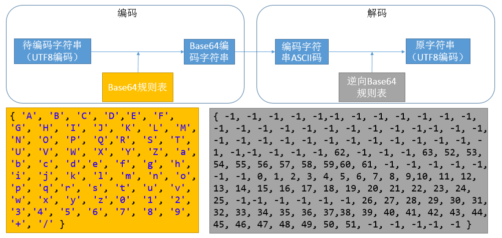
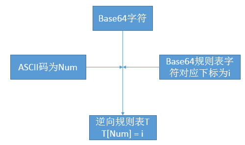

##【字符编码】字符编码 && Base64编码算法

##
##一、前言

##
##　　在前面的解决乱码的一文中，只找到了解决办法，但是没有为什么，说白了，就是对编码还是不是太熟悉，编码问题是一个很简单的问题，计算机从业人员应该也必须弄清楚，基于编码的应用有Base64加密算法，然后，这个问题一直放着，想找个机会解决。于是乎，终于逮到机会，开始下手。

##
##二、编码

##
##　　关于ASCII、Unicode编码、UTF-8编码等问题，可以参见笔者另外一篇博客【字符编码】彻底理解字符编码。

##
##三、Base64算法

##
##　　Base64是网络上最常见的用于传输8Bit字节代码的编码方式之一，关于Base64的介绍可以参见这两篇文章base64，BASE64算法，下面我们通过Java来实现Base64编码算法并且详细解析其中遇到的问题。

##
##　　Base64编码算法的流程图如下：

##
## 

##
##　　说明：Base64规则表由Base64的规定的规则得到，而逆向Base64规则表则通过少量的计算获得，如某Base64的编码字符串为QQ==，对于字符Q而言，Q的ASCII编码为81，Base64规则中，16对应Q，则将逆向Base64表中下标为81的项置为16。其余不在Base64中的元素在逆向表中值为-1，逆向表的计算流程如下：

##
## 

##
##四、Base64算法的Java实现

##
##　　Java中的字符都是以Unicode格式进行存储的，如何查看任一个字符在Java中的表示？使用如下代码即可　
  

	import java.io.UnsupportedEncodingException;
public class Test {
    public static void main(String[] args) throws UnsupportedEncodingException {
        String str = "张";
        byte[] bytes = str.getBytes("utf-8");
        for (int i = 0; i < bytes.length; i++) {
            System.out.print(Integer.toHexString(bytes[i] &amp; 0xff).toUpperCase() + " ");
        	}
    	}
	}

View Code

##
##　　运行结果：

##
##　　E5 BC A0

##
##　　说明：假设中文张的编码为GBK，则转化为UTF-8编码经过了GBK->Unicode->UTF-8的步骤。

##
##　　Base64算法代码清单　　
  

	package com.leesf.chapter10;

import java.io.UnsupportedEncodingException;

public class Base64 {
    private static char[] base64EncodeChars = new char[] { "A", "B", "C", "D",
            "E", "F", "G", "H", "I", "J", "K", "L", "M", "N", "O", "P", "Q",
            "R", "S", "T", "U", "V", "W", "X", "Y", "Z", "a", "b", "c", "d",
            "e", "f", "g", "h", "i", "j", "k", "l", "m", "n", "o", "p", "q",
            "r", "s", "t", "u", "v", "w", "x", "y", "z", "0", "1", "2", "3",
            "4", "5", "6", "7", "8", "9", "+", "/" 	};

    private static byte[] base64DecodeChars = new byte[] { -1, -1, -1, -1, -1,
            -1, -1, -1, -1, -1, -1, -1, -1, -1, -1, -1, -1, -1, -1, -1, -1, -1,
            -1, -1, -1, -1, -1, -1, -1, -1, -1, -1, -1, -1, -1, -1, -1, -1, -1,
            -1, -1, -1, -1, 62, -1, -1, -1, 63, 52, 53, 54, 55, 56, 57, 58, 59,
            60, 61, -1, -1, -1, -1, -1, -1, -1, 0, 1, 2, 3, 4, 5, 6, 7, 8, 9,
            10, 11, 12, 13, 14, 15, 16, 17, 18, 19, 20, 21, 22, 23, 24, 25, -1,
            -1, -1, -1, -1, -1, 26, 27, 28, 29, 30, 31, 32, 33, 34, 35, 36, 37,
            38, 39, 40, 41, 42, 43, 44, 45, 46, 47, 48, 49, 50, 51, -1, -1, -1,
            -1, -1 	};

    public static String encode(byte[] data) {
        StringBuffer sb = new StringBuffer();
        int len = data.length;
        int i = 0;
        int b1, b2, b3;
        while (i < len) {
            // 提取b1
            b1 = data[i++] &amp; 0xff;
            if (i == len) { // len % 3 == 1
                // 向右无符号移动2位，保留b1的0-5位（前六位）
                sb.append(base64EncodeChars[b1 >>> 2]);
                // 保留b1的6-7位（后两位），其余位为0，然后向左移动4位，低位补0
                sb.append(base64EncodeChars[(b1 &amp; 0x3) << 4]);
                // 添加两个等号（Base64规则）
                sb.append("==");
                // 跳出循环
                break;
            	}
            // 提取b2
            b2 = data[i++] &amp; 0xff;
            if (i == len) { // len % 3 == 2
                // 保留b1的0-5位（前六位），其余位为0
                sb.append(base64EncodeChars[b1 >>> 2]);
                // 保留b1的6-7位（后两位），其余位为0，然后向左移动4位，低位补0
                // 然后保留b2的0-3位（前四位），然后合并
                sb.append(base64EncodeChars[((b1 &amp; 0x03) << 4)
                        | ((b2 &amp; 0xf0) >>> 4)]);
                sb.append(base64EncodeChars[(b2 &amp; 0x0f) << 2]);
                // 添加两个等号（Base64规则）
                sb.append("=");
                // 跳出循环
                break;
            	}
            // 提取b3
            b3 = data[i++] &amp; 0xff;
            // 向右无符号移动2位，保留b1的0-5位（前六位）
            sb.append(base64EncodeChars[b1 >>> 2]);
            // 保留b1的6-7位（后两位），其余位为0，然后向左移动4位，低位补0
            // 然后保留b2的0-3位（前四位），然后合并
            sb.append(base64EncodeChars[((b1 &amp; 0x03) << 4)
                    | ((b2 &amp; 0xf0) >>> 4)]);
            // 保留b2的4-7位（后四位），然后向右移2位，低位补0，
            // 然后保留b3的0-1位（前两位），然后合并
            sb.append(base64EncodeChars[((b2 &amp; 0x0f) << 2)
                    | ((b3 &amp; 0xc0) >>> 6)]);
            // 保留b3的2-7位（后六位）
            sb.append(base64EncodeChars[b3 &amp; 0x3f]);
        	}
        return sb.toString();
    	}

    public static byte[] decode(String str) throws UnsupportedEncodingException {
        // 使用ISO8859-1搭配其他编码如UTF-8,GBK可以显示中文
        StringBuffer sb = new StringBuffer();
        // 获取ASCII码
        byte[] data = str.getBytes("US-ASCII");
        int len = data.length;
        int i = 0;
        int b1, b2, b3, b4;
        while (i < len) {
            do {
                b1 = base64DecodeChars[data[i++]];
            	} while (i < len &amp;&amp; b1 == -1);
            if (b1 == -1)
                break;
            do {
                b2 = base64DecodeChars[data[i++]];
            	} while (i < len &amp;&amp; b2 == -1);
            if (b2 == -1)
                break;
            // b1向左移2位，然后b2保留2-3位，再向右无符号移动4位，再合并
            sb.append((char) ((b1 << 2) | ((b2 &amp; 0x30) >>> 4)));
            do {
                b3 = data[i++];
                if (b3 == 61) // 遇到了=号，结束，返回
                    return sb.toString().getBytes("ISO8859-1");
                b3 = base64DecodeChars[b3];
            	} while (i < len &amp;&amp; b3 == -1);
            if (b3 == -1)
                break;
            // 提取b2的4-7位（后四位），再向左移动4位，b3保留2-5位，再向右无符号移动2位
            sb.append((char) (((b2 &amp; 0x0f) << 4) | ((b3 &amp; 0x3c) >>> 2)));
            do {
                b4 = data[i++];
                if (b4 == 61) // 遇到了=号，结束，返回
                    return sb.toString().getBytes("ISO8859-1");
                b4 = base64DecodeChars[b4];
            	} while (i < len &amp;&amp; b4 == -1);
            if (b4 == -1)
                break;
            // 提取b3的6-7位（最后两位），再向左移动6位，再取b4的2-7位（后六位），然后合并b4
            sb.append((char) (((b3 &amp; 0x03) << 6) | (b4 &amp; 0x3f)));
        	}
        return sb.toString().getBytes("ISO8859-1");
    	}

    public static void main(String[] args) throws UnsupportedEncodingException {
        String s = "张";
        System.out.println("编码前：" + s);
        String x = encode(s.getBytes());
        System.out.println("编码后：" + x);
        String x1 = new String(decode(x));
        System.out.println("解码后：" + x1);
    	}
	}

View Code

##
##　　运行结果：

##
##　　编码前：张　　编码后：5byg　　解码后：张　　说明：理解了Base64的编码解码过程，那么代码也很好理解。

##
##五、总结

##
##　　经过此篇博文，对字符编码的理解更深刻了，明白了字符编码之间的如何进行转化，有了这个基础后，再看其他与字符编码相关的知识将更容易，特此记录，以后遇到与字符编码相关的问题还会进行记录。谢谢各位园友观看~