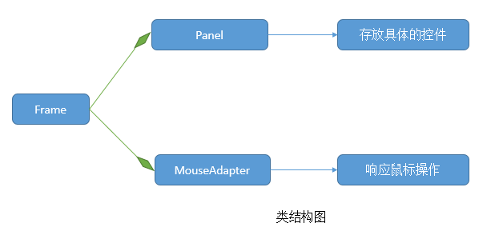
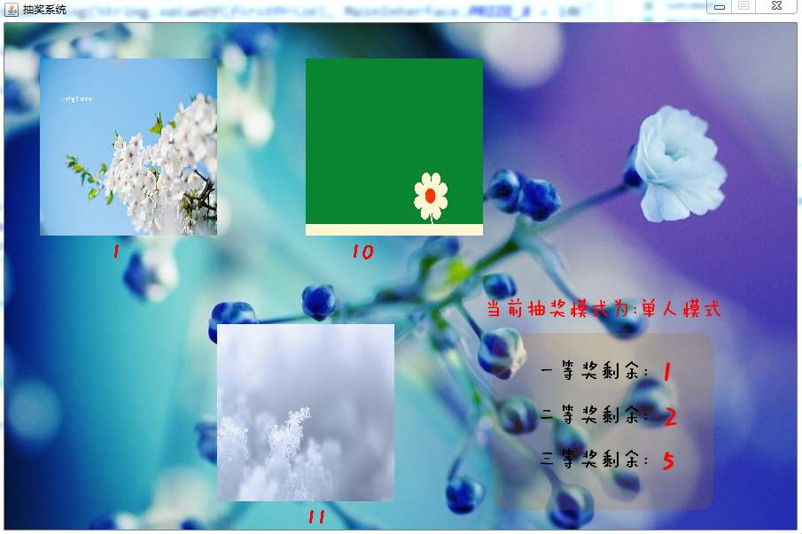
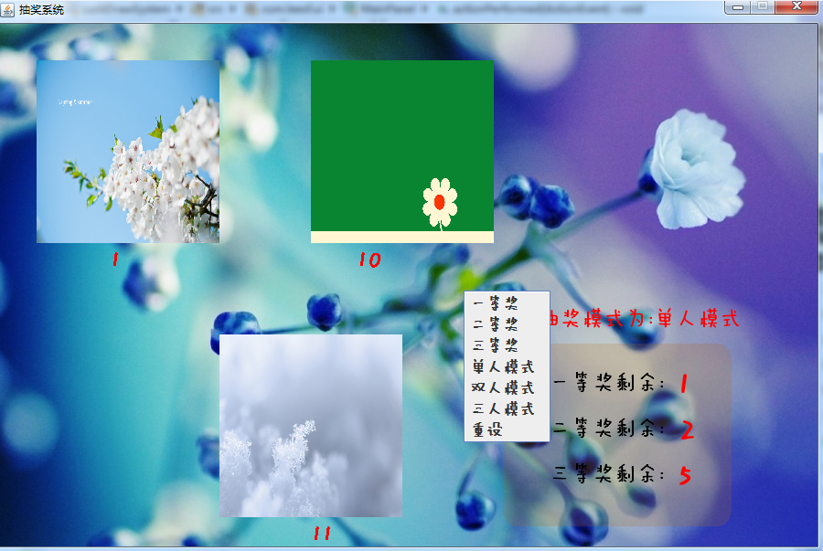

##【小型系统】抽奖系统-使用Java Swing完成

##
##一、需求分析

##
##　　1. 显示候选人照片和姓名。

##
##　　2. 可以使用多种模式进行抽奖，包括一人单独抽奖、两人同时抽奖、三人同时抽奖。

##
##　　3. 一个人可以在不同的批次的抽奖中获取一、二、三等奖，但是不能在同一批次抽奖中获取多个奖项。

##
##二、系统总体框架

##
##　　系统需求比较简单，采用Java Swing技术可以很好的实现，系统的总体类框架图如下

##
##　　 

##
##　　说明：基于主要的三个类就可以完成所需要的功能，Frame有Panel类型与MouseAdapter类型的成员，Panel主要用户存放具体的控件和绘制相应的信息，MouseAdapter主要用于响应鼠标的点击操作。

##
##三、系统实现细节

##
##　　1. 照片轮流显示效果 - 定时器

##
##　　既然是抽奖系统，所以一定要有让候选人图片滚动以起来的效果，那么如何实现呢？采用定时器即可，每100ms出发一次定时器，则可以让每100ms都显示不同候选者的照片和姓名。

##
##　　2. 同一候选人在同一批次不能获得多个奖项 - 循环算法

##
##　　在进行多人模式进行抽奖的时候，如何保证同一候选人不能获得多个奖项？使用一个循环算法即可，若随机生成的几个数相同，则重新生成，直到同一批次生成的数均不相同。

##
##　　3. 候选人照片与姓名如何对应 - 两个链表实现

##
##　　使用两个链表保证滚动的照片和姓名相对应，前提是照片名字是用候选人姓名+照片格式构成，如leesf.jpg。这样，在读取照片的时候也对照片名进行解析，提取出名字，并将照片和名字分别加入照片链表和姓名列表，这样，在取的时候直接同时取照片链表和姓名链表的相应项即可。

##
##四、代码清单

##
##　　本系统代码已经上传到GitHub上。地址为：https://github.com/leesf/LuckDrawSystem.git 欢迎各位园友fork和下载。

##
##五、运行截图

##
##　　 
　　系统界面
 
菜单栏

##
##六、总结

##
##　　一个非常简单的抽奖系统，读者有需要的可以根据自己的需求去进行修改。谢谢各位园友的观看~

##
##　　

##
##　　