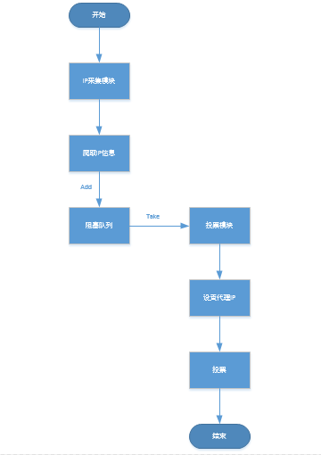
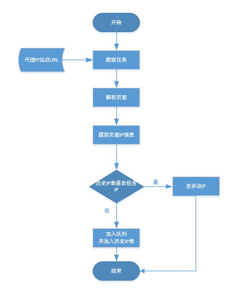
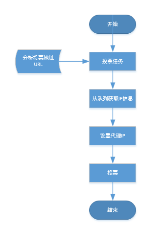
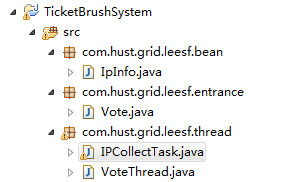

##【小型系统】简单的刷票系统（突破IP限制进行投票）

##
##一、前言　　

##
##　　相信大家平时肯定会收到朋友发来的链接，打开一看，哦，需要投票。投完票后弹出一个页面（恭喜您，您已经投票成功），再次点击的时候发现，啊哈，您的IP（***.***.***.***）已经投过票了，不能重复投票。这时候，我们可能会想，能不能突破ip地址的限制进行刷票呢？有了这样的想法，那就去做吧，下面我将介绍我这个简单的刷票系统，仅供有需求的园友们参考。

##
##二、系统设计

##
##　　系统主要实现的是突破IP限制进行刷票，其中，由IP采集模块负责从互联网上爬取代理IP，放入阻塞队列，该任务会定期执行。之后由投票模块从阻塞队列中获取IP，并进行设置，然后进行投票。系统流程图如下：

##
## 

##
##三、系统技术

##
##　　系统使用HttpClient + JSoup + 多线程来完成刷票，HttpClient用于进行投票，JSoup用于解析页面，多线程技术用于分离任务，使得分工更加明确。使用到了生产者消费者模式，该模式直接使用BlockingQueue来实现。

##
##四、系统介绍

##
##　　系统主要分为三个模块：

##
##　　① IP采集模块

##
##　　② 投票模块

##
##　　③ IP信息模块

##
##　　其中，IP采集模块主要是从互联网爬取IP代理信息，并将该信息放入阻塞队列，这样就可以伪造IP，进行多次投票。

##
##　　其中，投票模块从IP采集模块放入阻塞队列取出IP信息，并设置代理，找到投票入口地址，然后进行投票操作。

##
##　　其中，IP信息模块主要是对爬取的IP信息进行了封装，方便其他模块进行操作。

##
##　　4.1 IP采集模块

##
##　　IP采集模块流程图如下

##
## 　　几点说明：

##
##　　1.系统使用的代理IP站点URL为http://www.kuaidaili.com/，www.xicidaili.com。

##
##　　2.提取IP信息为提取单条IP信息，并判断历史IP表是否已经存在，若存在，表示之前已经加入过此IP信息，则直接丢弃，反之，则加入队列并加入历史IP表。

##
##　　3.此任务会定期开启，如一个小时爬取一次代理IP。

##
##　　4.2 投票模块

##
##　　投票模块流程图如下

##
## 　　几点说明：

##
##　　1.投票网站http://www.hnxdf.com/vote/，我们选取的第一位进行投票，分析出投票的入口为http://www.hnxdf.com/vote/iRadio_vote.asp?VoTeid=215。

##
##　　2.根据IP采集模块放入队列的IP信息进行设置，然后进行投票。

##
##　　4.3 IP信息模块

##
##　　此模块主要对从网站爬取的IP信息进行了封装，方便其他模块进行操作。

##
##五、系统代码框架

##
##　　系统的整个代码框架如下

##
## 

##
##　　其中，bean包的IpInfo封装了爬取的IP信息。

##
##　　其中，entrance包的Vote为系统的入口。

##
##　　其中，thread包的IPCollectTask为爬取代理IP任务，VoteThread为进行投票线程。

##
##六、系统代码

##
##　　1.IpInfo.java
  

	package com.hust.grid.leesf.bean;

public class IpInfo {
    public IpInfo(String ipAddress, int port, String location,
            String anonymousType, String type, String confirmTime) {
        this(ipAddress, port, location, anonymousType, type, confirmTime, null,
                null);
    	}

    public IpInfo(String ipAddress, int port, String location,
            String anonymousType, String type, String confirmTime,
            String getPostSupport, String responseSpeed) {
        this.ipAddress = ipAddress;
        this.port = port;
        this.location = location;
        this.anonymousType = anonymousType;
        this.type = type;
        this.confirmTime = confirmTime;
        this.getPostSupport = getPostSupport;
        this.responseSpeed = responseSpeed;
    	}

    public String getIpAddress() {
        return ipAddress;
    	}

    public void setIpAddress(String ipAddress) {
        this.ipAddress = ipAddress;
    	}

    public int getPort() {
        return port;
    	}

    public void setPort(int port) {
        this.port = port;
    	}

    public String getLocation() {
        return location;
    	}

    public void setLocation(String location) {
        this.location = location;
    	}

    public String getAnonymousType() {
        return anonymousType;
    	}

    public void setAnonymousType(String anonymousType) {
        this.anonymousType = anonymousType;
    	}

    public String getType() {
        return type;
    	}

    public void setType(String type) {
        this.type = type;
    	}

    public String getConfirmTime() {
        return confirmTime;
    	}

    public void setConfirmTime(String confirmTime) {
        this.confirmTime = confirmTime;
    	}

    public String getGetPostSupport() {
        return getPostSupport;
    	}

    public void setGetPostSupport(String getPostSupport) {
        this.getPostSupport = getPostSupport;
    	}

    public String getResponseSpeed() {
        return responseSpeed;
    	}

    public void setResponseSpeed(String responseSpeed) {
        this.responseSpeed = responseSpeed;
    	}

    @Override
    public boolean equals(Object anthor) {
        if (this == anthor) {
            return true;
        	}
        if (anthor == null || getClass() != anthor.getClass()) {
            return false;
        	}

        IpInfo ipInfo = (IpInfo) anthor;
        return (this.ipAddress.equals(ipInfo.ipAddress)
                &amp;&amp; this.port == ipInfo.port
                &amp;&amp; this.location.equals(ipInfo.location)
                &amp;&amp; this.anonymousType.equals(ipInfo.anonymousType)
                &amp;&amp; this.type.equals(ipInfo.type) &amp;&amp; this.confirmTime
                    .equals(ipInfo.confirmTime))
                &amp;&amp; this.getPostSupport.equals(ipInfo.getPostSupport)
                &amp;&amp; this.responseSpeed.equals(ipInfo.responseSpeed);
    	}

    @Override
    public int hashCode() {
        int hash = 5;
        hash = 89 * hash
                + (this.ipAddress != null ? this.ipAddress.hashCode() : 0);
        hash = 89 * hash + this.port;
        hash = 89 * hash
                + (this.location != null ? this.location.hashCode() : 0);
        hash = 89
                * hash
                + (this.anonymousType != null ? this.anonymousType.hashCode()
                        : 0);
        hash = 89 * hash + (this.type != null ? this.type.hashCode() : 0);
        hash = 89 * hash
                + (this.confirmTime != null ? this.confirmTime.hashCode() : 0);
        hash = 89
                * hash
                + (this.getPostSupport != null ? this.getPostSupport.hashCode()
                        : 0);
        hash = 89
                * hash
                + (this.responseSpeed != null ? this.responseSpeed.hashCode()
                        : 0);
        return hash;
    	}
    
    @Override
    public String toString() {
        return "ipAddress = " + ipAddress + ", port = " + port + ", localtion = "
                + location + ", anonymousType = " + anonymousType + ", type = " 
                + type + ", confirmTime = " + confirmTime + ", getPostSupport = "
                + getPostSupport + ", responseSpeed = " + responseSpeed;
    	} 

    private String ipAddress;
    private int port;
    private String location;
    private String anonymousType;
    private String type;
    private String confirmTime;
    private String getPostSupport;
    private String responseSpeed;
	}

View Code

##
##　　2.Vote.java
  

	package com.hust.grid.leesf.entrance;

import java.util.Timer;
import java.util.concurrent.BlockingQueue;
import java.util.concurrent.LinkedBlockingQueue;

import com.hust.grid.leesf.bean.IpInfo;
import com.hust.grid.leesf.thread.IPCollectTask;
import com.hust.grid.leesf.thread.VoteThread;

public class Vote {
    private BlockingQueue<IpInfo> ipInfoQueue;
    private IPCollectTask ipCollectTask;
    private VoteThread voteThread;

    public Vote() {
        ipInfoQueue = new LinkedBlockingQueue<IpInfo>();
        ipCollectTask = new IPCollectTask(ipInfoQueue);
        voteThread = new VoteThread(ipInfoQueue);
    	}

    public void vote() {
        Timer timer = new Timer();
        long delay = 0;
        long period = 1000 * 60 * 60;
        // 每一个小时采集一次ip
        timer.scheduleAtFixedRate(ipCollectTask, delay, period);

        // 开启投票任务
        voteThread.start();
    	}

    public static void main(String[] args) {
        Vote vote = new Vote();
        vote.vote();
    	}
	}

View Code

##
##　　3.IPCollectTask.java
  

	package com.hust.grid.leesf.thread;

import java.io.IOException;
import java.util.ArrayList;
import java.util.List;
import java.util.TimerTask;
import java.util.concurrent.BlockingQueue;
import java.util.concurrent.LinkedBlockingQueue;

import org.jsoup.Jsoup;
import org.jsoup.nodes.Document;
import org.jsoup.nodes.Element;
import org.jsoup.select.Elements;

import com.hust.grid.leesf.bean.IpInfo;

public class IPCollectTask extends TimerTask {
    private BlockingQueue<IpInfo> ipInfoQueue; // 连接生产者与消费者的阻塞队列
    private List<IpInfo> historyIpLists; // 记录已经获取的ip信息

    public IPCollectTask(BlockingQueue<IpInfo> ipInfoQueue) {
        this.ipInfoQueue = ipInfoQueue;
        this.historyIpLists = new ArrayList<IpInfo>();
    	}

    /**
     * 获取www.xicidaili.com的ip地址信息
     */
    public void getXiCiDaiLiIpLists() {
        String url = "http://www.xicidaili.com/";
        String host = "www.xicidaili.com";
        Document doc = getDocumentByUrl(url, host);
        // 解析页面的ip信息
        parseXiCiDaiLiIpLists(doc);
    	}

    /**
     * 解析页面的ip信息
     * 
     * @param doc
     */
    public void parseXiCiDaiLiIpLists(Document doc) {
        Elements eleLists = doc.getElementsByTag("tbody");
        Element tbody = eleLists.get(0); // 获取tbody
        Elements trLists = tbody.children();
        Element ele = null;
        for (int i = 0; i < trLists.size(); i++) {
            if ((i % 22 == 0) || (i % 22 == 1)) { // 去掉不符合条件的项
                continue;
            	}
            ele = trLists.get(i);
            Elements childrenList = ele.children();
            String ipAddress = childrenList.get(1).text();
            int port = Integer.parseInt(childrenList.get(2).text());
            String location = childrenList.get(3).text();
            String anonymousType = childrenList.get(4).text();
            String type = childrenList.get(5).text();
            String confirmTime = childrenList.get(6).text();

            IpInfo ipInfo = new IpInfo(ipAddress, port, location,
                    anonymousType, type, confirmTime);
            putIpInfo(ipInfo);

        	}
    	}

    /**
     * 将ip信息放入队列和历史记录中
     * 
     * @param ipInfo
     */
    private void putIpInfo(IpInfo ipInfo) {
        if (!historyIpLists.contains(ipInfo)) { // 若历史记录中不包含ip信息，则加入队列中
            // 加入到阻塞队列中，用作生产者
            try {
                ipInfoQueue.put(ipInfo);
            	} catch (InterruptedException e) {
                // TODO Auto-generated catch block
                e.printStackTrace();
            	}
            // 加入历史记录中
            historyIpLists.add(ipInfo);
        	}
    	}

    /**
     * 根据网页Document解析出ip地址信息
     * 
     * @param doc
     */
    private void parseKuaiDaiLiIpLists(Document doc) {
        Elements eleLists = doc.getElementsByTag("tbody");
        Element tbody = eleLists.get(0); // 获取tbody
        Elements trLists = tbody.children(); // 获取十条ip记录
        for (Element tr : trLists) { // 遍历tr
            Elements tdElements = tr.children(); // tr中的td包含了具体的信息
            String ipAddress = tdElements.get(0).text();
            int port = Integer.parseInt(tdElements.get(1).text());
            String anonymousType = tdElements.get(2).text();
            String type = tdElements.get(3).text();
            String getPostSupport = tdElements.get(4).text();
            String location = tdElements.get(5).text();
            String responseSpeed = tdElements.get(6).text();
            String confirmTime = tdElements.get(7).text();

            IpInfo ipInfo = new IpInfo(ipAddress, port, location,
                    anonymousType, type, confirmTime, getPostSupport,
                    responseSpeed);

            putIpInfo(ipInfo);
        	}
    	}

    /**
     * 根据提供的url和host来获取页面信息
     * 
     * @param url
     * @param host
     * @return
     */
    private Document getDocumentByUrl(String url, String host) {
        Document doc = null;
        try {
            doc = Jsoup
                    .connect(url)
                    .header("User-Agent",
                            "Mozilla/5.0 (Windows NT 6.1; WOW64; rv:43.0) Gecko/20100101 Firefox/43.0")
                    .header("Host", host).timeout(5000).get();
        	} catch (IOException e) {
            e.printStackTrace();
        	}

        return doc;
    	}

    /**
     * 获取http://www.kuaidaili.com/free/的ip
     */
    private void getKuaiDaiLiFreeIpLists() {
        // 第一次访问，需解析总共多少页
        String baseUrl = "http://www.kuaidaili.com/free/inha/";
        String host = "www.kuaidaili.com";
        Document doc = getDocumentByUrl(baseUrl, host);
        // 解析ip信息
        parseKuaiDaiLiIpLists(doc);
        Element listNav = doc.getElementById("listnav");
        // 获取listnav下的li列表
        Elements liLists = listNav.children().get(0).children();
        // 获取含有多少页的子元素
        Element pageNumberEle = liLists.get(liLists.size() - 2);
        // 解析有多少页
        int pageNumber = Integer.parseInt(pageNumberEle.text());
        // 拼接成其他页的访问地址
        for (int index = 1; index <= pageNumber; index++) {
            baseUrl = baseUrl + index;
            doc = getDocumentByUrl(baseUrl, host);
            parseKuaiDaiLiIpLists(doc);
            // 休眠一秒
            fallSleep(1);
        	}
    	}

    /**
     * 获取www.kuaidaili.com/proxylist/的ip
     */
    private void getKuaiDaiLiIpLists() {
        int start = 1;
        String baseUrl = "http://www.kuaidaili.com/proxylist/";
        String host = "www.kuaidaili.com";
        while (start <= 10) { // 爬取10页
            String url = baseUrl + start + "/";
            Document doc = getDocumentByUrl(url, host);
            // 解析ip信息
            parseKuaiDaiLiIpLists(doc);
            start++;
            // 休眠一秒
            fallSleep(1);
        	}
    	}

    /**
     * 进行休眠
     */
    private void fallSleep(long seconds) {
        try {
            Thread.sleep(seconds * 1000);
        	} catch (InterruptedException e) {
            e.printStackTrace();
        	}
    	}

    @Override
    public void run() {
        // getKuaiDaiLiFreeIpLists();
        System.out.println("IPCollect task is running");
        getKuaiDaiLiIpLists();
        getXiCiDaiLiIpLists();
    	}

    public BlockingQueue<IpInfo> getIpInfoQueue() {
        return ipInfoQueue;
    	}

    public static void main(String[] args) {
        BlockingQueue<IpInfo> queue = new LinkedBlockingQueue<IpInfo>();
        IPCollectTask task = new IPCollectTask(queue);
        Thread thread = new Thread(task);
        thread.start();
        try {
            Thread.sleep(30 * 1000);
        	} catch (InterruptedException e) {
            // TODO Auto-generated catch block
            e.printStackTrace();
        	}
        System.out.println("queue size is " + queue.size());
        try {
            while (!queue.isEmpty()) {
                System.out.println(queue.take());
            	}
        	} catch (InterruptedException e) {
            e.printStackTrace();
        	}

        System.out.println("historyList size is " + task.historyIpLists.size());
    	}
	}

View Code

##
##　　4.VoteThread.java
  

	package com.hust.grid.leesf.thread;

import java.io.IOException;
import java.util.concurrent.BlockingQueue;

import org.apache.http.HttpEntity;
import org.apache.http.HttpHost;
import org.apache.http.HttpResponse;
import org.apache.http.client.ClientProtocolException;
import org.apache.http.client.HttpClient;
import org.apache.http.client.methods.HttpGet;
import org.apache.http.conn.params.ConnRoutePNames;
import org.apache.http.impl.client.DefaultHttpClient;
import org.apache.http.params.HttpConnectionParams;
import org.apache.http.params.HttpParams;
import org.apache.http.util.EntityUtils;

import com.hust.grid.leesf.bean.IpInfo;

public class VoteThread extends Thread {
    private BlockingQueue<IpInfo> ipInfoQueue;

    public VoteThread(BlockingQueue<IpInfo> ipInfoQueue) {
        this.ipInfoQueue = ipInfoQueue;
    	}

    @Override
    public void run() {
        HttpClient client = new DefaultHttpClient();
        HttpParams params = client.getParams();
        HttpConnectionParams.setConnectionTimeout(params, 10000);
        HttpConnectionParams.setSoTimeout(params, 15000);
        HttpResponse response = null;
        HttpGet get = null;
        HttpEntity entity = null;
        HttpHost proxy = null;
        while (true) {
            IpInfo ipInfo = null;
            try {
                ipInfo = ipInfoQueue.take();
            	} catch (InterruptedException e1) {
                // TODO Auto-generated catch block
                e1.printStackTrace();
            	}
            proxy = new HttpHost(ipInfo.getIpAddress(), ipInfo.getPort());
            client.getParams().setParameter(ConnRoutePNames.DEFAULT_PROXY,
                    proxy);
            get = new HttpGet(
                    "http://www.hnxdf.com/vote/iRadio_vote.asp?VoTeid=215");
            get.addHeader("Host", "www.hnxdf.com");
            get.addHeader("User-Agent",
                    "Mozilla/5.0 (Windows NT 6.1; WOW64; rv:43.0) Gecko/20100101 Firefox/43.0");
            try {
                response = client.execute(get);
                entity = response.getEntity();
                byte[] bytes = EntityUtils.toByteArray(entity);
                // 对响应内容编码格式进行转化，统一成utf-8格式
                String temp = new String(bytes, "gbk");
                byte[] contentData = temp.getBytes("utf-8");
                System.out.println(new String(contentData));
                System.out.println("-----------------------------------");
            	} catch (ClientProtocolException e) {
                e.printStackTrace();
            	} catch (IOException e) {
                e.printStackTrace();
            	}
        	}
    	}
	}

View Code

##
##七、系统总结

##
##　　此系统很简单，想清楚思路之后很快就能够写出代码，系统运行时，由于代理IP站点提供的免费IP质量不是太高，有效的IP地址还是很少，所有效果不是特别理想，此系统功能也很简单，但是各位园友可以在此基础上去发挥自己的想象力，定制属于自己的投票系统。

##
##八、总结

##
##　　至此，整个系统分析就已经完成了，其中，图也画得不是太规范，还请各位园友海涵。也谢谢各位园友观看。

##
##　　ps:整个工程（包含必要的jar文件）已经上传到GitHub上，欢迎各位园友访问：https://github.com/leesf/TicketBrushSystem

##
##　　