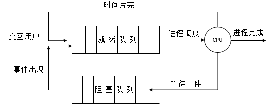
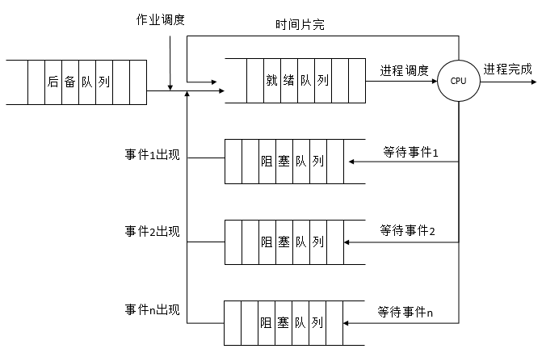
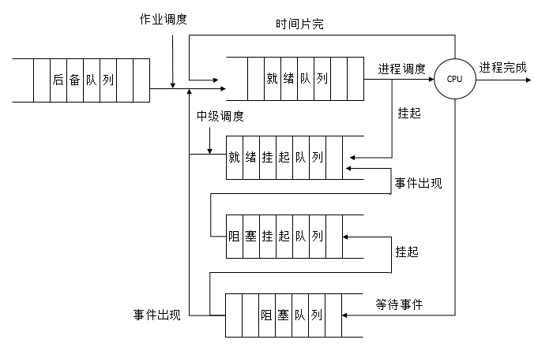
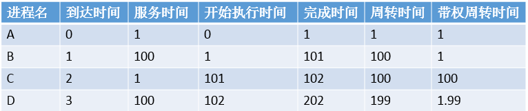
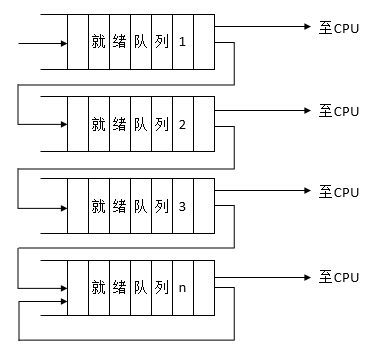
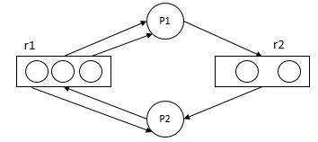
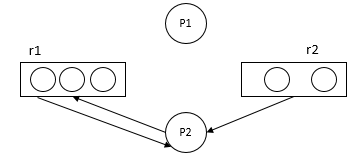
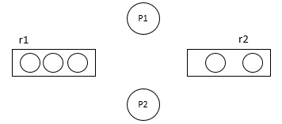

**一、前言**

前面介绍了进程与线程的相关概念，现在继续学习处理机调度，处理机是系统最重要的资源，提高处理机的利用率和改善系统性能，在很大程度上取决于处理机调度性能的好坏，下面来介绍处理的调度以及死锁的问题。

**二、处理机调度的层次**

**** 2.1 高级调度 **  
**

高级调度又称为作业调度或长程调度，主要功能是根据某种算法， **把外存上处于后备队列中的那些作业调入内存，调度的对象是作业** 。

作业，包含了程序、数据、作业说明书，系统根据该作业说明书来控制程序的运行。在批处理系统中，是以作业为基本单位从外存调入内存的。

作业步，在作业运行期间，每个作业都必须经过若干个相对独立又相互关联的顺序加工步骤才能得到结果，每一个加工步骤称为一个作业步，各作业步相互关联，上一个作业步的输出可能是下一个作业步的输入。

作业流，若干个作业进入系统后，被依次存放在外存上，这边形成了输入的作业流，在操作系统的控制下，逐个作业进行处理，于是便形成了处理作业流。

作业控制块（JCB），为了管理和调度作业，在多道批处理系统中为每个作业设置了一个作业控制块，如同进程控制块是进程在系统中存在的标识一样，他是作业在系统中存在的标志，其中保存了系统对作业进行管理和调度所需的全部信息。每当作业进入系统时，系统便为每个作业简历一个JCB，根据作业类型将它插入相应的后备队列中，作业调度程序根据一定的调度算法来调度他们，被调度到的作业将会装入内存，当一个作业执行结束进入完成状态时，系统负责回收分配给它的资源，陈晓它的作业控制块。

作业调度，根据作业控制块中的信息，审查系统能否满足用户作业的资源需求，以及按照一定的算法，从外存的后备队列中选取某些作业调入内存，并为他们创建进程、分配必要的资源。然后再将新创建的进程插入到就绪队列，准备执行。

2.2 低级调度

低级调度也称为进程调度或短程调度，它所 **调度的对象是进程（或内核级线程）** ，进程调度是最基本的一种调度。

低级调度用于决定就绪队列中的哪个进程（或内核级线程）应获得处理机，然后再由分派程序执行把处理机分配给该进程的具体操作。其主要功能如下

① 保存处理机的现场信息，低级调度程序通过某种算法从就绪队列中选取一个进程，把它的状态改为运行状态，并准备把处理机分配给它。  

② 把处理机分配给进程，由分派程序把处理机分配给进程，此时需要为选中的进程恢复处理机现场。  

为了实现进程调度，应该具有如下三个基本机制

① 排队器，为了提高进程调度的效率，事先应该将系统的所有就绪进程按照一定的方式排成一个或多个队列，以便调度程序能最快地找到它。  

② 分派器，分派器把由进程调度程序所选定的进程，从就绪队列中去除该进程，然后进行上下文切换，将处理机分配给它。  

③ 上下文切换机制，当对处理机进行切换时，会 **发生两对上下文切换操作**
，在第一对上下文切换时，操作系统将保存当前进程的上下文，而装入分派程序的上下文，一遍分派程序运行，在第二对上下文切换时，将移出分派程序，而把新选进程的CPU现场信息装入到处理机的各个相应寄存器中。  

进程调度可以采用下述两种调度方式

①
非抢占式方式，一旦把处理机分配给某进程后，不管它要运行多长时间，都一直让它运行下去，不会因为时钟中断等原因而抢占正在运行进程的处理机。直至该进程完成，资源释放处理机，或发生某事件时而被阻塞时，才再把处理机分配给其他进程。在此种方式下，可能引起其他进程调度的因素如下：正在执行的进程执行完成，或因发生某事件而不能再继续执行；执行中的进程因提出I/O请求而暂停执行；在进程通信或同步过程中执行了某种原语操作，如wait、block、wakeup等。系统开销小，但是不能在要求比较严格的实时系统中。  

②
抢占方式，允许调度程序根据某种原则去暂停某个正在执行的进程，将已分配给该进程的处理机重新分配给另一个进程，可以防止一个长进程长时间占用处理机，开销较大，并且其基于如下原则：优先权原则，通常对一个重要的和紧急的作业赋予较高的优先级；短作业（进程）优先原则，新到来的作业（进程）比正在执行的作业（进程）明显的短时，将暂停当前长作业（进程）的执行，将处理机分配给新到的短作业（进程），使之优先执行；时间片原则，进程按时间片轮转，当一个时间片用完后，便停止该进程的执行而重新进行调度。  

2.3 中级调度  

中级调度又称为中程调度，其主要是为了提高内存利用率和系统吞吐率，将那些暂时不能运行的进程不再占用宝贵的内存资源，而是将他们调至外存上去等待，此时的进程的状态称为就绪驻外存状态或挂起状态，当这些进程重新具备运行条件且内存又稍有空闲时，由中级调度来决定把外存上的那些具备运行条件的进程重新调入内存，修改为就绪状态，挂在就绪队列上等待进程调度。

**三、调度队列模型和调度准则**

3.1 仅有进程调度的调度队列模型  

每个进程在执行时都可以出现以下三种情况

① 任务在给定的时间片内已经完成，该进程便在释放处理机后进入完成状态。  

② 任务在本次时间片尚未完成，OS便将该任务在放入就绪队列的末尾。  

③ 在执行期间，进程因为某事件而被阻塞后，被OS放入阻塞队列。  

3.2 具有高级和低级调度的调度队列模型

在批处理系统中，不仅需要进程调度，还需要作业调度，由后者按一定的作业调度算法，从外存的后备队列汇总选择一批作业调入内存，并为它们建立进程，送入就绪队列。然后由进程调度按照一定的进程调度算法选择一个进程，把处理机分配给该进程。

说明：该调度模型具有多个阻塞队列，根据不同的阻塞原因确定不同的阻塞队列。

3.3 同时具有三级调度的调度队列模型

引入中级调度后，可以把进程的就绪状态分为内存就绪，外存就绪，内存阻塞，外存阻塞。其调度模型如下图所示

3.4 面向用户的准则

①
周转时间短，周转时间是指从作业被提交给系统开始，到作业完成为止这段时间间隔，它包括四部分：作业在外存后备队列上等待调度的时间，进程在就绪队列上等待进程调度的时间，进程在CPU上执行的时间，进程等待I/O操作完成的时间。

②
响应时间快，从用户通过键盘提交一个请求开始，到系统首次产生响应为止的时间，包括键盘输入的请求信息传送到处理机的时间，处理机对请求信息进行处理的时间，形成的响应消息回送到中断显示器的时间。

③ 截止时间的保证，某任务必须开始执行的最迟时间，或必须完成的最迟时间。

④ 优先权准则，让某些紧急的作业能够得到及时处理。

3.5 面向系统的准则

① 系统吞吐量高，指在单位时间内系统所完成的作业数。

② 处理机利用率好

③ 各类资源的平衡利用。

**四、调度算法**

根据系统的资源分配策略所规定的资源分配算法，对于不同的系统和系统目标，通常采用不同的调度算法，如在批处理系统中，为了照顾为数众多的短作业，应采用短作业优先的调度算法，在分时系统中，应采用轮转法。

4.1 先来先服务和短作业（进程）优先调度算法

先来先服务（FCFS）调度算法是一种最简单的调度算法，该算法可用于作业调度，也可用于进程调度，每次调度从后备作业队列（就绪队列）选择一个最先进入该队列的作业（进程），以便进行下一步处理。FCFS有利于长作业（进程），而不利于短作业（进程）。

说明：短作业时间的带权周转时间明显高于长作业。

短作业（进程）优先调度算法SJ(P)F对短作业（进程）优先调度的算法，其可以用于作业调度和进程调度，每次调度从后备队列（就绪队列）选择一个估计运行时间最短的作业（进程），以便进行下一步处理。SJ(P)F对长作业不利，也不能保证紧迫性作业（进程）被及时处理，同时，由于作业（进程）的长短只是根据用户所提供的估计时间而定的，用户可能有意无意缩短估计运行时间，所以不一定能够保证短作业优先调度。

4.2 高优先权优先调度算法

为了使紧迫任务进入系统后便获得优先处理，引入最高优先权优先调度算法，使用该算法进行作业调度时，系统将从后备队列中选择若干优先权最高的作业装入内存，若进行进程调度，则把处理机分配给就绪队列中优先权最高的进程，该算法可以分为非抢占式优先权算法和抢占式优先权调度算法。

① **非抢占式优先权算法**
，系统一旦把处理机分配给就绪队列中优先权最高的进程后，该进程便一直执行下去，直至完成；或因某事件使该进程放弃处理机时，系统方可再将处理机重新分配给另一个优先权最高的进程。

② **抢占式优先权调度算法**
，系统把处理分配给优先权最高的进程，但在执行期间，如果又出现另一个优先权更高的进程，进程调度程序就立即停止当前进程的执行，重新将处理机分配给新到的优先权最高的进程。

对于最高优先权优先调度算法，其关键在于使用的静态优先权还是动态优先权，以及如何确定进程的优先权。

① 静 **态优先权**
，在创建进程时确定，在进程的整个运行期间保持不变，确定进程优先级的依据如下：进程类型（系统进程的优先权高于一般用户进程的优先权），进程对资源的需求（进程的估计执行时间及内存需要量的多少，对要求少的进程赋予高的优先权），用户要求（用户进程的紧迫程度及用户所付费用的多少确定）。

② **动态优先权**
，在创建进程时所赋予的优先权，是可以随进程的推进或所其等待时间的增加而改变的，以便获得更好的调度性能，例如，让就绪队列中的进程让其优先权随等待时间的增加而增加。

**高响应比优先调度算法，**
在批处理系统中，短作业优先算法是一种比较好的算法，其主要不足之处是长作业得不到保证，为每个作业引入动态优先权，并使作业的优先级随等待时间的增加而以速率a提高，则长作业在等待一定时间后，必然有机会获得处理机，该优先权的变化规律可描述为：
**优先权 = （等待时间 + 要求服务时间）/ 要求服务时间 = 响应时间 / 要求服务时间。**
此算法会保证短、长作业能够得到调度，但是在进行调度之间都需要进行响应比的计算，增加系统开销。

4.3 基于时间片的轮转调度算法  

在分时系统中，为保证及时响应用户的请求，必须采用基于时间片的轮转式进程调度算法，广泛采用多级反馈队列调度算法。

① **时间片轮转法**
，系统将所有的就绪进程按先来先服务的原则排成一个队列，每次调度时，把CPU分配给队首进程，并令其执行一个时间片，时间片的大小从几ms到几百ms，当执行的时间片用完时，由一个计时器发出时钟中断请求，调度程序便据此信息来停止该进程的执行，将它送到就绪队列末尾，然后，再把处理机分配给就绪队列中心的队首进程，同时也让它执行一个时间片，这样就可以保证就绪队列中的所有进程在一个给定的时间内均能获得一个时间片的处理机执行时间。  

② **多级反馈队列调度算法**
，首先，设置多个就绪队列，并为各个队列赋予不同的优先级，第一个队列的优先级最高，第二个其次，其余各队列的优先权逐个降低，该算法赋予各个队列中进程执行时间的大小也不相同，在优先权越高的队列中，为每个进程所规定的执行时间片就越小。  

说明：当一个进程进入内存后，首先将它放入第一队列的末尾，按FCFS原则排队等待调度，当轮到该进程执行时，如它能够在该时间片内完成，则可撤离系统，如果在一个时间片内尚未结束，调度程序便将该进程转入第二队列的末尾，再同样按照FCFS原则等待调度执行，如果在第二队列的时间片仍为完成，则进入第三队列末尾，以此类推，直至到达最后第n队列，便按照时间片轮转的方式运行。只有当第一队列空闲时，调度程序才调度第二队列中的进程运行，仅当第1~(i-1)队列为空时，才会调度第i队列中的进程运行。如果处理机正在第i队列中为某个进程服务时，又有新进程进入到优先权较高的第1~（i-1）中的任何一个队列，则此时新进程会抢占正在运行进程的处理机，即由调度程序把正在运行的进程放回到第i队列的末尾，把处理机分配到新的高优先权进程。

**五、产生死锁的原因和必要条件**

死锁是指多个进程在运行过程中因为争夺资源而造成的一种僵局，当进程处于这种僵局状态时，若无外力作用，他们都将无法再向前推进。

5.1 产生死锁的原因

产生死锁的原因可以归结为如下两点

① **竞争资源** ，当系统中供多个进程共享的资源，如打印机、公用队列等，其数目不足以满足诸进程的需要时，会引起诸进程对资源的竞争而产生死锁。

② **进程间推进顺序非法** ，进程在运行过程中，请求和释放资源的顺序不当，也会导致进程死锁。

**竞争资源引起的死锁**
，竞争的资源可以分为可剥夺性资源（某进程在获得这类资源后，该资源可以再被其他进程或系统剥夺，如处理机和内存资源）和不可剥夺性资源（当某进程获得这类资源后，再不能强行收回，只能在进程用完后自行释放，如磁带机、打印机等）。

①
竞争非剥夺性资源引起的死锁，在系统中配置的非剥夺性资源，由于它们的数量不能满足诸进程运行的需要，会使进程在运行过程中，因争夺这些资源而陷入僵局。如系统中只有一台打印机和一台磁带机供进程p1和p2使用，假定p1占用了打印机，p2占用了磁带机，若p1继续要求磁带机，则p1会阻塞，p2又要求打印机，则p2也将阻塞，两个进程都在等待对方释放出自己所需的资源，但它们又不能释放出自己已占有的资源，以致进入死锁状态。

②
竞争临时性资源而引起的死锁，对于打印机这类可以重复使用的资源称为永久性资源，而临时性资源则是由一个进程产生，被另一个进程使用短暂时间后便无用的资源，其也可能会引起死锁。若s1、s2、s3为临时性资源，进程p1产生s1，又要求从p3接受s3，进程p3产生s3，又要求从p2接受s2，p2产生s2，又要求从s1接受消息，如果消息通信的顺序如下

p1: request(s3);release(s1);

p2: request(s1);release(s2);

p3: request(s2);release(s3);

则可能会发生死锁。

**进程推进顺序不当引起的死锁**
，由于进程在运行中具有异步性特征，当进程推进顺序不合法时就可能引起死锁。如进程p1运行request(r2)，此时r2被p2占有，所以p1将阻塞，当p2运行request(r1)，此时r1被p1占有，所以p2将阻塞，此时，就发生了死锁。

5.2 产生死锁的必要条件

死锁发生必须具有下列四个必要条件

① **互斥条件**
，指进程对所分配到的资源进行排他性使用，即在一段时间内某资源只由一个进程占用，如果此时还有其他进程请求该资源，则请求者只能等待，直至占有该资源的进程用完释放。  

② **请求和保持条件**
，指进程已经保持了至少一个资源，但又提出了新的资源请求，而该资源又已经被其他进程占用，此时请求进程阻塞，但又对自己已获得的其他资源保持不放。  

③ **不剥夺条件** ，指进程已获得的资源，在未使用完之前，不能被剥夺，只能在使用完时由自己释放。  

④ **环路等待条件** ，指在发生死锁时，必然存在一个进程-
资源的环形链，即进程集合{p0,p1,p2,...,pn}中的p0正在等待p1占用的资源，p1在等待p2占用的资源，...，pn正在等待p0占用的资源。  

5.3 处理死锁的基本方法  

为保证系统中诸进程的正常运行，应事先采取必要的措施，来预防发生死锁，在系统中已经出现死锁后，则应该及时检测到死锁的发生，并采取释放措施来解除死锁。处理死锁的方法可归结如下四种。

① **预防死锁**
，该方法通过设置某些限制条件，去破坏产生死锁的四个必要条件中的一个或几个，来预防死锁。其是一种比较容易实现的方法，已经被广泛使用，但由于所施加的限制条件往往太严格，因而可能会导致系统资源利用率和系统吞吐量降低。  

② **避免死锁**
，该方法也是事先预防的策略，但它并不需要事先采取各种限制措施去破坏产生死锁的四个必要条件，而是在资源的动态分配过程中，用某种方法去防止系统进入不安全状态，从而避免发生死锁。  

③ **检测死锁**
，该方法并不需要事先采取任何限制措施，也不必要检查系统是否已经进入不安全区，而是允许系统在运行过程中发生死锁，但可通过系统所设置的检测机构，及时检测死锁的发生，并精确地确定与死锁有关的进程和资源，然后，采取适当措施，从系统中将已发生的死锁清除掉。  

④ **解除死锁**
，这是与检测死锁相配套的一种措施，当检测到系统中已经发生死锁时，需将今晨从死锁状态中解脱出来，常用的实施办法是撤销或挂起一些进程，以便回收一些资源，再将这些资源分配给已处于阻塞状态的进程，使之转为就绪状态，以继续运行。  

**六、预防死锁的方法**

预防死锁和避免死锁这两种方法都是通过施加某些限制条件，来预防发生死锁，两者主要差别在于：为预防死锁所施加的限制条件较严格，往往会影响进程的并发执行，而未避免死锁所施加的限制条件就相对宽松，这给进程的运行提供了较宽松的环境，有利于进程的并发执行。

6.1 预防死锁  

预防死锁是使四个必要条件中的第2、3、4个条件之一不能成立，来避免发生死锁，对于条件1，则应该加以保证。

① **摒弃请求和保持条件** ，系统规定所有进程在开始运行之前， **都必须一次性地申请其在整个运行过程中所需的全部资源**
，若系统有足够的资源，则可分配给进程，这样，进程在运行期间都不会提出资源请求，从而摒弃了请求条件，若系统有一种资源无法满足某进程的要求时，即使其他资源都空闲，也不分配给该进程，而让其等待，在等待中不会占用任何资源，也摒弃了请求和保持条件。其优点在于简单、易于实现和安全，缺点为资源严重浪费，降低了资源利用率，进程不能保证及时运行。  

② **摒弃不剥夺条件**
，进程是逐个提出对资源的要求的，当一个已经保持了某些资源的进程，再提出新的资源请求而不能立即得到满足时，必须释放它已经保持了的所有资源，带以后需要时再重新申请，这意味着某一进程已经占用的资源，在运行过程中会被暂时的释放掉，也可认为被剥夺了，从而摒弃了不可剥夺条件。其缺点在于比较复杂并且付出很大的代价，可能反复申请和释放资源，致使进程的执行无限地推迟，延长了进程周转时间，增加系统开销，降低了吞吐量。  

③ **摒弃环路等待条件**
，系统将所有资源按类型进行线性排队，并赋予不同的序号，所有进程对资源的请求必须严格按照资源序号递增的次序提出，这样，在所形成的资源分配图中，不可能再出现环路，因而摒弃了环路等待条件。其缺点在于由于为系统中各类资源所分配的序号相对稳定，这就限制了新类型设备的增加，并且作业（进程）使用各类资源的顺序与系统规定的顺序不同，造成对资源的浪费，同时也会限制用户简单自主的编程。  

6.2 系统安全状态  

**只要系统能够始终处于安全状态，便可避免发生死锁**
。在避免死锁的方法中，运行进程动态地申请资源，但系统在进行资源分配之前，应先计算此次资源分配的安全性，若此次分配不会导致系统进入不安全状态，则将资源分配给进程，否则，令进程等待。

安全状态指的是系统能够按某种进程顺序（p1,p2,p3,...,pn），来为每个进程pi分配其所需资源，直至满足每个进程对资源的最大需求，使每个进程都可顺利地完成。如果系统无法找到这样一个安全序列，则称系统处于不安全状态。虽然并非所有的不安全状态都必然会转为死锁状态，但当系统进入不安全状态后，便有可能进入死锁状态，只要系统处于安全状态，系统便可避免进入死锁状态，因此，避免死锁的实质在于，
**系统在进行资源分配时，如何使系统不进入不安全状态。**

**** 6.3 利用银行家算法避免死锁

1\. 银行家算法的数据结构

①
可利用资源向量Available，这是一个含有m个元素的数组，其中每一个元素代表一类可利用的资源数目，初始值为系统所配置的改类全部可用资源的数目，Available[j]
= k，表示系统中Rj资源又k个。

② 最大需求矩阵Max，这是一个n * m 的矩阵，定义了系统中n个进程中的每一个进程对m类资源的最大需求，Max[i,j] =
k，表示进程i需要Rj类资源的最大数目为k。  

③ 分配矩阵Allocation，是一个n * m 的矩阵，定义了系统中每一类资源当前已经分配每一进程的资源数，Allocation[i,j] =
k，表示进程i已经分得Rj类资源的数目为k。  

④ 需求矩阵Need，是一个n * m的矩阵，表示每一个进程尚需的各类资源数。Need[i,j] = k，表示进程i还需要Rj类资源k个。  

**Need[i, j] = Max[i, j] - Allocation[i, j]**  

**** 2\. 银行家算法

**** 设Requesti进程Pi的请求向量，若Requesti[j] =
K，表示进程Pi需要Rj类资源K个，当Pi发出资源请求后，系统按照下述步骤进行检查

① 如果Requesti[j] <= Need[i, j]，转向②，否则，因为它所需要的资源数已超过它所宣布的最大值，出错。  

② 如果Requesti[j] <= Available[j]，转向③，否则，表示尚无足够资源，Pi需要等待。  

③ 系统尝试把资源分配给进程Pi，并修改数据结构中的数值： **  
**

**** Available[j] = Available[j] - Requesti[j];  

Allocation[i, j] = Allocation[i, j] + Requesti[j];  

Need[i, j] = Need[i, j] - Requesti[j]; **  
**

④
系统执行安全性算法，检查此次资源分配后系统是否处于安全状态，若安全，才正式将资源分配给进程Pi，以完成本次分配，否则，将本次的尝试分配作废，恢复原来的资源分配状态，让进程Pi等待。

3\. 安全性算法

系统所执行的安全性算法可描述如下

① 设置工作向量Work，表示系统可提供给进程继续运行所需的各类资源数目，它含有m个元素，在执行安全算法开始时，Work = Available;

② 设置Finish，表示系统是否有足够的资源分配给进程，使之运行完成，开始时Finish[i] =
false，当有足够资源分配给进程时，再令Finish[i] = true;

③ 从进程集合中找到一个能满足下述条件的的进程：Finish[i] = fasle；Need[i, j] <= Work[j]，若找到，进入④，否则，执行⑤

④ 当进程Pi获得资源后，可顺利执行，直至完成，并释放出分配给它的资源，执行 Work[j] = Work[j] + Allocation[i, j]；
Finish[i] = true；进入步骤③

⑤ 如果所有的进程的Finish[i] = true都满足，则表示系统处于安全状态，否则，系统处于不安全状态。

**七、死锁的检测与解除**

7.1 死锁的检测

当系统为进程分配资源时，若未采取任何限制性措施，则系统必须提供检测和解除死锁的手段，系统必须要做到

① 保存有关资源的请求和分配信息

② 提供一种算法，以利用这些信息来检测系统是否已进入死锁状态。

资源分配图用圆圈代表一个进程，用方框代表一类资源，由于一种类型的资源可以有多个，用方框中的一个点代表一类资源中的一个资源。

说明：p1进程获得了两个r1资源，请求一个r2资源，p2进程获得一个r1资源和一个r2资源，并且又申请了一个r1资源。

利用资源分配图可以检测系统是否处于死锁状态。

① 在资源分配图中，找到一个既不阻塞又不独立的进程结点pi，在顺利情况下，可获得所需资源而继续运行，直至运行完毕，再释放其所占用的全部资源。

② p1释放资源后，p2可获得资源继续运行，执行p2完成后又释放其所占用的资源。

③
在进行一系列化简后，若能消去图中所有的边，使得所有的进程结点都成为孤立结点，则称该图是可以完全简化的，若不能通过任何过程使改图完全简化，则改图是不可完全简化的。

所有的简化顺序，都将得到相同的不可简化图，S为死锁状态的充分条件是： **当且仅当S状态的资源分配图是不可完全简化的，该充分条件称为死锁定理。**

7.2 死锁的解除  

当发现有死锁情况时，需要立即把他们从死锁状态中解脱出来，常用两种解除死锁的方法

① **剥夺资源** ，从其他进程剥夺足够数量的资源给死锁进程，以解除死锁状态。  

② **撤销进程** ，使全部死锁进程都夭折掉，或者按照某种顺序逐个撤销进程，直至有足够的资源可用，使死锁状态消除为止。  

**八、总结**

**** 关于处理机调度和死锁就介绍到这里，相信看完了本篇博客，园友们对处理机的调度和死锁方面的知识会有一个比较全面的认识，谢谢各位园友的观看~

