**一、前言**

在分析了处理器调度后，接着分析存储器管理，如何对存储器进行有效的管理，直接影响着存储器的利用率和系统性能。下面，开始存储器管理的学习。

**二、存储器的层次结构**

2.1 主存储器

主存储器是计算机系统中的一个主要部件，用于保存进程运行时的程序和数据，CPU的控制部件只能从主存储器中取得指令和数据，数据能够从主存储器中读取并将他们装入到寄存器中，或者从寄存器存入到主存储器，CPU与外围设备交换的信息一般也依托于主存储器地址空间。但是，主存储器的访问速度远低于CPU执行指令的速度，于是引入了寄存机和告诉缓冲。

2.2 寄存器

寄存器访问速度最快，能与CPU协调工作，价格昂贵，容量不大，寄存器用于加速存储器的访问速度，如用寄存器存放操作数，或用作地址寄存器加快地址转换速度等。

2.3 高速缓存

高速缓存容量大于或远大于寄存器，但小于内存，访问速度高于主内存器，根据程序局部性原理，将主存中一些经常访问的信息存放在高速缓存中，减少访问主存储器的次数，可大幅度提高程序执行速度。通常，进程的程序和数据存放在主存，每当使用时，被临时复制到高速缓存中，当CPU访问一组特定信息时，首先检查它是否在高速缓存中，如果已存在，则直接取出使用，否则，从主存中读取信息。有的计算机系统设置了两级或多级高速缓存，一级缓存速度最高，容量小，二级缓存容量稍大，速度稍慢。

2.4 磁盘缓存

磁盘的IO速度远低于对主存的访问速度，因此将频繁使用的一部分磁盘数据和信息暂时存放在磁盘缓存中，可减少访问磁盘的次数，磁盘缓存本身并不是一种实际存在的存储介质，它依托于固定磁盘，提供对主存储器空间的扩充，即
**利用主存中的存储空间，来暂存从磁盘中读出或写入的信息**
，主存可以看做是辅存的高速缓存，因为，辅存中的数据必须复制到主存方能使用，反之，数据也必须先存在主存中，才能输出到辅存。

**三、程序的装入和链接**

为了使程序能够运行，必须先为之创建进程，而创建进程的第一件事，就是将程序和数据装入内存，如何将一个用户源程序变为一个可在内存中执行的程序，通常要经过如下几步，首先是
编译（由编译程序将用户源代码编译成若干个目标模块），其次是链接（由链接程序将编译后形成的一组目标模块，以及它们所需要的库函数链接在一起，形成一个完整的装入模块），最后是装入（由装入程序将装入模块装入内存）。

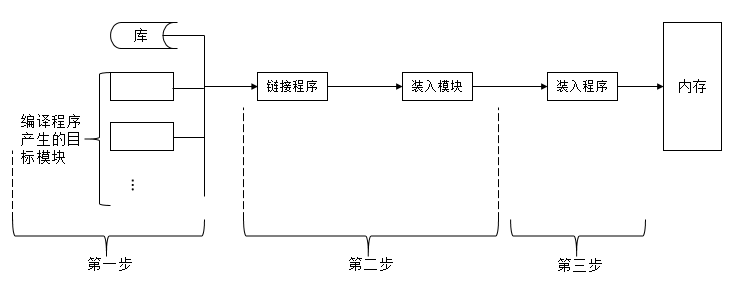

3.1 程序的装入

在装入一个模块到内存时，有绝对装入方式，可重定位装入方式，动态运行时装入方式。

① **绝对装入方式**
，如果在编译时知道程序驻留在内存的什么位置，那么，编译程序将产生绝对地址的目标代码，绝对装入方式按照装入模块中的地址，将程序和数据装入内存，装入模块被装入内存后，由于程序中的逻辑地址与实际内存地址完全相同，故不需要对程序和数据的地址进行修改。

② **可重定位装入方式**
，由于绝对装入方式只能将目标模块装入到内存中事先指定的位置，在多道程序环境下，编译程序不可能事先知道所编译的目标模块应放在内存的何处，因此，绝对装入方式只适用于单道程序环境，在多道程序环境下，所得到的目标模块的起始地址通常都是以0开始的，程序中的其他地址也都是相对于起始地址计算的，此时应采用可重定位装入方式，根据内存的当前情况，将装入模块装入到内存的适当位置。该方式会使装入模块中的所有逻辑地址与实际装入内存的物理地址不同，需要对数据地址和指令地址进行修改，通常把再装入时对目标程序中指令和数据的修改过程称为重定位，又因为
**地址变换通常是在装入时一次完成的，以后不再变化，故称为静态重定位** 。

③ **动态运行时装入方式**
，可重定位装入方式允许将装入模块装入到内存中任何允许的位置，故可用多道程序环境，但这种方式并不允许程序运行时在内存中移动位置，因为，程序在内存中的移动，意味着它的物理位置发生了变化，这就必须对程序和数据的地址进行修改后方能运行。然而，在运行过程中它在内存中的位置可能经常要改变，此时就应该采用动态运行时装入方式。动态运行时的装入程序在把装入程序装入内存后，
**并不立即把装入模块中的相对地址转换为绝对地址，而是把这种地址转换推迟到程序真正要执行时才进行**
。因此，装入内存后的所有地址都仍是相对地址，为了使地址转换不影响指令的执行速度，需要重定位寄存器的支持。

3.2 程序的链接

源程序经过编译后，可得到一组目标模块，再利用链接程序把这组目标模块链接，形成装入模块，根据链接时间的不同，可把链接分为静态链接（在程序运行之前，先将各目标模块及他们所需的库函数，链接成一个完整的装配模块，以后不再拆开）、装入时动态链接（将用户源程序编译后所得到的一组目标模块，在装入内存时，采用边装入边链接的链接方式）、运行时动态链接（对某些目标模块的链接，是在程序执行中需要盖模块时，才对它进行链接）。

① **静态链接**
，在将目标模块装配成一个装入模块时，需要对相对地址进行修改（由于编译程序产生的所有目标模块中，使用的都是相对地址，其起始地址都为0，每个模块中的地址都是相对于起始地址计算的）。也需要变换外部调用符号（将每个模块中所用的外部调用符号都变换为相对地址），这种先进行链接所
**形成的一个完整的装入模块**
，又称为可执行文件，通常都不再拆开它，要运行时可直接将它装入内存，这种事先进行链接，以后不再拆开的链接方式，称为静态链接方式。

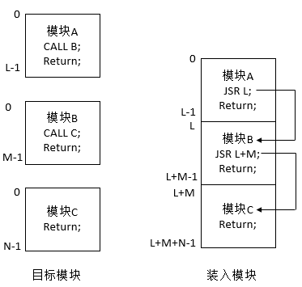

② **装入时动态链接** ，用户源程序经编译后所得是目标模块，是在 **装入内存时边装入边链接**
的，即在装入一个目标模块时，若发生一个外部模块调用事件，将引起装入程序去找出相应的外部目标模块，并将它装入内存，装入时动态链接有如下优点，便于修改和更新（各目标模块是分开的存放的，所以要修改或更新各目标模块非常容易），便于实现对目标模块的共享（很容易将一个目标模块链接到几个应用模块上，实现多个应用程序对该模块的共享）

③ **运行时动态链接** ，将某些模块的链接推迟到 **程序执行时才进行链接**
，即在执行过程中，当发现一个被调用模块尚未装入内存时，立即由OS去找到该模块并将之装入内存，把它链接到调用者模块上，凡在执行过程中未被调用到的模块，都不会被调入内存和被链接到装入模块上，这样不仅加快程序的装入过程，同时也节省了大量的内存空间。

**四、连续分配方式**

连续分配方式是指为一个用户程序分配一个连续的内存空间，可以将连续分配方式分为 单一连续分配、固定分区分配、动态分区分配、动态重定位分区分配。

4.1 单一连续分配

这是一种最简单的存储管理方式，但只能在单用户、单任务的操作系统中，将内存分为系统区和用户区，系统区供OS使用，通常放在内存的低地址，用户区是指除系统区以外的全部内存空间，提供给用户使用。

4.2 固定分区分配

固定分区分配是一种最简单的可运行多道程序的存储管理方式，将内存用户空间划分为若干个固定大小的区域，在每个分区只装入一道作业，这样，便允许多道作业并发执行，当有空闲分区时，便可以再从外存的后备作业队列中选择一个适当大小的作业装入该分区，当该作业结束时，又可再从后备作业队列中找出另一作业调入该分区。

对于内存的用户空间的划分，有如下两种方法。

①
分区大小相等，即所有的内存分区大小相等。缺点是缺乏灵活性，即当程序太小时，会造成内存资源的浪费，程序太大时，一个分区由不足以装入该程序，只是该程序无法运行。

② 分区大小不等，把内存区划分成含有多个较小的分区、适量中等分配和少量大分区，这样，便可根据程序的大小为之分配适当的分区。

为了便于内存分配，将分区按大小进行排队，并为之简历一张分区使用表，其中各表项包括每个分区的起始地址、大小、状态（是否已分配），当有一个程序需要装入时，由内存分配程序检索该表，从中找出一个能满足要求的，尚未分配的分区，将之分配给该程序，然后将该表项中的状态设置为已分配，若未找到大小足够的分区，则拒绝为该用户分配内存。

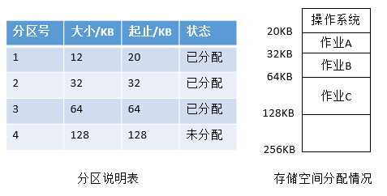

4.3 动态分区分配

动态分区分配是根据进程的实际需要，动态地为之分配内存空间，在实现可变分区分配时，将涉及到分区分配中所用的数据结构、分区分配算法、分区的分配和回收等。

①
分区分配中的数据结构，为了实现分区分配，胸中必须配置相应的数据结构，用来描述空闲分区和已分配分区的情况，为分配提供依据，常用的数据结构有如下两种形式：空闲分区表（在系统中设置一张空闲分区表，用于记录每个空闲分区的情况，每个空闲分区占一个表目，表目中包括分区序号、分区始址、分区大小等，在前面已有介绍）、空闲分区链（为了实现对空闲分区的分配和链接，在每个分区的起始部分，设置一些用于控制分区分配的信息，以及用于链接各分区所用的向前指针；在分区尾部设置一向后指针，这样，可以将空闲分区链接成一个双向链），为了检索方便，在分区尾部重复设置状态为和分区大小表目，当分区被分配出去以后，把状态为从0改成1，此时前后指针都失去意义（已经不再空闲链表中）。

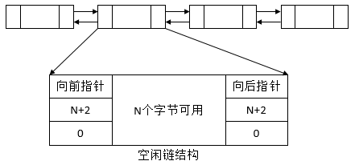

② 分区分配算法，为把一个新作业装入内存，需按照一定的分配算法，从空闲分区表或空闲分区链中选出一分区分配给该作业，目前常用一下五种分配算法

1\. 首次适应算法（First Fit）

以空闲分区链为例进行说明，FF算法要求 **空闲分区链以地址递增的次序链接**
，在分配内存时，从链首开始顺序查找，直至找到一个大小能满足要求的空闲分区为止，然后再按照作业的大小，从该分区划出一块内存空间分配给请求者，余下的空闲分区仍留在空闲链中，若从链首直至链尾都不能找到一个能满足要求的分区，则此次内存分配失败，返回。该算法倾向于优先利用内存中低址部分的空闲分区，从而保留了高址部分的大空闲区，这给以后达到的大作业分配大的内存空闲创造了条件，缺点在与低地址空间不断被划分，会留下许多难以利用的、很小的空闲分区，而每次查找又都是从低地址部分开始，这无疑会增加查找可用空闲分区的开销。

2\. 循环首次适应算法（Next Fit）  

由首次适应算法演变而来，在未进程分配内存空间时，不再是每次都从链首开始查找，而是 **从上次找到的空闲分区的下一个空闲分区开始查找**
，直至找到一个能满足要求的空闲分区，从中划分出一块与请求大小相等的内存空间分配给作业。进行空闲分区分配时，会采用循环查找方式，即如果最后一个（链尾）空闲分区的大小仍不能满足要求，则返回第一个空闲分区。该算法能使内存中的空闲分区分布得更加均匀，从而减少了查找空闲分区时的开销，但是会缺乏大的空闲分区。

3\. 最佳适应算法（Best Fit）

该算法总是能把满足要求、又是最小的康县分区分配给作业，避免大材小用，为了加速寻找，该算法要求把所有的空闲分区按其
**容量以从小到大的顺序形成一个空闲分区链**
，这样，第一次就能找到满足要求的空闲区，必然是最佳的，孤立地看，最佳适应算法似乎是最佳的，然而宏观上却不一定，因为每次分配后所切割下来的剩余部分总是最小的，会留下很多难以使用的小空闲区。

4\. 快速适应算法（Quick Fit）

该算法又称为分类搜索法，是 **将空闲分区容量大小进行分类，对于每一类具有相同容量的所有空闲分区，单独设立一个空闲分区链表**
，这些，系统中存在多个空闲分区链表，同时在内存中设立一张管理索引表，该表的每一项对应了一种空闲分区类型，并记录了该类型空闲分区链表表头的指针。该算法的优点是查找效率高，仅需根据进程的长度，寻找到能容纳它的最小空闲区链表，并取下第一块进行分配即可。该算法在进行空闲分区分配时，不会对任何分区产生分割，所以能保留大的分区，满足对大空间的需求，也不会产生内存碎片。但是在分区归还主存时算法复杂，系统开销大。

③ 分区分配操作，在动态分区分配存储管理中，主要的操作是分配内存和回收内存。

1\. 分配内存

系统利用某种分配算法，从空闲分区链（表）中找到所需大小的分区，其流程图如下

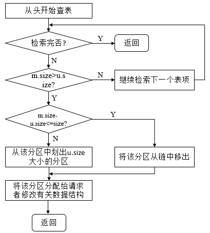

说明：size表示事先规定的不再切割的剩余分区的大小。空闲分区表示为m.size，请求分区的大小为u.size。

2\. 回收内存

当进程运行完毕释放内存时，系统根据回收区的首址，从空闲区链（表）中找到相应的插入点，此时会出现如下四种情况之一：
**回收分区与插入点的前一个空闲区F1相邻接** ，此时将回收区与插入点的前一分区合并，不必为回收区分配新表项，只需要修改前一分区F1的大小。
**回收分区与插入点的后以空闲分区F2相邻接** ，此时将两分区合并，形成新的空闲分区，用回收区的首址作为新空闲区的首址，大小为两者之和。
**回收区同时与插入点的前、后两个分区邻接** ，此时将三个分区合并，使用F1的表项和F1的首址，取消F2的表项，大小为三者之和。
**回收区既不与F1邻接，也不与F2邻接** ，这时为回收区单独建立一个新表项，填写回收区的首址和大小，并根据其首址插入到空闲链中的适当位置。

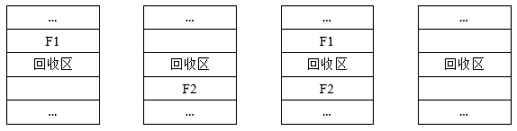

4.4 伙伴系统

伙伴系统规定，无论已分配分区还是空闲分区，其大小均为2的k次幂，k为整数，1<= k <=
m，其中，2^1表示分配的最小分区的大小，2^m表示分配的最大分区的大小，通常2^m是整个可分配内存的大小。假设系统开始时的初始容量为2^m个字，由于不断切分，可能会形成若干个不连续的空闲分区，将这些空闲分区根据分区的大小进行分类，对于每一类具有相同大小的所有空闲分区，单独设立一个空闲分区双向链表。这样，不同大小的空闲分区形成了k个空闲分区链表。

当需要为进程分配一个长度为n的存储空间时，首先计算一个i值，使2^i-1 < n <=
2^i，然后，在空闲分区大小为2^i的空闲分区链表中查找，若找到，即把该空闲分区分配给进程，否则，表明2^i的空闲分区已经耗尽，在大小为2^i+1的空闲分区链表中查找，若存在，则将该空闲分区分为两个大小为2^i的分区，一个用于分配，一个加入到大小为2^i的空闲分区链表中，若还是不存在，则继续在大小为2^i+2的空闲分区链表中查找，若存在，则将空闲分区进行两次分割，一次分割为两个大小为2^i+1的空闲分区，一个加入到大小为2^i+1的空闲分区链表中，另外一个继续进行分割，分成两个大小2^i的空闲块，一个用于分配，另外一个加入到大小为2^i的空闲分区链表中，以此类推。在最坏的情况下，可能需要对2^k的空闲分区进行k此分割才能得到所需分区。

当回收空闲分区时，也需要经过多次合并，如回收大小为2^i的空闲分区时，若事先已经存在2^i的空闲分区，则应将其与伙伴分区合并为一个大小为2^i+1的空闲分区，若事先已存在2^i+1的空闲分区，则再次进行合并，合并为2^i+2的分区，以此类推。

4.5 可重定位分区分配

在连续分配方式中，必须把一个系统或用户程序装入一连续的内存空间，若果在系统中只有若干个小的分区，即使他们容量总和大于要装入的程序，但由于这些分区不相邻接，也无法把该程序装入内存。若想装入，则将内存中的所有作业进行移动，使他们全部相邻接，这样，即可把原来分散的多个小分区拼接成一个大分区，这时，就可以把作业装入该区。经过紧凑后的某些用户程序在内存中的位置发生了变化，此时若不对程序和数据的地址加以修改（变换），则程序必将无法执行，为此，
**在每次紧凑之后，都必须对移动了的数据和程序进行重定向** 。

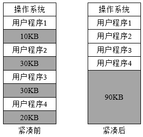

在动态运行时装入的方式中，作业装入内存后的所有地址都仍然是相对地址，将相对地址转化为物理地址的工作，退推迟到程序指令要真正执行时进行。为了是地址变换不影响指令的执行速度，在系统中增设了一个重定位寄存器，用它来存放程序（数据）在内存中的起始地址。在程序执行时，真正访问的内存地址是相对地址与重定位寄存器中的地址相加而形成的。该动作是随着对每条指令或数据的访问自动进行的，故称为动态重定位，当系统对内存进行了紧凑而使若干程序在内存中移动时，不需要对程序做任何修改，只要用该程序在内存的新起始地址去置换原来的起始地址即可。

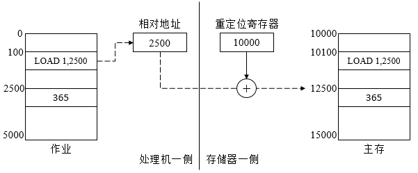

动态重定位分区分配算法与动态分区分配算法基本上相同，差别仅在于：在这种分配算法中， **增加了紧凑功能**
，通常，在找不到足够大的空闲分区来满足用户需求时进行紧凑。

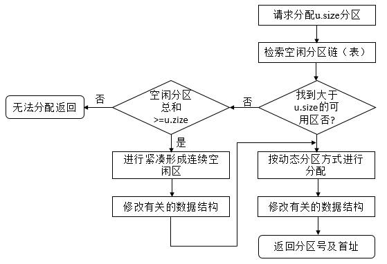

4.6 对换

在多道程序环境下，一方面，在内存中的某些进程由于某事件尚未发生而被阻塞运行，但它却占用了大量的内存空间，甚至有时可能出现在内存中所有进程都被阻塞而迫使CPU停止下来等待的情况，另一方面，却有很多作业在外存上等待，因无内存而无法进入内存运行的情况，这是对系统资源的浪费，为了解决这个问题，增设了对换设施，
**对换是把内存中暂时不能运行的进程或者暂时不用的程序和数据调出到外存上，以便腾出足够的内存空间，再把已具备运行条件的进程或者进程所需要的程序和数据调入内存**
。对换是提高内存利用率的有效措施。如果对换的单位是进程，便称为整体对换或进程对换，为了实现进程对换，系统必须实现对换空间的管理、进程的换出、进程的换入。

① **对换空间的管理** ，在具有对换功能的OS中，通常把 **外存分为文件区和对换区**
，前者用于存放文件，后者用于存放从内存换出的进程。由于文件通常是较长久的驻留在外存上，文件区的管理主要目标是提高存储空间的利用率，采取离散分配方式，进程通常在对换区中驻留的时间较短暂，对换操作较频繁，故对对换空间管理的主要目标是提高进程换入和换出的速度，采取的是连续分配的方式，较少考虑外存中的碎片问题。  

② **进程的换出**
，每当进程由于创建子进程而需要更多的内存空间，但又无足够的内存空间情况时，系统应将某进程换出，首先，系统首先选择处于阻塞状态且优先级最低的进程作为换出进程，然后启动磁盘，将该进程的程序和数据传送到磁盘的对换区上，若传送过程没有错误，则可回收该进程所占用的内存空间，并对该进程的进程控制块做相应的修改。  

③ **进程的换入**
，系统定时地查看所有进程的状态，从中找出就绪状态但已换出的进程，将其中换出时间最久的进程作为换入进程，将其换入，直至无换入的进程或无可换出的进程为止。  

**五、基本分页存储管理方式**

连续分配方式会形成很多碎片，为之进行紧凑操作的开销非常大，如果允许一个进程直接分散地装入到许多不相邻接的分区中，则无须进行紧凑操作，基于这一思想产生了离散分配方式，如果离散分配的基本单位是页，则称为分页存储管理方式，若为段，则为分段存储管理方式。

5.1 页面与页表  

分页存储管理是将一个 **进程的逻辑地址空间分成若干个大小相等的片** ，称为页面或页，并为各页进行编号，从0开始。相应地，
**把内存空间分成与页面相同大小的若干个存储块**
，称为（物理）块或者页框，也同样为它们编号，如0#块，1#块等。在未进程分配内存时，以块为单位将进程的若干个页分别装入到多个可以不相邻接的物理块中，由于进程的最后一页经常装不满一块而形成不可利用的碎片，称之为页内碎片。

在分页系统中的页面其大小应适中，页面若太大，一方面可以是内存碎片减少，有利于提供内存利用率，但是，每一个进程占用的页面较多，导致页表过长，占用太多内存，会降低页面换进换出的效率。页面若太大，可减少页表的长度，提供页面换进换出的速度，但是，内存碎片会增大，所以，也页面大小应适中，通常为512B~8K

分页地址中的地址结构如下

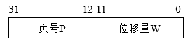

说明：前一部分为页号P，后一部分为位移量W（或称为页内地址），总共32位，其中0~11位为页内地址，每页大小4KB，12~31位为页号，地址空间最多允许1M页。

为了能够保证在内存中找到每个页面所对应的物理块，系统为每个进程建立了一张页面映射表，简称为页表。页表项纪录了相应页在内存中对应的物理块号，在配置了页表后，进程执行时，通过查找该表，即可找到每页在内存中的物理块号，
**页表实现了从页号到物理块号的地址映像** 。

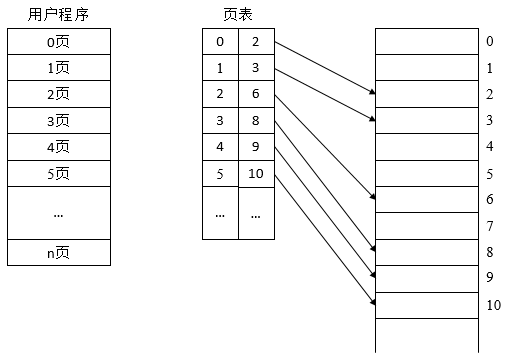

即使在简单的分页系统中，也常在页表的表项中设置一存取控制字段，用于对该存储块中的内存加以保护，当存取控制字段仅有一位时，可用来规定该存储块中的内存时允许读/写，还是只读；若存取控制字段为二位，则可规定为读/写、只读、只执行等存取方式。

5.2 地址变换机构

为了能够将用户地址空间中的逻辑地址变换为内存空间中的物理地址，在系统中必须设置地址变换机构，该机构的基本任务是实现从逻辑地址到物理地址的转换，由于页内地址与物里块内的地址一一对应，无须再进行转换，因此，地址变换机构的任务实际上只是将逻辑地址中的页号转换为内存中的物理块号。又因为页面映射表的的作用就是用于实现从页号到物理块号的变换，因此，
**地址变换任务是借助页表来完成的** 。

页表的功能可以由一组专门的寄存器来实现，一个页表项用一个寄存器，由于寄存器具有较高的访问速度，因而有利于提高地址变换的速度，但成本较高，且页表项一般会很多，都使用寄存器实现不太现实，因此，
**页表大多驻留在内存** 。在系统中只设置一个 **页表寄存器PTR(Page-Table Register)，用于存放页表在内存的始址和页表的长度**
，平时，进程执行时，页表的始址和页表长度存放在本进程的PCB中，当调度程序调度到某进程时，将这两个数据装入页表寄存器，因此，在单处理机环境下，虽然系统中可以运行多个进程，但只需要一个页表寄存器。

当进程要访问某个逻辑地址中的数据时，分页地址变换机构会自动地将有效地址（相对地址）分为页号和页内地址两部分，再以页号为索引去检索页表，查找操作由硬件执行，在执行检索前，先将页号与页表长度进行比较，若页号大于或等于页表长度，则表示本次访问的地址超越了进程的地址空间，这一错误将被系统发现并产生一个地址越界中断。若未出现错误，则将页表始址加上页号与页表项长度的乘积，便得到该表项在页表中的位置，于是可从中得到该页的物理块号，将之装入物理地址寄存器，与此同时，再将有效地址寄存器中的页内地址送入物理地址寄存器的块内地址字段中，这样，便完成了逻辑地址到物理地址的转换。

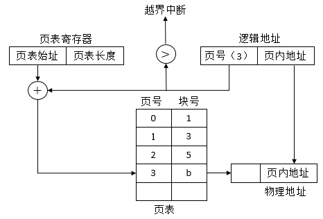

上述操作中，每次存取一个数据时，都会 **访问内存两次**
，第一次是访问内存中的页表，从中找到指定页的物理块号，再将块号与页内偏移量W拼接，以形成物理地址，第二次访问时，才是从第一次所得的地址中获得所需数据，因此，这种方式会使计算机的处理速度降低一半，为了提高地址变换速度，可以在地址变换机构中
**增设一个具有并行查询能力的特殊高速缓冲寄存器，又称为联想寄存器或快表，用以存放当前访问的那些页表项** 。

此时的变换过程如下，在CPU给出有效地址后（逻辑地址），由地址变换机构自动的将页号P送入高速缓冲寄存器，并将此页号与高速缓存中的所有页号进行比较，若其中有与之相匹配的页号，便表示所要访问的页表项在快表中，于是，可以直接从快表中读出该页所对应的物理块号，并送到物理地址寄存器中，如在快表中没有找到，则还需要再访问内存中的页表，找到后，把从页表项读出的物理块好送入地址寄存器，同时，再将此页表项存入快表的寄一个寄存器单元，即修改快表，如果快表已满，则OS需要找到一个老的且已被认为不再需要的页表项，将它换出。

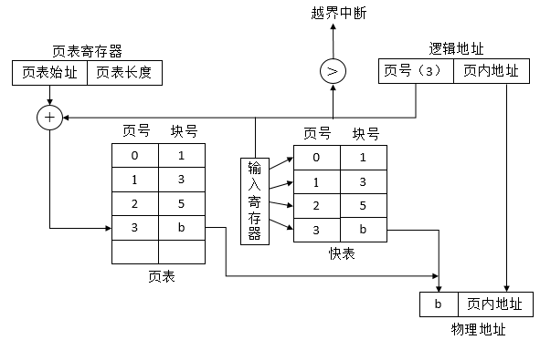 5.3 两级和多级页表

现代计算机系统中，可以支持非常大的逻辑地址空间（2^32~2^64），这样，页表就变得非常大，要占用非常大的内存空间，如，具有32位逻辑地址空间的分页系统，规定页面大小为4KB，则在每个进程页表中的页表项可达1M(2^20)个，又因为每个页表项占用一个字节，故每个进程仅仅页表就要占用1MB的内存空间，而且要求连续，这显然是不现实的，可以通过如下两个方法解决该问题。

① 采用离散分配方式来解决难以找到一块连续的大内存空间的问题。

② 只将当前需要的部分页表项调入内存，其余页表项仍驻留在磁盘上，需要时再调入。

对于要求连续的内存空间来存放页表的问题，可利用将页表进行分页，并离散地将各个页面分别存放在不同的物理块中的办法来解决，同样的，也要为离散分配在页表再建立一张页表，称为外层页表。在每个页表项中记录了页表页面的物理块号，以32位逻辑地址空间为例进行说明。

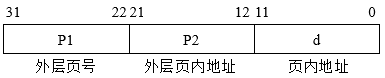

说明：外层页号P1为10位，可以表示1024个物理块，外层页表中的外层也内地址P2为10位，可以表示1024个物理块，页内地址为12位，表示页面大小为4K。

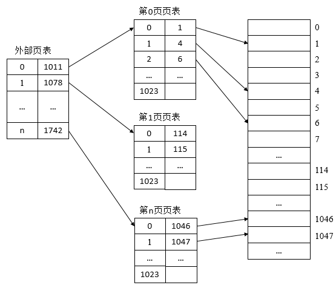

说明：在页表的每一个表项中存放的是进程的某页在内存中的物理块号，如第0页的0页存放1#物理块，第1页存放4#物理块，而在外层页表的每个页表项中，所存放的是某页表分页的首址，如第0页页表存放在1011#物理块中，第1页页表存放在1078#物理块中。

为了实现地址变换，在地址变换机构中需要增设一个外层页表寄存器，用于存放外层页表的始址，并利用逻辑地址中的外层页号，作为外层页表的索引，从中找到指定页表分页的始址，在利用P2作为指定页表分页的索引，找到指定的页表项，其中即含有该页在内存的物理块号，用该块号和页内地址d即可构成访问的内存物理地址。

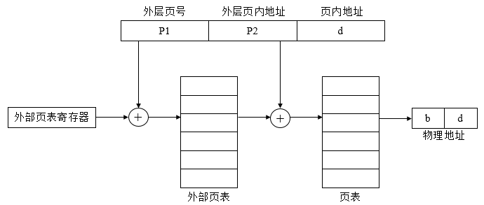

将页表施行离散分配的方法，虽然解决了对大页表无需大片存储空间的问题，但是并未解决用较少的内存空间去存放大页表的问题，换言之，只用离散分配空间的办法并未减少页表所占用的内存空间，解决办法是把当前需要的一批页表项调入内存，以后再根据需要陆续调入。在采用两级页表结构的情况下，对于正在运行的进程，必须将其外层页表调入内存，而对页表则只需要调入一页或者几页，为了表征某页的页表是否已经调入内存，还应在外层页表项中增设一个状态位S，其值若为0，表示该页表分页尚未调入内存，否则，说明已经在内存，进程运行时，地址变换机构根据逻辑地址P1，去查找外层页表，若所找到的页表项中的状态位为0，则产生一中断信号，请求OS将该页表分页调入内存。

对于64位的机器而言，采用两级页表已经不太合适，如果页面大小仍采用4KB，那么剩下52位，若还是按照物理块的大小（2^12位）来划分页表，每个页表项4B，故一页中可存放2^10个页表项，则将余下的42位用于外层页号，此时，外层页表中可能有4096G个页表项，要占用16384GB的连续内存空间，显然是不行的。必须采用多级页表，即将外层页表再进行分页。若计算机的虚拟地址空间大小为2^64，页面大小为4KB，页表项为4B，则最少页表的级数为6级，首先总的页面个数为2^52（64
- 12），其次，每个物理块能装入的页表项为4KB/4B = 2^10个，10 * 6 > 52，即最少需要6级。

**六、基本分段存储管理方式**

从固定分区到动态分区分配，再到分页存储管理方式，其主要动力为提高内存利用率，引入分段存储管理的目的在于满足用户在编程和使用上多方面的要求。如

① 方便编程，用户可以把自己的作业按照逻辑关系划分为若干段，每个段都是从0开始编址，并有自己的名字和长度。

② 信息共享，在实现对程序和数据的共享时，是以信息的逻辑单位为基础的，比如共享某个函数。

③ 信息保护，信息保护同样是对信息的逻辑单位进行保护。

④ 动态增长，在实际应用中，数据段在使用过程中往往会不断增长，而实现无法确切知道数据段会增长到多大，分段可以较好的解决这个问题。

⑤ 动态链接，再运行时，先将主程序所对应的目标程序装入内存并启动运行，当运行过程中有需要调用某段时，才将该段调入内存并进行链接。

6.1 分段系统的基本原理

在分段管理中，作业的地址空间被划分为若干个段，每个段定义了一组逻辑信息，如有主程序段MAIN，子程序段X，数据段D及栈段S，每个段都有自己的名字，每个段从0开始编址，并采用一段连续的地址空间，段的长度由相应的逻辑信息组的长度决定，因而各段长度不等，整个作业的地址空间由于是分成多个段，因而是二维的，即其
**逻辑地址由段号和段内地址构成** 。

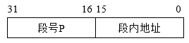

说明：一个作业允许最长有64K个段，每个段的最大长度为64KB。

在分段式存储管理系统中，为每个分段分配一个连续的分区，而进程中的各个段可以离散地移入内存中不同的分区，为了使程序正常运行，能够物理内存中找出每个逻辑段所对应的位置，应该为每个进程建立一张段映射表，称为段表，每个段在表中有一个表项，其中记录了该段在内存中的起始地址和段的长度。段表可以存放在一组寄存器中，这样有利于提高地址转换速度，但通常将段表放在内存中。
**段表用于实现从逻辑段到物理内存区的映射** 。

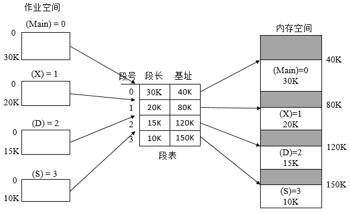

为了实现从进程的逻辑地址到物理地址的变换功能，在系统中设置了段表寄存器， **用于存放段表始址和段表TL**
，在进行地址变换时，系统将逻辑地址中的段号与段表长度TL进行比较，若S>TL，表示段号太大，访问越界，产生越界中断信号，若未越界，则根据段表的始址和该段的段号，计算该段对应段表项的位置，从中读出该段在内存中的起始地址，然后，再检查段内地址d是否超过该段的段长SL，若超过，同样发出越界中断信号，若为越界，则将该段的基址与段内地址d相加，即得到要访问的内存物理地址。

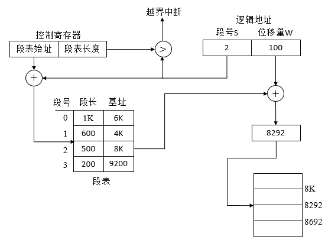

每次访问一个数据时（需给出段号和段内地址），也需要访问两次内存，第一次根据段号获得基址，第二次根据基址与段内地址之和访问真实数据的物理地址。这降低了计算机的速率，也可以增设一个联想存储器，用来保存最近常用的段表项，用来加速存取数据的时间。

可以看到，分页与分段存在很大的相似性，如都采用离散分配方式，都需要通过地址映射机构实现地址变换，但两者的主要 **区别** 如下。

① 页是信息的物理单位，分页是为实现离散分配方式，以 **消减内存的外零头，提高内存的利用率**
，或者说，分页仅仅是由于系统管理的需要而不是用户的需要，段则是信息的逻辑单位，它含有一组意义相对完整的信息，分段的目的是为了能更好地满足用户的需要。

②
页的大小固定且由系统决定，由系统把逻辑地址划分为页号和页内地址两部分，是由机器硬件实现的，一个系统中，只存在一种大小的页面，段的长度则不固定，决定于用户所编写的程序，通常由编译程序在对源程序进行编译时，根据信息的性质来划分。

③
分页的作业的地址空间是一维的，即单一的线性的地址空间，程序员只利用一个记忆符即可表示一个地址，而分段的作业地址空间是二维的，程序员在标识一个地址是，需要给出段名和段内地址。

6.2 段页式存储管理方式

分页系统能够有效的提高内存利用率（但是会存在页内碎片），分段系统则能够很好地满足用户需要。若能将两种方式结合起来，既具有分段系统的便于实现、分段可共享、易于保护、可动态链接等优点，又能像分页系统那样很好地解决内存的外部碎片问题，基于此，提出了段页式系统。

段页式系统先将用户程序分成若干个段，再把段分为若干个页，并为每一个段赋予一个段名。段页式系统中，地址结构由段号、段内页号、页内地址三部分构成。

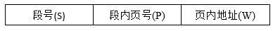

在段页式系统中，为了便于实现地址转换，须配置一个段表寄存器，其中存放段表始址和段表长TL，进行地址变换时，首先利用段号S，将它与段表长TL进行比较，若S<TL，表示未越界，于是利用段表始址和段号来求出该段所对应的段表项在段表中的位置，从中得到该段的页表始址，并利用逻辑地址中的段内页号P来获得对应页的页表项位置，从中读出该页所在的物理块号b，再利用b和页内地址构成物理地址。

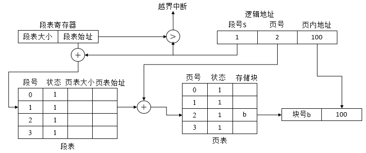

在段页式系统中，为了获得一条指令或数据，需要 **访问内存三次**
，第一次访问时访问内存中的段表，从中取得页表始址，第二次访问是访问内存中的页表，从中取出该页所在的物理块号，并将该块号与页内地址一起形成指令或数据的物理地址，第三次访问才是真正的从第二次访问所得的地址中，取出指令或数据。同样，也可以增设高速缓冲寄存器用于加快访问速度。

**七、虚拟存储器的基本概念**

前面所介绍的存储器管理方式都有一个共同的特点，即他们都要求将一个作业全部装入内存后方能运行，于是，出现了下面两种情况

① 有的作业很大，其所要求的内存空间超过了内存总容量，作业不能全部被装入内存，致使该作业无法运行。

② 做大量作业要求运行，但由于内存容量不足以容纳所有这些作业，只能将少数作业装入内存让他们先运行，而将其他大量作业留在外存上等待。

为了解决上述问题，可以增加物理内存，但是其不太现实，另外是从逻辑上扩充内存容量。

基于程序的局部性原理（时间局限性和空闲局限性），程序在运行之前，没有必要全部装入内存，仅需将那些当前要运行的少数页面或段先装入内存便可运行。其余部分暂留在磁盘上，程序运行时，如果它所要访问的页（段）已经调入内存，便可继续执行下去，但如果程序所要访问的页（段）尚未调入内存（缺页或缺段），此时程序应利用OS的请求调页（段）功能，将它们调入内存，以使进程继续执行下去。如果此时内存已满，无法再装入新的页（段），则还需利用页（段）的置换功能，将内存中暂时不用的页（段）调至磁盘上，再将要访问的页（段）调入内存，使程序继续执行。这样，可以使很大的用户程序在较小的内存空间中运行。从用户的调入看，该系统具有很大的内存容量，但是，用户看到的大容量只是一种感觉，这种存储器被称为虚拟存储器。
**所谓虚拟存储器，是指具有请求调入功能和置换功能，能从逻辑上对内存容量加以扩充的一种存储器系统，其逻辑容量由内存容量和外存容量之和决定，其运行速度接近内存，成本接近外存。**

7.1 虚拟存储器的实现方法

在虚拟存储器中，允许将一个作业分多次调入内存，其 **建立在离散分配的存储管理方式上** 。

① **请求 **分页** 系统**，在分页系统的基础上， **增加了请求调页功能和页面置换功能所形成的页式虚拟存储系统**
，其允许只装入少量页面的程序（数据），便启动运行，以后，再通过调页功能及页面置换功能，陆续地把要运行的页面调入内存，同时把暂时不用的页面换出到外存，
**置换是以页面为单位** 。其需要必要的硬件和软件支持。硬件有 **请求分页的页表机制**
（它是在纯分页的页表机制上增加若干项而形成的，作为请求分页的数据结构）、 **缺页中断机构**
（每当用户程序要访问的页面尚未调入内存时，便产生一缺页中断，请求OS将所缺的页调入内存）、 **地址变换机构**
（在纯分页的基础上发展形成）。软件有用于实现调页的软件和实现页面置换的软件。

② **请求分段系统** ，在分段系统的基础上， **增加了请求调段功能和分段置换功能所形成的段式虚拟存储系统。**
其允许只装入少量段的用户程序和数据，即可启动运行，以后再通过调段功能和段的置换功能将咱不运行的段调出，同时调入即将运行的段， **置换是以段为单位**
。其需要必要的硬件和软件支持，硬件有请求分段的段表机制（它是在纯分页的段表机制上增加若干项而形成的，作为请求分段的数据结构）、 **缺段中断机构**
（每当用户程序要访问的段尚未调入内存时，便产生一缺段中断，请求OS将所缺的段调入内存）、 **地址变换机构**
（在纯分段的基础上发展形成）。软件有用于实现调页的软件和实现页面置换的软件。

7.2 虚拟存储器的特征

① 多次性，一个作业会被分成多次调入内存运行，多次性是虚拟存储器最重要的特征。

② 对换性，允许在作业的运行过程中进行换进、换出。换进换出能够有效地提高内存利用率。

③ 虚拟性，使用户所看到的内存容量远大于实际内存容量。

虚拟性是以多次性和对换性为基础的，仅当系统允许将作业分多次调入内存，并能够将内存中暂时不运行的程序和数据换至磁盘上时，才有可能实现虚拟存储器，而多次性和对换性有必须建立在离散分配的基础上。

**八、请求分页存储管理方式**

请求分页是建立在分页基础上的，增加了请求调页功能和页面置换功能。

8.1 请求分页中的硬件支持

① **页表机制**
，其基本作用仍然是将用户地址空间中的逻辑地址变换为内存空间中的物理地址，由于只将应用程序的一部分调入内存，还有一部分仍在盘上，故需要再页表中再增加若干项，供程序（数据）在换进、换出时参考，请求分页系统中的页表项如下

说明：状态位P，用于指示该页是否已调入内存，供程序访问时参考；访问字段A，用于记录本页在一段时间内被访问的次数，或记录本页最近已有多长时间未被访问，供选择换出页面时参考；修改位M，表示该页在调入内存后是否被修改过，由于内存的每一页在外存上保留有一个副本，因此，若未被修改，则在置换时就不需要再将该页写回到外存上，若被修改，则必须重写到外存上，M位供置换页面时参考；外存地址，指出该页在外存上的地址，通常是物理块号，供调入该页时参考。

② **缺页中断机构**
，当要访问的页面不在内存时，产生一个缺页中断，请求OS将缺的页面调入内存，缺页作为中断，也需要经过保护CPU现场、分析中断原因、转入中断处理程序进行处理、恢复CPU环境等。但是，其与一般中断相比有一些不同，主要在于：在指令执行期间产生和处理中断信号（通常CPU都是在一条指令执行完后，才检查是否有中断请求到达，若有，则响应，否则，继续执行下一条指令，然而，缺页中断是在指令执行期间，发现所要访问的指令或数据不再内存时所产生和处理的），一条指令在执行期间，可能产生多次缺页中断。

③ **地址变换机构** ，在分页系统地址变换基础上，为实现存储器而增加的某些功能而形成。如产生和处理缺页中断，以及从内存中换出一页功能等。

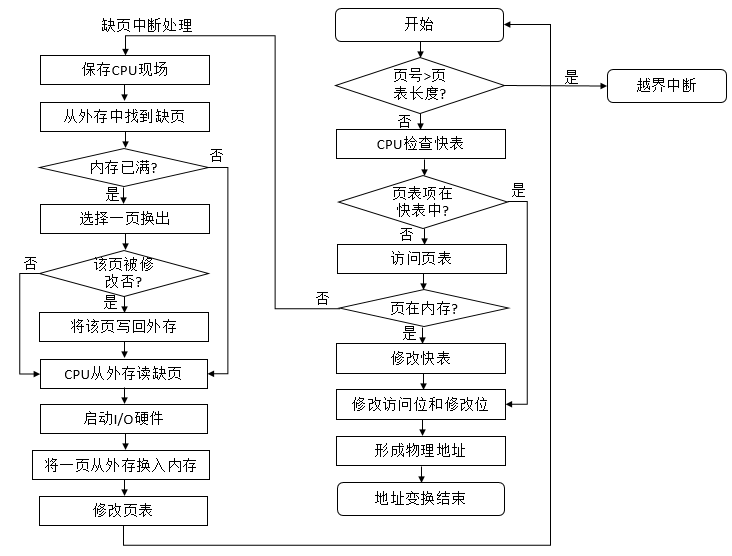

8.2 内存分配策略和分配算法

在为进程分配内存时，涉及到如下三个问题：最小物理块数的确定、物理块的分配策略、物理块的分配算法。

① **最小物理块数的确定**
，指能够保证进程正常运行所需的最小物理块数，当系统为进程分配的物理块数小于此值时，进程将无法运行。进程应获得的最少物理块数与计算机的硬件结构有关，取决于指令的格式、功能、寻址方式。

② **物理块的分配策略**
，在请求分页系统中，可采取两种内存分配策略，固定和可变分配策略，在进行置换时，也可采用全局置换和局部置换，可组合出如下三种适用的策略。
**固定分配局部置换**
（为每个进程分配一定数目的物理块，整个运行期不再改变，如果进程在运行中发现缺页，则只能从该进程在内存的n个页面中选出一页换出，然后再调入一页，以保证分配给该进程的内存空间不变，若开始为进程分配的物理块数太少，则会频繁缺页，降低系统吞吐量，若太多，则使内存中驻留的进程数目减少，进而造成CPU空闲或其他资源空闲的情况），
**可变分配全局置换**
（先为系统中的每个进程分配一定数目的物理块，而OS自身也保持一个空闲物理块队列，当某进程发现缺页时，由系统从空闲物理块队列中取出一个物理块分配给该进程，并将欲调入的缺页装入其中，仅当空闲物理队列的物理块用完时，OS才能从内存中选择一页调出，该页可能是系统中任一进程的页，这样，会是那个进程的物理块减少，进而使缺页率增加），
**可变分配局部置换**
（为每个进程分配一定数目的物理块，当进程缺页时，只允许从该进程在内存中的页面中选出一页换出，这样不会影响其他进程的运行，如果该进程频繁发生缺页，则系统需要再为该进程分配若干附加的物理块，直至该进程的缺页率减少到适当程度为止，反之，若一个进程正在运行过程中的缺页率特别低，则此时可适当减少分配给该进程的物理块数，但不应该引起缺页率明显增加）。

③ **物理块分配算法** ，可采用 **平均分配算法** （将系统中所有可供分配的物理块平均分配给各个进程）、 **按比例分配**
（根据进程的大小按比例分配物理块）、 **考虑优先权的分配算法**
（将重要的，紧迫的作业分配较多的内存空间，可将系统的物理块分成两部分，一部分按比例分配给各进程，另一部分则根据进程的优先权适当地增加相应份额后，分配给进程）

**九、页面置换算法**

在进程运行过程中，若其所要访问的页面不在内存而需把它们调入内存，但内存已五空闲空间时，为了保证该进程能正常运行，系统必须从内存中调出一页程序或数据送磁盘的对换区中，但应将哪个页面调出，必须根据一定的算法来确定，通常，把选择换出页面的算法称为页面置换算法，置换算法的好坏，直接影响到系统的性能。一个好的页面置换算法，应该具有较低的页面更换频率。

9.1 最佳置换算法

是一种理论上的算法，所选择的被淘汰页面将是以后用不使用的，或者是在最长时间内不再被访问的，采用最佳置换算法，可以保证获得最低的缺页率，由于无法预知一个进程在内存的若干个页面中，哪个页面是未来最长时间内不再被访问的，因而该算法无法实现，但可以以此评价其他算法。假设系统为某进程分配了三个物理块，并考虑如下的页面号引用串：7，
0 ，1， 2， 0， 3， 0， 4， 2， 3， 0， 3， 2， 1， 2， 0， 1， 7， 0， 1。在进程运行后的置换如下图。

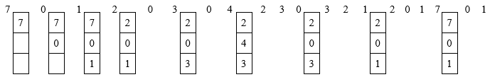

采用最佳置换算法发生了6次页面置换。

9.2 先进先出页面（FIFO）置换算法

**该算法总是淘汰最先进入内存的页面，即选择在内存中驻留时间最久的页面予以淘汰**
，该算法实现简单，只需要把一个进程已调入内存的页面，按照先后次序链接成一个队列，并设置一个指针，称为替换指针，使之指向最老的页面，但该算法与进程实际运行的规律不相适应，因为在进程中，有些页面经常被访问，FIFO算法并不能保证这些页面不被淘汰。

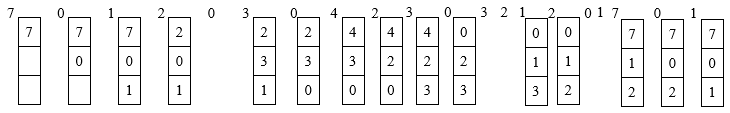

使用FIFO算法时进行了12次页面置换。

9.3 最近最久未使用（LRU）置换算法

该算法根据页面调入内存后的使用情况来进行决策，由于无法预测各页面将来的使用情况，LRU只能使用最近的过去代替最近的将来，因此，LRU置换算法是选择最近最久未使用的页面予以淘汰。该算法赋予每个页面一个访问字段，用来记录一个页面自上次访问以来所经历的时间t，当需要淘汰一个页面时，选择现有页面中其t值最大的，即最近最久未使用的页面予以淘汰。

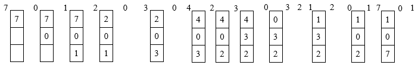

使用LRU算法时进行了9次页面置换。

9.4 Clock置换算法

为每一页设置一位访问位，再将内存中的所有页面都通过链接指针链接成一个循环队列，当某页被访问时，其访问位置为1，置换算法在选择一页淘汰时，只需要检查页的访问位，如果是0，就选择该页换出；若为1，则重新置为0，暂不换出，给该页第二次驻留内存的机会，再按照FIFO算法检查下一页面。当检查到队列中的最后一个页面时，若其访问位仍然是1，则再返回到队首去检查第一个页面，该算法只有一位访问位，只能用它表示该页是否已经使用过，而置换时是将未使用过的页面置换出去，故又把该算法称为最近未用算法NRU(Not
Recently Used)

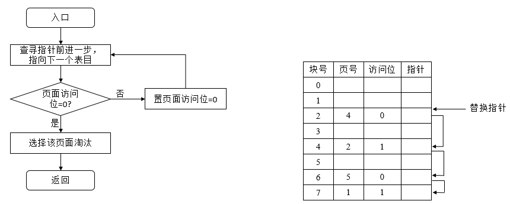

在将一个页面换出时，如果该页已经被修改过，便需要将该页重新写回到磁盘上，但如果没有被修改过，则不必将它拷回磁盘，在改进的Clock算法中，增加了一个置换代价的因素，这样，选择页面换出时，既要是未使用过的页面，又是要未被修改过的页面，把同时满足这两个条件的页面作为首选淘汰页面。由访问位A和修改位M可以组合如下四种类型的页面

① （A = 0, M = 0），表示该页最近既未被访问，又未被修改，是最佳淘汰页面。

② （A = 0, M = 1），表示该页最近未被访问，但已被修改，并不是很好的淘汰页面。

③ （A = 1, M = 0），表示该页最近已被访问，但未被修改，该页可能被再次访问。

④ （A = 1, M = 1），表示该页最近已被访问且被修改，该页可能再被访问。

对于置换而言，执行如下几步。

① 从指针所指示的当前位置开始，扫描循环队列，寻找A = 0 且 M =
0的第一类页面，将所遇到的第一个页面作为所选中的淘汰页，在第一次扫描期间不改变访问位A。

② 如果第一步失败，即查找一周后未遇到第一类页面，则开始第二轮扫描，寻找A = 0 且 M =
1的第二类页面，将所遇到的第一个这类页面作为淘汰页。在第二轮扫描期间，将所有扫描过的页面的访问位置为0。

③
如果第二步也失败，即未找到第二类页面，则将指针返回到开始位置，并将所有的访问位复为0，然后重复第一步，如果仍然失败，则重复第二步，则一定能够找到被淘汰的页。

十、请求分段存储管理方式

只需先调入若干个分段便可启动运行，当所访问的段不在内存中时，可请求OS将所缺的段调入内存。也同样需要硬件的支持。

10.1 请求分段中的硬件支持

为了快速完成请求分段功能，需要支持的硬件有段表机制、缺段中断机制、地址变换机构。

① **段表机制** ，由于只有一部分段装入内存，其余段仍留在外存上，需要再段表中增加若干项，以供程序调进、调出时参考。

说明：各字段意义如下存取方式（用于标识本分段的存取属性是只执行、只读、还是允许读/写），访问字段A（用于记录该段被访问的频繁程度），修改位M（表示该页在进入内存后是否已被修改过，供置换时参考），存在位P（表示本段是否已调入内存，供程序访问时参考），增补位（用于表示本段在运行过程中是否做过动态增长），外存始址（本段在外存中的起始地址，即起始盘块号）。

② **缺页中断机构**
，进程运行时发现所需的段尚未调入内存，便由缺段中断机构产生一个缺段中断信号，进入OS后由缺段中断处理程序将所需要的段调入内存。需要在一条指令的执行期间，产生和处理中断，以及一条指令执行期间，可能会产生多次缺段中断。

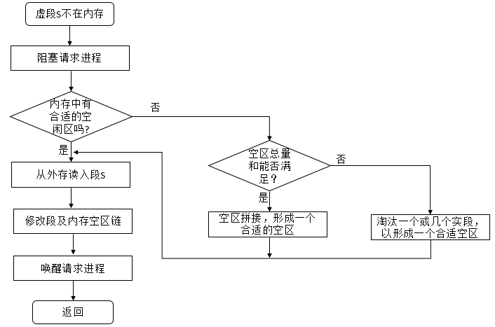

③ 地址变换机构，其在分段系统地址变换机构基础上形成，增加了缺段中断的请求和处理功能。

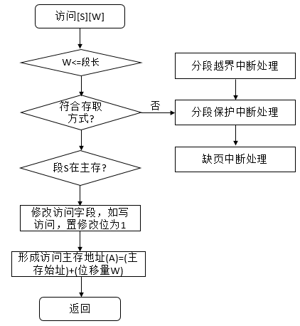

**十一、总结**

经过本篇博客，明白了OS如何对存储器进行高效管理，其中有很多细节直接我们去好好思考，也谢谢各位园友的观看~

