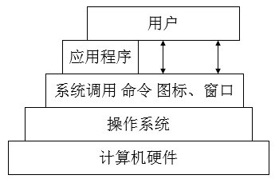
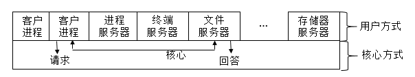
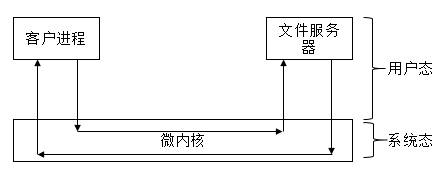

##【操作系统】操作系统综述（一）

##
##一、前言

##
##　　操作系统的重要性不言而喻，学习操作系统对我们理解计算机的工作流程是非常有利的，也很有利于我们学习掌握其他语言，因为语言中的很多概念都是直接和操作系统相关的，学好操作系统就是基础中的基础，所以，很有必要好好掌握操作系统这门基础知识。

##
##二、何为操作系统

##
##　　操作系统(OS，Operating System)是配置在计算机硬件上的第一层软件，是对硬件系统的首次扩充。它在计算机系统中占据了重要地位，汇编程序、编译程序、数据库管理系统等系统软件，都依赖于操作系统的支持，需要取得操作系统的服务。

##
##三、操作系统的作用

##
##　　为什么需要操作系统？可以很简单的会带，因为为了方便使用者使用计算机，所以需要操作系统，如果没有操作系统，使用计算机将会无比的困难，因为机器只能识别0,1二进制码，而普通人不可能去通过二进制码而计算机打交道，所以必须需要操作系统，这样普通用户才能很好的使用计算机，比如windows操作系统，Linux操作系统，它们都使得我们使用计算机变得非常的简单。既然需要在计算机中装操作系统，那么操作到底有什么作用呢。

##
##　　3.1 OS作为用户与计算机硬件系统之间的接口

##
##　　用户可以通过如下三种方式使用计算机。

##
##　　① 命令方式；OS提供了命令接口，用户可输入命令取得操作系统的服务，并控制用户程序的运行。

##
##　　② 系统调用方式；OS提供了系统调用，用户可在应用程序中调用系统调用，来实现与操作系统的通信，并取得它的服务。

##
##　　③ 图形、窗口方式；这应该是用户最熟悉的一种方式，只需要通过鼠标简单的点击就能够实现与操作系统之间的通信，并取得它的服务。

##
##　　OS作为接口示意图如下。

##
##　　 

##
##　　3.2 OS作为计算机系统资源的管理者

##
##　　OS管理的计算机系统资源如下。

##
##　　① 处理器；用于分配和控制处理器。

##
##　　② 存储器；负责内存的分配与回收。

##
##　　③ I/O设备；负责I/O设备的分配与操纵。

##
##　　④ 文件管理；负责文件的存取、共享和保护。

##
##　　3.3 OS实现了对计算机资源的抽象

##
##　　若在计算机上没有安装任何软件，那么用户需要面向硬件接口进行编程，那是相当的痛苦，为了方便使用硬件设备，则覆盖了一层I/O设备管理软件，该软件提供Read/Write接口，用户通过此接口就可以使用该硬件设备进行数据的输入和输出了，这就方便了很多。还可以覆盖一层文件管理软件并提供相应的操作接口，用户则可以用户接口去操作文件，而不用去了解具体的细节。OS就是由这些软件组成，其屏蔽了具体的硬件的细节，提供统接口供用户调用，通过该接口就可以轻松的访问操纵硬件资源。

##
##四、操作系统的基本特性

##
##　　操作系统最重要的特征有并发、共享、虚拟和异步。其中，并发是最基本的特征，其他三个特征都是以并发为前提的。

##
##　　4.1 并发性　　

##
##　　提到并发，就自然而然的会提到并行，两者到底有怎样的区别呢。

##
##　　并行性是指两个或多个事件在同一时刻发生。

##
##　　并发性是指两个或多个事件在同一时间间隔发生。

##
##　　有两者的概念可知，在单处理器计算机上，多道程序会交替运行，是并发的；但是每一个时刻最多只有一道程序运行，是并行的。而在多处理器计算机上，同一时刻会有多到程序同时运行，是并行的。

##
##　　用户编写好的程序交给计算机运行，从用户的角度看，计算机运行的是程序，但是，实际上，在计算机中运行的是线程。因为程序时静态实体，不能被处理器调用独立运行，更不能与其他程序并发执行。实际上，计算机会为每个程序建立进程，然后为每一个进程建立线程，处理器调度线程，从而到达运行程序的效果。

##
##　　而进程与线程也是一个容易混淆的概念。进程是操作系统分配资源的基本单位，线程是独立运行和独立调度的基本单位，线程基本上不占据资源，一个进程的多个线程共享该进程的资源。关于进程与线程，之后还会具体的介绍。

##
##　　4.2 共享性

##
##　　共享是指操作系统中的资源可供内存中多个并发执行的进程(线程)共同使用，这种资源的共同使用就叫做资源共享。而根据各种资源的不同属性，进程对资源利用的方式也不相同，目前实现资源共享的方式有如下两种。

##
##　　1. 互斥共享方式

##
##　　互斥共享是指当资源被一个进程A占用时，其他想用使用该资源的进程B就只能等待，只有进程A使用完该资源后，进程B才能够使用该资源，这种共享方式就叫做互斥式共享，把这种资源叫做临界资源或独占资源。如打印机就属于临界资源。

##
##　　2. 同时访问方式

##
##　　某一资源在一段时间内可由多个进程"同时"访问，这种"同时"是宏观上的，在微观上，这些进程可能是交替对该资源进行访问，磁盘设备就是这类资源。

##
##　　4.3 虚拟技术

##
##　　虚拟就是通过某种技术把一个物理实体转变为若干个逻辑上的对应物。物理实体是实际存在的，逻辑上的对应物是虚拟的，现在主要有两种虚拟技术，时分复用和空分复用技术。

##
##　　1. 时分复用技术

##
##　　时分复用技术可以用来实现虚拟处理机、虚拟设备等，用来提高资源的利用率。

##
##　　虚拟处理机技术。虚拟处理机技术借助多道程序设计技术，即为每一道程序建立一个进程，让多道程序并发执行，从而达到分时使用一台计算机，这台计算机能够同时为多个用户服务，使得每个终端用户都认为有一个处理机专门为他服务。

##
##　　虚拟设备技术。通过虚拟设备技术将一台物理I/O设备虚拟为多态逻辑上的I/O设备，并允许用户占用一台逻辑上的I/O设备，这样可以允许在一段时间内由一个用户访问的设备变为在一段时间内允许多个用户同时访问的共享设备。

##
##　　2. 空分复用技术

##
##　　空分复用技术可以用来实现虚拟磁盘、虚拟存储等，用来提高资源利用率。

##
##　　虚拟磁盘技术。通过虚拟磁盘技术可以将一个硬盘虚拟为多台虚拟磁盘，这样使用起来既安全又方便。如将一块硬盘划分为C、D、E等逻辑盘。

##
##　　虚拟存储器技术。利用存储器的空闲空间来存放程序，提高内存利用率。还可以通过虚拟存储器技术(实质上是时分复用技术)在逻辑上扩大存储器的容量，它可以使得一道程序通过时分复用技术在远小于它的内存空间中运行。

##
##　　时分复用或空分复用中逻辑设备数为N，那么每台虚拟设备速速必然等于或低于物理设备速度的1/N。

##
##　　4.4 异步性

##
##　　在多道程序环境下，允许多个进程并发执行，但只有进程在获得所需的资源后方可执行，如正在执行的进程A提出打印请求，需要使用打印机，但是此时进程B正在使用打印机，故此时进程A只能等待并且放弃处理机资源，当进程B使用完打印机后，并且分配处理机才能运行，可以看出，进程的执行通常不是一气呵成的，而是走走停停的方式。进程以不可预知的速度向前推进，此即进程的异步性。异步性也是操作系统的一个重要特征。

##
##五、微内核OS结构

##
##　　为提高操作系统的正确性、灵活性、易维护性、可扩充性，在现代操作系统结构设计中，即单处理机环境下，大多采用了基于客户/服务器模式的微内核结构，将操作系统划分为两个部分：微内核和多个服务器，对微内核的描述如下。

##
##　　5.1 微内核的特点

##
##　　1. 足够小的内核

##
##　　内核是指经过精心设计、能实现现代OS最基本核心功能的部分。微内核并不是一个完整的OS，而只是操作系统中最基本的部分，它通常用于实现与硬件紧密相关的处理、实现一些比较基本的功能、负责客户和服务器之间的通信。

##
##　　2. 基于客户/服务器模式

##
##　　将操作系统中最基本的功能放入内核中，把其他绝大部分功能放在微内核外面的一组服务器(进程)中实现。如用于提供对进程进行管理的进程服务器，提供对虚拟存储器管理的虚拟存储器服务器，提供I/O设备管理的I/O设备管理服务器。他们都是被作为进程来实现的，运行在用户态，客户与服务器之间是借助微内核提供的消息传递机制来实现信息交互的

##
## 

##
##　　说明：可以看到客户进程与服务器是通过微内核来完成通信的。

##
##　　3. 应用"机制与策略分离"原理

##
##　　所谓机制，是指实现某一功能的具体执行结构，而策略，则是在机制的基础上，借助于某些参数或算法来实现该功能的优化，或达到不同的功能目标。通常，机制处于一个系统的基层，而策略则处于系统的高层。在微内核系统中，机制通常放在OS的微内核中。

##
##　　4. 采用面向对象技术

##
##　　利用面向对象技术的抽象和隐蔽原则来控制系统的复杂性，利用对象、封装、继承等概念来确保操作系统的正确性、可靠性、易修改性等。

##
##　　5.2 微内核的基本功能

##
##　　1. 进程（线程）管理

##
##　　为实现进程（线程）调度功能，必须在进程管理中设置一个或多个进程（线程）优先级队列，能将指定优先级进程（线程）从所在队列中取出，并将其投入执行。由于这部分属于调度功能的机制部分，应将它放入微内核中。而如何确定每类用户进程的优先级，以及如何修改他们的优先级，都是属于策略问题，可将他们放在微内核外的进程管理服务器中。由于进程之间的通信功能是微内核OS最基本的功能，因此几乎所有的微内核OS都将进程通信功能放在微内核中，此外，还将进程的切换、线程的调度、以及处理机之间的同步功能也放入微内核中。

##
##　　2. 低级存储器管理

##
##　　在微内核中，配置了最基本的低级存储器管理机制。如用于将用户控件的逻辑地址变换Wie内存空间的物理地址的页表机制和地址变换机制，这部分是依赖于机器的，因此放入微内核汇中，而采取何种页面算法、采用何种内存分配和回收策略都是具体的策略，放在微内核外的存储器管理服务器中去实现。　　

##
##　　3. 中断和陷入处理

##
##　　微内核可以捕获所发生的中断和陷入事件，并进行相应的前期处理。如进行中断现场保护，识别中断和陷入的类型，然后将有关事件的信息转化成消息后，把它发送给相关的服务器。有服务器根据中断和陷入的类型，调用相应的处理程序来进行后期处理。

##
##　　5.3 微内核存在的问题

##
##　　微内核OS采用客户/服务器模式，有许多优点，但是也存在一些缺点，如客户进程与服务进程，服务进程与服务进程通信时，都需要经过微内核，会存在多次用户/内核模式及上下文切换，这使得开销较大。

##
## 　　说明：当客户进程请求文件服务时，需要经过四次用户态和系统态的切换，这样使得开销成本很大。为了减少开销，会把服务器移入到微内核中，这样就只需要进行两次切换即可，会减少系统开销，但是会增加内核的容量。

##
##六、总结

##
##　　操作系统的基本知识就介绍到这里，之后我们会更深入的介绍每一个知识点，谢谢各位园友的观看~　