##【操作系统】文件管理（六）

##
##一、前言

##
##　　本篇是操作系统系列的最后一篇，文件管理，由于系统的内存有限并且不能长期保存，故平时总是把它们以文件的形式存放在外存中，需要时再将它们调入内存。如何高效的对文件进行管理是操作系统实现的目标。

##
##二、文件和文件系统

##
##　　现代OS几乎都是通过文件系统来组织和管理在计算机中所存储的大量程序和数据的。文件系统的管理功能是通过把它所管理的程序和数据组织成一系列文件的方法来实现的。而文件则是指具有文件名的若干相关元素的集合。元素通常是记录，而记录是一组有意义的数据项的集合。可以把数据组成分为数据项、记录、文件。

##
##　　① 数据项，数据项是最低级数据组织形式。分为基本数据项（用于描述一个对象某种属性的字符集，是数据组织中可以明明的最小逻辑数据单位，即原子数据，又称为数据元素或字段）和组合数据项（由若干个基本数据项组成）

##
##　　② 记录，是一组相关数据项的集合，用于描述一个对象在某方面的属性，为了能够唯一标识一个记录，需要在记录中确定一个或集合数据项，把他们的集合称为关键字，关键字是能够唯一标识一个记录的数据项。

##
##　　③ 文件，文件是具有文件名的一组相关元素的集合，分为有结构文件和无结构文件。有结构文件由若干个相关记录组成，无结构文件则被看成一个字符流。文件是文件系统的最大数据单位。文件应该具有自己的属性，包括文件类型（如源文件、目标文件、可执行文件等），文件长度（文件的当前长度，也可能是最大允许长度），文件的物理位置（指示文件在哪一个设备上及在该设备的哪个位置的指针），文件的建立时间（文件最后一次修改时间）。

##
##　　一个文件可对应若干个记录，一个记录可对应若干个数据项。

##
##　　文件系统管理的对象有：文件（作为文件管理的直接对象），目录（为了方便用户对文件的存取和检索，在文件系统中配置目录，每个目录项中，必须含有文件名及该文件所在的物理地址，对目录的组织和管理是方便和提高对文件存取速度的关键），磁盘（磁盘）存储空间（文件和目录必定占用存储空间，对这部分空间的有效管理，不仅能提高外存的利用率，而且能提高对文件的存取速度）。

##
##　　2.1 文件操作

##
##　　① 创建文件，在创建一个新文件时，系统首先要为新文件分配必要的外存空间，并在文件系统的目录中，为之建立一个目录项，目录项中应该记录新文件的文件名及其在外存的地址等属性。

##
##　　② 删除文件，当已不再需要某文件时，可将其从文件系统中删除，在删除时，系统应先从目录中找到要删除文件的目录项，使之成为空项，然后回收该文件所占用的存储空间。

##
##　　③ 读文件，读文件时，须在相应系统调用中给出文件名和应读入的内存目标地址。此时，系统要查找目录，找到指定目录项，从中得到被读文件在外存中的位置。在目录项中，还有一个指针用于对文件进行读/写。

##
##　　④ 写文件，写文件时，须在相应系统调用中给出文件名和其在内存源地址。此时，系统要查找目录，找到指定目录项，从再利用目录中的写指针进行写操作。

##
##　　⑤ 截断文件，如果一个文件的内容已经陈旧而需要全部更新时，一种方法是将此文件删除，再重新创建一个新文件，但如果文件名和属性均无改变，则可采取截断文件的方法，其将原有的文件长度设置为0，放弃原有文件的内容。

##
##　　⑥ 设置文件的读/写位置，用于设置文件读/写指针的位置，以便每次读/写文件时，不需要从始端开始而是从所设置的位置开始操作。可以改顺序存取为随机存取。

##
##　　当前OS所提供的大多数对文件的操作，其过程大致都是这样两步：首先，检索文件目录来找到指定文件的属性及其在外存上的位置；然后，对文件实施相应的操作，如读/写文件等，当用户要求对一个文件实施多次读/写或其他操作时，每次都要从检索目录开始，为了避免多次重复地检索目录，在大多数OS中都引入了打开这一文件系统调用，当用户第一次请求对某文件系统进行操作时，先利用open系统调用将该文件打开。

##
##　　打开是指系统将指名文件的属性（包括该文件在外存上的物理位置）从外存拷贝到内存打开文件表的一个表目中，并将该表目的编号（索引号）返回给用户，以后，当用户再要求对该文件进行操作时，便可利用系统所返回的索引号向系统提出操作请求，系统便可直接利用该索引号到打开文件表中去查找，从而避免了对该文件的再次检索，如果用户不再需要对该文件实施操作，可利用关闭系统调用来关闭此文件，OS将会把该文件从打开文件表中的表目上删除掉。

##
##三、文件的逻辑结构

##
##　　对任何的文件，都存在以下两种形式的结构

##
##　　① 文件的逻辑结构，这是从用户观点出发所观察到的文件组织形式，是用户可以直接处理的数据及其结构，独立于文件的物理特性，又称为文件组织。

##
##　　② 文件的物理结构，又称为文件的存储结构，是指文件在外存上的存储组织形式，不仅与存储介质有关，还与外存分配方式有关。

##
##　　3.1 文件逻辑结构的类型

##
##　　文件的逻辑结构可分为两大类，一类是有结构文件，这是指由一个以上的记录构成的文件，故把他称为记录式文件，另一类是无结构文件，这是指由字符流构成的文件，又称为流式文件。

##
##　　① 有结构文件，每个记录都用于描述实体集中的一个实体，各记录有着相同或不同数目的数据项，记录分为定长记录（文件中所有记录的长度都是相同的，所有记录中的各数据项都处在记录中相同的位置，具有相同的顺序和长度）和变长记录（文件中个记录的长度不相同，可能由于一个记录中所包含的数据项目并不相同）。根据用户和系统的需要，可采用多种方式来组织这些记录，如顺序文件（记录按照某种顺序排列所形成的文件，记录通常是定长的，能较快查找到文件中的记录），索引文件（记录为可变长度时，通常建立一张索引表，并为每个记录设置一个表项，加快对记录检索的速度），索引顺序文件（为文件建立一张索引表，为每一组记录中的第一个记录设置一个表项）。

##
##　　② 无结构文件，对于源程序、可执行文件、库函数等通常采用的是无结构文件形式，即流式文件，其长度以字节为单位。

##
##　　3.2 顺序文件

##
##　　文件是记录的集合，文件中的记录可以是任意顺序的，因此，它可以按照各种不同的顺序进行排列，一般地，可归纳为以下两种情况。

##
##　　① 串结构，个记录之间的顺序与关键字无关，通常按照时间先后排序，最先存入的记录作为第一个记录，其次，为第二个记录，以此类推。

##
##　　② 顺序结构，文件中所有记录按照关键字排列，可以按照关键词长度从大到小排列。顺序结构的检索效率更高。

##
##　　顺序文件的最佳应用场合是在对诸记录进行批量存取时，即每次要读或写一大批记录时，此时，对顺序文件的存取效率是所有逻辑文件中最高的，此外，只有顺序文件才能存储在磁带上，并能有效工作。但是想要增加或删除一个文件比较困难。

##
##　　3.3 索引文件

##
##　　对于定长记录文件，可以方便的实现顺序存取和直接存取，然而，对于变长记录就很难实现。为了解决变长记录检索问题，可为变长记录文件建立一张索引表，对主文件中的每个记录，在索引表中设有一个相应的表项，用于记录该记录的长度L及指向该记录的指针（指向该记录在逻辑地址空间的首址），由于索引表示按记录键排序的，因此，索引表本身是一个定长记录的顺序文件。从而可以方便实现直接存取。

##
## 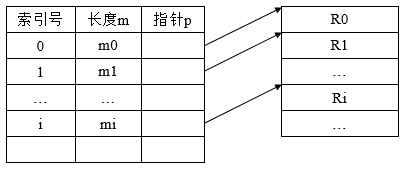　　在对索引文件进行检索时，首先根据用户（程序）提供的关键字，并利用折半查找检索索引表，从中找到相应的表项，再利用该表项给出的指向记录的指针值，去访问所需的记录。每当要向索引文件中增加一个新纪录时，便须对索引表进行修改。索引表的问题在于除了有主文件外，还需要配置一张索引表，每个记录需要有一个索引项，因此提高了存储费用。

##
##　　3.4 索引顺序文件

##
##　　其有效克服了变长记录不便于直接存取的缺点，而且所付出的代价也不算太大，它是顺序文件和索引文件相结合的产物，它将顺序文件中的所有记录分为若干个组，为顺序文件建立一张索引表，在索引表中为每组中的第一个记录建立一个索引项，其中含有该记录的键值和指向记录的指针。

##
## 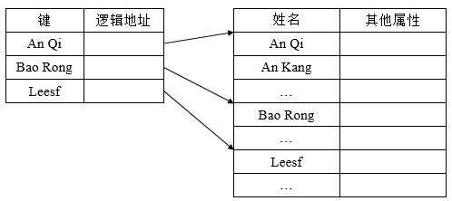

##
##　　在对索引顺序文件进行检索时，首先利用用户（程序）所提供的关键字及某种查找算法去检索索引表，找到该记录组中的第一个记录的表项，从中得到该记录组第一个记录在主文件中的位置，然后，再利用顺序查找法去查找主文件，从中找出所要求的记录。

##
##　　3.5 直接文件

##
##　　对于直接文件，则根据给定的记录键值，直接获得指定记录的物理地址，换言之，记录键值本身就决定了记录的物理地址，这种由记录键值到记录物理地址的转换被称为键值转换。

##
##　　3.6 哈希（Hash）文件

##
##　　利用Hash函数可将记录键值转换为相应记录的地址，为了能实现文件存储空间的动态分配，通常由Hash函数所求得的并非是相应记录的地址，而是指向一目录表相应表目的指针，该表目的内容指向相应记录所在的物理块。

##
## 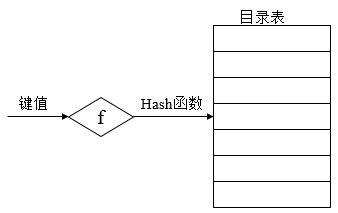

##
##四、外存分配方式

##
##　　由于磁盘具有可直接访问的特性，故当磁盘来存放文件时，具有很大的灵活性。而文件的物理结构与外村分配方式有关，在采用连续分配方式时的文件物理结构是顺序式的文件结构，在采用链接分配方式将形成链接式文件结构，而索引分配方式将形成索引式文件结构。

##
##　　4.1 连续分配

##
##　　连续分配要求为每个文件分配一组相邻接的盘块，一组盘块地址定义了磁盘上的一段线性地址。采用连续分配方式时，可把逻辑文件中的记录顺序地存储到邻接的各物理盘块中，这样所形成的文件结构称为顺序文件结构，这种分配方式保证了逻辑文件中的记录顺序与存储器中文件占用盘块的顺序的一致性。下图为连续分配方式（假设记录与盘块一样大）。

##
## 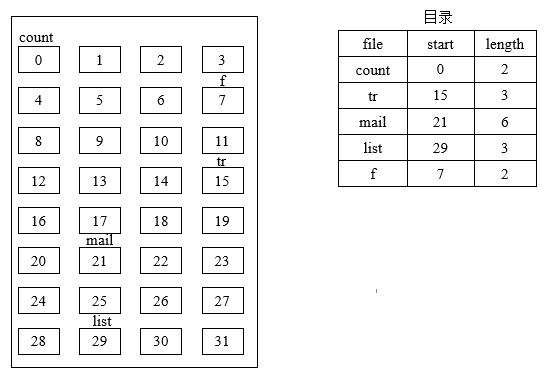　　如同动态分配分区分配一样，随着文件建立时空间的分配和文件删除时的空间回收，将使磁盘空间被分割成许多小块，这些小块的连续去已难以存储文件，此即外存的碎片，同样，可以使用紧凑的方法，将盘上所有的文件紧靠在一起，把所有的碎片拼成一大片连续的存储空间。

##
##　　连续分配的优点如下

##
##　　① 顺序访问容易，访问一个占有连续空间的文件非常容易。

##
##　　② 顺序访问速度快，因为由连续分配所装入的文件，其所占用的盘块可能是位于一条或几条相邻的磁道上，这是，磁头移动距离最少，这种对文件访问的速度使几种存储空间分配方式中最高的一种。

##
##　　连续分配的缺点如下

##
##　　① 要求又连续的存储空间，要为每个文件分配一段连续的存储空间，这样，便会产生许多外部碎片，严重地降低了外存空间利用率，定期紧凑会花费大量的机器时间。

##
##　　② 必须实现知道文件的长度，事先知道文件的长度，然后根据其大小，在存储空间中找出一块其大小足够的存储区，将文件装入，对于动态增长的文件非常低效。

##
##　　4.2 链接分配

##
##　　如果将一个逻辑文件存储到外存上，并不要求为整个文件分配一块连续的空间，而是可以将文件装到多个离散的盘块中，这样就可以消除连续分配的缺点。采用链接分配方式时，可通过在每个盘块上的链接指针，将同属于一个文件的多个离散盘块链接成一个链表，把这样形成的物理文件称为链接文件。链接分配采取离散分配方式，消除了外部碎片，故而显著地提高了外存空间的利用率，并且对文件的增、删、改、查十分方便。链接方式可分为隐式链接和显示链接两种形式。

##
##　　① 隐式链接， 在文件目录的每个目录项中，都须含有指向链接文件第一个盘块和最后一个盘块的指针。

##
## 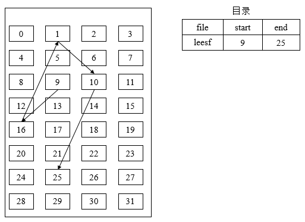

##
##　　说明：第9个盘块指向第16个盘块，第16个盘块指向第1个盘块，第1个盘块指向第10个盘块，第10个盘块指向第25个盘块（结束块）。　　

##
##　　隐式链接分配的主要问题在于：其只适合于顺序访问，对随机访问的效率及其低效。此外，其可靠性较差，任何一个指针出现问题，都会导致整个链的断开。可以将几个盘块组成一个簇，然后以簇为单位进行分配，会减少查找指定块的时间，但是会增加内部碎片。

##
##　　② 显示链接，把用于链接文件各物理块的指针，显式的放在内存的一张链接表中，该表在整个磁盘仅设置一张。

##
## 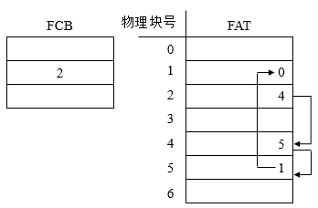

##
##　　说明：表的序号从0开始，直至N-1，N为盘块总数，在每个表项中存放链接指针，即下一个盘块号，在该表中，凡是属于某一文件的第一个盘块号，或者说是每一条链的链首指针所对应的盘块号，均作为文件地址被填入相应的文件的FCB(File Control Block)的物理地址字段中，由于查找记录的过程是在内存中进行的，因而提高了检索速度，减少了访问磁盘的次数，由于分配给文件的所有盘块号都在该表中，故把该表称为文件分配表FAT（File Allocation Table）。

##
##　　链接分配的问题如下：不能支持高效的直接存储（要对一个较大的文件进行直接存取，须首先在FAT中顺序地查找很多盘块号）；FAT需要占用较大的内存空间（由于一个文件所占用的盘块的盘块号是随机地分布在FAT中的，因而只有将整个FAT调入内存，才能保证FAT中找到一个文件的所有盘块号，当磁盘容量较大时，FAT占用的容量更大）

##
##　　③ 索引分配，事实上，在打开某个文件时，只需要把该文件占用的盘块号的编号调入内存即可，完全没有必要把整个FAT调入内存，为此，应该将每个文件所对应的盘块号集中地放在一起，索引分配方式就是基于这种想法所形成的一种分配方式。其为每个文件分配一个索引块（表），再把分配给该文件的所有盘块号都记录在该索引块中，因而该索引块就是一个含有许多磁盘块号的数组。在建立一个文件时，只需要在位为之建立的目录项中填上指向该索引块的指针（单级索引）。

##
## 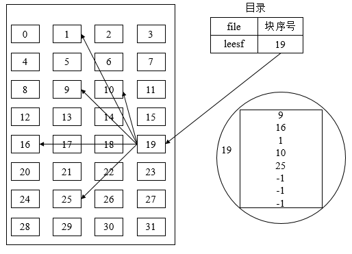

##
##　　说明：索引方式支持直接访问，可在索引块中找到第i个盘块，索引方式也不会产生外部碎片，当文件较大时，索引分配方式要优于链接分配方式。其主要问题在于：可能需要花费较多的外存空间，每当建立一个文件时，便须为之分配一个索引块，将分配给该文件的所有盘块号记录其中。对于小文件而言，索引块的利用率非常低。

##
##　　当OS为一个大文件分配磁盘空间时，如果所分配的盘块的盘块号已经装满一个索引块时，OS便为该文件分配另一个索引块，用于将以后继续为之分配的盘块号记录于其中，以此类推，然后再通过链指针将各索引块按序链接起来，当文件太大时，索引块太多，效率是低效的。此时，应该为这些索引块再建立一级索引，称为第一级索引，还可再建立索引，称为第二级索引等等。称为多级索引分配。

##
## 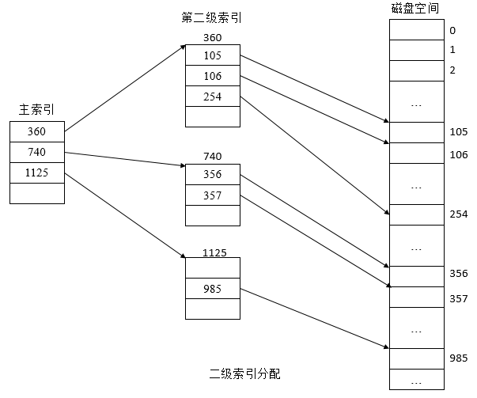

##
##　　说明：在二级索引分配方式下，若每个盘块的大小为1KB，每个盘块号占4个字节，则在一个索引块可以存放256个盘块号，这样，在两级索引时，最多可以包括存放文件的盘块号总数为64K(256 * 256)个盘块号，所允许文件最大长度为64MB，若盘块号为4KB，则一级索引的最大文件大小为4MB，二级索引的最大文件大小为4GB。

##
##　　④ 混合索引分配方式，将多种索引分配方式相结合而形成的一种分配方式，如直接地址（在索引结点中设置10个直接地址项，每项中所存放的是该文件数据所在盘块的盘块号，假如每个盘块大小为4KB，当文件不大于40KB时，可以直接从索引结点中读出该文件的全部盘号），一次间接地址（利用索引结点中的地址项来提供一次间接地址，其实质就是一级索引分配方式，在一次简直快中可存放1K个盘块号，允许最大文件为4MB），多次间接地址（当文件大于4MB + 40KB时，系统采用二次间址分配方式，其实质是两级索引分配方式，采用二次间址的最大文件大小为4GB，同理，可采用三次间接地址，允许文件最大大小为4TB）。

##
## 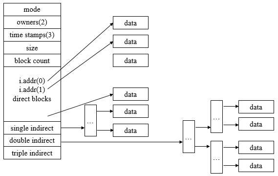

##
##五、目录管理

##
##　　为了能够对文件实施有效的管理，必须对它们加以妥善组织，这主要是通过文件目录实现的，文件目录也是一种数据结构，用于标识系统中的文件及其物理地址，供检索时使用，对目录的管理要求如下

##
##　　① 实现按名存取，即用户只须向系统提供所需访问的文件的名字，便能够快速准确地找到指定文件在外存上的存储位置，这是目录管理中最基本的功能。

##
##　　② 提高对目录检索速度，通过合理地组织目录结构的方法，可加快对目录的检索速度，从而提高对文件的存取速度。

##
##　　③ 文件共享，在多用户系统中，应该允许用户共享一个文件。

##
##　　④ 允许文件重名，系统应允许不同用户对不同文件采用相同的名字，以便用户按照自己的习惯给文件命名和使用文件。

##
##　　5.1 文件控制块

##
##　　为了能对文件进行正确的存取，必须为文件设置用于描述和控制文件的数据结构，称之为文件控制块FCB，文件管理程序可借助于文件控制块中的信息，对文件施加各种操作，文件与文件控制块一一对应，而人们把文件控制块的有序集合称为文件目录，一个文件控制块就是一个文件目录项。通常，一个文件目录也可被看成是一个文件，称为目录文件。

##
##　　文件控制块包含基本信息、存取控制信息、使用信息。

##
##　　① 基本信息，包括文件名（标识一个文件的符号名，在每个系统中，每个文件都有唯一的名字，用户利用该名字进行存取）；文件物理位置（指文件在外存上的存储位置，包括存放文件的设备名、文件在外村上的起始盘块号、指示文件所占用的盘块数或字节数的文件长度）；文件逻辑结构（指示文件是流式文件还是记录式文件、记录数，文件是定长还是变长记录）；文件物理结构（指示文件是顺序文件、链式文件还是索引文件）

##
##　　② 存取控制信息，包括文件主的存取权限、核准用户的存取权限及一般用户的存取权限。

##
##　　③ 使用信息，包括文件的建立日期和时间、文件上一次修改的日期和时间及当前使用信息（这项信息包括当前已打开该文件的进程数、是否被其他进程锁住、文件在内存中是否已被修改但尚未拷贝到盘上）

##
## 

##
##　　5.2 索引结点

##
##　　文件目录通常是存放在磁盘上的，当文件很多时，文件目录可能要占用大量的盘块，在查找的过程中，先将存放目录文件的第一个盘块中的目录调入内存，然后把用户所给定的文件名和目录项中的文件名逐一对比。若未找到指定文件，则再将下一个盘块中的目录项调入内存。在检索目录文件时，只用到了文件名，仅当找到一个目录项（即其中的文件名与指定要查找的文件名相匹配）时，才需要从该目录项中读出该文件的物理地址，而其他一些对该文件进行描述的信息，在检索目录时一概不用，显然，这些信息在检索目录时不需要调入内存。为此，在有的系统中，如UNIX系统，便采用了把文件名和文件描述信息分开的方法，亦即，使文件描述信息单独形成一个称为索引结点的数据结构，简称为i结点，在文件目录中的每个目录项由文件名和指向该文件所对应的i结点的指针所构成。

##
## 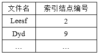

##
##　　每个文件都有唯一的磁盘索引结点（磁盘索引结点信息与文件名等信息一起构成了FCB），其主要包括内容如下

##
##　　① 文件主标识符，即拥有该文件的个人或小组的标识符。

##
##　　② 文件类型，包括正规文件、目录文件或特别文件。

##
##　　③ 文件存取权限，指各类用户对该文件的存取权限。

##
##　　④ 文件物理地址，每个索引结点中含有13个地址项（混合索引方式），他们以直接或间接的方式给出数据文件所在的盘块的编号。

##
##　　⑤ 文件长度，指以字节为单位的文件长度。

##
##　　⑥ 文件连接计数，表明在本文件系统中所有指向该文件名的指针计数。 

##
##　　⑦ 文件存取时间，指本文件最近被进程存取的时间、最近被修改的时间及索引结点最近被修改的时间。

##
##　　当文件被打开时，要将磁盘索引结点拷贝到内存索引结点中，便于以后使用，在内存索引结点中又增加了一下内容。

##
##　　① 索引结点编号，用于标识内存索引结点。

##
##　　② 状态，指示i结点是否上锁或被修改。

##
##　　③ 访问计数，每当有进程要访问此i结点时，将访问计数加1，访问完再减1。

##
##　　④ 文件所属文件系统的逻辑设备号。

##
##　　⑤ 链接指针，设置有分别指向空闲链表和散列队列的指针。

##
##　　5.3 目录结构

##
##　　目录结构的组织，关系到文件系统的存取速度，也关系到文件的共享性和安全性，目前常用的目录结构形式有单级目录、两级目录、多级目录。

##
##　　① 单级目录结构，在整个系统中只建立一张目录表，每个文件占一个目录项，目录项中含文件名、文件扩展名、文件长度、文件类型、文件物理地址、状态位（表示目录项是否空闲）等。每当要建立一个新文件时，必须先检查所有的目录项，以保证新文件名在目录中是唯一的，然后再从目录表中找到一个空白目录项，填入新文件的文件名及其他说明信息，并置状态为1，删除文件时，先从目录中找到该文件的目录项，回收该文件所占用的存储空间，然后再清除该目录项。单级目录的有点是简单并且能够实现目录管理的基本功能-按名存取，但是查找速度慢（查找一个目录项要花费较多的时间），不允许重名（在一个目录表中的所有文件，都不能与另一个文件有相同的名字，这是难以避免的），不便于实现文件共享（每一个用户都有自己的名字空间或命名习惯，因此，应该允许不同用户使用不同的文件名来访问同一个文件） 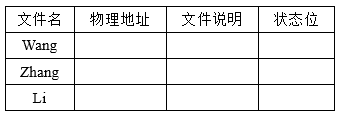　　② 两级目录结构，为每个用户建立一个单独的用户文件目录UFD（User File Directory），这些文件目录具有相似的结构，由用户所有文件的文件控制块组成。此外，系统中还有一个主文件目录MFD（Master File Directory），在主文件目录中，每个用户目录文件都占有一个目录项，其目录项包括用户名和指向用户目录文件的指针。

##
## 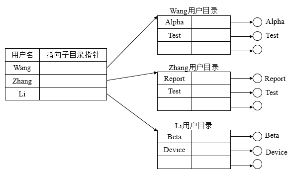

##
##　　两级目录结构客服了单级目录的缺点，具有如下优点：提高了检索目录的速度（如果在主目录中有n个子目录，每个用户目录最多为m个目录项，则为查找一指定的目录项，最多只需要检索n+m个目录项）。在不同的用户目录中，可以使用相同的文件名（只要在用户自己的UFD中，每个文件名都是唯一的，不同用户可以有文件名相同的文件）。不同用户还可使用不同的文件名来访问系统中同一个共享文件。但在多个用户需要合作完成一个大任务时，不便于用户之间共享文件。

##
##　　③ 多级目录结构，对于大型文件系统，通常采用三级或三级以上的目录结构，以提高对目录的检索速度和文件系统的性能。多级目录结构又称为树形目录结构，主目录被称为根目录，把数据文件称为树叶，其他的目录均作为树的结点。

##
## 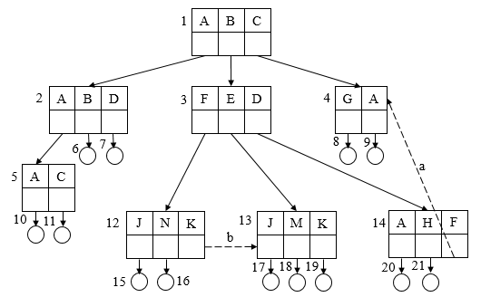

##
##　　说明：方框代表目录文件，圆圈代表数据文件，主目录中有是哪个用户总目录A、B、C，在B用户的总目录B中，又包括三个分目录F、E、D，其中每个分目录中又包含多个文件，为提高系统的灵活性，应该允许在一个目录文件中的目录项既是作为目录文件的FCB，又是数据文件的FCB，这一信息可用目录项中的一位来指示。如用户A总目录中，目录项A是目录文件FCB，而目录项B和D则是数据文件的FCB。

##
##　　在树形目录结构中，从根目录到任何数据文件，都只有一条唯一的通路，在该路径上从树的根开始，把全部目录文件名和数据文件名依次用"/"连接起来，即构成该数据文件的路径名。系统中的每个文件都有唯一的路径名。例如，用户B访问文件J，则使用路径名/B/F/J来访问。

##
##　　当一个文件系统含有很多级时，每访问一个文件，都要使用从树根开始直到树叶（数据文件）为止的、包含各中间节点（目录）的全路径名，这非常麻烦，可为每个进程设置一个当前目录，又称为工作目录，进程对各文件的访问都相对于当前目录而进行的。把从当前目录开始值得数据文件为止所构成的路径名称为相对路径名，而把从树根开始的路径名称为绝对路径名。

##
##　　④ 增加和删除目录，在树形目录结构中，用户可为自己建立UFD，并可再创建子目录，在用户要创建一个新文件时，只需要查看自己的UFD及其子目录中有无与新建文件相同的文件名，若无，便可在UFD或其某个子目录中增加一个新目录项。在树形目录中，如何删除一个目录，应该视情况而定，若要删除的目录为空，则简单地将其删除，使它在其上一级目录中所对应的目录项为空，若不为空，可采用如下方法：不删除非空目录（当目录不为空时，为了删除一个非空目录，必须先删除目录中所有的文件，使之称为空目录，然后再删除，如果目录中包含有子目录，则应该递归调用方式删除），可删除非空目录（将目录中的所有文件和子目录同时删除）。

##
##　　5.4 目录查询技术

##
##　　当用户要访问一个已存在的文件时，系统首先利用用户提供的文件名对目录进行查询，找出该文件的文件控制块或对应索引结点，然后，根据FCB或索引结点中所记录的文件物理地址（盘块号），换算出文件在磁盘上的物理位置，最后，再通过磁盘驱动程序，将所需文件读入内存。目前常用的方式有线性检索法和Hash方法。

##
##　　① 线性检索法，其又称为顺序检索法，在树形目录中，用户提供的文件名是由多个文件分量名组成的路径名，此时须对多级目录进行查找，假定用户给定的文件路径名为/usr/ast/mbox，则查找过程如下。

##
## 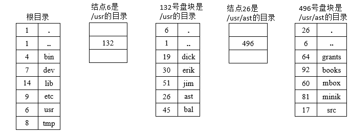

##
##　　说明：首先，系统应先读入第一个文件分量名usr，用它与根目录文件（或当前目录文件）中各目录项中的文件名顺序地进行比较，从中找到匹配者，并得到匹配项的索引结点号是6，再从6号索引结点中得到usr目录文件放在132号盘块中，将该盘块内容读入内存。接着，系统再将路径名中的第二个分量名ast读入，用它与放在132号盘块中的第二级目录文件中各目录项的文件名顺序进行比较，又找到匹配项，从中得到ast的目录文件放在26号索引结点中，再从26号索引结点中得知/usr/ast是存放在496号盘块中，再读入496号盘块。然后，将文件的第三个分量名mbox读入，用它与第三季目录文件/usr/ast中各目录项的文件名进行比较，最后得到/usr/ast/mbox的索引结点号为60，即在60号索引结点中存放了指定文件的物理地址，目录查询操作到此结束，如果在顺序查找过程中发现有一个文件分量名没有找到，则停止查找，并返回文件未找到信息。

##
##　　② Hash方法，系统利用用户提供的文件名并将它转换为文件目录的索引值，再利用该索引值到目录中去查找，这将提高检索速度。

##
##六、文件存储空间管理

##
##　　6.1 空闲表法

##
##　　空闲表法属于连续分配方式，它与内存的动态分配方式雷同，它为每个文件分配一块连续的存储空间，即系统也为外存上所有空闲区建立一张空闲表，每个空闲区对应于一个空闲表项，其中包括表项序号、该空闲区的第一个盘块号、该区的空闲盘块号等信息，再将所有空闲区按其起始盘块号递增排列。

##
## 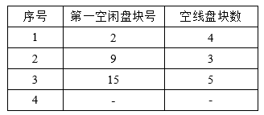

##
##　　空闲盘区的分配与内存的动态分配类似，同样采用首次适应算法，循环首次适应算法等。系统在对用户所释放的存储空间进行回收时，也采取类似于内存回收的方法，即考虑回收区是否与空闲表中插入点的前区和后区相邻接，对相邻接者应该予以合并。当文件较小时，采用连续分配方式，当文件较大时，可采用离散分配方式。

##
##　　6.2 空闲链表法

##
##　　空闲链表法是将所有空闲盘区拉成一条空闲链。把链表分成两种形式，空闲盘块链和空闲盘区链。

##
##　　① 空闲盘块链，这是将磁盘上的所有空闲空间，以盘块为单位拉成一条链，当用户因创建文件而请求分配存储空间时，系统从链首开始，依次摘下适当数目的空闲盘块分配给用户，当删除文件而释放空间时，系统将回收的盘块依次插入空闲盘块链的末尾，其优点是用于分配和回收一个盘块的过程简单，但在为文件分配盘块时，可能要重复操作多次。

##
##　　② 空闲盘区链，这是将磁盘上的所有空闲盘区（每个盘区可包含若干个盘块）拉成一条链，在每个盘区上除了含有只是下一个空闲盘区的指针外，还应有能指明本盘区大小（盘块数）的信息。盘区分配与内存的动态分配类似，可采用首次适应算法，在回收盘区时，同样也要将回收区和相邻接的空闲盘区相合并，在采用首次适应算法时，可以采用显式链接法提高检索速度，在内存中为空闲盘区建立一张链表。

##
##　　6.3 位示图法

##
##　　利用二进制的一位表示磁盘中的一个盘块的使用情况，当其值为0时，表示对应的盘块空闲，为1时，表示已经分配，磁盘上的所有盘块都有一个二进制位与之对应，这样，由所有盘块所对应的位构成一个集合，称为位示图，通常可用m * n个位数来构成位示图，并使m * n等于磁盘的总块数。

##
## 

##
##　　对于盘块的分配分为如下三步

##
##　　① 顺序扫描位示图，从中找出一个或一组值为0的二进制位。

##
##　　② 将所找到的一个或一组二进制位转换成与之赌赢的盘块号。

##
##　　③ 修改位示图。

##
##　　对于盘块的回收分为如下两步

##
##　　① 将回收盘块的盘块号转换成位示图中的行号和列号。

##
##　　② 修改位示图。

##
##　　此方法的优点在于从位示图中很容易找到一个或一组相邻接的空闲盘块，此外，由于位示图很小，占用空间少，因而可将其保存在内存中，进而使在每次进行盘区分配时，无需首先把盘区分配表读入内存，节省磁盘启动时间。

##
##　　6.4 成组链接法

##
##　　空闲表法和空闲链表法都不适用于大型系统，因为这会使空闲表或空闲链表很长，在UNIX采用的成组链接法，结合上述两种方法。

##
##　　① 空线盘块的组织，空闲盘块栈用来存放当前可用的一组空闲盘块的盘块号（最多含100个号），以及栈中尚有的空闲盘块号数N，顺便指出，N兼做栈顶指针使用，栈是临界资源，系统设置一把锁供进程互斥访问。其中，S.free(0)是栈底，栈满时栈顶为S.free(99)。

##
##　　② 文件区中的所有空闲盘块被分成若干个组，如每100个盘块作为一组。

##
##　　③ 将每一组含有的盘块总数N和该组所有的盘块号记入其前一组的第一个盘块S.free(0)~S.free(99)中，这样，由各组的第一个盘块可链接成一条链。

##
##　　④ 将第一组的盘块总数和所有的盘块号记入空闲盘块号栈中，作为当前可供分配的空闲盘块号。

##
##　　⑤ 最末一组只有99个盘块，其盘块号分别记入其前一组的S.free(1)~S.free(99)中，而在S.free(0)中则存放0，作为空闲盘块链的结束。

##
## 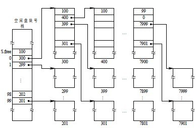

##
##　　当系统要为用户分配文件所需的盘块时，须调用盘块分配过程来完成。该过程首先检查空闲盘块号栈是否上锁，如未上锁，便从 栈顶取出一空闲盘块号，将与之对应的盘块分配给用户，然后将栈顶指针下移一格。若该盘块号已是栈底，即S.free(0)，这是当前栈中最后一个可分配的 盘块号。由于在该盘块号所对应的盘块中记有下一组可用的盘块号，因此，须调用磁盘读过程，将栈底盘块号所对应盘块的内容读入栈中，作为新的盘块号栈的内 容，并把原栈底对应的盘块分配出去(其中的有用数据已读入栈中)。然后，再分配一相应的缓冲区(作为该盘块的缓冲区)。最后，把栈中的空闲盘块数减1并返回。
　　在系统回收空闲盘块时，须调用盘块回收过程进行回收。它是将回收盘块的盘块号记入空闲盘块号栈的顶部，并执行空闲盘块数加1操作。当栈中空闲盘块号数目已达100时，表示栈已满，便将现有栈中的100个盘块号，记入新回收的盘块中，再将其盘块号作为新栈底。
七、总结
　　本篇学习了文件管理的主要内容，明白了系统是如何高效组织文件的具体细节。也谢谢各位园友的观看~